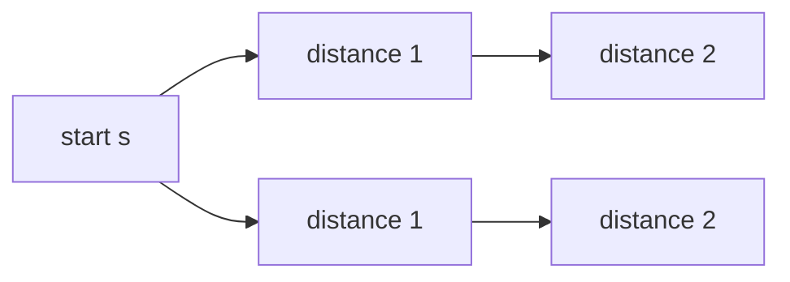
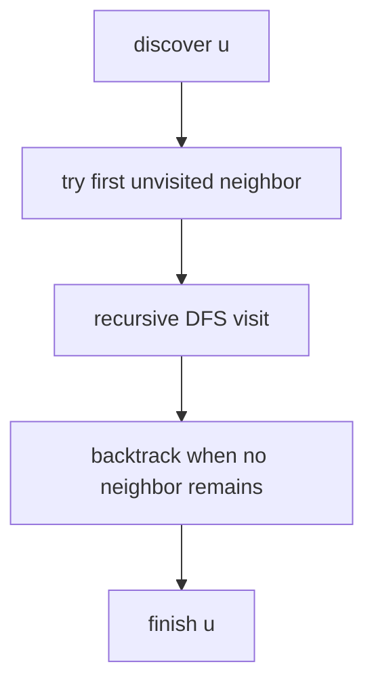
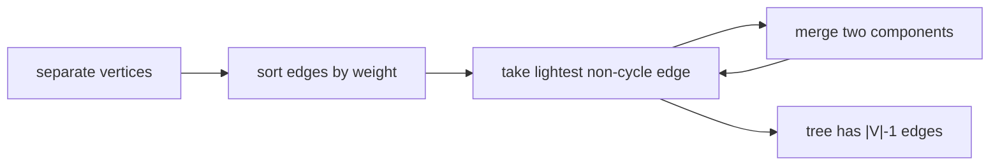

# 16. Advanced Algorithms

## 16.1 Elementary Graph Algorithms: Representation, BFS, DFS, and Applications

Graph algorithms usually assume a graph $G=(V,E)$ with vertices and edges. A graph may be directed or undirected, weighted or unweighted. Representation matters because the chosen representation affects algorithmic cost.

| Representation   |                   Space | Best for                                       | Key operation cost                       |
| ---------------- | ----------------------: | ---------------------------------------------- | ---------------------------------------- |
| Adjacency matrix |         $O(\| V \| ^2)$ | Dense graphs and constant-time adjacency tests | Test edge $(u,v)$ in $O(1)$              |
| Adjacency list   | $O(\| V \| + \| E \| )$ | Sparse graphs and traversing neighbors         | Iterate neighbors of $u$ in $O(\deg(u))$ |
| Edge list        |           $O(\| E \| )$ | Algorithms that repeatedly scan all edges      | Scan all edges in $O(\| E \| )$          |

Matrix values depend on the task. For shortest paths, missing edges are usually represented by $\infty$; for unweighted adjacency, missing edges are usually `0` or `false`.

### Breadth-First Search

Breadth-first search (BFS) explores a graph in increasing distance from a start vertex $s$, where distance means number of edges in an unweighted graph. It uses a FIFO queue.

```text
BFS(G, s):
  for each vertex v:
    color[v] := white
    d[v] := infinity
    parent[v] := nil
  color[s] := gray
  d[s] := 0
  enqueue(s)

  while queue is not empty:
    u := dequeue()
    for each neighbor v of u:
      if color[v] = white:
        color[v] := gray
        d[v] := d[u] + 1
        parent[v] := u
        enqueue(v)
    color[u] := black
```



BFS properties:

| Property                           | Explanation                                                                  |
| ---------------------------------- | ---------------------------------------------------------------------------- |
| Time complexity                    | $O(\| V \| + \| E \| )$ with adjacency lists.                                |
| Shortest path in unweighted graphs | $d[v]$ is the minimum number of edges from $s$ to $v$.                       |
| BFS tree                           | `parent[v]` records a shortest-path tree rooted at $s$.                      |
| Applications                       | Connectivity, shortest unweighted paths, bipartite testing, level structure. |

A graph is bipartite if vertices can be colored with two colors so every edge goes between colors. BFS tests this by assigning alternating colors by distance parity; an edge connecting equal colors proves the graph is not bipartite.

### Depth-First Search

Depth-first search (DFS) explores as far as possible along one branch before backtracking. It is naturally recursive or stack-based.

```text
DFS(G):
  for each vertex u:
    color[u] := white
    parent[u] := nil
  time := 0
  for each vertex u:
    if color[u] = white:
      DFS-Visit(u)

DFS-Visit(u):
  color[u] := gray
  discovery[u] := ++time
  for each neighbor v of u:
    if color[v] = white:
      parent[v] := u
      DFS-Visit(v)
  color[u] := black
  finish[u] := ++time
```



DFS properties:

| Property               | Explanation                                                   |
| ---------------------- | ------------------------------------------------------------- |
| Time complexity        | $O(\| V \| + \| E \| )$ with adjacency lists.                 |
| DFS forest             | Parent pointers form a forest when the graph is disconnected. |
| Discovery/finish times | Support interval reasoning and topological sorting.           |
| Edge classification    | Tree, back, forward, and cross edges in directed DFS.         |

DFS applications:

| Application                   | Mechanism                                                                                                                                         |
| ----------------------------- | ------------------------------------------------------------------------------------------------------------------------------------------------- |
| Cycle detection               | A back edge to a gray vertex indicates a directed cycle. In undirected graphs, an edge to an already visited non-parent vertex indicates a cycle. |
| Topological ordering          | In a DAG, list vertices by decreasing finish time.                                                                                                |
| Connected components          | Run DFS/BFS from unvisited vertices in an undirected graph.                                                                                       |
| Strongly connected components | Use DFS ordering plus graph reversal in algorithms such as Kosaraju.                                                                              |
| Maze/backtracking search      | DFS explores one branch and backtracks when stuck.                                                                                                |

A **topological ordering** of a directed acyclic graph (DAG) orders vertices so every edge goes from earlier to later. It exists exactly for DAGs. DFS can compute it by placing each vertex at the front of a list when it finishes.

### What to Emphasize in an Oral Answer

- Start with representation choices and their costs: adjacency matrix $O(V^2)$ and fast edge tests, adjacency list $O(V+E)$ and fast neighbor traversal, edge list $O(E)$ and full-edge scans.
- Define BFS mechanics: initialize colors/distances/parents, use a FIFO queue, and visit vertices by increasing unweighted distance from the source.
- State BFS guarantees and uses: $O(V+E)$ with adjacency lists, shortest unweighted distances, BFS tree, connectivity, and bipartite testing by level parity.
- Define DFS mechanics: recursive or stack-based deep exploration with colors, parent pointers, discovery times, and finish times.
- State DFS guarantees and uses: $O(V+E)$, DFS forest on disconnected graphs, cycle detection, topological sorting, connected/SCC analysis, and edge classification.
- Make the contrast explicit: BFS gives layer distances; DFS gives structural information through backtracking and finish order.

::: details Suggested answer

Elementary graph algorithms start with representation. An adjacency matrix uses $O(V^2)$ space and gives constant-time edge tests, so it is convenient for dense graphs. An adjacency list uses $O(V+E)$ space and stores only existing edges, so it is better for sparse graphs and traversal algorithms. An edge list is useful when an algorithm repeatedly scans all edges.

Breadth-first search explores from a start vertex in layers. It initializes colors, distances, and parent pointers, then uses a FIFO queue, first visiting all vertices at distance one, then distance two, and so on. With adjacency lists it runs in $O(V+E)$. Its main guarantee is that in an unweighted graph, the recorded distance is the shortest number of edges from the source. Parent pointers form a BFS tree. BFS also gives applications such as connectivity testing and bipartite testing by alternating colors across layers.

Depth-first search follows one path as far as possible before backtracking. It can be recursive or stack-based, records discovery and finish times, and forms a DFS forest if the graph is disconnected. With adjacency lists it also runs in $O(V+E)$. DFS is useful for cycle detection, connected components, strongly connected components, topological sorting, and other structural graph analyses. In directed graphs, edge classification by DFS tree structure and discovery state helps explain these applications.

The key contrast is that BFS gives shortest unweighted paths by layers, while DFS gives structural information through deep exploration, backtracking, and finish times.

:::

## 16.2 Minimum Spanning Trees: General Greedy Method, Kruskal, and Prim

For a connected undirected weighted graph $G=(V,E,w)$, a **spanning tree** is a tree containing all vertices. A **minimum spanning tree** (MST) is a spanning tree with minimum total edge weight.

The general MST method is greedy:

1. Start with an empty set $A$ of chosen edges.
2. Maintain that $A$ is **safe**, meaning it is contained in at least one MST.
3. Repeatedly add a safe edge until $A$ has $|V|-1$ edges.

The main justification is the **cut property**:

> For any cut $(S,V-S)$ that respects $A$, a minimum-weight edge crossing the cut is safe to add to $A$.

A cut respects $A$ if no edge of $A$ crosses it. Kruskal and Prim are implementations of this safe-edge idea.

### Kruskal's Algorithm

Kruskal's algorithm grows a forest. It sorts edges by increasing weight and adds the next lightest edge that connects two different components.

```text
Kruskal(G):
  A := empty set
  make-set(v) for every vertex v
  sort edges by nondecreasing weight
  for each edge (u, v) in sorted order:
    if find-set(u) != find-set(v):
      A := A union {(u, v)}
      union(u, v)
  return A
```



With a disjoint-set union data structure, the running time is dominated by sorting:

$$
O(|E|\log |E|).
$$

### Prim's Algorithm

Prim's algorithm grows one tree from a start vertex. At each step it adds the cheapest edge connecting the current tree to a vertex outside the tree.

```text
Prim(G, r):
  for each vertex v:
    key[v] := infinity
    parent[v] := nil
  key[r] := 0
  Q := all vertices

  while Q is not empty:
    u := extract-min(Q)
    for each edge (u, v) with v in Q:
      if w(u, v) < key[v]:
        parent[v] := u
        key[v] := w(u, v)
```


Common running times:

| Implementation                   |                                    Time |
| -------------------------------- | --------------------------------------: |
| Adjacency matrix/simple array    |                         $O(\| V \| ^2)$ |
| Binary heap with adjacency lists |               $O(\| E\| \log \| V \| )$ |
| Fibonacci heap                   | $O(\| E \| +    \| V \| \log \| V \| )$ |

Kruskal is often natural for sparse graphs with easily sorted edges. Prim is often natural when the graph is dense or when growing one connected component from a root is convenient.

### What to Emphasize in an Oral Answer

- Define the MST setting precisely: connected, undirected, weighted graph; result has all vertices, no cycles, $|V|-1$ edges, and minimum total weight.
- State the greedy invariant: maintain a safe edge set that is contained in some MST.
- Explain the cut property: for any cut respecting the current set, a lightest crossing edge is safe to add.
- Kruskal: sort edges by nondecreasing weight, add the next edge connecting different components, skip cycle-forming edges, and use disjoint sets.
- Give Kruskal's usual complexity: sorting dominates at $O(E\log E)$.
- Prim: grow one tree from a root by repeatedly adding the cheapest edge from the tree to an outside vertex, usually with keys in a priority queue.
- Contrast the algorithms: Kruskal merges components using globally light non-cycle edges; Prim expands a single tree using light crossing edges.

::: details Suggested answer

A minimum spanning tree problem asks for a lowest-total-weight tree connecting all vertices of a connected undirected weighted graph. The answer has no cycles and exactly $V-1$ edges. The general algorithm is greedy: keep a set of edges that can still be extended to some minimum spanning tree, then add a safe edge until the set has $V-1$ edges.

The cut property explains safe edges. If a cut separates the vertices and none of the already chosen edges crosses that cut, then a lightest edge crossing the cut is safe to add. Both Kruskal's and Prim's algorithms are different ways of repeatedly applying this idea.

Kruskal's algorithm sorts all edges by weight and scans them in increasing order. It adds an edge if it connects two different components and skips it if it would create a cycle. A disjoint-set data structure keeps track of components. The result is a forest that gradually merges into one spanning tree. Its running time is usually $O(E\log E)$ because of sorting.

Prim's algorithm grows a single tree. It starts from one vertex and repeatedly adds the cheapest edge from the current tree to a vertex outside it. A priority queue stores, for each outside vertex, the cheapest known connection to the tree. Depending on implementation, common bounds are $O(V^2)$ with a matrix or $O(E\log V)$ with a binary heap.

The important contrast is that Kruskal chooses globally light non-cycle edges and merges components, while Prim chooses light crossing edges from one growing tree.

:::

## 16.3 Single-Source Shortest Paths: Bellman-Ford, Dijkstra, and DAG Shortest Paths

The single-source shortest-path problem asks for shortest distances from a source $s$ to every vertex in a weighted directed graph. The common relaxation operation is:

```text
Relax(u, v, w):
  if d[v] > d[u] + w(u, v):
    d[v] := d[u] + w(u, v)
    parent[v] := u
```

Initialize:

$$
d[s]=0,\quad d[v]=\infty\text{ for }v\ne s.
$$

### Bellman-Ford and Queue-Based Bellman-Ford

Bellman-Ford works with negative edge weights and can detect negative cycles reachable from the source. The standard version relaxes all edges $|V|-1$ times:

```text
Bellman-Ford(G, s):
  initialize distances
  repeat |V|-1 times:
    for each edge (u, v):
      Relax(u, v, w)
  for each edge (u, v):
    if d[v] > d[u] + w(u, v):
      report negative cycle
```

Time complexity:

$$
O(|V||E|).
$$

The topic specifically names **queue-based Bellman-Ford**. This variant keeps a queue of vertices whose outgoing edges may still improve distances. When relaxing an edge improves $d[v]$, vertex $v$ is inserted into the queue if it is not already there.

```text
QueueBellmanFord(G, s):
  initialize distances
  queue := [s]
  inQueue[s] := true

  while queue is not empty:
    u := dequeue()
    inQueue[u] := false
    for each edge (u, v):
      if d[v] > d[u] + w(u, v):
        d[v] := d[u] + w(u, v)
        parent[v] := u
        if not inQueue[v]:
          enqueue(v)
          inQueue[v] := true
```

This queue-based version often avoids useless scans in practice, but the worst-case time is still $O(|V||E|)$. Negative-cycle detection requires counting relaxations or another check; if a vertex's distance can be improved after enough relaxations, a reachable negative cycle exists.

### Dijkstra's Algorithm

Dijkstra's algorithm assumes all edge weights are nonnegative. It repeatedly finalizes the not-yet-final vertex with the smallest tentative distance.

```text
Dijkstra(G, s):
  initialize distances
  Q := priority queue of vertices by d
  while Q is not empty:
    u := extract-min(Q)
    for each edge (u, v):
      Relax(u, v, w)
```

The correctness relies on nonnegative weights: once the smallest tentative vertex is extracted, no later path through unsettled vertices can make it cheaper.

Common running times:

| Implementation                   |                                      Time |
| -------------------------------- | ----------------------------------------: |
| Array / adjacency matrix         |                           $O(\| V \| ^2)$ |
| Binary heap with adjacency lists | $O((\| V \| +    \| E \| )\log \| V \| )$ |
| Fibonacci heap                   |   $O(\| E \| +    \| V \| \log \| V \| )$ |

### DAG Shortest Paths

In a directed acyclic graph, shortest paths can be found even with negative edge weights because there are no cycles. The algorithm uses topological order:

```text
DAG-Shortest-Paths(G, s):
  topologically sort vertices
  initialize distances
  for each vertex u in topological order:
    for each outgoing edge (u, v):
      Relax(u, v, w)
```

Time complexity:

$$
O(|V|+|E|).
$$

This algorithm is a direct use of topological ordering from DFS: every edge goes forward in the order, so one pass is enough.

### What to Emphasize in an Oral Answer

- Define the problem: shortest distances and parent pointers from one source to all vertices in a weighted directed graph.
- State initialization and relaxation: $d[s]=0$, others $\infty$; relax edge $(u,v)$ if $d[u]+w(u,v)$ improves $d[v]$.
- Bellman-Ford: relax all edges $|V|-1$ times, then check for further relaxation to detect reachable negative cycles; works with negative weights, $O(VE)$.
- Queue-based Bellman-Ford: process only vertices whose outgoing edges may improve distances; often faster in practice, but still $O(VE)$ worst case and needs negative-cycle detection.
- Dijkstra: requires nonnegative weights, repeatedly extracts the unsettled vertex with minimum tentative distance, and finalizes it.
- Give Dijkstra implementation costs: $O(V^2)$ with arrays/matrix, about $O((V+E)\log V)$ with a binary heap.
- DAG shortest paths: topologically sort and relax edges once in order; $O(V+E)$ and can handle negative edges because there are no cycles.

::: details Suggested answer

Single-source shortest-path algorithms maintain tentative distances from a source and improve them by relaxation. Relaxing an edge $(u,v)$ checks whether the known path to $u$ followed by that edge gives a better path to $v$. If so, it updates the distance and parent pointer.

Bellman-Ford is the most general of the three algorithms here. It allows negative edge weights and detects reachable negative cycles. The standard version relaxes every edge $V-1$ times, then checks whether any edge can still be relaxed. If so, there is a negative cycle. Its time complexity is $O(VE)$. The queue-based variant keeps only vertices whose outgoing edges may still be useful. When a vertex's distance improves, it is put into the queue. This is often faster in practice, but its worst-case complexity remains $O(VE)$.

Dijkstra's algorithm is faster but requires nonnegative edge weights. It always selects the unsettled vertex with the smallest tentative distance and then relaxes its outgoing edges. Nonnegative weights guarantee that once a vertex is selected, its distance is final. With a binary heap it runs in about $O((V+E)\log V)$, and with simple arrays it is $O(V^2)$.

For DAGs, the acyclic structure gives an even simpler algorithm. Topologically sort the vertices, initialize distances, and relax outgoing edges in that order. Since every edge goes forward in the topological order, one pass is enough, giving $O(V+E)$ time. This also works with negative edge weights because a DAG has no cycles.

:::

## 16.4 All-Pairs Shortest Paths: Floyd-Warshall

The all-pairs shortest-path problem asks for shortest path distances between every ordered pair of vertices. Floyd-Warshall is a dynamic programming algorithm using an adjacency matrix.

Let $D^{(k)}[i,j]$ be the length of the shortest path from $i$ to $j$ whose intermediate vertices are allowed only from the set $\{1,\dots,k\}$. Initialization:

$$
D^{(0)}[i,j]=
\begin{cases}
0 & i=j,\\
w(i,j) & (i,j)\in E,\\
\infty & \text{otherwise}.
\end{cases}
$$

Recurrence:

$$
D^{(k)}[i,j]=
\min\left(D^{(k-1)}[i,j],\ D^{(k-1)}[i,k]+D^{(k-1)}[k,j]\right).
$$

In-place pseudocode:

```text
FloydWarshall(W):
  D := W with D[i,i] = 0
  for k := 1 to n:
    for i := 1 to n:
      for j := 1 to n:
        D[i,j] := min(D[i,j], D[i,k] + D[k,j])
  return D
```

Properties:

| Property                  | Explanation                                                                                     |
| ------------------------- | ----------------------------------------------------------------------------------------------- |
| Time                      | $O(\| V \| ^3)$                                                                                 |
| Space                     | $O(\| V \| ^2)$ for the distance matrix                                                         |
| Negative edges            | Allowed if there are no negative cycles                                                         |
| Negative cycle indication | A negative value on $D[i,i]$ after the algorithm indicates a negative cycle reachable from $i$. |

Floyd-Warshall is attractive when the graph is dense or when all pair distances are needed. For sparse graphs with nonnegative weights, running Dijkstra from every vertex may be better.

### What to Emphasize in an Oral Answer

- Define the all-pairs problem: compute shortest distances between every ordered pair of vertices.
- State the dynamic-programming state $D^{(k)}[i,j]$: shortest path from $i$ to $j$ using only vertices $1..k$ as intermediates.
- Give initialization: zero on the diagonal, edge weights for existing edges, and $\infty$ for missing edges.
- Give the recurrence/update: $D[i,j]=\min(D[i,j],D[i,k]+D[k,j])$.
- State complexity and storage: three vertex loops give $O(V^3)$ time and the distance matrix costs $O(V^2)$ space.
- Mention negative weights and negative cycles: negative edges are allowed, but a negative diagonal entry after the algorithm indicates a negative cycle.
- Contrast use cases: good for dense graphs or all-pairs queries; repeated Dijkstra can be better for sparse nonnegative graphs.

::: details Suggested answer

Floyd-Warshall solves the all-pairs shortest-path problem by dynamic programming. Instead of choosing one source, it computes shortest distances between every pair of vertices.

The idea is to gradually allow more intermediate vertices. Let $D^{(k)}[i,j]$ be the best distance from $i$ to $j$ when only vertices $1$ through $k$ may be used as intermediate vertices. When vertex $k$ is introduced, the shortest path either does not use $k$, in which case the old value remains, or it uses $k$, in which case the path splits into $i$ to $k$ and $k$ to $j$. Therefore the update is $D[i,j]=\min(D[i,j],D[i,k]+D[k,j])$.

The algorithm has three nested loops over vertices, so its time complexity is $O(V^3)$, and it stores an $O(V^2)$ matrix. It can handle negative edge weights as long as there are no negative cycles. If after the computation a diagonal entry becomes negative, that signals a negative cycle.

Floyd-Warshall is most useful when the graph is dense or when all pair distances are needed. If the graph is sparse and edge weights are nonnegative, repeated Dijkstra runs may be more efficient.

:::

## 16.5 Transitive Closure

The **transitive closure** of a directed graph records reachability: whether there is any directed path from $i$ to $j$. It can be represented by a Boolean matrix $T$ where

$$
T[i,j]=\text{true}
\quad\Longleftrightarrow\quad
j\text{ is reachable from }i.
$$

One method is to run BFS or DFS from every vertex:

$$
O(|V|(|V|+|E|)).
$$

Another method is Warshall's algorithm, the Boolean version of Floyd-Warshall:

```text
Warshall(A):
  T := A
  set T[i,i] := true for all i
  for k := 1 to n:
    for i := 1 to n:
      for j := 1 to n:
        T[i,j] := T[i,j] or (T[i,k] and T[k,j])
  return T
```

Time complexity:

$$
O(|V|^3).
$$

Transitive closure connects relations and partial orders. In relation terms, the transitive closure of a relation $R$ is the smallest transitive relation containing $R$. In graph terms, it adds an edge $u\to v$ whenever a directed path from $u$ to $v$ exists.

Applications:

| Application             | Use                                                         |
| ----------------------- | ----------------------------------------------------------- |
| Reachability queries    | Answer whether one vertex can reach another.                |
| Dependency analysis     | Determine indirect prerequisites or module dependencies.    |
| Partial-order reasoning | Convert direct cover-like relations into full reachability. |
| Control-flow analysis   | Find which program points can reach which others.           |

### What to Emphasize in an Oral Answer

- Define transitive closure as reachability in a directed graph, represented by a Boolean matrix $T[i,j]$.
- Mention the reflexive convention used here: set $T[i,i]$ true because every vertex reaches itself by a length-zero path.
- Give the graph-search method: run BFS or DFS from every vertex, with time $O(V(V+E))$.
- Give Warshall's method: Boolean Floyd-Warshall update $T[i,j] := T[i,j] \lor (T[i,k] \land T[k,j])$.
- State Warshall complexity: $O(V^3)$, natural for matrix representation.
- Explain the relation viewpoint: it is the smallest transitive relation containing the original edge relation.
- Name applications: reachability queries, dependency analysis, partial orders, prerequisites, and control-flow reachability.

::: details Suggested answer

Transitive closure is the reachability relation of a directed graph. It answers whether there is a directed path from one vertex to another, not just whether there is a direct edge. In matrix form, the transitive closure has a true entry $T[i,j]$ exactly when $j$ is reachable from $i$; with the usual reflexive convention, every diagonal entry is true because a vertex reaches itself by a path of length zero.

One straightforward method is to run BFS or DFS from every vertex. This is good with adjacency lists and sparse graphs, with time $O(V(V+E))$. Another method is Warshall's algorithm, which is the Boolean version of Floyd-Warshall. It considers each vertex $k$ as a possible intermediate point and updates $T[i,j]$ if $i$ can reach $k$ and $k$ can reach $j$. This takes $O(V^3)$ time and works naturally on an adjacency matrix.

The relation viewpoint is also useful. A directed graph represents a binary relation, and transitive closure is the smallest transitive relation containing it. This matters in dependency analysis, partial orders, prerequisites, and reachability problems. It tells us all indirect consequences of the direct edges.

:::
