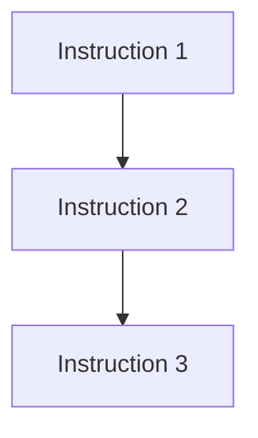
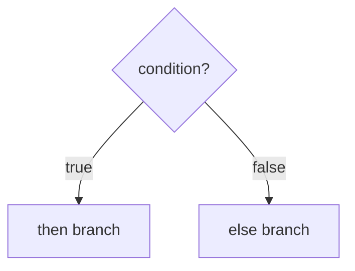
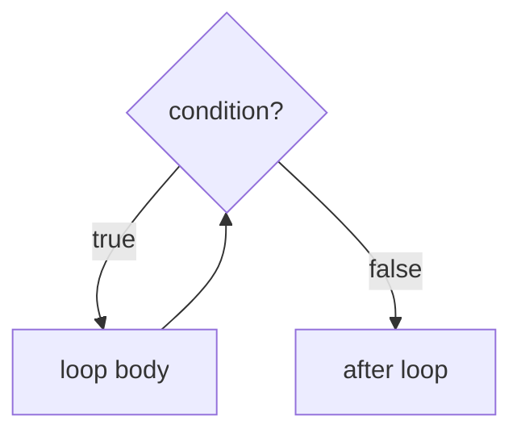
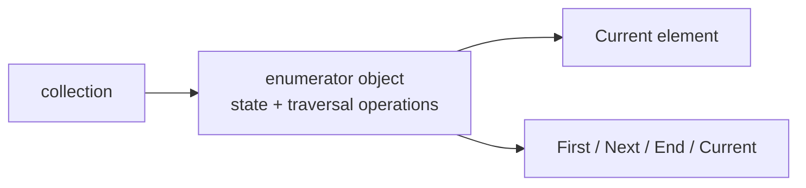

# 7. Algorithmic Patterns

## 7.1 From Specification to a Good Program

Algorithmic patterns are useful only when the task has first been specified precisely enough to match it to a known pattern, so the starting point is the general process of solving a simple programming task.

Program construction proceeds through these phases:

| Phase                 | Role                                                                                                                                |
| --------------------- | ----------------------------------------------------------------------------------------------------------------------------------- |
| Specification         | Define exactly what the task is, including input, output, value sets, precondition, and postcondition.                              |
| Design                | Choose the solution algorithm and data representation. This should be independent of a concrete programming language when possible. |
| Implementation        | Code the designed algorithm in a programming language.                                                                              |
| Testing and debugging | Run the program on selected test cases, compare actual and expected output, locate defects, correct them, and retest.               |
| Quality improvement   | Examine efficiency, memory use, usability, portability, and similar requirements.                                                   |

These phases are not strictly one-way. Defects in the specification may be discovered during design. Defects in the design may be found during implementation or testing. Fixes require retesting because a fix can introduce new defects.

### Specification

A specification should be correct, unambiguous, precise, complete, concise, and understandable. A textual task statement is usually not enough. For example, "give the tallest person among $N$ people" is ambiguous until the specification says what data are given and what should be returned.

The specification must include:

1. The names and value sets of input and output data.
2. Definitions of concepts used in the task.
3. The precondition: what must hold before execution.
4. The postcondition: what must hold after execution.
5. Environmental and quality requirements when relevant.

Example task:

```text
Input:
  N: number of people, a natural number.
  A: sequence of heights, indexed from 1 to N, in centimeters.

Output:
  MAX: ordinal number of the tallest person, between 1 and N.

Precondition:
  Every A[i] is positive.

Postcondition:
  MAX is in 1..N and A[MAX] >= A[i] for every i in 1..N.
```

Nondeterminism also matters. If several outputs satisfy the task postcondition, the task is nondeterministic. For example, if two people have the same maximum height, either index could satisfy the task. A deterministic program must choose one. The program postcondition may therefore be stricter than the task postcondition:

```text
Program postcondition:
  MAX is in 1..N, A[MAX] >= A[i] for every i,
  and no earlier element has the same maximum value.
```

This version chooses the first maximum.

### State Space

A program can be modeled as an automaton over a state space. The state space is the set of all possible tuples of program variable values. The precondition selects the states where the program is expected to start correctly, and the postcondition characterizes correct final states.

Adding a new program variable adds a new dimension to the state space. The parameter space determined by the task's input and output parameters is only part of the full program state space.

### Design and Structograms

Structograms, also known as Nassi-Shneiderman diagrams, are language-independent algorithm descriptions. The original diagrams are replaced here by prose and Mermaid.

Basic structured constructs:







The usual structogram constructs are sequence, selection, and pre-test loop. Extensions include procedure definition, multi-way selection, and post-test loops. In a multi-way selection exactly one branch condition should hold.

### Testing

Testing checks a program on selected test data. It cannot prove correctness in the full mathematical sense: not finding an error is not the same as proving no error exists. Exhaustive input testing is usually impossible. For example, a program with two 16-bit integer inputs already has $2^32$ input combinations.

A test case must include both input data and expected output. Otherwise the result cannot be judged.

Basic testing principles:

| Principle                             | Meaning                                                                        |
| ------------------------------------- | ------------------------------------------------------------------------------ |
| Good tests are error-revealing        | A good test case is likely to reveal a previously unknown error.               |
| Expected results are required         | Inputs alone are not enough.                                                   |
| Tests should be repeatable            | Non-repeatable tests make debugging expensive and unreliable.                  |
| Test valid and invalid data           | Both data satisfying and violating the precondition matter.                    |
| Examine each result thoroughly        | Each test should provide as much information as possible.                      |
| Check missing and unexpected behavior | Testing must check both missing required function and unwanted extra behavior. |
| Independent testing is valuable       | The author tends to assume their own program is correct.                       |

Dynamic testing methods:

| Method                    | Basis for test cases               | Strength                                                                   | Limitation                                                    |
| ------------------------- | ---------------------------------- | -------------------------------------------------------------------------- | ------------------------------------------------------------- |
| Black-box testing         | Task specification                 | Finds errors against required behavior without depending on implementation | Cannot guarantee all paths are tested                         |
| White-box testing         | Program code and control structure | Can cover instructions, branches, and paths                                | Exhaustive path testing is impractical, especially with loops |
| Stress/efficiency testing | Non-functional requirements        | Checks scale and runtime behavior                                          | Does not establish functional correctness by itself           |

### What to Emphasize in an Oral Answer

- Start from precise specification: input/output names, value sets, definitions, precondition, postcondition, and relevant quality requirements.
- Explain why ambiguity and nondeterminism matter; a deterministic program may need a stricter postcondition than the original task.
- Present the construction phases: specification, design, implementation, testing/debugging, and quality improvement, with feedback between phases.
- Frame programs as state-space transformations: preconditions select valid initial states and postconditions describe correct final states.
- Mention language-independent design with structured constructs such as sequence, selection, and loops.
- State the testing limits and methods: test cases need expected outputs, exhaustive testing is usually impossible, and black-box, white-box, and stress tests serve different purposes.

::: details Suggested answer

Algorithmic patterns only work well if the task is specified precisely. Program construction starts with a specification: the input and output data, their value sets, definitions of the used concepts, the precondition, and the postcondition. The specification must remove ambiguity. For example, saying "find the tallest person" is not enough until we say whether the output is a name, an index, or something else, and how ties are handled. If several outputs satisfy the task, the program may need a stricter postcondition, such as always choosing the first maximum.

After specification comes design, where we choose the algorithm and data representation independently of a particular programming language when possible, often using structured constructs such as sequence, selection, and loops. Then the design is implemented, tested, debugged, and improved for qualities such as efficiency and memory use. These phases are not strictly one-way: errors found later can force a correction in the specification or design.

Testing uses test cases with input and expected output, but it cannot prove correctness in general because exhaustive testing is usually impossible. Instead we use selected black-box tests from the specification, white-box tests from the code structure, and sometimes stress or efficiency tests. A program can also be viewed as an automaton over a state space: the precondition selects acceptable initial states and the postcondition describes correct final states. Introducing new variables changes this state space, which is why specifications must describe both the intended task and the program's observable result carefully.

:::

## 7.2 Data Types and the Method of Reduction

Data types matter before reduction to programming patterns. This matters because algorithmic patterns operate over abstract collections and enumerators, not directly over one fixed implementation.

### Data Type Concepts

Use the following ideas:

| Concept     | Meaning                                                                                |
| ----------- | -------------------------------------------------------------------------------------- |
| $A^*$       | Set of finite sequences over $A$.                                                      |
| $A^\infty$  | Set of infinite sequences over $A$.                                                    |
| $A^{**}$    | Union of finite and infinite sequences over $A$.                                       |
| State space | Cartesian product of type value sets.                                                  |
| Task        | A relation on the state space describing acceptable state transformations.             |
| Program     | An abstract operation that assigns a non-empty state sequence to every starting state. |

A type specification describes the requirements for values and operations:

$$
\text{Type specification} = (H, I_S, F)
$$

where:

| Component | Meaning                                            |
| --------- | -------------------------------------------------- |
| $H$       | Base set.                                          |
| $I_S$     | Specification invariant.                           |
| $T_T$     | Type value set selected from $H$ by the invariant. |
| $F$       | Specifications of the type operations.             |

The invariant is a property that must never be violated. For a set type, an invariant can be that an element occurs at most once.

A concrete type implements the specification:

$$
\text{Type} = (\rho, I, S)
$$

where:

| Component | Meaning                                                                                       |
| --------- | --------------------------------------------------------------------------------------------- |
| $\rho$    | Representation function/relation from concrete representation values to abstract type values. |
| $I$       | Concrete type invariant.                                                                      |
| $S$       | Programs implementing the operations.                                                         |

Representation is how abstract values are stored concretely. For example, a stack can be represented by an array or by a linked list. Implementation is the realization of the specified operations by concrete programs. In the model, program variables should be changed only through the operations of their types.

### Method of Reduction / Technique of Analogy

The technique of analogy, also called the method of reduction, means solving a concrete task by reducing it to a known programming pattern, traditionally called a programming theorem.

Steps of reduction:

1. Guess which programming pattern fits the task.
2. Specify the task using the notation of that pattern.
3. State the differences between the abstract pattern and the concrete task.
4. Substitute concrete interval bounds, predicates, functions, result variables, and operations.
5. Derive the concrete algorithm from the pattern algorithm.

Typical substitutions:

| Pattern element                        | Concrete counterpart                                                                      |
| -------------------------------------- | ----------------------------------------------------------------------------------------- |
| Enumerator $t: \operatorname{enor}(E)$ | The collection traversal used by the task.                                                |
| Predicate $\beta: E \to Bool$          | A task-specific condition, such as "is negative".                                         |
| Function $f: E \to H$                  | A value extracted or computed from each enumerated element.                               |
| Operation on $H$                       | Addition, multiplication, comparison, or another associative/ordered operation as needed. |
| Result variables                       | Concrete task outputs, often renamed.                                                     |

Example: count the negative numbers in a sequence.

| Pattern element      | Concrete task                               |
| -------------------- | ------------------------------------------- |
| Pattern              | Counting                                    |
| Enumerator           | Sequence enumerator over the input sequence |
| Predicate $\beta(e)$ | $e<0$                                       |
| Result $c$           | Number of negative elements                 |

This reduces the task to the counting pattern by analogy.

### Efficiency-Preserving Modifications

The embedded programming-theorem PDF notes that careful efficiency improvements are allowed when applying a pattern. For example, if `Current()` would otherwise be queried many times in one loop iteration, store it once in a helper variable. For maximum selection and conditional maximum search, the abstract result may include both the maximum value and the element where it occurs, but a concrete task may need only one of these when the element and value are the same.

### What to Emphasize in an Oral Answer

- Distinguish abstract type specification from concrete representation: invariants and operations define valid values and allowed changes.
- Define reduction/technique of analogy as matching a concrete task to a known programming theorem or pattern.
- Walk through the reduction steps: choose the pattern, rewrite the task in pattern notation, identify differences, substitute concrete elements, and derive the algorithm.
- Name the important substitutions: enumerator, predicate $\beta$, function $f$, operation on $H$, and result variables.
- Give a small example such as counting negative elements in a sequence.
- Mention that meaning-preserving efficiency improvements are allowed, such as caching `Current()` or omitting unnecessary abstract result components.

::: details Suggested answer

The method of reduction, or technique of analogy, means solving a concrete programming task by matching it to a known algorithmic pattern. This is possible because patterns are stated over abstract data types and enumerators rather than over one fixed implementation. A data type is not just storage; it has a value set, an invariant, and operations that preserve that invariant. A stack, for example, may be represented by an array or by linked nodes, but the abstract operations remain the same.

In reduction, first we identify which pattern is appropriate, for example summation, counting, maximum selection, linear search, or selection. Then we rewrite the task in the notation of that pattern and identify what the abstract parts mean concretely: what the enumerator is, what predicate beta means, what function f means, which operation is used on the result set, and how variables are renamed. For counting negative numbers in a sequence, the pattern is counting, the enumerator traverses the sequence, and beta of an element means that the element is less than zero.

After reduction, the concrete algorithm is obtained from the pattern algorithm by substitution. Small efficiency improvements are allowed if they preserve the pattern's meaning, such as storing the current enumerated value once instead of calling `Current()` repeatedly, or keeping only the abstract result components that the concrete task actually needs.

:::

## 7.3 Enumerator Concept and Enumerator Type

A collection is a data item or object suitable for storing elements. Collections may be concrete or virtual:

| Collection kind      | Examples                                      |
| -------------------- | --------------------------------------------- |
| Structured values    | Sets, sequences, stacks, queues, files        |
| Recursive structures | Trees, graphs                                 |
| Virtual collections  | Integer intervals, prime divisors of a number |

Processing a collection means processing its elements. Examples include:

- finding the largest element of a set;
- counting negative numbers in a sequence;
- selecting values stored in tree leaves;
- traversing every second element of an interval backwards;
- adding the prime divisors of a natural number.

An enumerator standardizes traversal. An enumerator uses four operations:

| Operation   | Meaning                                           |
| ----------- | ------------------------------------------------- |
| `First()`   | Move to the first element; start the enumeration. |
| `Next()`    | Move to the next element after the current one.   |
| `End()`     | Tell whether the enumeration has reached the end. |
| `Current()` | Return the current element.                       |

The standard processing scheme is:

```text
t.First()
while not t.End():
    process t.Current()
    t.Next()
```

The enumeration state can be:

| State          | Meaning                                              | Valid operations                 |
| -------------- | ---------------------------------------------------- | -------------------------------- |
| Ready to start | The enumerator exists but traversal has not started. | `First()`                        |
| In progress    | There is a current element.                          | `Current()`, `Next()`, `End()`   |
| Finished       | No more elements remain.                             | `End()`; usually not `Current()` |

The processing algorithm is responsible for using enumerator operations only in valid states. For example, it must not call `Current()` after `End()` is true.

Enumeration is not performed by the collection itself, but by a separate enumerator object. This separation is important because:

- the same collection may have several traversal strategies;
- traversal state is stored in the enumerator rather than in the collection;
- more than one enumeration of the same collection can exist at the same time, if the implementation supports separate enumerators.



### What to Emphasize in an Oral Answer

- Define a collection broadly: concrete structures such as arrays, sets, files, trees, or virtual collections such as integer intervals.
- Define an enumerator as the separate object that stores traversal state and standardizes element access.
- Name and order the four operations: `First()`, `End()`, `Current()`, and `Next()` in the usual loop.
- Explain valid states: before start, in progress, and finished; `Current()` is valid only while not at the end.
- Stress the separation between collection and enumerator: different traversals, independent traversal state, and possible multiple enumerations.
- Use a compact example, such as processing each element of a sequence or interval through the standard loop.

::: details Suggested answer

An enumerator is an object that standardizes the traversal of a collection. A collection may be a concrete structure such as an array, sequence, set, file, tree, or graph, or even a virtual collection such as an interval of integers. The point is that the algorithm does not need to know the internal representation of the collection; it only uses the enumerator operations.

The standard operations are `First`, `Next`, `End`, and `Current`. `First` starts the enumeration and moves to the first element. `End` tells whether traversal has finished. `Current` returns the current element, and `Next` advances to the following element. The typical loop is to call `First`, then while not `End`, process `Current` and call `Next`.

The enumerator has states: before starting, in progress, and finished. Some operations are meaningful only in some states, so the algorithm must call them in the right order; in particular, `Current` must not be used after `End` is true. Enumeration is done by a separate enumerator object rather than by the collection itself, which makes it possible to use different traversal strategies, keep traversal state separate from the collection, and sometimes have multiple enumerations of the same collection.

:::

## 7.4 Enumerators of Important Collections

Important collection enumerators include interval, array, sequence, sequential input file, set, vector, and matrix enumerators.

### Interval Enumerator

An interval enumerator traverses integer values between bounds. A simple forward interval enumerator over $[m..n]$ can be represented by the current index $i$.

```text
First():   i := m
End():     i > n
Current(): i
Next():    i := i + 1
```

Intervals may also be traversed backwards or with a step other than one, if the enumerator is defined that way.

### Array Enumerators

For indexable collections, the enumerator often enumerates indexes rather than stored values. The current value is obtained from the collection by indexing.

Vector enumerator for $v[m..n]$:

```text
First():   i := m
End():     i > n
Current(): v[i]       or index i, depending on the pattern
Next():    i := i + 1
```

For indexed collections, the element returned by a pattern may be an index. In maximum selection over a vector, the function $f$ is not identity if the enumerated element is the index: $f(i) = v[i]$.

Matrix enumerator in row-major order:

```text
First():   i := 1; j := 1
Current(): a[i, j]
Next():
  if j < m then j := j + 1
  else i := i + 1; j := 1
End():     i > n
```

Column-major traversal is another possible enumerator, so the traversal order is part of the enumerator definition.

### Sequence Enumerator

A sequence enumerator traverses the elements of a sequence in order. Its representation depends on the sequence implementation. For an array-backed sequence it may store an index; for a linked sequence it may store a node pointer.

```text
First():   move to first element
End():     no current element remains
Current(): current sequence element
Next():    move to successor
```

### Set Enumerator

A set has no inherent order, but an enumerator may still produce each element once in some implementation-defined order. When enumerating a set $h$, specification notation may use $e\in h'$ instead of $e\in t'$, meaning "take the elements of the set one after another."

### Sequential Input File Enumerator

A sequential input file is enumerated by reading records in order. Its enumerator can be represented by:

| Component   | Meaning                                     |
| ----------- | ------------------------------------------- |
| file `x`    | Remaining input file/stream                 |
| element `e` | Last element read                           |
| status `st` | Read status, such as normal or abnormal/end |

Typical operations:

```text
First():   read first element from file
Current(): e
Next():    read next element from file
End():     status says there is no normal current element
```

Sequential input files have a special issue: reading consumes input. Linear search and selection may stop before the file is fully processed, leaving unread elements. Therefore, if processing continues with the same enumerator or file, it must not restart with `First()`.

A pre-read file situation can occur when the first element has already been read into $e$, and the rest remains in file $x$. Then the enumeration consists of $(e', x')$, and the algorithm should not read a new first element before processing the already-read one.

### Collection-Specific Specification Notation

Direct notation for common enumerators:

| Collection                | Notation idea                                                |
| ------------------------- | ------------------------------------------------------------ |
| Sequential input file $x$ | Replace $e\in t'$ by $e\in x'$.                              |
| Set $h$                   | Replace $e\in t'$ by $e\in h'$.                              |
| Vector $v[m..n]$          | Sum/search over indexes $i=m,\ldots,n$, using values $v[i]$. |
| Matrix $a[1..n, 1..m]$    | Sum/search over index pairs $(i,j)$.                         |

For example, vector summation can be written as:

```text
s = sum from i=m to n of f(v[i])
```

Vector linear search can return an index:

```text
(l, ind) = search beta(v[i]) for i = m..n
```

For matrices, the result of search or maximum selection may include both row and column indexes.

### What to Emphasize in an Oral Answer

- Frame collection-specific enumerators by their stored state and implementations of `First`, `Next`, `End`, and `Current`.
- Cover interval traversal as the simplest case: current integer, bounds, direction, and step.
- For vectors and matrices, state that the enumerator often walks indexes; values are obtained by indexing, and matrix order may be row-major or column-major.
- Explain the important distinction between enumerating an index and evaluating a function such as $f(i)=v[i]$.
- Contrast sequence and set enumerators: sequences have natural order, sets produce each element once in an implementation-defined order.
- Highlight sequential input files: reading consumes input, early-stopping patterns leave unread data, and a pre-read current element must not be skipped.

::: details Suggested answer

Important collections can be enumerated by choosing what state the enumerator stores and how First, Next, End, and Current are implemented. For an interval, the enumerator can store the current integer. First sets it to the lower bound, Next increments it, End checks whether it passed the upper bound, and Current returns the integer.

For arrays, the enumerator usually stores an index. A vector enumerator traverses indexes from the first to the last position, and a matrix enumerator stores an index pair, for example in row-major order. The pattern may conceptually enumerate indexes and then use a function such as $f(i)=v[i]$ to obtain the stored value. This distinction matters when the result of a search or maximum selection is an index rather than the stored value itself.

A sequence enumerator traverses elements in sequence order; depending on representation it may store an index or a node pointer. A set enumerator returns each set element once, in some chosen order because sets have no inherent order. A sequential input file enumerator is represented by the file, the last read element, and the read status. Since reading a file consumes input, if a search stops early we must continue from the current state and must not restart the enumerator with `First`. If the first element has already been read before the pattern starts, that pre-read element has to be processed before reading another one.

:::

## 7.5 Programming Patterns Over Enumerators

The six concrete programming patterns are summation, counting, maximum selection, selection, linear search, and conditional maximum search.

Notation used below:

| Symbol              | Meaning                                                         |
| ------------------- | --------------------------------------------------------------- |
| $t: enor(E)$        | Enumerator producing elements of set/type $E$.                  |
| $t'$                | Initial state of the enumerator.                                |
| $f: E \to H$        | Function assigning a value to each enumerated element.          |
| $\beta: E \to Bool$ | Predicate over enumerated elements.                             |
| $H$                 | Result value set, with an operation or total order as required. |

### 7.5.1 Summation

**Task.** Given an enumerator $t$ over elements of $E$ and a function $f: E \to H$, compute the sum of $f(e)$ over all elements enumerated by $t$. The set $H$ has an associative addition operation with a left identity element $0$. For an empty enumeration, the result is defined as $0$.

Specification:

```text
Input/output state: (t: enor(E), s: H)
Precondition:       t = t'
Postcondition:      s = sum over e in t' of f(e)
```

Algorithm:

```text
s := 0
t.First()
while not t.End():
    s := s + f(t.Current())
    t.Next()
```

Typical examples: sum of numbers, product if the operation is multiplication and the identity is 1, concatenation if the operation is string/list concatenation and the identity is empty string/list.

### 7.5.2 Counting

**Task.** Given an enumerator $t$ over $E$ and a predicate $\beta: E \to Bool$, determine how many enumerated elements satisfy the predicate.

Specification:

```text
Input/output state: (t: enor(E), c: N)
Precondition:       t = t'
Postcondition:      c = number of e in t' such that beta(e)
```

Algorithm:

```text
c := 0
t.First()
while not t.End():
    if beta(t.Current()):
        c := c + 1
    t.Next()
```

Counting is a special summation where each element contributes $1$ if the predicate holds and $0$ otherwise.

### 7.5.3 Maximum Selection

**Task.** Given a non-empty enumeration $t$ and a function $f: E \to H$, where $H$ has a total order, find where $f$ takes its maximum value on the enumerated elements. The abstract result includes both the maximum value and the element where it occurs.

Specification:

```text
Input/output state: (t: enor(E), max: H, elem: E)
Precondition:       t = t' and |t| > 0
Postcondition:      (max, elem) is such that max = f(elem)
                    and f(elem) >= f(e) for every e in t'
```

Algorithm:

```text
t.First()
max := f(t.Current())
elem := t.Current()
t.Next()
while not t.End():
    if f(t.Current()) > max:
        max := f(t.Current())
        elem := t.Current()
    t.Next()
```

If ties must be handled deterministically, the comparison decides the rule. Using $>$ keeps the first maximum; using $\ge$ can keep the last maximum.

### 7.5.4 Selection

**Task.** Given an enumerator `t` and a predicate $\beta$, find the first enumerated element satisfying $\beta$, assuming such an element certainly exists.

Specification:

```text
Input/output state: (t: enor(E), elem: E)
Precondition:       t = t' and there exists an element in t' satisfying beta
Postcondition:      elem is the first enumerated element satisfying beta
```

Algorithm:

```text
t.First()
while not beta(t.Current()):
    t.Next()
elem := t.Current()
```

Because existence is guaranteed by the precondition, selection does not need a success flag. The enumeration does not have to be finite if this precondition guarantees termination by finding a suitable element in finite time.

### 7.5.5 Linear Search

**Task.** Given an enumerator `t` and a predicate $\beta$, find the first enumerated element satisfying $\beta$, if such an element exists.

Specification:

```text
Input/output state: (t: enor(E), l: Bool, elem: E)
Precondition:       t = t'
Postcondition:      l is true iff a matching element exists;
                    if l is true, elem is the first matching element
```

Algorithm:

```text
l := false
t.First()
while not l and not t.End():
    elem := t.Current()
    l := beta(elem)
    if not l:
        t.Next()
```

Some versions call `Next()` unconditionally after testing. Then the enumerator state returned by the pattern differs slightly: after a successful search it may already point after the found element. Linear search and selection return the enumerator as part of the abstract result because they may stop before the enumeration is finished. The remaining unprocessed elements can be processed later, but the enumeration must not be restarted with `First()`.

### 7.5.6 Conditional Maximum Search

**Task.** Given an enumerator $t$, a predicate $\beta$, and a function $f: E \to H$ with a total order on $H$, find the maximum $f(e)$ among elements satisfying $\beta(e)$.

Unlike ordinary maximum selection, there may be no element satisfying $\beta$, so the result includes a logical flag `l`.

Specification:

```text
Input/output state: (t: enor(E), l: Bool, max: H, elem: E)
Precondition:       t = t'
Postcondition:      if l is false, no e in t' satisfies beta(e);
                    if l is true, elem satisfies beta,
                    max = f(elem),
                    and max >= f(e) for every beta-satisfying e in t'
```

Algorithm:

```text
l := false
t.First()
while not t.End():
    x := t.Current()
    if beta(x):
        if not l:
            l := true
            max := f(x)
            elem := x
        else if f(x) > max:
            max := f(x)
            elem := x
    t.Next()
```

This pattern combines filtering and maximum selection. The flag `l` records whether a suitable element has been found yet.

### Pattern Summary

| Pattern                    | Precondition                  | Result                                          | Stops early? |
| -------------------------- | ----------------------------- | ----------------------------------------------- | ------------ |
| Summation                  | Enumerator can be empty       | Accumulated value                               | No           |
| Counting                   | Enumerator can be empty       | Count of elements satisfying $\beta$            | No           |
| Maximum selection          | Enumerator non-empty          | Maximum value and element                       | No           |
| Selection                  | Matching element exists       | First matching element                          | Yes          |
| Linear search              | No existence guarantee        | Success flag and first matching element if any  | Yes          |
| Conditional maximum search | No matching-element guarantee | Success flag, maximum value, and element if any | No           |

### What to Emphasize in an Oral Answer

- Define the patterns as reusable one-pass loop schemes over an enumerator $t$, using optional function $f$, predicate $\beta$, operation or order on $H$, and result variables.
- Summation and counting both tolerate empty enumerations; summation needs a neutral element and counting is a special summation of 0/1 contributions.
- Maximum selection requires a non-empty enumeration and a total order; mention initialization from the first element and tie-handling by $>$ versus $\ge$.
- Distinguish selection from linear search: selection assumes a match exists and needs no success flag; linear search has no existence guarantee and returns a Boolean flag.
- Explain early stopping and enumerator state for selection/search; the remaining enumeration may matter later.
- Conditional maximum search filters by $\beta$, initializes on the first qualifying element, and uses a flag because no qualifying element may exist.
- State that each pattern becomes a concrete algorithm by substituting the enumerator, predicate, function, operation, and result variables.

::: details Suggested answer

The standard programming patterns over enumerators are reusable one-pass loop schemes. Summation initializes an accumulator to the neutral element and combines it with $f$ of the current element for every enumerated element; counting is the special case where each element contributes one if predicate beta holds and zero otherwise. Both can handle an empty enumeration. Maximum selection is different because it assumes the enumeration is non-empty, initializes the maximum from the first element, and then updates it when a larger value is found. The comparison also determines tie behavior: using greater-than keeps the first maximum.

Selection and linear search both look for the first element satisfying a predicate. Selection assumes such an element exists, so it does not need a success flag. Linear search does not assume existence, so it returns a Boolean flag and the found element only if the flag is true. Both may stop before the enumeration is finished, so the state of the enumerator matters if later processing continues; we must not restart consumed input blindly.

Conditional maximum search combines filtering with maximum selection. It considers only elements satisfying beta and returns a flag because there may be no such element. If the first matching element is found, it initializes the maximum; later matching elements update it only if their f value is larger. These patterns are applied by substituting the concrete enumerator, predicate, function, operation, and result variables.

:::

## 7.6 Testing Programs Built from Algorithmic Patterns

Programs built from programming patterns can be tested with three strategies:

| Strategy  | Test-case origin                                  | Use for pattern-based programs                                                                     |
| --------- | ------------------------------------------------- | -------------------------------------------------------------------------------------------------- |
| Black box | Task specification                                | Use valid and invalid data; derive cases from the postcondition.                                   |
| White box | Code                                              | Try every instruction and every control node such as branches and loops.                           |
| Grey box  | Executable specification projected by the pattern | If the executable specification is itself pattern-based, use the usual test cases of that pattern. |

Because programming theorems are algorithmic patterns, each pattern has characteristic cases that should be tested after reducing a concrete task to that pattern.

### Pattern-Specific Test Ideas

The image-based examples are represented here as test-case categories.

| Pattern                    | Essential test cases                                                                                                                                                                             |
| -------------------------- | ------------------------------------------------------------------------------------------------------------------------------------------------------------------------------------------------ |
| Summation                  | Empty enumeration; one element; several elements; values that exercise the operation identity and associativity assumptions.                                                                     |
| Counting                   | Empty enumeration; no matching elements; all matching elements; first/last/some middle elements matching.                                                                                        |
| Maximum selection          | One element; maximum first; maximum last; maximum in the middle; ties if tie-handling matters.                                                                                                   |
| Selection                  | Match at first element; match after several nonmatching elements; smallest case satisfying the existence precondition.                                                                           |
| Linear search              | Empty enumeration; no match; match first; match last; match in the middle.                                                                                                                       |
| Conditional maximum search | Empty enumeration; no element satisfies predicate; one matching element; maximum among matching elements first/last/middle; nonmatching elements with larger raw $f$ values to verify filtering. |

### Valid and Invalid Data

Testing must include data satisfying the precondition and data violating it. For a pattern, this means both the pattern's precondition and the concrete task's precondition.

Examples:

| Task                             | Valid cases                   | Invalid or boundary cases                                                        |
| -------------------------------- | ----------------------------- | -------------------------------------------------------------------------------- |
| Maximum selection                | Non-empty input               | Empty input violates the pattern precondition and should be handled or rejected. |
| Selection                        | At least one matching element | No matching element violates selection's existence precondition.                 |
| Linear search                    | Any finite input              | Empty input and no-match input are valid and important.                          |
| Sequential input file processing | Normal readable input         | Empty file, malformed record, abnormal read status.                              |

### Testing a Task Reduced to a Pattern

For a concrete task, testing should check both the concrete transformation and the selected pattern.

Example: "Count negative values in an array."

| Aspect               | Test                                                                   |
| -------------------- | ---------------------------------------------------------------------- |
| Empty/small boundary | Empty array if allowed; one positive; one negative.                    |
| Predicate behavior   | All positive; all negative; mixed signs; zero if zero is not negative. |
| Position variety     | Negative at first, last, and middle positions.                         |
| Result correctness   | Count equals exactly the number of values satisfying $x<0$.            |

Example: "Find the first student with an excellent average."

| Aspect                      | Test                                                                           |
| --------------------------- | ------------------------------------------------------------------------------ |
| Selection/search difference | If existence is guaranteed, selection is valid; otherwise use linear search.   |
| First-match rule            | Excellent student first, middle, last.                                         |
| No-match case               | Must be handled only if using linear search or if input validation rejects it. |

The key idea is that applying a pattern does not remove the need for testing. It gives a structured way to choose meaningful tests.

### What to Emphasize in an Oral Answer

- Combine ordinary testing with pattern-aware testing: black-box from the task, white-box from the code, and grey-box from the selected pattern.
- Always include expected outputs, valid data, invalid data, and boundary cases based on both the task precondition and the pattern precondition.
- List characteristic cases by pattern: summation empty/one/many; counting none/all/some; maximum positions and ties; selection/search match positions.
- Distinguish valid no-match cases for linear search from invalid no-match cases for selection.
- For conditional maximum search, test no qualifying element, one qualifying element, qualifying maximum positions, and nonqualifying larger raw values.
- Conclude that reduction helps choose tests, but testing still cannot prove full correctness.

::: details Suggested answer

Programs built from algorithmic patterns are tested by combining ordinary testing principles with pattern-specific cases. Black-box tests come from the task specification: valid data, invalid data, and cases derived from the postcondition. White-box tests come from the code: every instruction, branch, and loop condition should be exercised as far as practical. Grey-box testing uses the executable specification or the selected programming pattern itself. Every test case must include both input and expected output.

Each pattern has characteristic tests. Summation should be tested on empty, one-element, and multi-element enumerations. Counting needs no match, all match, and some match cases. Maximum selection needs the maximum at the beginning, middle, and end, plus ties if tie-handling matters. Selection should test where the guaranteed matching element occurs. Linear search must also test the no-match and empty cases. Conditional maximum search needs no qualifying element, one qualifying element, and cases where the largest raw value is filtered out because it does not satisfy the predicate.

So the reduction to a pattern helps testing: once we know the pattern, we know which boundary cases and control paths are important. It also prevents a common mistake: a no-match input is a valid and necessary case for linear search, but it violates the precondition of selection. Testing still cannot prove full correctness; it only increases confidence by selecting cases likely to reveal errors.

:::
