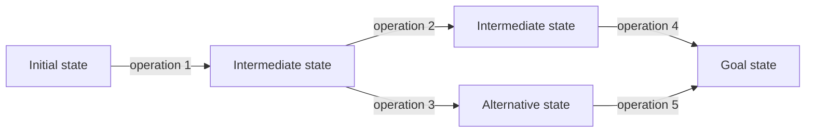

# 6. Artificial Intelligence

## 6.1 Pathfinding Problems and State-Space Modeling

Artificial intelligence studies methods for reproducing intelligent behavior by computer. In the search-centered view used here, an AI problem is difficult because the number of possible decisions or configurations is enormous. A naive enumeration of all possibilities can lead to combinatorial explosion, so the representation of the problem and the control strategy of the search are just as important as the raw algorithm.

Many AI tasks can be expressed as **pathfinding problems**. First, model the task as an edge-weighted directed graph. Then a solution is a path from a designated start node to one of the goal nodes, and in cost-sensitive versions the desired solution is a cheapest such path.

Describe a representation graph as a triple-like structure containing:

| Part | Meaning |
| --- | --- |
| Directed graph | Nodes represent meaningful configurations or subproblems; directed edges represent allowed transitions. |
| Edge costs | Costs are positive, with a positive lower bound $\delta$ in a $\delta$-graph. This prevents infinitely many ever-cheaper edge steps. |
| Start node | The node where the search begins. |
| Goal nodes | Nodes that satisfy the target condition. |

A **state-space representation** is the most direct model for many pathfinding tasks. It specifies:

| Element | Explanation |
| --- | --- |
| State space | The set of possible states of the central object or system. It is often described as a broader base set plus an invariant. |
| Operations | Each operation has a precondition and an effect. If the precondition holds in a state, the operation can produce a successor state. |
| Initial state or condition | The state, or set of states, where the solution may start. |
| Goal state or condition | The state, or set of states, that counts as success. |

The **state graph** has states as nodes and operation applications as directed edges. The state space is not the same as the problem space. The state space contains nodes; the problem space contains paths or operation sequences starting from the initial state. A solution is therefore not merely a goal state, but an operation sequence that reaches a goal state.



A **search system** has three conceptual parts:

| Part | Role |
| --- | --- |
| Global workspace | The memory of the search: current node, path, explored graph, open nodes, or other stored information depending on the algorithm. |
| Search rules | Rules that modify the workspace, such as moving to a neighbor, expanding a node, or backtracking. |
| Control strategy | The policy that chooses which rule to apply next. A heuristic is task-specific knowledge added to this strategy to improve success or efficiency. |

### Decomposition Model

A decomposition model based on AND/OR graphs is useful as a contrast: instead of moving between states, the problem is split into subproblems until simple subproblems are reached. The main focus remains state-space modeling with directed graphs.

### What to Emphasize in an Oral Answer

- Start from the search framing: many AI tasks are hard because the possible decision sequences or configurations explode combinatorially.
- Define the pathfinding model as a directed graph with states or configurations as nodes, allowed transitions as edges, positive edge costs when relevant, a start node, and goal nodes.
- Explain the state-space representation: state set, operations with preconditions and effects, initial state or condition, and goal state or condition.
- Distinguish state space from problem space: states are nodes, while candidate solutions are paths or operation sequences.
- Mention the search-system parts: global workspace, search rules, control strategy, and heuristics as task-specific guidance.
- Briefly contrast decomposition/AND-OR graphs if needed: they solve by splitting into subproblems rather than by moving through states.

::: details Suggested answer

Artificial intelligence problems are often treated as search problems because the system must choose a useful sequence of decisions from a very large set of possibilities. A pathfinding formulation makes this precise. We model the task as a directed graph: nodes are states or configurations, directed edges are allowed transitions, and edge costs describe the cost of applying a transition. The search starts from a designated initial node and tries to reach one of the goal nodes. If costs matter, the goal is not just any path but a cheapest path.

The state-space model is the standard way to build such a graph. It defines the state space, the operations, the initial state or initial condition, and the goal state or goal condition. An operation has a precondition and an effect: when the precondition holds in a state, the operation can be applied and produces a successor state. The resulting state graph has states as nodes and operation applications as edges.

It is important not to confuse the state space with the problem space. The state space contains individual states. The problem space contains possible operation sequences, or paths, starting from the initial state. A solution is therefore an operation sequence that leads to a goal, not merely the final state itself.

The reason this representation matters is that AI problems are usually too large for blind enumeration. The search system needs memory, rules that change that memory, and a control strategy that chooses what to try next. Heuristics are task-specific estimates or preferences built into that control strategy. They do not change the formal problem, but they can make the search practical by guiding it toward promising parts of the graph. A decomposition model is a useful contrast: it breaks a problem into subproblems in an AND/OR structure instead of representing the solution mainly as a path through states.

:::

## 6.2 Local Search

Local search keeps only a **current node** and usually its immediate neighborhood in the global workspace. The search rule replaces the current node by a preferably better neighbor. The control strategy is normally non-modifiable: once the search moves, it forgets the path that led there, so earlier decisions cannot be undone in the systematic way backtracking can undo them.

Local search needs a **fitness function** or objective function. The function estimates how good a state is, often by measuring closeness to a goal or value of a solution candidate. These methods are useful when a locally bad move does not destroy the possibility of success, or when the task is optimization rather than exact path reconstruction.

| Algorithm | Main idea | Strength | Main risk |
| --- | --- | --- | --- |
| Hill climbing | Move from the current node to the best available child or neighbor, usually avoiding immediate return to the parent. | Simple and memory-light. | Can get stuck in local optima, dead ends, plateaus, or cycles. |
| Tabu search | Store the current node, the best node found so far, and a short queue-like tabu list of recently visited nodes. Move to the best non-tabu neighbor. | Reduces short cycles and remembers the best state reached. | The tabu list is finite, so longer cycles and poor neighborhoods can still mislead it. |
| Simulated annealing | Choose a random neighbor. Always accept improvement; sometimes accept a worse move with a probability that decreases as the move gets worse and as the search cools. | Can escape local optima early in the search. | Needs a cooling schedule; too much randomness wastes time, too little becomes hill climbing. |

Compact pseudocode for the shared pattern:

```text
current := initial state
best := current

repeat until stopping condition:
  candidates := neighbors(current)
  next := choose candidate using the algorithm's rule
  if accept(current, next):
    current := next
    if fitness(current) is better than fitness(best):
      best := current

return best or current
```

For hill climbing, `choose` selects the best neighbor and `accept` usually requires improvement. For tabu search, `choose` excludes recently visited tabu states and updates the tabu queue. For simulated annealing, `choose` is random and `accept` may allow a worse state with a temperature-dependent probability.

### What to Emphasize in an Oral Answer

- Define local search as search that keeps a current state and its neighborhood, not a whole path or search tree.
- State the role of a fitness/objective function: it ranks neighboring states or candidate solutions.
- Contrast the named methods: hill climbing chooses the best improving neighbor; tabu search remembers recently visited states; simulated annealing sometimes accepts worse moves.
- Name the main failure modes: local optima, dead ends, plateaus, and cycles.
- Explain the tradeoff: very low memory and good optimization behavior, but weak completeness/optimality guarantees and no systematic path reconstruction.
- Mention when it fits: when a good final state matters more than the exact path to it.

::: details Suggested answer

Local search is a family of search methods that keep very little memory. Instead of storing a whole search tree or all explored paths, the algorithm keeps a current state and looks at nearby states. It then moves to a neighbor that seems better according to a fitness or objective function. This makes local search memory-efficient and useful for optimization problems, but it also means the algorithm does not remember enough structure to systematically undo earlier decisions.

Hill climbing is the simplest example. At each step it chooses the best neighboring state and moves there. It is fast and easy to implement, but it can fail when the best local move does not lead to a global solution. It may get stuck at a local optimum, in a dead end, on a plateau where neighbors look equally good, or in a cycle if the fitness function does not guide it well.

Tabu search adds a limited memory to reduce this problem. It remembers a short list of recently visited states, called the tabu set, and avoids moving back to them. It also records the best state found so far. This makes it less likely to loop in a short cycle and lets it return a good result even if the current state later becomes worse. The limitation is that the memory is finite, so it is still heuristic rather than complete.

Simulated annealing uses randomness to escape local traps. It always accepts a better move, but it may also accept a worse move with some probability. Early in the search this probability is higher, so the algorithm explores more freely. Later, as the temperature decreases, it becomes more conservative and behaves more like hill climbing. The tradeoff is controlled by the cooling schedule: cool too quickly and it gets stuck; cool too slowly and it wastes time.

Overall, local search is attractive when the path itself is less important than finding a good state, and when a compact heuristic can judge neighboring states. Its weakness is that it gives up completeness and optimality guarantees unless the problem structure is especially favorable.

:::

## 6.3 Backtracking Search

Backtracking stores the current path from the start node to the current node, together with information about still-untried outgoing edges. Its global workspace is larger than local search but much smaller than full graph search.

The two basic rules are:

1. **Forward step:** choose an untried outgoing edge from the current node and append it to the current path.
2. **Backtrack step:** if no acceptable forward step remains, delete the last edge from the path and return to the previous node.

Backtracking uses a **modifiable control strategy** because earlier decisions can be changed. It tries to move forward first and backtracks only as a last resort. Heuristics can improve it in two local ways:

| Heuristic | Role |
| --- | --- |
| Ordering | Try more promising outgoing edges earlier. |
| Pruning | Reject edges or partial paths that cannot lead to a useful solution. |

The list includes typical stopping or backtracking triggers:

| Trigger | Meaning |
| --- | --- |
| Dead end | The current node has no usable outgoing edge. |
| Dead-end mouth | The search can recognize that the current partial path leads only to failure. |
| Cycle | The current path would repeat a node and therefore loop. |
| Depth bound | The current path has reached the permitted search depth. |

Important properties:

| Variant or condition | Consequence |
| --- | --- |
| Finite acyclic directed graph with basic backtracking | Terminates and finds a solution if one exists. |
| General $\delta$-graph with cycle/depth monitoring | Terminates and finds a solution within the depth bound if one exists. |
| Memory use | Small, because it stores mainly one path and local choice information. |
| Optimality | Not guaranteed unless additional cost-aware rules are added. |

### What to Emphasize in an Oral Answer

- Define backtracking as a systematic depth-oriented search that stores the current path plus still-untried outgoing choices.
- Describe the two rules: take a forward step when an acceptable untried edge exists; otherwise remove the last step and return to the previous node.
- Explain why the control strategy is modifiable: earlier choices can be revised, unlike in ordinary local search.
- Mention backtracking triggers: dead end, recognizable dead-end mouth, cycle, or depth bound.
- Include heuristic roles: ordering tries promising choices first, and pruning rejects partial paths that cannot succeed.
- State the guarantees and limits: low memory and completeness under finite acyclic or bounded/cycle-checked assumptions, but no inherent optimality.

::: details Suggested answer

Backtracking is a systematic search method that stores the current path and the alternatives that have not yet been tried. It moves forward by choosing an outgoing edge from the current node. If that choice fails, it removes the last step and returns to the previous node, where it tries another alternative. This is why backtracking has a modifiable control strategy: unlike local search, it can revise an earlier decision.

The method is useful when a solution is a sequence of choices and many partial sequences can be rejected before they are completed. In a state-space graph, the workspace contains the path from the start state to the current state and the still-untried edges from nodes on that path. The algorithm tries forward movement first, and it backtracks only when it reaches a dead end, detects a cycle, reaches a depth bound, or recognizes that the partial path cannot lead to a solution.

Heuristics can make backtracking much more effective. Ordering heuristics choose promising edges first, so a solution may be found sooner. Pruning heuristics discard choices that cannot possibly lead to a valid goal. These heuristics do not change the basic structure of the algorithm; they reduce the amount of useless search.

The advantage of backtracking is that it is simple, uses relatively little memory, and can be complete under suitable assumptions such as a finite acyclic graph or a bounded search depth with cycle checking. The disadvantage is that it may discover a bad early choice only after exploring a large subtree. It also does not automatically find an optimal solution, because its main goal is to find a successful path, not necessarily the cheapest one.

:::

## 6.4 Heuristic Graph Search

Graph search stores a larger global workspace than local search or backtracking. It keeps a **search graph** of already discovered paths from the start node and marks some nodes as **open**. An open node is a discovered node whose successors are not yet known, or not yet known well enough.

For each discovered node, graph search stores:

| Stored value | Meaning |
| --- | --- |
| $g(n)$ | Cost of the currently stored path from the start node to node $n$. |
| $\pi(n)$ | Back-pointer to the predecessor of $n$ on that stored path. |
| open/closed status | Whether the node is waiting for expansion or has already been expanded. |
| $h(n)$ | Heuristic estimate of the remaining optimal cost from $n$ to a goal. |
| $f(n)$ | Evaluation value used to choose which open node to expand. |

Expansion means generating all successors of the chosen open node. If a newly found path to an already discovered node is cheaper, the stored $g$ and $\pi$ values may be updated and the node can become open again. In general graph search, this can make already discovered descendant information temporarily inconsistent, so some algorithms may expand a node more than once.

Uninformed graph searches are special cases of evaluation-based graph search:

| Search | Evaluation idea |
| --- | --- |
| Depth-first graph search | Prefer deeper nodes; in this notation, $f=-g$ when all edge costs are 1. |
| Breadth-first graph search | Prefer shallower nodes; $f=g$ when all edge costs are 1. |
| Uniform-cost graph search | Prefer the cheapest known path cost; $f=g$. |

Heuristic graph search adds $h(n)$, an estimate of the optimal remaining cost $h^\*(n)$. Important named variants include A, A*, $A^C$, and B.

| Algorithm | Evaluation or rule | Main guarantee or idea |
| --- | --- | --- |
| Look-ahead search | $f=h$ | Greedy: chooses the node estimated closest to a goal, but ignores cost already paid. |
| A algorithm | $f=g+h$, with $h \geq 0$ | Balances cost already paid and estimated remaining cost. |
| A* algorithm | $f=g+h$, with $0 \leq h \leq h^\*$ | With an admissible heuristic, finds an optimal solution if one exists. |
| $A^C$ algorithm | A* plus consistency: for every edge $(n,m)$, $h(n)-h(m) \leq c(n,m)$ | A consistent heuristic prevents the need to re-expand nodes; each node is expanded at most once. |
| B algorithm | Uses A*-style admissible information, but selects by $g$ among open nodes whose $f$ is below a threshold based on already expanded nodes | Also finds an optimal solution under the A*-like heuristic condition; State it expands the same set of nodes as A* but has quadratic running time. |

Admissibility and consistency:

| Property | Formula | Meaning |
| --- | --- | --- |
| Admissible heuristic | $0 \leq h(n) \leq h^\*(n)$ | The heuristic never overestimates the true cheapest remaining cost. |
| Consistent heuristic | $h(n) \leq c(n,m)+h(m)$ for every edge $(n,m)$ | The estimated cost cannot drop by more than the edge cost; this is a triangle-inequality-like condition. |

General graph-search facts:

- On finite $\delta$-graphs, graph searches terminate and find a solution if one exists.
- Many important graph searches can find a solution even in infinite graphs if a solution exists, but look-ahead search and unbounded depth-first graph search are exceptions.
- A* and $A^C$ find optimal solutions under their stated heuristic conditions.
- $A^C$ avoids re-expansion because consistency keeps stored path costs coherent after expansion.
- Graph search is usually more memory-intensive than backtracking because it stores many discovered nodes and paths.

Compact A* pseudocode:

```text
open := priority queue ordered by f(n) = g(n) + h(n)
g(start) := 0
pi(start) := none
insert start into open

while open is not empty:
  n := remove open node with smallest f
  if n is a goal:
    return path reconstructed from pi
  expand n
  for each edge n -> m with cost c:
    tentative := g(n) + c
    if m is new or tentative < g(m):
      g(m) := tentative
      pi(m) := n
      insert or reopen m in open

return failure
```

### What to Emphasize in an Oral Answer

- Define graph search by its larger workspace: discovered nodes, stored best paths, open/closed status, and back-pointers.
- Explain the stored values: $g(n)$ for known start cost, $\pi(n)$ for path reconstruction, $h(n)$ for estimated remaining cost, and $f(n)$ for expansion priority.
- Describe expansion and reopening: successors are generated, and cheaper paths can update $g$ and $\pi$.
- Contrast uninformed special cases with heuristic search: depth-first, breadth-first, and uniform-cost are evaluation choices without goal estimates.
- State the A-family distinctions: A uses $f=g+h$; A* is optimal with an admissible heuristic; $A^C$ adds consistency to avoid re-expansion.
- Include B algorithm briefly as another optimal variant with A*-style admissible information but different selection behavior.
- Finish with the tradeoff: stronger completeness/optimality results than local search, but much higher memory use and dependence on heuristic quality.

::: details Suggested answer

Heuristic graph search stores a search graph instead of only one path. It remembers discovered nodes, the best path currently known to each node, and a set of open nodes whose successors still need to be considered. For each node it stores the known path cost $g$, a back-pointer $\pi$ for reconstructing the path, and often a heuristic estimate $h$ of the remaining cost to a goal. Depth-first, breadth-first, and uniform-cost search can be seen as graph-search variants with different evaluation rules; heuristic search adds goal-directed estimates.

The control strategy chooses which open node to expand next. Expansion generates the node's successors. If the search discovers a cheaper path to a node it already knows, it updates the stored cost and back-pointer, and that node may become open again. This is the reason graph search can be more powerful than backtracking but also more memory-intensive: it keeps many alternatives alive at once.

The A algorithm uses the evaluation function $f=g+h$. The value $g$ is the exact cost already paid from the start to the current node, and $h$ estimates the remaining cost from the current node to a goal. This balances actual progress with goal-directed guidance. A* is the special case where the heuristic is admissible: it never overestimates the true cheapest remaining cost. With nonnegative costs and an admissible heuristic, A* finds an optimal solution if one exists.

The algorithm written as A C is commonly represented here as $A^C$. It is A* with a consistent heuristic. Consistency means that along every edge, the heuristic can decrease by at most the edge cost. This prevents a node that has already been expanded from later needing a cheaper correction, so each node is expanded at most once. That is a strong practical advantage.

The B algorithm is another optimal heuristic graph-search variant. Instead of simply choosing the smallest $g+h$ node as A* does, it uses cost $g$ among open nodes whose evaluation value is within a threshold determined by already expanded nodes. Under the same admissible-heuristic style condition, it finds an optimal solution and expands the same set of nodes as A*, though with different running-time behavior.

The main tradeoff is clear: heuristic graph search can be complete and optimal under the right conditions, but it pays with memory. It stores a frontier and a search graph, while local search and backtracking store much less. The quality of the heuristic is therefore central: a good heuristic reduces expansions, while a weak one makes the search approach uninformed uniform-cost behavior.

:::

## 6.5 Two-Player Games

For two-player games, focus on complete-information, zero-sum, finite games. These assumptions mean:

| Assumption | Meaning |
| --- | --- |
| Two-player | Two opponents alternate or otherwise choose moves. |
| Complete information | The current state and legal moves are known, unlike games with hidden cards or private state. |
| Zero-sum | One player's advantage is the other player's disadvantage. |
| Finite | The game tree has finite depth or can be searched with a finite cutoff. |

Games can be modeled with a state-space representation. The state graph is often treated as a **game tree** rooted at the current position. Edges represent legal moves. Levels alternate between our move and the opponent's move.

A **winning strategy** gives a move for every possible opponent response so that the player wins. A **non-losing strategy** guarantees at least a draw. Searching the full game tree can be impossible because of combinatorial explosion, so practical game-playing programs search only part of the tree and evaluate frontier positions.

Minimax:

| Level | Rule |
| --- | --- |
| Our move, MAX level | Choose the child with the maximum backed-up value. |
| Opponent move, MIN level | Assume the opponent chooses the child with the minimum value for us. |
| Leaves or cutoff frontier | Use exact win/loss/draw values if known; otherwise use an evaluation function. |

Compact minimax pseudocode:

```text
value(position, depth):
  if position is terminal or depth = 0:
    return evaluate(position)

  if it is our turn:
    return max(value(child, depth - 1) for each legal child)
  else:
    return min(value(child, depth - 1) for each legal child)
```

Alpha-beta pruning improves minimax by avoiding branches that cannot affect the final decision:

| Symbol | Meaning |
| --- | --- |
| $\alpha$ | Best value MAX can already guarantee on the current path. |
| $\beta$ | Best value MIN can already guarantee on the current path. |
| Pruning condition | If $\alpha \geq \beta$, the remaining branch cannot change the decision and can be skipped. |

Other refinements:

| Refinement | Role |
| --- | --- |
| Variable-depth minimax and quiescence tests | Avoid evaluating unstable positions too early; search deeper in tactically active branches. |
| Averaging variants | Combine several high and low child values rather than only strict max/min in some evaluation schemes. |
| Negamax | Uses the zero-sum symmetry by negating values at the opponent level and always maximizing. |

### What to Emphasize in an Oral Answer

- State the assumptions: two-player, complete-information, zero-sum, finite game tree or finite search cutoff.
- Model the game as a state-space/game tree with legal moves as edges and alternating MAX/MIN levels.
- Distinguish a winning strategy from a single winning line; a strategy must handle every opponent response, and a non-losing strategy guarantees at least a draw.
- Explain minimax: evaluate terminal or cutoff leaves, then back up maxima at our turns and minima at opponent turns.
- Explain alpha-beta pruning with $\alpha$ and $\beta$ bounds and the $\alpha \geq \beta$ cutoff, emphasizing that it preserves the minimax result.
- Mention practical refinements: evaluation functions, depth cutoffs, quiescence/variable-depth search, and negamax.

::: details Suggested answer

Two-player games can be modeled as search problems in a state space. A state is a game position, and an edge is a legal move. For complete-information, zero-sum, finite games, the game can be represented as a tree rooted at the current position. The levels alternate between our moves and the opponent's moves.

The central idea is that our choice must account for the opponent's best reply. A winning strategy is not just one good line of play; it is a plan that gives an answer to every possible move by the opponent. A non-losing strategy guarantees at least a draw. In small games one could search the full game tree and determine whether such a strategy exists. In realistic games the tree is too large, so programs search only a limited subtree and use an evaluation function at the frontier.

Minimax is the basic algorithm for this setting. At our levels, called MAX levels, the algorithm chooses the child with the largest value. At the opponent's levels, called MIN levels, it assumes the opponent will choose the child that is worst for us. Values are therefore propagated upward from the leaves: maxima at our turns and minima at the opponent's turns. The move whose value reaches the root is selected.

Alpha-beta pruning improves minimax without changing the result. It keeps two bounds: alpha, the best value MAX can already guarantee, and beta, the best value MIN can already guarantee. If the search reaches a point where alpha is at least beta, the remaining children cannot influence the final decision, so that branch can be skipped. With good move ordering, alpha-beta can examine far fewer nodes than plain minimax.

Practical game search also uses refinements. Variable-depth search and quiescence tests avoid stopping evaluation in unstable tactical positions. Negamax rewrites minimax using the symmetry of zero-sum games: instead of alternating min and max code, it negates the opponent's value and always maximizes. The common theme is that game playing is still search, but the search must model an intelligent adversary rather than a passive graph.

:::
