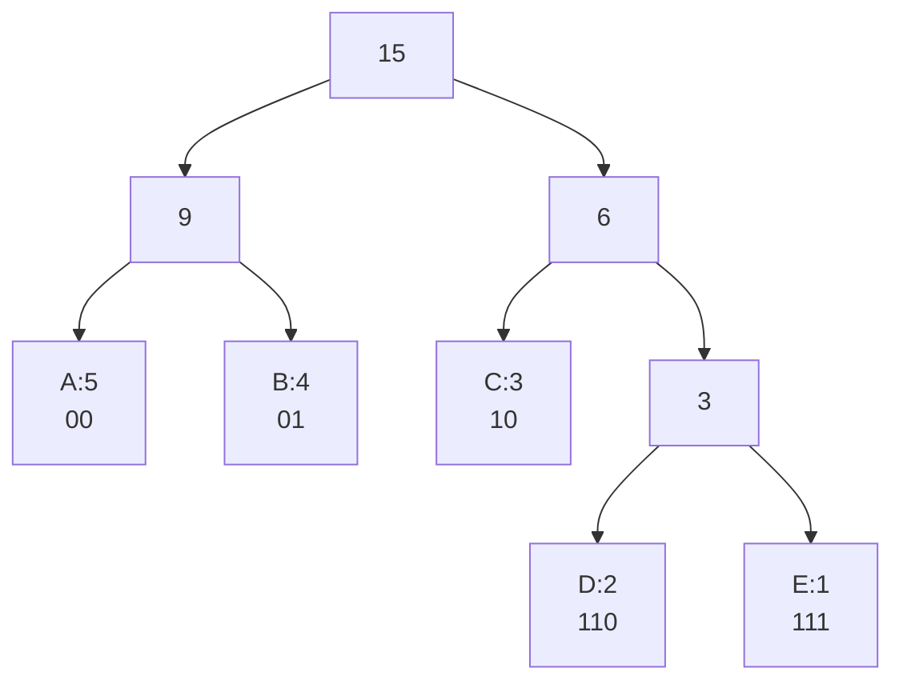

# 14. Basic Algorithms

## 14.1 Efficiency of Algorithms and Growth of Functions

Efficiency and growth-rate material is included here directly.

Algorithm efficiency describes how resource use grows with input size. The two most common resources are:

| Resource         | Meaning                                                                              |
| ---------------- | ------------------------------------------------------------------------------------ |
| Time complexity  | Number of elementary operations as a function of input size.                         |
| Space complexity | Amount of memory used as a function of input size, often excluding the input itself. |

The input size is usually denoted by $n$, but other parameters can matter. For example, counting sort is $O(n + k)$, where $k$ is the key range. String matching often uses $n$ for text length and $m$ for pattern length.

The lower-bound argument uses operation-count notation:

| Notation | Meaning                                      |
| -------- | -------------------------------------------- |
| $T(n)$   | Operation count as a function of input size. |
| $mT(n)$  | Minimum operation count.                     |
| $MT(n)$  | Maximum operation count.                     |
| $AT(n)$  | Average operation count.                     |

When analyzing an algorithm, choose the dominant operation. In sorting, this is often comparison count or movement count. In string matching, it may be character comparisons. In graph algorithms, it may be edge scans.

### Asymptotic Notation

Asymptotic notation ignores constant factors and lower-order terms to compare growth for large inputs.

| Notation       | Meaning                | Formal intuition                                                |
| -------------- | ---------------------- | --------------------------------------------------------------- |
| $O(g(n))$      | Asymptotic upper bound | $f(n)$ grows no faster than a constant multiple of $g(n)$.      |
| $\Omega(g(n))$ | Asymptotic lower bound | $f(n)$ grows at least as fast as a constant multiple of $g(n)$. |
| $\Theta(g(n))$ | Tight bound            | Both $O(g(n))$ and $\Omega(g(n))$.                              |
| $o(g(n))$      | Strictly smaller order | $f(n) / g(n) \to 0$.                                            |
| $\omega(g(n))$ | Strictly larger order  | $f(n) / g(n) \to \infty$.                                       |

Common growth order:

$$
1 < log n < n < n log n < n^2 < n^3 < 2^n < n!
$$

Examples:

| Expression                  | Simplified growth  |
| --------------------------- | ------------------ |
| $3n + 10$                   | $\Theta(n)$        |
| $5n \log n + 12n$           | $\Theta(n \log n)$ |
| $7n^2 + 100n \log n$        | $\Theta(n^2)$      |
| Binary search               | $\Theta(\log n)$   |
| Linear scan                 | $\Theta(n)$        |
| Nested loops over all pairs | $\Theta(n^2)$      |

### Best, Worst, and Average Cases

For the same input size, different actual inputs can cause different running times.

| Case         | Meaning                                            |
| ------------ | -------------------------------------------------- |
| Best case    | Minimum cost among inputs of size $n$.             |
| Worst case   | Maximum cost among inputs of size $n$.             |
| Average case | Expected cost under an assumed input distribution. |

Worst-case analysis is useful because it gives a guarantee. Average-case analysis is useful only when the distribution assumption is meaningful.

### Stability and In-Place Sorting

Sorting algorithms are often compared by more than time complexity.

| Property | Meaning                                                              |
| -------- | -------------------------------------------------------------------- |
| Stable   | Equal keys keep their original relative order.                       |
| In-place | Uses only constant or small auxiliary memory beyond the input array. |
| Adaptive | Runs faster on partially sorted input.                               |

These properties matter for choosing algorithms in practice. For example, stable sorting is important when sorting records by multiple keys.

### What to Emphasize in an Oral Answer

- Define efficiency as growth of resource use with input size, mainly time and space.
- Mention that input size may involve more than $n$, such as key range $k$ or pattern length $m$.
- Explain operation counts and the dominant operation: comparisons, moves, character comparisons, edge scans, and similar units.
- Distinguish best, worst, and average case; average case requires a meaningful input distribution, while worst case gives a guarantee.
- Define the main asymptotic notations: $O$, $\Omega$, $\Theta$, and optionally strict $o$ and $\omega$.
- Give the common growth order and examples: $\log n$, $n$, $n\log n$, $n^2$, $2^n$, $n!$.
- For sorting, also mention stability, in-place memory use, and adaptiveness as practical efficiency-related properties.

::: details Suggested answer

Algorithm efficiency measures how resource use grows with input size. The main resources are time and memory. We usually express time as an operation count function such as $T(n)$, where $n$ is the input size, but other parameters can matter too, such as key range in counting sort or pattern length in string matching. The analysis also has to say what operation is being counted, for example comparisons in sorting, character comparisons in string matching, or edge scans in graph algorithms.

Growth is described with asymptotic notation. Big-O gives an upper bound, Omega gives a lower bound, and Theta gives a tight bound. For example, a linear scan is $\Theta(n)$, binary search is $\Theta(\log n)$, and a typical efficient comparison sort such as merge sort is $\Theta(n\log n)$. We ignore constants and lower-order terms because asymptotic notation is about large-input growth.

For the same input size, the running time may differ by input, so we distinguish best, worst, and average cases. Worst-case analysis gives a guarantee; average-case analysis is useful only under a stated distribution. Besides time, sorting algorithms are compared by stability, memory use, and whether they are in-place or adaptive. So efficiency is not just a number; it is a description of resource growth under stated assumptions.

:::

## 14.2 Comparison Sorting: Insertion Sort, Merge Sort, Quicksort, and Heap Sort

A comparison sort obtains information about the input order only by comparing elements. The main comparison sorts here are insertion sort, merge sort, quicksort, and heap sort. Bubble sort and tournament sort are useful secondary examples.

### Sorting Summary

| Algorithm       | Best             | Average       | Worst         | Stable                       | In-place                                | Notes                                       |
| --------------- | ---------------- | ------------- | ------------- | ---------------------------- | --------------------------------------- | ------------------------------------------- |
| Insertion sort  | $O(n)$           | $O(n^2)$      | $O(n^2)$      | Yes                          | Yes for arrays                          | Excellent for small or nearly sorted input. |
| Merge sort      | $O(n \log n)$    | $O(n \log n)$ | $O(n \log n)$ | Yes if implemented carefully | No for arrays                           | Divide and conquer; needs auxiliary space.  |
| Quicksort       | $O(n \log n)$    | $O(n \log n)$ | $O(n^2)$      | Usually no                   | Yes-ish for arrays plus recursion stack | Fast in practice with good pivots.          |
| Heap sort       | $O(n \log n)$    | $O(n \log n)$ | $O(n \log n)$ | No                           | Yes                                     | Uses binary heap; good worst-case bound.    |
| Bubble sort     | $O(n)$ optimized | $O(n^2)$      | $O(n^2)$      | Yes                          | Yes                                     | Secondary example, rarely used in practice. |
| Tournament sort | $O(n \log n)$    | $O(n \log n)$ | $O(n \log n)$ | Depends                      | Extra tree space                        | Secondary example, rarely used in practice. |

### Insertion Sort

Important points:

- For small $n$ around 30, insertion sort can be very good.
- Moving an element takes one assignment, while a swap in bubble sort takes three assignments.
- It can be implemented on a linked list by adjusting pointers.
- At step $j$, prefix $A[1..j]$ is sorted.

Algorithm:

```text
for j := 2 to n:
    key := A[j]
    i := j - 1
    while i >= 1 and A[i] > key:
        A[i + 1] := A[i]
        i := i - 1
    A[i + 1] := key
```

Invariant: before each outer-loop iteration, the prefix before $j$ is sorted and contains the same elements as before. The algorithm inserts $A[j]$ into its correct position in that sorted prefix.

Insertion sort is stable if equal keys are not moved past each other. It is adaptive because nearly sorted arrays cause few shifts.

### Merge Sort

Merge sort is based on merging two sorted sequences and can be applied top-down recursively or bottom-up iteratively; the bottom-up version is useful for sequential files.

Top-down algorithm:

```text
mergeSort(A):
    if length(A) <= 1: return A
    split A into left and right halves
    left := mergeSort(left)
    right := mergeSort(right)
    return merge(left, right)
```

The merge step scans two sorted sequences and repeatedly copies the smaller current element to the output. Merging costs $\Theta(n)$ for total length $n$. The recurrence is:

$$
T(n) = 2T(n/2) + \Theta(n) = \Theta(n \log n)
$$

Merge sort gives reliable $O(n \log n)$ time and can be stable. Its usual array version needs $O(n)$ auxiliary memory.

### Quicksort

Quicksort chooses an element, puts smaller elements to its left and larger elements to its right, inserts the pivot between the two parts, and recursively sorts both parts.

Partition-based version:

```text
quickSort(A, low, high):
    if low < high:
        p := partition(A, low, high)
        quickSort(A, low, p - 1)
        quickSort(A, p + 1, high)
```

Partition rearranges elements so that:

```text
A[low..p-1] <= A[p] <= A[p+1..high]
```

If pivots split the array reasonably evenly, quicksort is $O(n \log n)$ on average. If pivots repeatedly produce highly unbalanced partitions, the worst case is $O(n^2)$. Good pivot selection, randomization, and switching to insertion sort for small partitions improve practical performance.

### Heap Sort

Heap sort has two phases:

1. Build the initial heap from the unsorted input array.
2. Repeatedly swap the root with the last active element, mark that element inactive, and sink the new root inside the active heap.

A max-heap is a complete binary tree stored in the array where each parent is at least as large as its children. The maximum is at the root.

Algorithm:

```text
buildMaxHeap(A)
heapSize := n
while heapSize > 1:
    swap A[1] and A[heapSize]
    heapSize := heapSize - 1
    sink A[1] inside A[1..heapSize]
```

The result is sorted in ascending order because the largest remaining active element is moved to the end each time.

Complexity:

| Step                   | Cost          |
| ---------------------- | ------------- |
| Build heap bottom-up   | $O(n)$        |
| $n - 1$ removals/sinks | $O(n \log n)$ |
| Total                  | $O(n \log n)$ |

Heap sort is in-place and has good worst-case complexity, but it is not stable and often has worse cache behavior than quicksort.

### Secondary Examples

**Bubble sort.** Bubble sort repeatedly swaps adjacent out-of-order elements so that the largest active element "bubbles" to the end. After each pass, the final position can be ignored. It is simple and stable but $O(n^2)$ and not used in practice except for teaching.

**Tournament sort.** Tournament sort builds a complete binary tournament tree. The maximum is at the root. After outputting it, the leaf containing that maximum is replaced by negative infinity and the affected branch is replayed so the next maximum reaches the root. It illustrates tree-based comparison sorting, but it is not commonly used in practice.

### What to Emphasize in an Oral Answer

- Define comparison sorting: the algorithm learns order only through pairwise comparisons, so comparisons are the key cost.
- Insertion sort: sorted-prefix invariant, insert by shifting, stable/in-place/adaptive, $O(n)$ best and $O(n^2)$ average/worst.
- Merge sort: divide and conquer, linear merge, recurrence $T(n)=2T(n/2)+\Theta(n)$, stable if implemented carefully, $O(n\log n)$ time and usually $O(n)$ extra space.
- Quicksort: choose pivot, partition, recursively sort subarrays; expected $O(n\log n)$ with good pivots but $O(n^2)$ worst case with bad splits.
- Heap sort: build max-heap, repeatedly move root maximum to the end and sink; $O(n\log n)$ worst case, in-place, not stable.
- Compare practical tradeoffs: stability, in-place behavior, adaptiveness, cache behavior, and suitability for small or nearly sorted input.
- Mention bubble sort and tournament sort only as secondary comparison-sort examples.

::: details Suggested answer

Comparison sorting algorithms learn the input order by comparing elements, so comparison count is the natural cost measure. Insertion sort maintains a sorted prefix and inserts each next element into that prefix by shifting larger elements to the right. It is $O(n)$ in the best case on already sorted input and $O(n^2)$ on average and in the worst case, but it is simple, stable, in-place, adaptive, and very good for small or nearly sorted inputs.

Merge sort is divide and conquer. It recursively splits the array, sorts the halves, and merges two sorted sequences in linear time. Its recurrence $T(n)=2T(n/2)+\Theta(n)$ gives $\Theta(n\log n)$ in all cases. It can be stable, but the normal array implementation needs linear auxiliary space.

Quicksort chooses a pivot, partitions the array into elements smaller and larger than the pivot, and recursively sorts the two parts. It is very fast on average, with expected $O(n\log n)$ time, but bad pivots can cause $O(n^2)$ worst-case time. Heap sort first builds a max-heap and then repeatedly moves the maximum root to the end of the active array and sinks the new root. It is in-place and worst-case $O(n\log n)$, but not stable and often has less favorable cache behavior than quicksort. Bubble sort and tournament sort are also comparison-sort examples, but they are mainly educational here.

:::

## 14.3 Lower Bounds for Comparison Sorting

Operation counts and decision trees give the lower-bound argument. The corrected proof is given here.

### Maximum Selection Lower Bound

Finding the maximum of $n$ elements requires at least $n - 1$ comparisons. If an element is never compared, it could be larger than all others, so it cannot be ruled out. Each comparison can eliminate at most one candidate from being the maximum, and $n - 1$ candidates must be eliminated.

### Decision Tree Model

For comparison sorting, every comparison has one of two outcomes, so any deterministic comparison sort can be represented by a binary decision tree:

- internal nodes are comparisons;
- edges are comparison outcomes;
- leaves are possible final orderings/permutations;
- the height of the tree corresponds to worst-case comparisons.

To sort $n$ distinct elements correctly, the algorithm must distinguish all $n!$ possible input permutations. Therefore the decision tree must have at least $n!$ leaves.

A binary tree of height $h$ has at most $2^h$ leaves, so:

$$
\begin{aligned}
2^h &\ge n! \\
h &\ge \log_2(n!)
\end{aligned}
$$

### Worst-Case Lower Bound

We need:

$$
\log_2(n!) = \Omega(n \log n)
$$

One simple bound:

$$
\begin{aligned}
n! &= 1 * 2 * \ldots * n \\
&\geq (n/2)^{n/2}
\end{aligned}
$$

because the last $n/2$ factors are all at least $n/2$. Therefore:

$$
\begin{aligned}
\log_2(n!) &\geq \log_2((n/2)^{n/2}) \\
&= (n/2) \log_2(n/2) \\
&= \Omega(n \log n)
\end{aligned}
$$

Thus every comparison sort has worst-case comparison count:

$$
\Omega(n \log n)
$$

Merge sort and heap sort match this lower bound asymptotically with $O(n \log n)$ worst-case time, so they are asymptotically optimal among comparison sorts.

### Average-Case Lower Bound

The same decision-tree model also gives an average-case lower bound when every input permutation is equally likely. The idea is that the average number of comparisons is the average depth of leaves in the decision tree. Among binary trees with a fixed number of leaves, an almost complete tree minimizes the leaf-depth sum. Since the tree still needs $n!$ leaves, the average depth is also:

$$
\Omega(\log(n!)) = \Omega(n \log n)
$$

So comparison sorting requires $\Omega(n \log n)$ comparisons not only in the worst case, but also on average under the uniform permutation model.

### What to Emphasize in an Oral Answer

- Start with the simpler maximum-selection lower bound: finding the maximum needs at least $n-1$ comparisons because each comparison eliminates at most one candidate.
- Define the decision-tree model for deterministic comparison sorting: internal nodes are comparisons, edges are outcomes, leaves are final permutations.
- State why at least $n!$ leaves are necessary for $n$ distinct inputs.
- Use the binary-tree height bound $2^h \ge n!$, so $h \ge \log_2(n!)$.
- Show the asymptotic step: $n! \ge (n/2)^{n/2}$ implies $\log(n!)=\Omega(n\log n)$.
- Conclude that every comparison sort needs $\Omega(n\log n)$ comparisons in the worst case, and also on average under the uniform permutation model.
- Mention that merge sort and heap sort match the lower bound asymptotically in worst case.

::: details Suggested answer

Lower bounds explain what no algorithm in a model can beat. For maximum selection, at least $n-1$ comparisons are necessary because each comparison can rule out at most one element from being the maximum, and all but one candidate must be ruled out. For full comparison sorting, the stronger lower bound comes from the decision-tree model. A deterministic comparison sort can be represented as a binary tree where each internal node is a comparison and each edge is one possible result of that comparison. Each leaf corresponds to a final ordering of the input.

For n distinct elements there are n factorial possible input permutations. A correct comparison sort must be able to distinguish all of them, so its decision tree needs at least n factorial leaves. A binary tree of height h has at most 2 to the h leaves, so 2 to the h must be at least n factorial. Therefore h is at least log base 2 of n factorial.

Now $\log(n!)$ is $\Omega(n\log n)$. For example, the last $n/2$ factors in $n!$ are each at least $n/2$, so $n!$ is at least $(n/2)^{n/2}$. Taking logarithms gives an $n\log n$ lower bound. Thus any comparison sorting algorithm needs $\Omega(n\log n)$ comparisons in the worst case, and a similar decision-tree argument gives the same asymptotic lower bound on average for uniformly distributed permutations. Merge sort and heap sort match this worst-case bound asymptotically, so they are optimal among comparison sorts up to constant factors.

:::

## 14.4 Linear-Time Sorting: Bucket Sort, Counting Sort, and Radix Sort

Linear-time sorting algorithms are not comparison sorts. They beat the $\Omega(n \log n)$ comparison lower bound by using assumptions about the keys, such as bounded integer ranges, digits, or approximate uniform distribution.

### Bucket Sort

Bucket sort is useful for values distributed almost uniformly over a range.

Algorithm:

1. Determine the value range.
2. Create buckets covering subranges.
3. Put each input element into the appropriate bucket.
4. Sort each bucket, often with insertion sort or another simple method.
5. Concatenate buckets in order.

Example:

| Input values in `[0, 1)`       | Buckets                                                                         |
| ------------------------------ | ------------------------------------------------------------------------------- |
| `0.12, 0.78, 0.31, 0.25, 0.94` | `[0.0,0.2): 0.12`, `[0.2,0.4): 0.25,0.31`, `[0.6,0.8): 0.78`, `[0.8,1.0): 0.94` |

If elements are uniformly distributed and the number of buckets is proportional to $n$, bucket sort has expected $O(n)$ time. In the worst case, all elements may land in one bucket and the cost depends on the internal bucket sort, often $O(n^2)$ if insertion sort is used.

### Counting Sort

Counting sort is stable and linear when keys are integers in a small range.

Assume keys lie in $\{0,\ldots,k\}$.

Algorithm:

1. Create count array $C[0..k]$, initially zero.
2. Scan input and increment $C[key]$.
3. Compute prefix sums in $C$; after this, $C[x]$ tells how many elements are $\le x$.
4. Scan input from right to left and place each element into its final output position using $C[key]$.
5. Decrement $C[key]$ after placing.

Worked example:

```text
input:  2 5 3 0 2 3 0 3
counts: C[0]=2, C[1]=0, C[2]=2, C[3]=3, C[4]=0, C[5]=1
output: 0 0 2 2 3 3 3 5
```

Complexity:

| Measure | Cost                                      |
| ------- | ----------------------------------------- |
| Time    | $O(n + k)$                                |
| Space   | $O(n + k)$ if stable output array is used |

Counting sort is useful when $k$ is not much larger than $n$. It is also commonly used as the stable subroutine in radix sort.

### Radix Sort

Radix sort sorts keys digit by digit. The least-significant-digit version sorts by units digit, then tens digit, then hundreds, and so on.

Important requirement: the per-digit sorting algorithm must be stable. Stability preserves the order produced by earlier less-significant digits.

Example:

```text
input:         329 457 657 839 436 720 355
ones digit:    720 355 436 457 657 329 839
tens digit:    720 329 436 839 355 457 657
hundreds digit:329 355 436 457 657 720 839
```

Complexity:

$O(d(n + k))$

where:

- $d$ is the number of digits;
- $k$ is the base/range of each digit;
- $n$ is the number of elements.

If $d$ and $k$ are bounded or small relative to $n$, radix sort is linear in $n$. It is not a comparison sort and therefore does not contradict the comparison-sort lower bound.

### Linear-Time Sorting Comparison

| Algorithm     | Assumption                   | Time            | Stable                                | Main limitation                                |
| ------------- | ---------------------------- | --------------- | ------------------------------------- | ---------------------------------------------- |
| Bucket sort   | Roughly uniform distribution | Expected $O(n)$ | Depends on bucket sort                | Bad distribution can make it slow              |
| Counting sort | Integer keys in small range  | $O(n + k)$      | Yes when implemented with prefix sums | Large key range costs memory/time              |
| Radix sort    | Keys split into fixed digits | $O(d(n + k))$   | Yes if digit sort is stable           | Needs digit representation and stable sub-sort |

### What to Emphasize in an Oral Answer

- Start with why the comparison lower bound does not apply: these algorithms use key structure beyond comparisons.
- Bucket sort: assumes near-uniform distribution over a range, distributes elements into buckets, sorts buckets, concatenates; expected $O(n)$ but bad distribution can be slow.
- Counting sort: assumes integer keys in a small range $\{0,\ldots,k\}$; count frequencies, compute prefix sums, place into output positions.
- State counting-sort cost and limitation: $O(n+k)$ time and usually $O(n+k)$ space, useful only when $k$ is not too large.
- Mention stability of counting sort and the usual right-to-left placement for stable output.
- Radix sort: process digits with a stable sub-sort, commonly least significant to most significant, with cost $O(d(n+k))$.
- Conclude with assumptions/tradeoffs: bucket depends on distribution, counting on range, radix on digit representation and stable passes.

::: details Suggested answer

Linear-time sorting algorithms avoid the comparison-sort lower bound by using extra assumptions about keys. Bucket sort assumes values are distributed fairly uniformly over a known range. It places elements into buckets for subranges, sorts each bucket, and concatenates the buckets. Its expected time can be linear, but if all elements fall into one bucket the worst case depends on the internal sorting algorithm.

Counting sort assumes integer keys in a small range. It counts how many times each key occurs, computes prefix sums to find final positions, and places elements into an output array. When scanning the input from right to left, equal keys keep their relative order, so the algorithm is stable. It runs in $O(n+k)$ time, where $k$ is the key range, and it usually needs $O(n+k)$ auxiliary space.

Radix sort sorts keys digit by digit, usually from least significant to most significant. Each digit pass must use a stable sort such as counting sort, because earlier digit order must be preserved. Its cost is $O(d(n+k))$, where $d$ is the number of digits and $k$ is the digit range. These algorithms can be linear only because they use key structure beyond comparisons, and each one has an assumption: bucket sort needs a good distribution, counting sort needs a small range, and radix sort needs a digit representation with stable passes.

:::

## 14.5 Data Compression: Naive Coding, Huffman Coding, and LZW

Three basic lossless compression methods are naive fixed-length coding, Huffman coding, and LZW.

### Naive Fixed-Length Coding

Naive compression encodes every character independently using fixed-length bit strings.

If the alphabet has $d$ symbols, each symbol needs:

$$
\lceil \log_2 d \rceil
$$

bits, because that many bits can encode at least $d$ different codes.

For an input of length $n$, the encoded length is:

$$
n \cdot \lceil \log_2 d \rceil
$$

plus the code table, if the decoder does not already know it.

Example: `ABRAKADABRA`.

| Quantity            | Value                      |
| ------------------- | -------------------------- |
| Distinct symbols    | `A, B, R, K, D`            |
| $d$                 | 5                          |
| $n$                 | 11                         |
| Bits per symbol     | $\lceil log2 5 \rceil = 3$ |
| Encoded data length | $11 \cdot 3 = 33$ bits     |

One possible fixed-length code table:

| Symbol | Code  |
| ------ | ----- |
| A      | `000` |
| B      | `001` |
| R      | `010` |
| K      | `011` |
| D      | `100` |

This is simple but does not exploit different character frequencies.

### Huffman Coding

Huffman coding gives shorter codewords to more frequent symbols and longer codewords to rarer symbols. It produces a prefix-free binary code: no codeword is the prefix of another. Prefix-free codes can be decoded unambiguously by reading bits from the root of the tree to a leaf.

Algorithm:

1. Sort symbols by frequency.
2. Repeatedly select the two rarest elements/groups.
3. Merge them into a new group with frequency equal to the sum.
4. Put the new group back into the sorted sequence.
5. The merge history forms a binary tree.
6. Codewords are read from root to leaves, usually assigning `0` and `1` to left/right edges.

Example frequencies:

| Symbol    | A   | B   | C   | D   | E   |
| --------- | --- | --- | --- | --- | --- |
| Frequency | 5   | 4   | 3   | 2   | 1   |

Merge sequence:

| Step | Merge      | New frequency | Remaining groups      |
| ---- | ---------- | ------------- | --------------------- |
| 1    | `D + E`    | 3             | `A:5, B:4, C:3, DE:3` |
| 2    | `C + DE`   | 6             | `CDE:6, A:5, B:4`     |
| 3    | `A + B`    | 9             | `AB:9, CDE:6`         |
| 4    | `AB + CDE` | 15            | root                  |

One code table:

| Symbol | Code  |
| ------ | ----- |
| A      | `00`  |
| B      | `01`  |
| C      | `10`  |
| D      | `110` |
| E      | `111` |

Tree sketch:



Huffman coding is optimal among prefix-free binary codes when symbol frequencies are known and symbols are encoded independently.

### LZW Compression

LZW, Lempel-Ziv-Welch, builds a dictionary while reading the input. It does not need a frequency table in advance.

Encoding algorithm:

1. Initialize the dictionary with all one-character words.
2. Find the longest dictionary word `W` matching the current input prefix.
3. Output the dictionary index of `W`.
4. Remove `W` from the input.
5. Add `W` plus the next input symbol to the dictionary.
6. Repeat.

Decoding also builds the dictionary from the received codes:

1. Decode the current code to word `u` and output it.
2. Use the first character of the next decoded word to add a new dictionary entry.
3. If there is no next word yet, decode the available part but do not add a full entry.

Important edge case: a received code may refer to a dictionary entry that the decoder is just about to create. This happens for inputs like `AAA`.

Example:

```text
Initial dictionary:
1 -> A

Encode AAA:
output 1 for A
add 2 -> AA
output 2 for AA
compressed output: 1, 2
```

Decode `1, 2`:

1. Code `1` decodes to `A`.
2. Code `2` is not yet in the decoder dictionary.
3. The missing entry is reconstructed as previous string plus its first character: `A + A = AA`.
4. Output becomes `AAA`, and dictionary entry `2 -> AA` is created.

In general, the special missing-code rule is:

```text
missing entry = previous_string + first(previous_string)
```

### Compression Comparison

| Method             | Needs prior frequencies? | Main idea                                      | Strength                                  | Weakness                             |
| ------------------ | ------------------------ | ---------------------------------------------- | ----------------------------------------- | ------------------------------------ |
| Naive fixed-length | No                       | Same bit length for every symbol               | Very simple                               | Ignores frequency                    |
| Huffman            | Yes                      | Frequent symbols get shorter prefix-free codes | Optimal prefix code for known frequencies | Code table/tree needed               |
| LZW                | No                       | Build dictionary of repeated strings           | Adapts to repeated substrings             | Dictionary management and edge cases |

### What to Emphasize in an Oral Answer

- Frame the topic as lossless compression: the decoder must reconstruct the original text exactly.
- Naive fixed-length coding: every alphabet symbol gets $\lceil\log_2 d\rceil$ bits, so data length is $n\lceil\log_2 d\rceil$ plus any needed table.
- Explain why fixed-length coding is simple but ignores symbol frequencies.
- Huffman coding: use known frequencies, repeatedly merge the two least frequent groups, and read prefix-free codes from the binary tree.
- State the key Huffman guarantees and limits: unambiguous decoding, optimal among prefix-free binary codes for independent symbols with known frequencies, but the tree/table is needed.
- LZW: no prior frequencies; encoder outputs longest dictionary match and adds match plus next symbol, while decoder rebuilds the dictionary.
- Mention the LZW missing-code edge case: reconstruct as previous string plus its first character.

::: details Suggested answer

These are lossless compression methods, so decoding must reconstruct the original text exactly. Naive fixed-length compression assigns every alphabet symbol a codeword of the same length. If the alphabet has $d$ symbols, each symbol needs $\lceil\log_2 d\rceil$ bits. For `ABRAKADABRA` there are five different letters, so each character can be encoded in three bits, giving 33 bits for the eleven-character text, plus the code table if the decoder does not already know it. This is simple but ignores different character frequencies.

Huffman coding improves this by using frequencies. It repeatedly merges the two least frequent symbols or groups, building a binary tree. More frequent symbols end up closer to the root and receive shorter codewords. The resulting code is prefix-free, so decoding is unambiguous. For frequencies A 5, B 4, C 3, D 2, E 1, one possible code is A equals 00, B equals 01, C equals 10, D equals 110, and E equals 111.

LZW uses a dynamically built dictionary rather than prior frequencies. The encoder outputs the index of the longest dictionary word matching the current input and adds that word plus the next character to the dictionary. The decoder rebuilds the same dictionary from the codes. A special case occurs when a code refers to the entry currently being created; then it is reconstructed as the previous string plus its first character.

:::

## 14.6 String Matching: Brute Force, Quick Search, and KMP

String matching searches for a pattern $P$ of length $m$ inside a text $T$ of length $n$.

### Brute-Force Pattern Matching

The concrete brute-force string-matching algorithm is:

```text
for s := 0 to n - m:
    j := 0
    while j < m and T[s + j] = P[j]:
        j := j + 1
    if j = m:
        report match at shift s
```

Worst-case time is $O(nm)$, for example when many shifts match most of the pattern and fail near the end. Space usage is $O(1)$.

### KMP: Knuth-Morris-Pratt

KMP improves on brute force by using repeated pattern structure to shift by more than one character after mismatch. It computes an auxiliary `next` array, also called a failure function or prefix function.

Core idea:

- Suppose the pattern matched up to some position and then failed.
- A prefix of the matched part may also be a suffix of that matched part.
- The pattern can be shifted so this prefix aligns with the suffix already seen.
- No text characters need to be rechecked unnecessarily.

Prefix example for pattern `ABABAC`:

| Prefix ending at position | Longest proper prefix also suffix | Length |
| ------------------------- | --------------------------------- | ------ |
| `A`                       | empty                             | 0      |
| `AB`                      | empty                             | 0      |
| `ABA`                     | `A`                               | 1      |
| `ABAB`                    | `AB`                              | 2      |
| `ABABA`                   | `ABA`                             | 3      |
| `ABABAC`                  | empty                             | 0      |

KMP search:

```text
i := 0   // text index
j := 0   // pattern index
while i < n:
    if T[i] = P[j]:
        i := i + 1
        j := j + 1
        if j = m:
            report match at i - m
            j := failure[j - 1]
    else if j > 0:
        j := failure[j - 1]
    else:
        i := i + 1
```

The failure function is computed in $O(m)$, and the search is $O(n)$, so total time is $O(n + m)$.

### Quick Search

Quick Search decides the shift from the character immediately after the current pattern window, not from the mismatch position itself.

Let $\mathrm{Shift}[c]$ be precomputed from the pattern:

- if character $c$ occurs in the pattern, align the rightmost occurrence of $c$ in the pattern with the text character after the current window;
- if $c$ does not occur in the pattern, shift the pattern completely past that character.

For pattern length $m$, a common shift definition is:

$$
\mathrm{Shift}[c] =
\begin{cases}
m + 1, & \text{if } c \text{ does not occur in } P,\\
m - \mathrm{lastIndex}(c), & \text{if } c \text{ occurs in } P.
\end{cases}
$$

where $\mathrm{lastIndex}(c)$ is zero-based.

Search sketch:

```text
k := 0
while k <= n - m:
    compare P[0..m-1] with T[k..k+m-1]
    if all characters match:
        report match at k
    if k + m >= n:
        stop
    c := T[k + m]
    k := k + Shift[c]
```

Quick Search can skip several positions and is often efficient in practice. Its worst case can still be $O(nm)$.

### Rabin-Karp

Rabin-Karp is included as secondary string-matching material alongside brute force, Quick Search, and KMP.

Rabin-Karp treats the pattern and each text window as numbers computed with a rolling hash. For pattern length $m$, alphabet base $d$, and text-window hash $s_i$, the next hash can be computed in constant time:

$$
s_{i+1} = (s_i - \operatorname{ord}(T[i]) \cdot d^{m-1}) \cdot d + \operatorname{ord}(T[i+m])
$$

To avoid huge numbers, computation is done modulo a large prime $p$. Hash equality is only a candidate match, because different strings may have the same hash modulo $p$; candidate matches must be verified character by character. If the hashes differ, the strings definitely do not match.

Rabin-Karp is useful when searching for many patterns or when rolling hashes are otherwise helpful.

### String-Matching Comparison

| Algorithm    | Preprocessing             | Search time                                 | Main idea                                      |
| ------------ | ------------------------- | ------------------------------------------- | ---------------------------------------------- |
| Brute force  | None                      | Worst $O(nm)$                               | Try every alignment.                           |
| KMP          | $O(m)$ failure function   | $O(n)$                                      | Reuse matched prefix/suffix information.       |
| Quick Search | Shift table over alphabet | Often fast, worst $O(nm)$                   | Shift based on character after current window. |
| Rabin-Karp   | Pattern hash              | Expected good, worst with collisions/checks | Compare rolling hashes, verify candidates.     |

### What to Emphasize in an Oral Answer

- Define the problem and notation: find occurrences of pattern $P$ of length $m$ in text $T$ of length $n$.
- Brute force: try every shift and compare left to right; $O(nm)$ worst-case time and $O(1)$ extra space.
- KMP: preprocess the pattern into a failure/prefix table based on longest proper prefix that is also a suffix.
- Explain KMP's mechanism: after mismatch, shift according to prefix-suffix information so text characters are not rechecked unnecessarily.
- State KMP complexity: $O(m)$ preprocessing, $O(n)$ search, $O(n+m)$ total.
- Quick Search: build a shift table and shift using the text character immediately after the current window, aligning the rightmost occurrence or skipping past absent characters.
- Mention key contrasts: KMP has linear worst-case guarantee; Quick Search is often fast but still $O(nm)$ worst case; Rabin-Karp uses rolling hashes and verifies collisions.

::: details Suggested answer

In string matching we search for occurrences of a pattern $P$ of length $m$ in a text $T$ of length $n$. The brute-force method tries every possible alignment. At each shift it compares the pattern with the text window from left to right. Its worst-case time is $O(nm)$, because many alignments may match almost all characters before failing, and it uses only constant extra space.

KMP improves this by preprocessing the pattern. It builds a next array or failure function that records, for each matched prefix, the longest proper prefix that is also a suffix. When a mismatch occurs, KMP shifts the pattern according to this information instead of restarting from scratch, so text characters are not rechecked unnecessarily. The pattern preprocessing is $O(m)$, the search is $O(n)$, so the total time is $O(n+m)$.

Quick Search uses a different idea. After comparing the current window, it looks at the text character immediately after the window. If that character occurs in the pattern, the pattern is shifted so its rightmost occurrence aligns with that character; if it does not occur, the pattern is shifted past it. This is often fast in practice, although the worst case can still be quadratic. Rabin-Karp compares rolling hash values and verifies candidate matches when hashes agree.

:::
