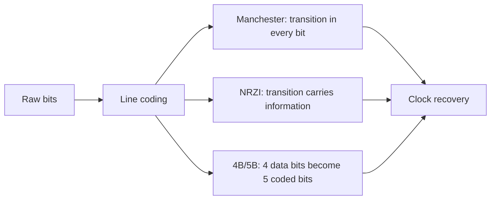
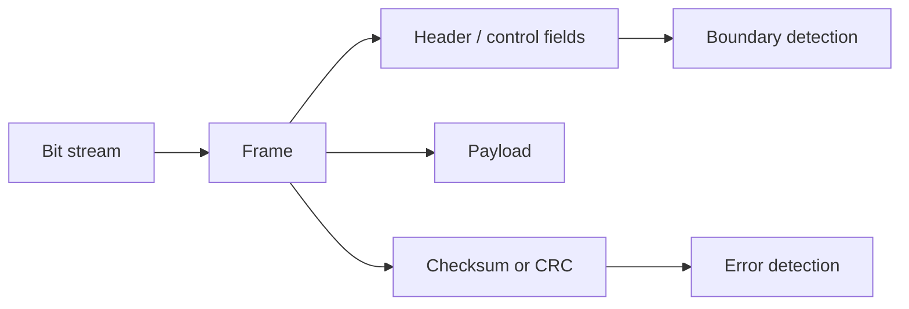
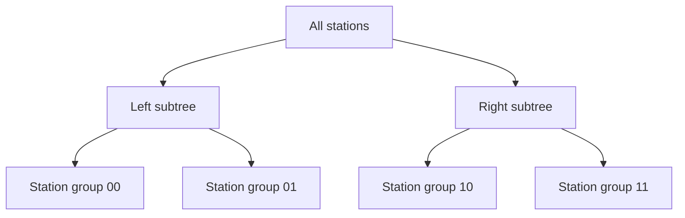
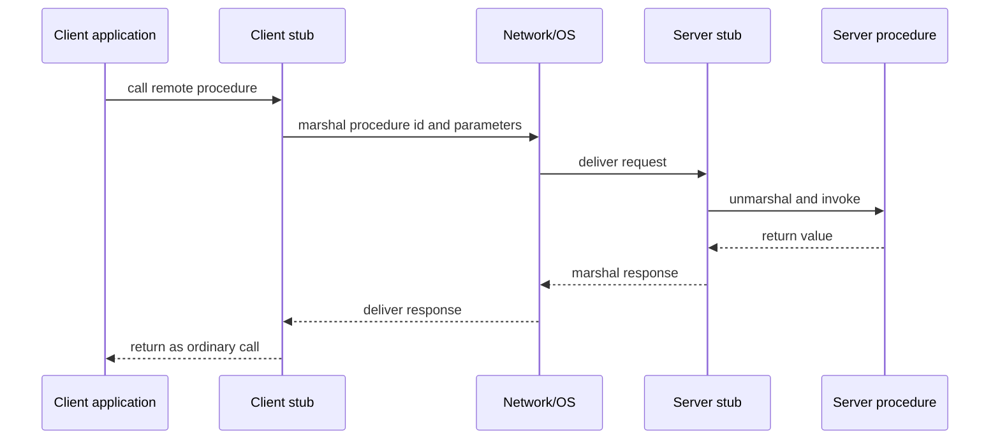
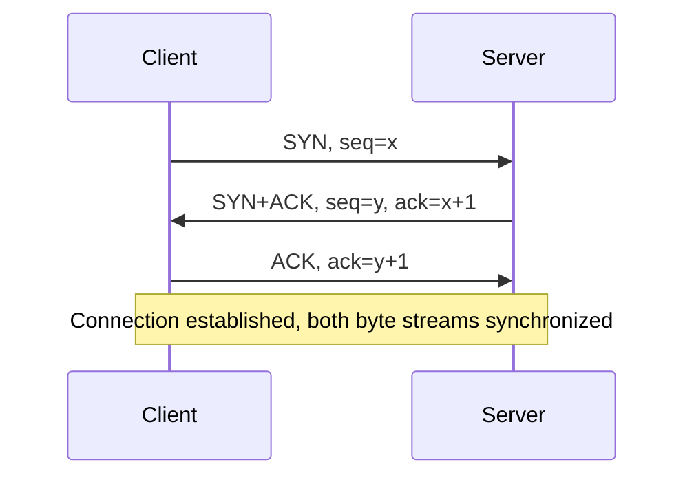
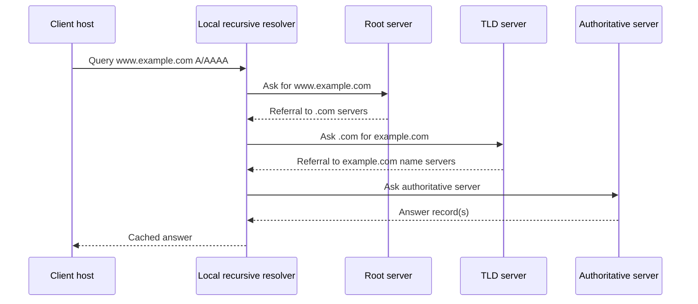
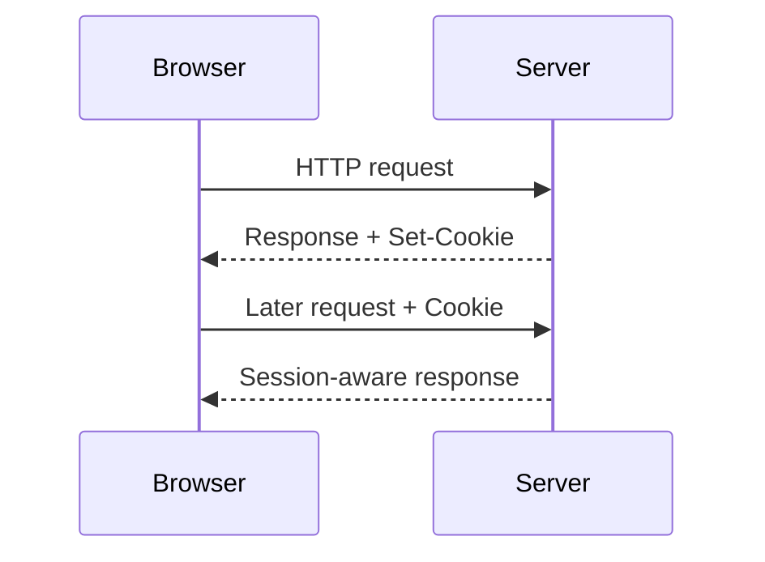

# 18. Computer Networks

This subject follows the network layers and selected concrete mechanisms: Manchester, NRZI, 4B/5B, QPSK, QAM-16, TCP connection management, ECN/DCTCP, DNS, HTTP, DHCP, and ARP.

## 18.1 Layer Models: ISO/OSI and TCP/IP

Computer networks are usually explained through **layer models**. A layer offers services to the layer above it and uses services of the layer below it. This separation lets one layer change its implementation without forcing every application or every piece of hardware to change.

There are two relevant models.

| Model                   | Layers                                                                      | Main idea                                                                                                                                                                                            |
| ----------------------- | --------------------------------------------------------------------------- | ---------------------------------------------------------------------------------------------------------------------------------------------------------------------------------------------------- |
| TCP/IP model            | Link, network, transport, application                                       | The practical Internet model. It became the standard protocol family for large-scale internetworking and is the model most directly reflected in real protocols such as IP, TCP, UDP, DNS, and HTTP. |
| ISO/OSI reference model | Physical, data link, network, transport, session, presentation, application | A conceptual reference model that separates communication functions more finely. It is useful for naming responsibilities even when real protocols do not fit it perfectly.                          |

The OSI model can be remembered from bottom to top:


The TCP/IP model merges several OSI responsibilities:

| TCP/IP layer | Rough OSI correspondence                              | Examples                                    |
| ------------ | ----------------------------------------------------- | ------------------------------------------- |
| Link         | Physical + data link responsibilities                 | Ethernet, Wi-Fi, PPP, local framing and MAC |
| Network      | Network layer                                         | IP, ICMP, routing                           |
| Transport    | Transport layer                                       | TCP, UDP                                    |
| Application  | Session + presentation + application responsibilities | DNS, HTTP, DHCP, application protocols      |

The exam point is not that one model is "right" and the other is "wrong." The OSI model is a clean vocabulary; TCP/IP is the deployed Internet architecture.

### What to Emphasize in an Oral Answer

- Define a layer model as a service boundary: each layer uses the layer below and offers a cleaner service to the layer above.
- Name the OSI layers in order and attach one responsibility to each: physical bits, data-link frames/local access, network packets/routing, transport process communication, session dialogs, presentation representation, application protocols.
- Name the TCP/IP layers and examples: link, network/IP/ICMP, transport/TCP/UDP, and application/DNS/HTTP/DHCP.
- Explain the mapping: TCP/IP merges OSI physical+data-link into link and folds session/presentation responsibilities into application protocols.
- Emphasize why layering matters: modularity, replaceable implementations, encapsulation, and clear reasoning about where a failure or protocol feature belongs.
- Avoid saying one model is simply correct and the other wrong; OSI is a reference vocabulary, TCP/IP is the deployed Internet architecture.

::: details Suggested answer

Layer models divide network communication into responsibilities. A layer provides a service to the layer above it and hides the details of how that service is implemented below it. The OSI model is the more detailed conceptual model: physical, data link, network, transport, session, presentation, and application. It is useful because each layer has a clear role, from transmitting raw bits up to application-level protocols.

The TCP/IP model is the practical model used by the Internet. It has four layers: link, network, transport, and application. The link layer handles local transmission and framing; the network layer, mainly IP, moves packets across interconnected networks; the transport layer provides process-to-process communication through TCP or UDP; and the application layer contains protocols such as DNS and HTTP.

The two models are related but not identical. TCP/IP merges some OSI responsibilities, especially session and presentation, into the application layer. The important idea is modularity: Ethernet or Wi-Fi can change without rewriting HTTP, and DNS or HTTP can use the same transport and network services.

:::

## 18.2 Physical Layer: Baseband, Broadband, Encoding, and Modulation

The **physical layer** transmits bits through a communication channel. It specifies mechanical, electrical, timing, and procedural details of the interface and the transmission medium.

### Signals, Symbols, and Synchronization

Distinguish wired and wireless transmission:

| Area                  | Key facts                                                                                                                                                              |
| --------------------- | ---------------------------------------------------------------------------------------------------------------------------------------------------------------------- |
| Wired transmission    | Data is sent by changing a physical quantity such as voltage or current. Periodic signals can be decomposed into harmonic components, which explains bandwidth limits. |
| Wireless transmission | Electromagnetic waves have frequency $f$ and wavelength $\lambda$; in vacuum, $\lambda \cdot f = c$, where $c$ is the speed of light.                                  |
| Symbol                | The transmitted unit need not be one bit. A symbol may encode several bits, such as four symbols $A=00$, $B=01$, $C=10$, $D=11$.                                       |
| Baud versus bit rate  | Baud means symbols per second; data rate means bits per second. They are equal only when one symbol encodes exactly one bit.                                           |

Synchronization answers the question: **when should the receiver sample the signal and where does a symbol begin?**

| Synchronization method               | Meaning                                                                                                                           |
| ------------------------------------ | --------------------------------------------------------------------------------------------------------------------------------- |
| Explicit clock                       | A separate clock signal is available; suitable for short or parallel transmissions.                                               |
| Critical instants                    | Sender and receiver synchronize at the beginning of a symbol or block and assume clocks remain close enough for a short interval. |
| Symbol codes / self-clocking signals | The signal itself contains transitions that allow clock recovery without a separate clock.                                        |

### Transmission Media

The following are media.

| Medium                       | Characteristics                                                                                                    |
| ---------------------------- | ------------------------------------------------------------------------------------------------------------------ |
| Magnetic carriers            | High bandwidth, high latency; useful for physical data transfer, not interactive networking.                       |
| Twisted pair                 | Common in telecommunication and Ethernet; supports analog and digital transmission.                                |
| Coaxial cable                | Higher speed and distance than simple twisted copper; supports analog and digital signals.                         |
| Optical fiber                | Uses light source, fiber, and detector; a pulse can represent `1`, no pulse `0`; high bandwidth and long distance. |
| Radio                        | Easy to generate, usable indoors and outdoors, supports long distances; propagation depends strongly on frequency. |
| Microwave                    | Mostly line-of-sight, fading can occur, relatively inexpensive for some links.                                     |
| Infrared and millimeter wave | Useful at short distance; does not penetrate solid objects well.                                                   |
| Visible light / laser        | High bandwidth, cheap and license-free, but weather and alignment can matter.                                      |

### Baseband and Broadband

| Transmission type | Meaning                                                                                                                | Typical use                                    |
| ----------------- | ---------------------------------------------------------------------------------------------------------------------- | ---------------------------------------------- |
| Baseband          | The digital signal is converted directly to voltage/current and transmitted in the channel without carrier modulation. | Many local wired digital links.                |
| Broadband         | The signal is carried by modulating a carrier in a wider frequency band.                                               | Radio, cable, and other carrier-based systems. |

### Digital Encoding Schemes

Manchester, NRZI, and 4B/5B are important digital encoding schemes. The 4/5 item is the common 4B/5B line-coding scheme.

| Encoding   | How it represents bits                                                                                                                                       | Why it matters                                                                                                           |
| ---------- | ------------------------------------------------------------------------------------------------------------------------------------------------------------ | ------------------------------------------------------------------------------------------------------------------------ |
| Manchester | Each bit period contains a transition, so data and clock are combined. Depending on convention, low-to-high may mean `1` and high-to-low `0`, or vice versa. | Self-clocking and robust synchronization, but it uses more bandwidth because every bit has a transition.                 |
| NRZI       | Information is represented by whether the signal changes state, commonly "invert on 1" and "no transition on 0" or the opposite by convention.               | Reduces some synchronization problems compared with simple NRZ, but long runs without transitions may still be an issue. |
| 4B/5B      | Each 4-bit data group is mapped to a 5-bit code word chosen to avoid too many consecutive zeros.                                                             | Improves clock recovery and works well with encodings such as NRZI; overhead is 25%.                                     |



### Modulation

For broadband transmission, Start from a sinusoidal carrier:

$$
g(t) = A * sin(2*pi*f*t + phi)
$$

The information can be encoded by changing amplitude $A$, frequency $f$, or phase $\varphi$.

| Modulation family | Analog form | Digital form | Idea                                                |
| ----------------- | ----------- | ------------ | --------------------------------------------------- |
| Amplitude         | AM          | ASK          | Encode information in the amplitude of the carrier. |
| Frequency         | FM          | FSK          | Encode information in the frequency of the carrier. |
| Phase             | PM          | PSK          | Encode information in phase shifts of the carrier.  |

The topic also names QPSK and QAM-16:

| Scheme | Meaning                                  | Core description                                                                                                  |
| ------ | ---------------------------------------- | ----------------------------------------------------------------------------------------------------------------- |
| QPSK   | Quadrature phase-shift keying            | Uses four carrier phases, so one symbol can carry 2 bits. It is a PSK scheme.                                     |
| QAM-16 | 16-point quadrature amplitude modulation | Combines amplitude and phase changes; one of 16 constellation points is selected, so one symbol can carry 4 bits. |

Digital transmission uses a finite set of discrete signal states. Analog transmission uses a continuous set of signal values. Digital reception can often regenerate the original discrete value despite moderate noise; analog noise tends to accumulate.

### What to Emphasize in an Oral Answer

- Frame the physical layer as converting bits or symbols into signals over a medium, with timing, electrical/optical/radio, and mechanical interface details.
- Distinguish bit rate from baud rate: a symbol can encode one or more bits.
- Mention synchronization: explicit clock, critical instants, or self-clocking signal codes.
- Contrast baseband with broadband: direct digital signaling versus modulating a carrier.
- For broadband, name the carrier parameters and digital modulation families: amplitude/ASK, frequency/FSK, phase/PSK.
- Include the required examples: Manchester is self-clocking but bandwidth-expensive; NRZI uses transitions; 4B/5B avoids long transition-free runs at 25% overhead.
- Include QPSK and QAM-16 as symbol examples: QPSK carries 2 bits per symbol, QAM-16 carries 4 bits per symbol.
- Tie media choice to bandwidth, distance, noise, mobility, and line-of-sight constraints.

::: details Suggested answer

The physical layer is responsible for transmitting bits as physical signals. It defines the medium, timing, electrical or optical properties, and the way symbols are represented. In wired media, information can be sent by changing voltage or current; in wireless media, electromagnetic waves are used, with frequency and wavelength related by $\lambda \cdot f = c$.

The transmitted unit is often a symbol, not necessarily a single bit. Baud measures symbols per second, while bit rate measures bits per second. Synchronization is therefore essential: the receiver must know when to sample the signal. This can be done with an explicit clock, by synchronizing at block boundaries, or with self-clocking codes.

In baseband transmission, the digital signal is put directly onto the medium. In broadband transmission, the data modulates a carrier. Modulation can change amplitude, frequency, or phase; the digital versions are ASK, FSK, and PSK. QPSK uses four phases and carries two bits per symbol, while QAM-16 combines amplitude and phase to represent sixteen symbols, four bits per symbol.

Digital encoding schemes solve synchronization and signal-quality problems. Manchester has a transition in every bit period and is self-clocking but bandwidth-expensive. NRZI uses transitions to carry information. 4B/5B maps each four data bits to five coded bits to avoid long transition-free runs. Together, media, encoding, and modulation determine the achievable bit rate, reliability, and distance.

:::

## 18.3 Data Link Layer: Framing, Error Control, Flow Control, and MAC

The **data link layer** provides a well-defined service interface to the network layer over a local link. It handles frames, errors, flow control, and local medium access.

Three service styles. The wording is normalized here:

| Service style                            | Meaning                                                                                                                 |
| ---------------------------------------- | ----------------------------------------------------------------------------------------------------------------------- |
| Unacknowledged connectionless service    | Frames are sent without explicit acknowledgement; suitable where the medium is reliable or higher layers handle errors. |
| Acknowledged connectionless service      | Each frame is acknowledged, but no long-lived connection is set up.                                                     |
| Acknowledged connection-oriented service | A logical connection is established and frames are acknowledged in order.                                               |

### Framing

The physical layer sends a stream of bits; the data link layer must split it into **frames** and compute checksums. Four framing techniques are:

| Method                             | Mechanism                                                                                                                  | Main problem or use                                                        |
| ---------------------------------- | -------------------------------------------------------------------------------------------------------------------------- | -------------------------------------------------------------------------- |
| Character count                    | The header states how many characters are in the frame.                                                                    | Very sensitive to header errors; a corrupted count loses frame boundaries. |
| Flag bytes with character stuffing | Special start/end bytes mark frame boundaries; escape bytes protect accidental flag bytes inside data.                     | Byte-oriented method.                                                      |
| Flag bit pattern with bit stuffing | Frames begin/end with a bit pattern such as `01111110`; after five consecutive `1` bits in data, the sender inserts a `0`. | Bit-oriented method; receiver removes stuffed zeros.                       |
| Physical-layer coding violation    | Uses redundant physical encoding patterns that cannot appear in normal data.                                               | Works only when the physical code has unused symbols.                      |



### Error Handling

The data link layer must answer two questions:

1. Did frames reach the destination network layer?
2. Did they arrive in the correct order and exactly once?

To achieve this, protocols use acknowledgements, timeouts, retransmissions, and sequence numbers. A damaged or lost frame can be retransmitted, and duplicate frames can be recognized by sequence numbers.

Bit errors:

| Error type       | Meaning                                                                                                        |
| ---------------- | -------------------------------------------------------------------------------------------------------------- |
| Single-bit error | One bit changes from `0` to `1` or from `1` to `0`.                                                            |
| Burst error      | A sequence is affected, with first and last symbols wrong and no sufficiently long correct subsequence inside. |

### Hamming Distance, Detection, and Correction

Let a code contain permitted codewords of equal length. The **Hamming distance** between two codewords is the number of bit positions where they differ. The distance of a code is the minimum distance between any two different permitted codewords.

| Code distance | Consequence                                                                          |
| ------------- | ------------------------------------------------------------------------------------ |
| 1             | No reliable error detection: one bit error may turn one valid codeword into another. |
| 2             | One-bit errors can be detected but not corrected.                                    |
| 3             | One-bit errors can be corrected and two-bit errors can be detected.                  |

General rule:

| Goal                   | Required minimum code distance |
| ---------------------- | ------------------------------ |
| Detect $d$ bit errors  | $d + 1$                        |
| Correct $d$ bit errors | $2d + 1$                       |

Also give the Hamming bound: for a code $C$ of length $n$ and distance $k$, disjoint balls around codewords must fit into all $2^n$ bit strings. This expresses the tradeoff between code rate and error-handling power. A good code has both high rate and high distance, but those goals conflict.

### Parity and Hamming Code

A **parity bit** is chosen so the number of `1` bits is even or odd.

| Parity      | Rule                                                              |
| ----------- | ----------------------------------------------------------------- |
| Even parity | Add `0` if the number of ones is already even; otherwise add `1`. |
| Odd parity  | Add `0` if the number of ones is already odd; otherwise add `1`.  |

In a Hamming code, check bits are placed at power-of-two positions (`1`, `2`, `4`, `8`, ...). Data bits fill the remaining positions. Each check bit controls a pattern of positions, and the resulting parity syndrome identifies a one-bit error.

### CRC

CRC, or cyclic redundancy check, treats a bit sequence as coefficients of a polynomial over $Z_2$.

Steps:

1. Choose a generator polynomial $G(x)$ of degree $r$, known by sender and receiver.
2. Append $r$ zero bits to the frame, forming $x^r M(x)$.
3. Divide by $G(x) \pmod 2$.
4. Subtract the remainder modulo 2 and append it as the checksum.
5. The receiver divides the received polynomial by $G(x)$. A nonzero remainder indicates an error.

CRC cannot detect errors whose error polynomial is a multiple of the generator polynomial, but well-chosen generators detect common burst errors very well.

### Elementary Data Link Protocols and Flow Control

Describe a progression of data link protocols:

| Protocol                  | Assumptions                                                    | Behavior                                                                                                    |
| ------------------------- | -------------------------------------------------------------- | ----------------------------------------------------------------------------------------------------------- |
| Unrestricted simplex      | Sender and receiver always ready, no errors, infinite buffers. | Sender continuously sends frames; no sequence number or acknowledgement is needed.                          |
| Simplex stop-and-wait     | Receiver needs processing time, no frame damage/loss.          | Sender sends one frame and waits for acknowledgement before sending the next.                               |
| Simplex for noisy channel | Frames may be damaged or lost.                                 | Sender uses timeout and retransmission; receiver checks checksum, acknowledges good frames, drops bad ones. |

The **sliding-window protocol** generalizes stop-and-wait. The sender may have up to $n$ unacknowledged frames in flight. Sender and receiver each maintain a window of allowed sequence numbers.

If an error happens in a stream:

| Strategy         | Receiver behavior                                                                          | Tradeoff                                                                       |
| ---------------- | ------------------------------------------------------------------------------------------ | ------------------------------------------------------------------------------ |
| Go-back-N        | Discards frames after the missing or bad frame; sender retransmits from that frame onward. | Simpler, but wastes bandwidth after isolated errors.                           |
| Selective repeat | Buffers good frames after the bad one and asks for/retransmits only missing frames.        | Better bandwidth use, but needs more receiver memory and sequence-number care. |

### HDLC and PPP

| Protocol | Main content                                                                                                                                                                                                                                                                             |
| -------- | ---------------------------------------------------------------------------------------------------------------------------------------------------------------------------------------------------------------------------------------------------------------------------------------- |
| HDLC     | Bit-oriented data link protocol using a sliding window. Frame fields include flag, address, control, data, and checksum. Frame types include information, supervisory, and unnumbered frames. Supervisory frames include receive ready, reject, receive not ready, and selective reject. |
| PPP      | Point-to-Point Protocol. Provides framing, a line control protocol for setup/testing/option negotiation/release, and negotiation of network-layer options. It is byte-oriented and can carry protocol identifiers such as LCP, NCP, IP, IPX, or AppleTalk.                               |

### Medium Access Control and Dynamic Channel Allocation

When several stations share a broadcast channel, the MAC sublayer decides who may transmit. Static allocation divides the medium by frequency or time, but this is inefficient for bursty traffic. Dynamic allocation is needed when stations transmit irregularly.

Competition protocols assume that collisions can happen and collided frames must be retransmitted.

| Protocol            | Time model / sensing                     | Behavior                                                                                                               |
| ------------------- | ---------------------------------------- | ---------------------------------------------------------------------------------------------------------------------- |
| Pure ALOHA          | Continuous time, no carrier sensing      | Send whenever ready; on collision, wait random time and retry.                                                         |
| Slotted ALOHA       | Discrete slots                           | Send only at slot boundaries; this roughly doubles ALOHA capacity but performance still drops sharply under high load. |
| 1-persistent CSMA   | Carrier sensing, continuous time         | If channel is idle, send immediately; if busy, keep listening and send as soon as it becomes idle.                     |
| Non-persistent CSMA | Carrier sensing, continuous time         | If busy, wait random time before checking again; reduces greediness.                                                   |
| p-persistent CSMA   | Carrier sensing, slotted time            | If idle, transmit with probability $p$; otherwise defer to the next slot with probability $1-p$.                       |
| CSMA/CD             | Carrier sensing with collision detection | Monitor while transmitting; abort on collision, wait random time, and retry.                                           |

Non-race protocols avoid collisions:

| Protocol                           | Idea                                                                                                                                                    |
| ---------------------------------- | ------------------------------------------------------------------------------------------------------------------------------------------------------- |
| Reservation / placeholder protocol | Stations reserve future sending opportunities in numbered contention slots.                                                                             |
| Binary countdown                   | Stations send binary identifiers from most significant bit; if a station sends `0` and hears `1`, it withdraws because a higher-priority sender exists. |

Limited-race protocols combine low-latency contention under light load with collision-free selection under heavy load. A typical example is **adaptive tree traversal**:



At each tree node, the protocol tests whether zero, one, or several stations in that subtree want to transmit. On collision, it descends to children.

### What to Emphasize in an Oral Answer

- Define the data link layer as local-link delivery that packages bits into frames and handles framing, errors, flow control, and medium access.
- List framing methods and their problems: character count, flag bytes plus character stuffing, flag bit patterns plus bit stuffing, and physical-layer coding violations.
- Explain error handling with checksums, acknowledgements, timeouts, retransmission, sequence numbers, and duplicate suppression.
- State the Hamming-distance rules: distance $d + 1$ detects $d$ bit errors, and distance $2d + 1$ corrects $d$ bit errors.
- Include parity, Hamming codes, and CRC; for CRC, mention polynomial division over $Z_2$ and nonzero remainder detection.
- Explain stop-and-wait versus sliding windows, and compare go-back-N with selective repeat.
- Mention HDLC/PPP as protocol examples if time allows: HDLC is bit-oriented with sliding windows, PPP is byte-oriented with link and network-control negotiation.
- For MAC, contrast random access/competition protocols such as ALOHA and CSMA/CD with reservation, binary countdown, and adaptive-tree style collision reduction.

::: details Suggested answer

The data link layer turns an unreliable bit stream into frames and provides local delivery services to the network layer. It must identify frame boundaries, detect or correct errors, regulate flow, and decide access to a shared medium.

Framing can be done by character count, by start and end flag bytes with character stuffing, by flag bit patterns with bit stuffing, or by physical-layer coding violations. Since the physical layer can corrupt bits, frames include redundancy. The most important ideas are Hamming distance, parity, Hamming codes, and CRC. A code with distance $d+1$ can detect $d$ bit errors; a code with distance $2d+1$ can correct $d$ bit errors. CRC treats bit strings as polynomials over $\mathbb{Z}_2$, appends a remainder as checksum, and lets the receiver detect errors by division.

Flow control starts with stop-and-wait and becomes efficient with sliding windows. The sender may send several frames before acknowledgements arrive. If an error occurs, go-back-N retransmits from the bad frame onward, while selective repeat buffers later correct frames and retransmits only missing ones.

On broadcast links, MAC protocols allocate the channel. ALOHA sends freely and resolves collisions by random retry. CSMA improves this by listening before sending, and CSMA/CD also aborts when it detects a collision. Reservation, binary countdown, and adaptive tree protocols reduce or avoid collisions when contention is high.

:::

## 18.4 Network Layer: Routing, IP, Fragmentation, IPv4, and IPv6

The **network layer** forwards packets from source to destination across multiple networks. It is the lowest layer that deals with end-to-end delivery between hosts rather than only local link delivery.

Services offered to the transport layer should:

- hide subnet design details;
- hide the number, type, and topology of intermediate networks;
- provide a uniform addressing system.

### Routing Types and Algorithms

| Routing type         | Meaning                                                                                                             |
| -------------------- | ------------------------------------------------------------------------------------------------------------------- |
| Hierarchical routing | Routers are grouped into domains. A router knows its own domain in detail and treats other domains more abstractly. |
| Broadcast routing    | A packet is sent everywhere.                                                                                        |
| Multicast routing    | A packet is sent to a selected group.                                                                               |

A routing algorithm fills/maintains routing tables and then uses them for forwarding.

| Algorithm / family                         | Classification                        | Core idea                                                                                                                           |
| ------------------------------------------ | ------------------------------------- | ----------------------------------------------------------------------------------------------------------------------------------- |
| Dijkstra shortest path                     | Static / link-state style computation | Label nodes by best known distance from a start node; finalize the closest temporary label repeatedly.                              |
| Flooding                                   | Static                                | Forward incoming packets on all outgoing lines except the incoming line. Use hop count and duplicate tracking to limit explosion.   |
| Distance-vector / distributed Bellman-Ford | Adaptive, distance-based              | Each router knows costs to neighbors and exchanges distance vectors with them; it updates its own vector from neighbor information. |
| Link-state routing                         | Adaptive, connection/topology-based   | Discover neighbors, measure cost, build a link-state packet, flood it to routers, then compute shortest paths.                      |

Distance-vector protocols are simple and distributed, but can converge slowly and suffer from problems such as count-to-infinity. Link-state protocols require more global topology information but usually converge more predictably.

### Internet Routing, OSPF, BGP, and Path Vector

At the network layer, the Internet is an interconnection of autonomous systems. Inside an autonomous system, protocols such as OSPF can compute least-cost paths from link-state information. Between autonomous systems, **BGP** is used.

| Protocol            | Scope                       | Main idea                                                                                                                            |
| ------------------- | --------------------------- | ------------------------------------------------------------------------------------------------------------------------------------ |
| OSPF                | Inside an autonomous system | Builds a weighted directed graph of topology and computes least-cost paths.                                                          |
| BGP                 | Between autonomous systems  | Exchanges reachability between ASes while allowing policy decisions.                                                                 |
| Path-vector routing | BGP's routing model         | A route advertisement carries the AS path. A router can detect loops and apply policy based on the path, not just a distance number. |

BGP is not simply "shortest path." It may prefer or reject paths because of administrative policies, business relations, and transit rules.

### IP Datagrams and IPv4

Describe Internet communication as follows:

1. The transport layer breaks data streams into datagrams or segments.
2. Datagrams are transmitted across the Internet and may be broken into smaller units.
3. The target network layer reassembles the original datagram and passes it upward.
4. The target transport layer delivers data to the receiving process.

Important IPv4 header fields:

| Field                          | Purpose                                                        |
| ------------------------------ | -------------------------------------------------------------- |
| Version                        | Which IP version is used.                                      |
| IHL                            | IPv4 header length.                                            |
| Type of service / DS field     | Service class or traffic treatment.                            |
| Total length                   | Header plus payload length.                                    |
| Identification                 | Same value in all fragments of one original datagram.          |
| DF flag                        | "Don't fragment": routers must not fragment.                   |
| MF flag                        | "More fragments": set on all fragments except the last.        |
| Fragment offset                | Position of this fragment in the original datagram.            |
| Time to live                   | Hop limit; reduced at routers and packet is discarded at zero. |
| Protocol                       | Identifies upper-layer protocol, such as TCP or UDP.           |
| Header checksum                | Protects the IPv4 header and is recalculated at each hop.      |
| Source and destination address | IPv4 addresses.                                                |
| Options                        | Extensibility field, rarely used in fast paths.                |

### IPv4 Addresses, Subnets, CIDR, NAT, and Fragmentation

An IPv4 address is 4 bytes, commonly written in dotted decimal notation such as `192.168.0.1`. It identifies a network part and a host part.

Subnets divide an internal network into parts while appearing as one network externally. Routers use a subnet mask and longest-prefix matching. CIDR generalizes this by representing routes as prefixes rather than old address classes.

Private IPv4 ranges commonly used with NAT:

| Private range    | Size                 |
| ---------------- | -------------------- |
| `10.0.0.0/8`     | 16,777,216 addresses |
| `172.16.0.0/12`  | 1,048,576 addresses  |
| `192.168.0.0/16` | 65,536 addresses     |

**NAT** lets many internal hosts use private addresses while sharing one or a few public addresses. It mitigates IPv4 exhaustion but breaks the pure end-to-end addressing model and requires state at the NAT device.

**IPv4 fragmentation** can be performed by routers when a datagram is larger than the next link MTU and DF is not set. Fragments share the same identification value; offset and MF identify their positions. Reassembly is done at the destination.

### IPv6

IPv6 uses 16-byte addresses written as eight hexadecimal groups, such as:

```text
8000:0000:0000:0000:0123:4567:89AB:CDEF
```

Important contrasts:

| Aspect           | IPv4                                 | IPv6                                                                                                         |
| ---------------- | ------------------------------------ | ------------------------------------------------------------------------------------------------------------ |
| Address length   | 32 bits                              | 128 bits                                                                                                     |
| Header           | Variable length with header checksum | Simplified fixed base header, no header checksum                                                             |
| Fragmentation    | Routers may fragment unless DF set   | Fragmentation is handled by source nodes using an extension header; routers do not fragment ordinary packets |
| Address pressure | Exhausted; NAT common                | Vast address space; NAT is less central                                                                      |
| Extensibility    | Options in base header               | Extension headers                                                                                            |

### Network-Layer Protocols

| Protocol | Role                                                                                                                                         |
| -------- | -------------------------------------------------------------------------------------------------------------------------------------------- |
| ICMP     | Reports unexpected events such as unreachable destination, timeout, parameter problem, resource throttling, echo request, and echo response. |
| ARP      | Maps an IPv4 address to a physical address on a local network by broadcast request and reply.                                                |
| RARP     | Historical reverse mapping from physical address to IP address.                                                                              |
| OSPF     | Interior link-state routing protocol.                                                                                                        |
| BGP      | Exterior inter-AS routing protocol using policy and AS paths.                                                                                |

### What to Emphasize in an Oral Answer

- Define the network layer as host-to-host packet delivery across multiple networks, with addressing, forwarding, routing, and fragmentation concerns.
- Distinguish routing-table construction from per-packet forwarding and longest-prefix matching.
- Compare routing algorithms: distance vector/distributed Bellman-Ford, link-state plus Dijkstra, flooding, hierarchical routing, and path-vector BGP.
- Place Internet protocols correctly: IP carries datagrams, ICMP reports/control messages, ARP maps IPv4 to local hardware addresses, OSPF is internal link-state, and BGP is inter-AS policy routing.
- Cover IPv4 essentials: 32-bit addresses, CIDR/subnets, NAT pressure from address exhaustion, TTL, protocol, source/destination, checksum, and fragmentation fields.
- Explain fragmentation and MTU: IPv4 routers may fragment; IPv6 removes router fragmentation from normal forwarding.
- Cover IPv6 essentials: 128-bit addresses, simpler base header, extension headers, and source-side fragmentation.
- Mention the likely distinction that BGP is not simply shortest path routing; it carries AS paths and policy.

::: details Suggested answer

The network layer forwards packets between hosts across multiple networks. It hides subnet details from the transport layer and gives hosts a uniform addressing system. Routing has two parts: maintaining routing tables and forwarding packets according to those tables.

Distance-vector routing, such as distributed Bellman-Ford, has each router exchange distance information with its neighbors and update its vector from what neighbors report. Link-state routing works differently: routers discover neighbors, measure link costs, flood link-state information, and then compute shortest paths, typically with Dijkstra's algorithm. On the Internet, OSPF is a link-state protocol inside an autonomous system, while BGP routes between autonomous systems. BGP is a path-vector protocol: routes carry AS paths, so routers can detect loops and apply policy, not only shortest distance.

IP is the main network-layer protocol. IPv4 uses 32-bit addresses and a header with fields such as TTL, protocol, source, destination, checksum, and fragmentation fields. IPv4 routers may fragment packets if the next link MTU is too small and fragmentation is allowed. CIDR and longest-prefix matching replaced classful routing, and NAT became common because IPv4 addresses were exhausted.

IPv6 uses 128-bit addresses and a simpler base header. It removes router fragmentation from the normal forwarding path; fragmentation is done by source nodes with an extension header. This improves forwarding efficiency and gives a far larger address space.

:::

## 18.5 Transport Layer: UDP, TCP, Connection Management, and Congestion Control

The content belongs to the **transport layer**. The transport layer provides process-to-process communication above IP.

### Connectionless and Connection-Oriented Transport

| Mode                | Meaning                                                   | Tradeoff                                                                                           |
| ------------------- | --------------------------------------------------------- | -------------------------------------------------------------------------------------------------- |
| Connectionless      | No connection setup; each datagram is sent independently. | Low overhead, but no built-in reliability or ordering.                                             |
| Connection-oriented | Connection state is established and maintained.           | Can hide loss, duplication, corruption, and reordering from applications, but costs more overhead. |

Reliability mechanisms:

- acknowledgements for received packets;
- retransmission of unacknowledged packets;
- checksum over header and packet;
- sequence numbers and receiver reordering;
- duplicate suppression.

### Multiplexing, Demultiplexing, and Interaction Models

Transport protocols multiplex many application flows over the same network-layer service. Ports identify the sending and receiving processes.

| Concept                   | Meaning                                                                                                                                                                                                                                 |
| ------------------------- | --------------------------------------------------------------------------------------------------------------------------------------------------------------------------------------------------------------------------------------- |
| Multiplexing              | Combining traffic from several processes or channels into one lower-layer communication path.                                                                                                                                           |
| Demultiplexing            | Using identifiers such as ports to deliver received data to the correct process.                                                                                                                                                        |
| Bidirectional byte stream | TCP's model: two byte sequences flow in opposite directions; data may be segmented and reassembled by TCP.                                                                                                                              |
| RPC                       | Remote Procedure Call hides network communication behind a procedure-call interface. A client stub packs parameters, the OS sends a message, a server stub unpacks it, the server runs the procedure, and the result returns similarly. |



### UDP

UDP is a simple connectionless transport protocol.

| UDP property  | Meaning                                                                                                                                             |
| ------------- | --------------------------------------------------------------------------------------------------------------------------------------------------- |
| Header size   | 8 bytes.                                                                                                                                            |
| Header fields | Source port, destination port, UDP length, UDP checksum.                                                                                            |
| Reliability   | No retransmission, ordering, or flow control.                                                                                                       |
| Use case      | Short messages and applications that implement their own reliability or prefer low latency, such as DNS queries, streaming, or real-time protocols. |

### TCP Header and Service

TCP creates a reliable bidirectional byte stream between endpoints. It segments application data, numbers bytes, acknowledges received data, retransmits lost data, and uses flow/congestion control.

Important TCP header fields:

| Field                         | Purpose                                                                                                             |
| ----------------------------- | ------------------------------------------------------------------------------------------------------------------- |
| Source port, destination port | Identify sender and receiver process endpoints.                                                                     |
| Sequence number               | Number of the first data byte in the segment; SYN consumes one sequence number.                                     |
| Acknowledgement number        | If ACK is set, the next byte expected by the receiver.                                                              |
| Header length                 | TCP header length in 32-bit words.                                                                                  |
| Window                        | Receiver-advertised window: how many bytes may be sent from the acknowledged position.                              |
| Checksum                      | Protects TCP header, data, and pseudo-header.                                                                       |
| Options                       | Includes MSS and other extensions.                                                                                  |
| Urgent pointer                | Indicates urgent data position when URG is used.                                                                    |
| Flags                         | URG, ACK, PSH, RST, SYN, FIN. Modern headers also include ECN-related flags, but The list includes the classic six. |

### Three-Way Handshake and TCP States

TCP connection management is described by a state machine with connection establishment, data transfer, and connection termination states.

TCP connection establishment:



Common TCP states:

| State                   | Meaning                                                                                    |
| ----------------------- | ------------------------------------------------------------------------------------------ |
| CLOSED                  | No connection state exists.                                                                |
| LISTEN                  | Server waits for a connection request.                                                     |
| SYN-SENT                | Client has sent SYN and waits for a matching response.                                     |
| SYN-RECEIVED            | SYN received and SYN+ACK sent; waiting for final ACK.                                      |
| ESTABLISHED             | Data transfer state.                                                                       |
| FIN-WAIT-1              | Endpoint sent FIN and waits for ACK or FIN.                                                |
| FIN-WAIT-2              | FIN was acknowledged; waiting for peer's FIN.                                              |
| CLOSE-WAIT              | Peer sent FIN; local application has not closed yet.                                       |
| CLOSING                 | Both sides sent FIN, waiting for ACK.                                                      |
| LAST-ACK                | Local FIN sent after receiving peer FIN, waiting for final ACK.                            |
| TIME-WAIT (`TIME_WAIT`) | Wait to ensure old duplicate segments expire and final ACK can be retransmitted if needed. |

TCP close is usually a four-segment exchange because each direction of the byte stream is closed independently with FIN and ACK.

### Flow Control

**Flow control** protects the receiver from being overwhelmed. TCP uses the receiver-advertised window `rwnd`, also called `wnd`. If the receive buffer is full, the receiver can advertise `0`; otherwise it advertises how much more data it can accept. The sender must not have more unacknowledged data in flight than the advertised window allows.

### Congestion Control

**Congestion control** protects the network from overload. If too much traffic enters the network, buffers overflow, packets are lost, retransmissions increase load, and a feedback loop can cause congestion collapse. Call this the avalanche phenomenon.

Requirements:

| Requirement | Meaning                                                                                          |
| ----------- | ------------------------------------------------------------------------------------------------ |
| Efficiency  | High throughput with low latency.                                                                |
| Fairness    | Competing flows get roughly fair bandwidth, unless policy deliberately prioritizes some traffic. |

Tools:

- capacity increase;
- resource reservation and admission control;
- load reduction and regulation;
- sliding windows;
- slow start;
- Nagle's algorithm;
- Tahoe/Reno-style congestion response;
- AIMD behavior.

### Slow Start, Congestion Avoidance, Tahoe, and Reno

TCP uses two windows:

| Window                     | Owner    | Meaning                                                      |
| -------------------------- | -------- | ------------------------------------------------------------ |
| `rwnd` / advertised window | Receiver | Receiver-side flow-control limit.                            |
| `cwnd` / congestion window | Sender   | Sender-side estimate of safe in-flight data for the network. |

The effective sending window is roughly:

```text
min(rwnd, cwnd)
```

In slow start, `cwnd` begins small, often around one MSS, and grows by approximately one MSS per acknowledgement, doubling once per RTT until loss or a threshold.

After `cwnd` reaches `ssthresh`, congestion avoidance uses additional increase. On congestion, TCP applies multiplicative decrease. This is **AIMD**: additional increase, multiplicative decrease. It tends toward both efficiency and fairness.

| Algorithm | Packet loss response                                                                                                                                                                                                                  |
| --------- | ------------------------------------------------------------------------------------------------------------------------------------------------------------------------------------------------------------------------------------- |
| Tahoe     | On timeout or loss signal, set `ssthresh` to about half the window, reset `cwnd` to one MSS, and restart slow start.                                                                                                                  |
| Reno      | Uses fast retransmit on three duplicate ACKs and fast recovery. After fast retransmit, it halves the window but avoids returning all the way to the beginning of slow start for that case. Timeout still causes a stronger reduction. |

Also list MIMD and AIAD as alternative increase/decrease styles, but AIMD is the important TCP fairness mechanism.

### ECN and DCTCP

The topic explicitly names ECN marking and DCTCP. These are additional corrections.

| Mechanism | Meaning                                                                                                                                                                                                                                                                               |
| --------- | ------------------------------------------------------------------------------------------------------------------------------------------------------------------------------------------------------------------------------------------------------------------------------------- |
| ECN       | Explicit Congestion Notification. Routers can mark packets to indicate congestion instead of dropping them, if endpoints negotiated ECN support. The receiver echoes the indication back to the sender, and the sender reduces its rate.                                              |
| DCTCP     | Data Center TCP. A TCP congestion-control scheme for data centers that uses ECN marks to estimate the fraction of bytes that experienced congestion, then scales `cwnd` based on that estimate. It aims for high throughput and low latency in shallow-buffered data-center switches. |

### Nagle's Algorithm

Include TCP-Nagle: small packets should not be sent while acknowledgements are outstanding. A packet is small if its data length is less than MSS. Once the acknowledgement for the previous packet arrives, the next small packet can be sent. This reduces many tiny TCP segments on the network.

### What to Emphasize in an Oral Answer

- Define transport as process-to-process communication above host-to-host IP, with ports for multiplexing and demultiplexing.
- Contrast UDP and TCP: UDP is small, connectionless, unordered, and unreliable; TCP is connection-oriented, reliable, ordered, and byte-stream based.
- Name TCP reliability mechanisms: sequence numbers, acknowledgements, checksums, retransmission, duplicate suppression, and reassembly.
- Describe the three-way handshake and why SYN sequence numbers are acknowledged; mention four-way close and `TIME_WAIT` if states are asked.
- Separate flow control from congestion control: `rwnd` protects the receiver, `cwnd` protects the network, and the effective window is roughly `min(rwnd, cwnd)`.
- Explain slow start, congestion avoidance, and AIMD at a high level; contrast Tahoe reset with Reno fast retransmit/fast recovery after duplicate ACKs.
- Include ECN and DCTCP as modern congestion signaling: marks can replace drops, and DCTCP uses the marked-byte fraction in data centers.
- Mention Nagle's algorithm as the small-segment reduction rule when ACKs are outstanding.

::: details Suggested answer

The transport layer provides process-to-process communication above IP. UDP is the simple connectionless transport protocol: it has ports, length, checksum, and data, but it does not provide retransmission, ordering, flow control, or connection state. It is useful when messages are short or the application controls reliability itself.

TCP is connection-oriented and provides a reliable bidirectional byte stream. It uses sequence numbers, acknowledgements, checksums, retransmission, duplicate suppression, and receiver-side flow control. A connection is established by a three-way handshake: the client sends SYN with an initial sequence number, the server replies with SYN+ACK and its own sequence number, and the client replies with ACK. TCP then enters the established state. Closing is usually four-way because each direction of the stream is closed independently.

Flow control and congestion control solve different problems. Flow control protects the receiver using the advertised window. Congestion control protects the network using the congestion window. Slow start grows the congestion window quickly at first; congestion avoidance then grows it additionally. On congestion, Tahoe and Reno reduce the window, with Reno using fast retransmit and fast recovery after duplicate acknowledgements. This is the practical AIMD idea: increase cautiously, decrease strongly when congestion appears.

Modern congestion signaling can use ECN, where routers mark packets instead of dropping them. DCTCP is a data-center variant that uses the fraction of ECN-marked bytes to adjust the congestion window more precisely. TCP also has mechanisms such as Nagle's algorithm to avoid sending many small packets.

:::

## 18.6 Application Layer: DNS, HTTP, DHCP, and ARP

The application layer contains protocols that applications directly use. DNS and HTTP are central here. DHCP is also useful for IP configuration, and ARP belongs naturally near the network/link boundary because it maps IPv4 addresses to link-layer addresses.

### DNS

DNS is a hierarchical, distributed naming system. Its central role is to resolve human-readable domain names into numerical addresses and other records needed by network services.

Emphasize:

- DNS maps names such as `www.example.com` to addresses such as IPv4 or IPv6 addresses.
- It lets names stay stable even when physical location or routing changes.
- Responsibility is delegated: each domain can have authoritative name servers, and responsibility can be delegated to subdomains.
- DNS also stores information such as mail exchangers.
- DNS is both a distributed database and a protocol.

required DNS details:

| Concept                                | Meaning                                                                                                                                                                |
| -------------------------------------- | ---------------------------------------------------------------------------------------------------------------------------------------------------------------------- |
| Before DNS                             | Early Internet hosts relied on centrally maintained host tables such as `HOSTS.TXT`; this did not scale well.                                                          |
| Name hierarchy                         | Names are hierarchical, with the root at the top, then top-level domains, domains, subdomains, and host/service names.                                                 |
| Zone                                   | An administratively managed part of the DNS namespace. A zone is served by authoritative name servers.                                                                 |
| Zone file                              | A text representation of the records for a DNS zone, such as SOA, NS, A, AAAA, MX, CNAME, and TXT records.                                                             |
| Resource record                        | A typed DNS entry. Examples: `A` for IPv4 address, `AAAA` for IPv6 address, `MX` for mail exchanger, `NS` for name server, `CNAME` for alias, `TXT` for text metadata. |
| Local name server / recursive resolver | The resolver contacted by a host. It either answers from cache or recursively queries the DNS hierarchy on behalf of the client.                                       |
| Resolution                             | The process of finding records by following delegation from root to TLD to authoritative servers, or by using cached answers.                                          |

DNS resolution can be represented as:



### HTTP

HTTP is an application-layer request-response protocol for distributed hypermedia systems. A client, usually a browser or other user agent, sends requests to a server, and the server sends responses. HTTP semantics are mostly independent of the underlying transport, though HTTP/1.1 and HTTP/2 usually run over TCP, while HTTP/3 runs over QUIC over UDP.

The statement that HTTP/2.0 was newest after 2015. That statement is now outdated: HTTP/3 is standardized by RFC 9114. For the exam, the important point is still the protocol model and persistence/cookies.

| HTTP concept        | Meaning                                                                                                                                                                         |
| ------------------- | ------------------------------------------------------------------------------------------------------------------------------------------------------------------------------- |
| Stateless protocol  | Each request is independent at the protocol semantics level; state can be added by cookies, authentication, server sessions, or application logic.                              |
| Non-persistent HTTP | A separate TCP connection is opened for each object/request. This causes repeated connection setup cost.                                                                        |
| Persistent HTTP     | Multiple requests/responses reuse one connection, reducing handshake overhead and improving performance. HTTP/1.1 defaults to persistent connections unless closed.             |
| Cookie              | HTTP state-management mechanism. The server sends `Set-Cookie`; the user agent returns `Cookie` on later matching requests, enabling sessions over a mostly stateless protocol. |
| HTTP/2              | Multiplexes streams over a TCP connection and compresses headers.                                                                                                               |
| HTTP/3              | Uses QUIC over UDP as its transport, preserving HTTP semantics while changing the transport behavior.                                                                           |



### DHCP

DHCP automatically provides network configuration to hosts, commonly including IP address, network mask, default gateway, and DNS server.

Three allocation types:

| Allocation type | Meaning                                                 |
| --------------- | ------------------------------------------------------- |
| Manual          | Address is assigned based on MAC address.               |
| Automatic       | Address is assigned from a configured range.            |
| Dynamic         | Address is leased from a range and can later be reused. |

DHCP is a client-server protocol: clients send requests and servers provide configuration responses.

### ARP

ARP maps IPv4 addresses to physical addresses such as Ethernet MAC addresses. A host broadcasts a question like "Who has this IP address?" on the local network. The owner replies with its hardware address.

Four common cases:

1. Two clients on the same local network communicate directly.
2. A host sends to a host on another network through a gateway.
3. A router forwards a packet through another router.
4. A router forwards to a destination on a directly attached network.

RARP, also mentioned in the network-layer section, historically did the reverse: it mapped physical address to IP address for a newly started station. It is largely historical and superseded by BOOTP/DHCP-style configuration.

### What to Emphasize in an Oral Answer

- Frame the application layer as user/application-facing protocols built on transport services.
- For DNS, mention distributed hierarchical naming, delegation, zones, authoritative servers, recursive resolvers, caching, and common record types such as A, AAAA, MX, NS, CNAME, SOA, and TXT.
- Explain DNS resolution as following referrals from root to TLD to authoritative servers unless a cached answer is available.
- For HTTP, define request-response semantics and statelessness; cookies add application/session state.
- Contrast non-persistent and persistent HTTP; note HTTP/1.1 persistence, HTTP/2 multiplexing over TCP, and HTTP/3 over QUIC/UDP.
- Include DHCP: automatic IP configuration with manual, automatic, and dynamic lease allocation of address, mask, gateway, and DNS server.
- Include ARP as the local IPv4-to-MAC mapping protocol using broadcast request and reply, and distinguish it from DNS.

::: details Suggested answer

The application layer contains protocols that applications actually use. DNS is the distributed naming system of the Internet. It replaces unscalable central host tables with a delegated hierarchy: root, top-level domains, domains, subdomains, and host names. A zone is an administratively managed part of that hierarchy, served by authoritative name servers. Zone files contain resource records such as A, AAAA, MX, NS, CNAME, SOA, and TXT. A host normally asks a local recursive resolver, which follows referrals through the hierarchy or answers from cache.

HTTP is a request-response protocol for hypermedia systems. It is stateless at the protocol level: each request is separate, but cookies allow servers to maintain sessions. In non-persistent HTTP, a new TCP connection is opened for each object. In persistent HTTP, multiple requests use the same connection, which avoids repeated connection setup. HTTP/1.1 uses persistent connections by default, HTTP/2 multiplexes streams over TCP, and HTTP/3 keeps HTTP semantics but uses QUIC over UDP.

Also include DHCP and ARP. DHCP automatically supplies IP configuration such as address, mask, gateway, and DNS server, either manually, automatically, or dynamically by lease. ARP maps an IPv4 address to a physical address on a local network by broadcast request and reply.

:::
