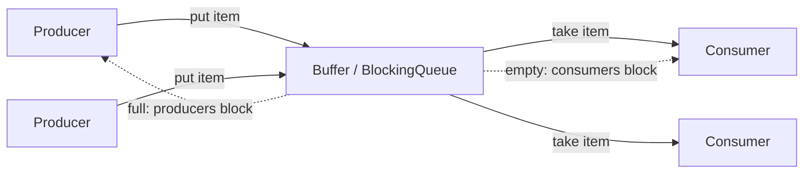
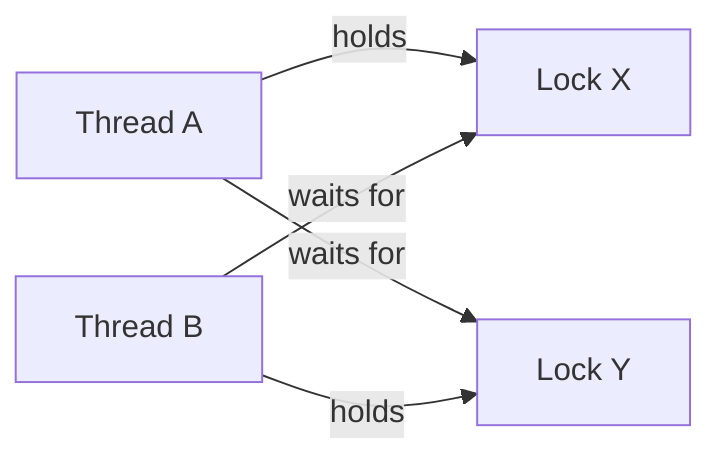

# 19. Concurrent Programming

This subject covers multithreaded programs, scheduling and context switches, race conditions, synchronization, blocking operations, stack and heap use in threads, monitor-style language support, synchronization and communication data types, executors, producer-consumer implementations, and deadlock.

## 19.1 Multithreaded Programs

### Concurrency, Parallelism, Processes, and Threads

Concurrent programming is about programs whose activities overlap in time. A program may compute while performing input/output, several computations may run on different processors, one processor may time-share several tasks, or one process may contain several execution threads.

Parallelism is narrower: activities actually execute at the same time on different cores or processors. Concurrency can exist on a single processor by time slicing; parallelism requires multiple execution resources.

Relevant base terms:

| Term           | Meaning                                                                                                                                                          |
| -------------- | ---------------------------------------------------------------------------------------------------------------------------------------------------------------- |
| Thread         | A software counterpart of a processor with minimal context. If it is stopped, its context can be saved and later reloaded so execution continues.                |
| Process / task | A larger unit that groups one or more threads. Threads in the same process share one address space; different processes do not directly see each other's memory. |
| Context switch | Passing control to another process or thread so one processor can execute several processes or threads over time.                                                |

Threads are lighter than processes because switching between threads of the same process does not require replacing the whole address-space/MMU context. Process creation, deletion, and switching are usually much more expensive because the OS must preserve isolation between memory areas, and only kernel mode may rewrite the necessary MMU state.

### Why Use Threads?

Threads are useful when work can overlap:

- a user interface remains responsive while a background computation runs;
- one thread waits for I/O while another continues CPU work;
- several worker threads process independent pieces of data;
- a server handles multiple clients;
- producer and consumer tasks run at different speeds and communicate through a buffer.

Threads inside one process share heap objects, open resources, and process-level state. That makes communication convenient, but it also creates the main danger of concurrent programming: mutable shared data can be accessed in unpredictable interleavings.

### Java Thread Basics

The additional material is Java-centered. In Java:

- the first thread starts in `main`;
- additional threads are represented by `java.lang.Thread`;
- constructing a `Thread` object does not start a new thread;
- calling `start()` creates a new execution thread;
- the new thread executes the `run()` method.

Ways to describe thread work:

| Method                      | Example idea                                           | Notes                                                                                 |
| --------------------------- | ------------------------------------------------------ | ------------------------------------------------------------------------------------- |
| Extend `Thread`             | Subclass `Thread` and override `run()`.                | Simple but uses the class's only superclass slot.                                     |
| Implement `Runnable`        | Put work in `run()` and pass the object to a `Thread`. | Usually cleaner because it separates task from execution resource.                    |
| Lambda / anonymous class    | Pass a short `Runnable` body.                          | Concise for small tasks; captured local variables must be final or effectively final. |
| `Callable<V>` via executors | Put work in `call()` and return a value.               | Used with `ExecutorService` and `Future`, covered in 19.9.                            |

Example:

```java
Runnable task = () -> {
    System.out.println("worker running");
};

Thread worker = new Thread(task);
worker.start();
```

Calling `worker.run()` directly would just execute the method in the current thread. `start()` is the operation that creates the separate execution thread.

### Lifecycle Coordination

`join()` blocks the caller until another thread terminates. It is used when one thread must wait for worker results before continuing.

```java
Thread left = new Thread(leftTask);
Thread right = new Thread(rightTask);

left.start();
right.start();

left.join();
right.join();
mergeResults();
```

A Java program terminates when all non-daemon threads have terminated, only daemon threads remain, or the JVM is explicitly stopped. A thread that starts another thread does not automatically wait for it. Exceptions in worker threads should be made visible; otherwise a worker may fail while the rest of the program appears to continue.

### Nondeterminism

Threaded programs are nondeterministic unless designed otherwise. The JVM and OS may run eligible threads in different orders across machines or even across two executions on the same machine. Correct code must not rely on a lucky schedule. It should use confinement, immutability, synchronization, locks, concurrent data structures, or message-passing abstractions.

### What to Emphasize in an Oral Answer

- Define concurrent programming as overlapping progress and distinguish it from parallelism, which requires simultaneous execution on multiple cores/processors.
- Compare process and thread: a process owns an address space and resources; a thread is a lightweight execution sequence inside a process.
- State the tradeoff: threads are cheaper and share heap/resources, but shared mutable state creates races unless controlled.
- Explain why threads are used: responsive UI, overlapping I/O and computation, workers, servers, and producer-consumer pipelines.
- For Java, say that `main` starts the first thread, `new Thread(...)` only creates an object, and `start()` creates the new execution thread that calls `run()`.
- Distinguish ways to define work: extending `Thread`, implementing `Runnable`, lambdas, and `Callable` with executors.
- Mention lifecycle coordination with `join()`, non-daemon thread termination rules, and making worker failures visible.
- Close with nondeterminism: correct threaded code cannot rely on one lucky schedule.

::: details Suggested answer

Multithreaded programming means structuring one program as several execution threads that can make progress during overlapping time periods. This is concurrency. It may become true parallelism if different threads run at the same time on different cores, but concurrency can also exist on one processor through time slicing.

A process is the larger execution container. It has an address space and may contain one or more threads. A thread is a lightweight execution sequence inside the process. Threads in the same process share memory, so communication is convenient and thread switching is usually cheaper than process switching. Processes give stronger isolation, while threads give cheaper cooperation.

In Java, the first thread runs `main`. A new thread is represented by `Thread`, but constructing a `Thread` object is not enough; `start()` must be called. The new thread then executes `run()`. The work can be described by extending `Thread`, implementing `Runnable`, or using a lambda. `Runnable` is often preferable because it separates the task from the thread object and avoids using the only Java superclass slot.

Coordination matters. `join()` lets one thread wait until another finishes, for example before merging worker results. But starting and joining threads do not solve all shared-state problems. Since threads can access the same heap objects, the scheduler may interleave reads and writes unpredictably. A correct multithreaded program must remain correct under every legal scheduling order, not just under the order the programmer expected.

:::

## 19.2 Scheduling and Context Switch

### Scheduling

Scheduling is the decision of which runnable thread receives processor time. It is necessary because a program or system may have more runnable threads than processor cores.

Scheduling goals:

- keep processors usefully occupied;
- let blocked threads stop consuming CPU;
- give responsive service to interactive or latency-sensitive work;
- avoid indefinite postponement;
- avoid excessive context-switch overhead.

Scheduling styles:

| Style                   | Meaning                                                              | Consequence                                                                 |
| ----------------------- | -------------------------------------------------------------------- | --------------------------------------------------------------------------- |
| Run-to-completion       | A task runs until it finishes or blocks.                             | Low switching overhead, but poor fairness/responsiveness if tasks are long. |
| Cooperative             | A thread voluntarily yields control.                                 | Correctness depends on cooperation; one bad task can block others.          |
| Preemptive time sharing | A timer or scheduler can interrupt a running thread and run another. | Better fairness and responsiveness, but more possible interleavings.        |

`Thread.yield()` is only a hint. It does not guarantee that another thread will run, so it must not be used to prove program ordering.

### Context Switch

A context switch is passing control to another process or thread. For threads, the minimal context includes the program counter, registers, stack pointer, and scheduler state needed to resume execution. For processes, switching is heavier because address-space isolation and MMU-related state may also change.


Context switches may happen because:

- a time slice expires;
- the running thread blocks on I/O, lock acquisition, `wait()`, `join()`, `sleep()`, `Future.get()`, or queue operations;
- a higher-priority thread becomes runnable;
- an interrupt or cancellation changes runnable state;
- the thread terminates.

### Why Context Switches Matter to Correctness

A source-level statement is not necessarily atomic. For example:

```java
balance += amount;
```

Conceptually this includes:

```text
old = balance
newValue = old + amount
balance = newValue
```

A context switch can occur between these lower-level steps. Another thread may then observe stale state or overwrite an update. Therefore the programmer must protect shared mutable state with synchronization or use an abstraction that already does so.

### Blocking and Scheduling

Blocking removes a thread from the runnable set until a condition becomes true. This is useful: a thread waiting for I/O or a queue item should not burn CPU. But it also means the program must leave shared state consistent before blocking and must re-check conditions after waking.

### What to Emphasize in an Oral Answer

- Define scheduling as choosing which runnable thread receives processor time when runnable work exceeds available processors.
- Contrast run-to-completion, cooperative scheduling, and preemptive time sharing, especially fairness versus switching overhead and extra interleavings.
- Define a context switch as saving the current program counter, registers, stack pointer, and scheduler state, then restoring another context.
- Note process switches are heavier than thread switches because address-space/MMU state may change.
- Name common switch/blocking causes: time slice expiry, I/O, lock acquisition, `wait()`, `join()`, `sleep()`, `Future.get()`, queue operations, higher priority, interruption, or termination.
- Emphasize correctness: source statements such as `balance += amount` are not necessarily atomic and can be interrupted between read, compute, and write.
- Mention `Thread.yield()` only as a hint, not a synchronization or ordering guarantee.
- End with nondeterminism: code must be correct for all legal schedules.

::: details Suggested answer

Scheduling is the choice of which runnable thread gets processor time. It is needed because there may be more runnable threads than available cores. The scheduler gives threads turns, often using time slicing, and a blocked thread stops being runnable so other work can continue.

A context switch is the actual transfer from one thread or process to another. The current execution context is saved and another context is restored. A thread switch is usually lighter than a process switch because threads in one process share the same address space. A process switch may require changing memory-management state to preserve isolation.

For concurrent programming, the important consequence is that a switch can happen between very small steps of a computation. A statement such as `balance += amount` is not automatically atomic: it reads the old value, computes a new one, and writes it back. If another thread runs between those steps, the two threads can interfere.

Scheduling is nondeterministic from the programmer's point of view. The same program may interleave operations differently on another JVM, another machine, or another run. Correct concurrent code therefore uses synchronization, immutable data, thread confinement, or concurrent abstractions instead of relying on a particular scheduling order.

:::

## 19.3 Race Condition

### Definition

A race condition is a correctness error where the result of a concurrent program depends on timing or scheduling. Some interleavings are safe, but another allowed interleaving produces wrong behavior. Race conditions are difficult to test because the failing schedule may be rare and may disappear when logging or debugging changes timing.

The interference idea can be summarized as:

```text
a || b is not necessarily equivalent to a then b, or b then a
```

Two actions that are correct separately can corrupt each other when their low-level steps interleave.

### Lost Update Example

Suppose two threads deposit into the same account:

```java
void deposit(int amount) {
    balance = balance + amount;
}
```

Possible unsafe interleaving:

| Step | Thread A       | Thread B       | Balance |
| ---- | -------------- | -------------- | ------- |
| 1    | reads `100`    |                | 100     |
| 2    | computes `150` |                | 100     |
| 3    |                | reads `100`    | 100     |
| 4    |                | computes `130` | 100     |
| 5    | writes `150`   |                | 150     |
| 6    |                | writes `130`   | 130     |

One update is lost. Each thread locally performed a reasonable read-compute-write sequence, but together the result is wrong.

### Usual Cause

Race conditions usually require:

1. shared data;
2. mutable state;
3. at least one write;
4. no correct synchronization or ordering relation.

Stack-local data is normally confined to one thread. Heap objects can be shared by references. Immutable shared data can be read safely. Mutable shared heap data must be protected.

### Correctness Options

| Strategy                        | Meaning                                                                                                              |
| ------------------------------- | -------------------------------------------------------------------------------------------------------------------- |
| Do not share                    | Keep data thread-confined.                                                                                           |
| Share immutable data            | Use values that cannot change after construction.                                                                    |
| Synchronize shared mutable data | Use `synchronized`, explicit locks, atomics, concurrent collections, blocking queues, or other correct abstractions. |
| Communicate instead of sharing  | Pass messages/items through queues so ownership is clearer.                                                          |

### Critical Sections

The **critical section** is the part of the code that accesses the shared mutable state and must not be interleaved unsafely. Synchronization should protect the entire invariant, not only one field or one method. Protecting some accesses but leaving other accesses unsynchronized is a common error.

### What to Emphasize in an Oral Answer

- Define a race condition as a correctness error where different legal timing/interleavings produce different, sometimes wrong, results.
- State the usual ingredients: shared data, mutable state, at least one write, and no correct synchronization or ordering relation.
- Use the lost-update example: two deposits both read the old balance, compute separately, and the later write overwrites the earlier update.
- Explain why races are hard to test: rare schedules may disappear under logging or debugging.
- Define the critical section as the code that accesses shared mutable state or an invariant that must not be interleaved unsafely.
- Give the safe design options: thread confinement, immutable shared values, synchronization/locks/atomics/concurrent collections, or message passing through queues.
- Mention the common trap: synchronizing only some accesses to an invariant is still wrong.

::: details Suggested answer

A race condition is a concurrency error where the result depends on an unlucky timing or scheduling order. The program may pass most tests and fail only when operations from different threads interleave in a particular way.

The usual cause is unsynchronized access to mutable shared data. If each thread only uses its own stack data, there is no shared object to corrupt. If several threads only read immutable data, there is no write race on that state. The danger appears when multiple threads can reach the same heap object, and at least one thread writes it without a proper synchronization relationship.

A typical example is a bank account update. `balance += amount` looks like one operation, but it is really a sequence: read the old balance, compute a new balance, and write it back. If two threads both read the same old balance before either writes, one later write can overwrite the other. One deposit disappears.

The fix is to protect the critical section: the part of the program that accesses shared mutable state and must not be interleaved unsafely. In Java, this can be a `synchronized` block, an explicit lock, an atomic variable, or a concurrent data structure. Other robust designs avoid the shared mutable state in the first place, for example by thread confinement, immutable shared values, or message passing through queues. The key discipline is that all accesses that participate in the invariant must follow the same synchronization rule.

:::

## 19.4 Synchronization, Explicit Locks, and Reader-Writer Synchronization

### Synchronization

Synchronization coordinates access to shared mutable data so invariants survive all legal interleavings. Java's built-in monitor lock is obtained with `synchronized`. A thread must hold the object's lock before entering a synchronized method or block, and the lock is released on exit.

Rules:

- synchronize every access to mutable shared state unless data is confined, immutable, or handled by a correct concurrent abstraction;
- use the same lock for all state that belongs to the same invariant;
- keep critical sections understandable and not longer than necessary;
- do not assume `sleep()` or `yield()` provides synchronization.

Example:

```java
class Account {
    private int balance;

    synchronized void deposit(int amount) {
        balance += amount;
    }

    synchronized int balance() {
        return balance;
    }
}
```

Both reading and writing use the same monitor lock.

### Intrinsic Locks Versus Explicit Locks

| Mechanism                   | What it gives                                                      | Useful when                                                              | Main risk                                                                            |
| --------------------------- | ------------------------------------------------------------------ | ------------------------------------------------------------------------ | ------------------------------------------------------------------------------------ |
| `synchronized` method/block | Intrinsic monitor mutual exclusion with automatic release on exit. | Simple critical sections tied to an object or lock object.               | One wait set per object; less control over timed or interruptible acquisition.       |
| `ReentrantLock`             | Explicit `lock()` and `unlock()` with `try-finally`.               | `tryLock()`, timed locking, interruptible locking, multiple conditions.  | Forgetting `unlock()`; more complex code.                                            |
| `Condition`                 | Explicit wait queue associated with a lock.                        | Protocols with several wait conditions such as `notEmpty` and `notFull`. | Must signal correctly and check conditions in loops.                                 |
| `ReentrantReadWriteLock`    | Many simultaneous readers or one exclusive writer.                 | Read-heavy data such as caches/maps.                                     | Misclassifying operations; possible writer or reader starvation depending on policy. |

The standard explicit-lock pattern is:

```java
lock.lock();
try {
    // critical section
} finally {
    lock.unlock();
}
```

The `finally` block is necessary because exceptions must not leave the lock held.

### Extra Operations of Explicit Locks

Explicit locks can provide:

- `tryLock()`: attempt to acquire without waiting forever;
- timed `tryLock(timeout, unit)`: wait only for a bounded time;
- interruptible acquisition: allow cancellation while waiting for a lock;
- multiple `Condition` objects for separate wait queues;
- hand-over-hand locking or other advanced protocols.

### Reader-Writer Synchronization

Reader-writer synchronization allows multiple readers at the same time but excludes writers:

| Operation           | Lock needed | Can run with                    |
| ------------------- | ----------- | ------------------------------- |
| Read-only operation | Read lock   | Other readers                   |
| Mutating operation  | Write lock  | No readers and no other writers |

This improves concurrency when reads are frequent and writes are rare. It is incorrect if a "read" operation actually mutates state, caches lazily, updates statistics, or participates in an invariant requiring exclusive access.

Fairness matters:

- reader-preference can starve writers;
- writer-preference can delay readers;
- fair policies reduce starvation at some performance cost.

### Conditions with Explicit Locks

A bounded buffer can use two conditions:

- `notFull`: producers wait here while the buffer is full;
- `notEmpty`: consumers wait here while the buffer is empty.

This is clearer than using one object wait set for both conditions.

```java
lock.lock();
try {
    while (buffer.isEmpty()) {
        notEmpty.await();
    }
    Item item = remove();
    notFull.signal();
    return item;
} finally {
    lock.unlock();
}
```

The condition check must be in a loop.

### What to Emphasize in an Oral Answer

- Define synchronization as the discipline that preserves shared-state invariants under all legal interleavings.
- For `synchronized`, mention intrinsic monitor locks, automatic release on exit, and the need to use the same lock for every read/write in the invariant.
- Contrast intrinsic locks with `ReentrantLock`: explicit `lock()`/`unlock()` in `finally`, plus `tryLock`, timed acquisition, interruptible acquisition, and multiple conditions.
- Explain `Condition` objects as separate wait queues such as `notEmpty` and `notFull`, with condition checks in loops.
- Describe reader-writer synchronization: many simultaneous readers or one exclusive writer, useful for read-heavy data.
- Include the fairness tradeoff: reader preference can starve writers; writer preference can delay readers; fair policies may cost throughput.
- State the main consistency rule: do not mix synchronized and unsynchronized access, or different locks, for the same shared invariant.

::: details Suggested answer

Synchronization is the discipline that makes shared mutable state safe. If two threads can access the same mutable object and at least one writes it, the accesses must be coordinated. The goal is to preserve the object's invariants under every possible interleaving.

The simplest Java mechanism is `synchronized`. A synchronized method or block acquires an object's monitor lock, runs the critical section, and releases the lock on exit. If all accesses to a shared variable use the same lock, those accesses are mutually exclusive. This is enough for many simple cases, such as protecting an account balance.

Explicit locks give the same basic mutual exclusion with more control. A `ReentrantLock` is acquired explicitly and released in a `finally` block. It can support `tryLock()`, timed waits, interruptible lock acquisition, and multiple condition queues. This is useful when intrinsic monitors are too limited, but it also makes the code easier to get wrong.

Reader-writer synchronization is used when many operations only read shared state and relatively few modify it. Several readers may hold the read lock together, but a writer must hold the write lock exclusively. This improves concurrency for read-heavy objects, but operations must be classified correctly and the fairness policy must avoid starving one side.

The main rule is consistency: every access involved in the shared invariant must use the chosen synchronization protocol. Mixing synchronized and unsynchronized access, or locking different objects for the same state, breaks the guarantee.

:::

## 19.5 Blocking Operations

### Definition

A blocking operation cannot complete immediately and therefore suspends the calling thread until:

- a condition becomes true;
- a result becomes available;
- a timeout expires;
- the thread is interrupted;
- the operation fails.

Blocking is useful because waiting threads should not waste CPU in a busy loop.

### Common Java Blocking Operations

| Operation                            | Blocks until                                                      |
| ------------------------------------ | ----------------------------------------------------------------- |
| `Thread.join()`                      | The target thread finishes.                                       |
| `Thread.sleep(time)`                 | The time interval expires or the thread is interrupted.           |
| `Object.wait()`                      | The thread is notified/interrupted and reacquires the monitor.    |
| `Condition.await()`                  | The condition is signaled/interrupted and the lock is reacquired. |
| `BlockingQueue.take()`               | An item is available.                                             |
| `BlockingQueue.put()`                | Space is available in a bounded queue.                            |
| `Future.get()`                       | The asynchronous computation finishes or fails.                   |
| `ExecutorService.awaitTermination()` | The executor terminates or timeout expires.                       |
| Blocking I/O                         | Data or completion is available, or an error/cancellation occurs. |

### `join()` and `sleep()`

`join()` is an ordering mechanism: the caller waits for another thread to terminate. It is useful for collecting worker results.

`sleep()` pauses the current thread for a time interval. It is not synchronization. Sleeping does not prove another thread has reached a desired state, and it does not protect shared data.

### `wait()`, `notify()`, and `notifyAll()`

`wait()` is tied to an object monitor:

1. The calling thread must own the object's monitor lock.
2. `wait()` releases that lock and places the thread in the object's wait set.
3. Another thread changes state and calls `notify()` or `notifyAll()`.
4. The waiting thread wakes, but it must reacquire the monitor before continuing.
5. The condition must be checked again.

Correct pattern:

```java
synchronized (lock) {
    while (!condition) {
        lock.wait();
    }
    // condition holds here
}
```

Use a `while` loop because wakeups can be spurious, notification is not a proof that the condition still holds, and another awakened thread may consume the condition first.

### Interruption and Cancellation

Java interruption is cooperative cancellation:

- one thread calls `thread.interrupt()`;
- the target can test `isInterrupted()` or `Thread.interrupted()`;
- blocking methods such as `sleep()`, `join()`, `wait()`, and many blocking-queue operations may throw `InterruptedException`;
- CPU-bound loops should periodically check interruption.

Good code either handles interruption by shutting down cleanly or restores the interrupt status so a higher layer can handle it.

### Timed Blocking

Indefinite waiting can make systems fragile. Timed waits add a deadline:

- timed `wait`;
- timed `poll` / `offer`;
- timed `tryLock`;
- timed `Future.get`;
- timed `awaitTermination`.

The robust pattern computes a deadline, waits only for the remaining time, and fails or retries if the deadline expires.

### What to Emphasize in an Oral Answer

- Define a blocking operation as one where the calling thread cannot continue until an event, condition, time, or result becomes available.
- Contrast blocking with busy waiting: blocking frees the processor, but it requires careful state and cancellation handling.
- Give Java examples: `join()`, `sleep()`, lock acquisition, `wait()`, `Future.get()`, `BlockingQueue.put/take`, I/O, and executor termination waits.
- Distinguish `join()` from `sleep()`: `join()` waits for another thread to finish, while `sleep()` only pauses the current thread and is not synchronization.
- Explain monitor waiting: `wait()` must be called with the monitor held, releases the lock, enters the wait set, wakes after notify/timeout/interruption, then reacquires the lock.
- State the loop rule for condition waits: always re-check the condition after waking; do not rely on a single `if`.
- Include interruption and timed blocking as cancellation/progress tools for avoiding unbounded waits.
- Mention that shared state should be left consistent before a thread blocks.

::: details Suggested answer

A blocking operation is an operation where the calling thread cannot continue immediately, so it waits until some event happens. This is normal in concurrent programs. A thread may wait for another thread to finish, for input or output, for an item to appear in a queue, for a lock, for a condition, or for the result of a future. Blocking is preferable to busy waiting because the waiting thread does not continuously consume CPU.

Typical Java examples are `join()`, `sleep()`, `wait()`, `Future.get()`, blocking queue operations, and executor termination waits. `join()` waits for another thread to finish. `sleep()` pauses the current thread for a time interval, but it should not be used as synchronization.

For condition waiting, Java monitors use `wait()`, `notify()`, and `notifyAll()`. A thread calls `wait()` while holding the monitor lock. The call releases the lock and places the thread in the wait set. Later another thread changes the state and notifies. The awakened thread must reacquire the lock and re-check the condition. Therefore `wait()` belongs in a loop, not an `if`.

Blocking operations should also support cancellation. Java uses interruption: one thread interrupts another, and blocking methods may throw `InterruptedException`. Long computations should check the interruption status cooperatively. Timed blocking is also important because indefinite waits can make a program hang forever if the expected event never happens.

:::

## 19.6 Use of Memory: Stack and Heap in Threads

### Stack and Heap

A Java program has heap memory for objects and stacks for method calls.

| Location      | Contents                                                                                                    | Thread meaning                                                                 |
| ------------- | ----------------------------------------------------------------------------------------------------------- | ------------------------------------------------------------------------------ |
| Thread stack  | Stack frames, parameters, local variables, temporary references, return information, exception propagation. | Each started thread has its own stack. Ordinary stack data is thread-confined. |
| Heap          | Objects and object fields.                                                                                  | Shared if references to the same object are reachable from several threads.    |
| Static fields | Class-level variables stored outside individual stacks.                                                     | Shared by all threads in the same JVM/class loader context.                    |

When a new thread starts, it receives its own independent call stack. However, local variables on that stack may hold references to heap objects. If another thread also has a reference to the same object, the object is shared even though each reference variable is local.

### Primitive Values, References, and Object Sharing

Important cases:

| Case                                        | Safe without synchronization? | Why                                                          |
| ------------------------------------------- | ----------------------------- | ------------------------------------------------------------ |
| Local primitive variable used by one thread | Usually yes                   | It is on that thread's stack.                                |
| Local reference to a private object         | Yes if object does not escape | The object is effectively thread-confined.                   |
| Local reference to shared object            | No if object is mutable       | The reference is local, but the object is on the heap.       |
| Immutable shared object                     | Yes for reads                 | State cannot change after construction.                      |
| Mutable shared object                       | No                            | Needs synchronization, atomics, or a concurrent abstraction. |

### `final` and Effectively Final

`final` means the variable value cannot be changed. For a primitive, the value is fixed. For a reference, the reference cannot be changed to point to another object, but the object may still be mutable.

```java
final List<String> names = new ArrayList<>();
names.add("Ada");       // allowed: object mutates
// names = new ArrayList<>(); // not allowed: reference changes
```

This matters for lambdas and `Runnable` objects. A lambda may capture a final or effectively final reference, but the referenced object may still be shared mutable heap data.

### Confinement, Immutability, Synchronization

The key rule is that a program using mutable shared data between threads without synchronization is wrong.

Design choices:

1. **Thread confinement:** data is used by one thread only. Stack data is naturally confined; heap objects can be confined if references do not escape.
2. **Immutability:** shared objects cannot change after construction. Immutable objects can be shared freely for reads.
3. **Synchronization:** mutable shared objects are protected by `synchronized`, locks, atomics, concurrent collections, blocking queues, or another correct protocol.

### Memory Visibility

Synchronization is not only about mutual exclusion. It also creates ordering and visibility. Without a happens-before relation, one thread may not see another thread's most recent writes in the expected way. Thread start and join create useful ordering, and lock release/acquire creates visibility for data guarded by that lock.

### What to Emphasize in an Oral Answer

- Distinguish memory roles: each thread has its own stack, while objects live on the heap and may be reachable from several threads.
- Explain the reference trap: a local stack variable can hold a private reference value, but the referenced heap object may still be shared.
- Say what `final` and effectively final mean: the reference cannot change, but the object can still be mutable unless designed immutable.
- Use lambda capture as an example of effectively final references, not automatic thread safety.
- Give the safe strategies: thread confinement, immutable shared objects, synchronization/locks, atomics, or concurrent data structures.
- Include visibility: without a happens-before relationship, a thread may see stale values even if no high-level race is obvious.
- Tie stack/heap back to design: protect shared mutable heap state, not merely the local variables that point to it.

::: details Suggested answer

In a multithreaded Java program, the stack and heap have different concurrency roles. Each thread has its own stack. The stack stores method frames, parameters, local variables, return information, and exception data. Ordinary stack data is private to that thread.

The heap stores objects. Heap objects can be shared if more than one thread has a reference to the same object. A local variable can therefore still point to shared data: the reference is on one thread's stack, but the object behind it is on the heap.

This distinction explains why `final` is useful but not enough by itself. A final reference cannot be changed to point to another object, but the object it points to can still be mutable. A lambda can capture an effectively final reference to a list, but if another thread also uses that list, the list is shared mutable state and must be protected.

There are three safe strategies. First, avoid sharing by keeping data confined to one thread. Second, share immutable objects, whose state cannot change after construction. Third, synchronize access to mutable shared state with locks, atomics, concurrent data structures, or another correct mechanism. The key rule is that mutable shared data without synchronization is incorrect, even if it appears to work in a common schedule.

There is also a visibility issue. Without a proper happens-before relationship, one thread may keep seeing an old value written by another thread, even when the program seems to have a simple read-after-write pattern. Synchronization is therefore not only about mutual exclusion; it also gives the memory visibility needed for threads to communicate safely.

:::

## 19.7 Programming Language Support for Threads and Monitor

### Thread Support in Java

Java supports threads through the language and standard library:

| Feature                       | Role                                                                                    |
| ----------------------------- | --------------------------------------------------------------------------------------- |
| `Thread`                      | Represents an execution thread.                                                         |
| `Runnable`                    | Represents work with no result.                                                         |
| `Callable<V>`                 | Represents work that returns a value or throws checked exceptions.                      |
| `synchronized`                | Enters an intrinsic monitor lock.                                                       |
| `wait`, `notify`, `notifyAll` | Monitor condition waiting and notification.                                             |
| `volatile`                    | Visibility/order tool for simple state, not a replacement for compound synchronization. |
| `java.util.concurrent`        | Executors, locks, atomics, queues, synchronizers, concurrent collections.               |

The language-level support matters because correct synchronization must be visible to the compiler, JVM, and CPU memory model. Hand-written timing tricks are not reliable.

### Monitor Concept

A monitor is a higher-level synchronization construct that groups:

- shared data;
- procedures/methods that operate on that data;
- mutual exclusion, so only one thread is active inside the monitor at a time;
- condition waiting, so a thread can wait until the monitor state allows progress.

Java objects can act as monitors. Every object has an intrinsic lock and an associated wait set.

### `synchronized` Methods and Blocks

`synchronized` method:

```java
class Counter {
    private int value;

    synchronized void increment() {
        value++;
    }

    synchronized int get() {
        return value;
    }
}
```

`synchronized` block:

```java
private final Object lock = new Object();

void increment() {
    synchronized (lock) {
        value++;
    }
}
```

The block form makes the lock object explicit and can limit the protected region.

### Monitor Waiting

Monitor condition waiting uses `wait()` and notification:

- `wait()` releases the monitor lock and suspends the thread;
- `notify()` wakes one waiting thread;
- `notifyAll()` wakes all waiting threads;
- a woken thread must reacquire the lock before continuing;
- the condition must be rechecked in a loop.

With multiple conditions on the same monitor, `notifyAll()` is often safer than `notify()` because `notify()` might wake a thread whose condition is still false.

### Limits of Monitors

Intrinsic monitors are simple and useful, but they have limits:

- one wait set per object;
- no direct timed/interruptible lock acquisition syntax like explicit locks;
- easy to accidentally synchronize on the wrong object;
- deadlock is still possible if multiple locks are acquired inconsistently.

Explicit locks and conditions are used when those limitations matter.

### What to Emphasize in an Oral Answer

- Frame language support as built-in or library mechanisms for creating threads, defining tasks, mutual exclusion, waiting, communication, and lifecycle control.
- In Java, name `Thread`, `Runnable`, `Callable`, `synchronized`, `wait`, `notify`, and `notifyAll`.
- Define a monitor as shared state plus operations protected by one mutual-exclusion lock and condition waiting.
- Explain synchronized methods/blocks: entering acquires the object's intrinsic lock, exiting releases it.
- Explain condition waiting: `wait()` releases the monitor lock and suspends the thread; notification wakes waiters, which must reacquire the lock and re-check the condition in a loop.
- Prefer `notifyAll()` when several different conditions share one wait set or when the correct waiter is uncertain.
- Mention limits of intrinsic monitors: one wait set per object and less control than explicit locks, conditions, blocking queues, atomics, or executors.

::: details Suggested answer

Programming languages support concurrency by giving programmers thread creation, mutual exclusion, waiting, and communication mechanisms that the compiler and runtime understand. In Java, the basic thread abstraction is `Thread`, while `Runnable` and `Callable` describe tasks. The `synchronized` keyword provides monitor locking, and `wait`, `notify`, and `notifyAll` provide condition waiting inside monitors.

A monitor combines shared state, operations on that state, mutual exclusion, and condition waiting. Java objects can be used as monitors because every object has an intrinsic lock and a wait set. A synchronized method or block acquires the object's lock before executing and releases it afterward. That prevents two threads from executing protected code using the same monitor at the same time.

Condition waiting is the other part of the monitor idea. A thread that cannot proceed calls `wait()` while holding the monitor. This releases the lock and suspends the thread. Another thread changes the monitor state and calls `notify()` or `notifyAll()`. The waiting thread then wakes, reacquires the lock, and checks the condition again. The check must be in a loop.

Monitors are good for simple shared-state protocols, but they are not the only tool. Intrinsic monitors have one wait set per object and less control over timed or interruptible lock acquisition. Explicit locks, conditions, blocking queues, atomics, and executors provide more specialized support for common concurrency patterns.

:::

## 19.8 Data Types for Synchronization and Communication

### Purpose

Concurrent programs need data types that make shared access safe or communication explicit. These types reduce low-level locking code and package common protocols:

- atomic update;
- synchronized collection access;
- scalable concurrent maps/queues;
- blocking producer-consumer queues;
- latches and barriers;
- semaphores;
- futures and asynchronous results.

They do not remove the need to understand ownership and synchronization, but they give safer building blocks.

### Atomic Data Types

The `java.util.concurrent.atomic` package includes:

- `AtomicBoolean`;
- `AtomicInteger`;
- `AtomicLong`;
- atomic arrays;
- `AtomicReference<T>`.

Atomic types support operations such as atomic increment, compare-and-set, and atomic reference update. They are useful for simple counters, flags, and state references.

Atomic operations are not automatically enough for larger invariants. If an invariant involves several fields or several objects, a lock or higher-level data structure may still be needed.

### Thread-Safe and Concurrent Collections

Older synchronized classes:

- `Vector`;
- `Hashtable`;
- `StringBuffer`.

Synchronized wrappers:

- `Collections.synchronizedList`;
- `Collections.synchronizedSet`;
- `Collections.synchronizedMap`.

These serialize individual method calls, but compound actions still require external synchronization. For example, iterating over a synchronized list is not automatically safe if another thread can modify the list during iteration.

Modern concurrent collections:

- `ConcurrentHashMap`;
- `ConcurrentSkipListMap`;
- concurrent sets;
- copy-on-write lists/sets;
- `ConcurrentLinkedQueue`;
- `ConcurrentLinkedDeque`;
- blocking queues and deques.

These are designed for concurrent access and often scale better than simply locking an entire collection.

### Blocking Queues as Communication Data Types

`BlockingQueue` is the core in-process communication type for many producer-consumer designs.

| Operation family             | Full/empty behavior                                    |
| ---------------------------- | ------------------------------------------------------ |
| `add` / `remove`             | Throw exception if operation cannot proceed.           |
| `offer` / `poll`             | Return a special value instead of blocking.            |
| `put` / `take`               | Block until operation can proceed.                     |
| timed `offer` / timed `poll` | Wait up to a timeout, then return if still impossible. |

This gives both synchronization and backpressure.

### Synchronizers

| Type               | Purpose                                                    |
| ------------------ | ---------------------------------------------------------- |
| `Semaphore`        | Permit-based access to limited resources.                  |
| `CountDownLatch`   | One-time gate; threads wait until count reaches zero.      |
| `CyclicBarrier`    | Group waits until all parties reach the barrier; reusable. |
| `Phaser`           | Flexible multi-phase barrier.                              |
| `Exchanger`        | Two threads swap values.                                   |
| `SynchronousQueue` | Zero-capacity handoff queue.                               |
| `Future<V>`        | Represents result of asynchronous computation.             |

The right data type should match the protocol. Using a `BlockingQueue` for producer-consumer is usually safer than manual `wait`/`notify`; using a latch for one-time startup is clearer than a custom flag and lock.

### Queue Operations

Message-queue communication uses these operations:

- `PUT`: place a message at the end of a queue;
- `GET`: block while the queue is empty, then remove the first message;
- `POLL`: check whether a message exists without blocking;
- `NOTIFY`: install a handler for incoming messages.

These are distributed-message concepts, but they map well to concurrent-programming communication ideas: blocking operations, nonblocking polling, timed waiting, and callback/notification.

### What to Emphasize in an Oral Answer

- Define these data types as library abstractions that package common synchronization and communication protocols so programmers do not write all locking by hand.
- Use atomics for small independent state changes such as counters, flags, and references, while noting they do not automatically protect multi-field invariants.
- Distinguish older synchronized classes/wrappers from modern concurrent collections, and mention compound actions may still need external synchronization.
- Put `BlockingQueue` at the center of communication: `put/take` block, `offer/poll` are nonblocking or timed, and bounded queues provide backpressure.
- Name common synchronizers and their purpose: `Semaphore`, `CountDownLatch`, `CyclicBarrier`, `Phaser`, `Exchanger`, `SynchronousQueue`, and `Future`.
- Include the design rule: choose the data type that matches the protocol rather than recreating latches, queues, or barriers with ad hoc flags and locks.

::: details Suggested answer

Data types for synchronization and communication are library-level tools that package common concurrency patterns. Instead of writing all locking by hand, the programmer can use atomic variables, thread-safe collections, blocking queues, synchronizers, and futures. The point is both convenience and correctness.

Atomic variables such as `AtomicInteger`, `AtomicLong`, `AtomicBoolean`, and `AtomicReference` support small atomic updates without synchronized methods. They are useful for counters and flags, but they do not automatically protect larger invariants involving several fields.

Thread-safe and concurrent collections handle shared containers. Older synchronized classes and synchronized wrappers protect individual method calls, but compound actions such as iteration or check-then-act may still need external synchronization. Modern types such as `ConcurrentHashMap` and concurrent queues are designed specifically for concurrent access and often scale better.

For communication, `BlockingQueue` is central. Producers insert work items and consumers remove them. `put()` blocks when a bounded queue is full, and `take()` blocks when the queue is empty. Nonblocking and timed variants are available when indefinite waiting is not desired. Other synchronizers solve other patterns: semaphores count permits, latches wait for one-time events, barriers coordinate groups, exchangers swap values, and futures represent asynchronous results.

:::

## 19.9 Executors

### Motivation

Executors decouple tasks from threads.

- A **task** is a unit of work.
- A **thread** is an execution resource.

Creating one thread per task can waste memory, add context-switching overhead, and scale poorly. Manually assigning tasks to a fixed set of threads becomes complicated when task sizes differ. Executors centralize thread management.

### Core Executor Concepts

| Concept           | Role                                              | Main operations                                                    |
| ----------------- | ------------------------------------------------- | ------------------------------------------------------------------ |
| `Runnable`        | Task that returns no value.                       | `run()`                                                            |
| `Callable<V>`     | Task that returns a value or throws an exception. | `call()`                                                           |
| `Executor`        | Basic task submission interface.                  | `execute(Runnable)`                                                |
| `ExecutorService` | Executor with lifecycle and result-oriented APIs. | `submit`, `invokeAll`, `invokeAny`, `shutdown`, `awaitTermination` |
| `Future<V>`       | Handle for asynchronous result.                   | `get`, `isDone`, `cancel`                                          |
| `ForkJoinPool`    | Executor for divide-and-conquer computation.      | fork/join tasks, work stealing                                     |

### `Executor`

The central operation is:

```java
void execute(Runnable command)
```

The caller submits work; the executor decides when and on which worker thread it runs.

This improves server design:

| Design                | Problem                                                          |
| --------------------- | ---------------------------------------------------------------- |
| Sequential server     | One slow client blocks all later clients.                        |
| New thread per client | Too many threads under high load.                                |
| Fixed-pool executor   | Limits resource usage while still handling clients concurrently. |

### `ExecutorService`, `Callable`, and `Future`

`ExecutorService` adds lifecycle and result APIs:

- `submit()` returns a `Future`;
- `invokeAll()` waits for a collection of tasks;
- `invokeAny()` returns one successful result;
- `shutdown()` stops accepting new tasks;
- `awaitTermination()` blocks until termination or timeout.

`Callable<V>` differs from `Runnable` because it can return a result and throw checked exceptions.

`Future<V>` represents a result that may not be ready:

- `get()` blocks until completion and returns the result or reports exception;
- `isDone()` checks completion;
- `cancel()` requests cancellation, often via interruption.

### Executor Factories and Fork/Join

The `Executors` factory class provides common configurations:

- fixed thread pool;
- cached thread pool;
- single-thread executor;
- scheduled executor;
- work-stealing pool.

`ForkJoinPool` is intended for recursive divide-and-conquer work over mostly isolated data. It uses work stealing to balance tasks. Fork/join tasks should avoid blocking on I/O or locks because blocking ties up worker threads and weakens the pool's scheduling assumptions.

### Shutdown Discipline

Executors should be shut down deliberately:

```java
ExecutorService pool = Executors.newFixedThreadPool(4);
try {
    pool.submit(task);
} finally {
    pool.shutdown();
}
```

For robust programs, follow shutdown with `awaitTermination`, cancellation, or interruption handling as needed.

### What to Emphasize in an Oral Answer

- State the central distinction: a task is work to be done, while a thread is an execution resource.
- Explain why one-thread-per-task is risky: memory use, context switching, unbounded resource growth, and poor server scalability.
- Name the core Java types: `Executor.execute(Runnable)`, `ExecutorService`, `Runnable`, `Callable<V>`, `Future<V>`, and `ForkJoinPool`.
- Explain `ExecutorService` features: `submit`, `invokeAll`, `invokeAny`, `shutdown`, `awaitTermination`, and result/cancellation handling with `Future`.
- Contrast `Runnable` and `Callable`: no result/no checked exception versus value return and checked exception.
- Mention executor factory styles: fixed, cached, single-thread, scheduled, and work-stealing pools.
- For fork/join, mention recursive divide-and-conquer, work stealing, and the warning that blocking I/O or locks can weaken the model.
- Include shutdown discipline as a first-class part of executor use.

::: details Suggested answer

Executors solve the problem that tasks and threads are not the same thing. A task is a unit of work, while a thread is a resource that runs work. If a program creates one thread for every task, it can create too many threads, waste memory, and spend too much time context switching. Executors separate task submission from thread management.

In Java, the basic interface is `Executor`, with the method `execute(Runnable)`. The caller submits a task, and the executor decides when and where to run it. A server can accept each client request as a task without manually creating a new thread for every client. The executor may use a fixed thread pool, cached pool, single worker, scheduled pool, or work-stealing strategy.

`ExecutorService` adds lifecycle and result features. It can be shut down, queried for termination, and waited on with `awaitTermination()`. It supports `submit()`, `invokeAll()`, and `invokeAny()`. A `Runnable` returns no result, while a `Callable` returns a value and may throw an exception. Submitting a callable gives a `Future`, whose `get()` waits for completion and whose `cancel()` requests cancellation.

For recursive divide-and-conquer computations, fork/join is an executor-style model. A `ForkJoinPool` is designed for fine-grained tasks over isolated data and uses work stealing. The general benefit of executors is that thread management, resource limits, task submission, result collection, and shutdown become explicit and centralized.

:::

## 19.10 Producer-Consumer Problem and Its Implementation

### Problem Definition

The producer-consumer problem has one or more producer threads creating data and one or more consumer threads processing data. The producer and consumer should be decoupled: the producer should not directly call the consumer for every item, and the consumer should not need to know exactly when the producer runs.



The buffer absorbs speed differences.

### Amount of Asynchronicity

| Buffer size | Meaning                                    | Consequence                                       |
| ----------- | ------------------------------------------ | ------------------------------------------------- |
| `0`         | Rendezvous / direct handoff.               | Producer and consumer must meet at the same time. |
| `1`         | One-slot buffer.                           | Very limited decoupling.                          |
| $N$ bounded | Producer can run ahead by up to $N$ items. | Gives controlled asynchronicity and backpressure. |
| Unbounded   | Producer can run arbitrarily far ahead.    | Risk of memory growth if consumers are slower.    |

Bounded buffers are often best because they allow overlap but also prevent unlimited memory use.

### `BlockingQueue` Implementation

Preferred Java solution:

```java
BlockingQueue<Item> queue = new ArrayBlockingQueue<>(capacity);

// producer
queue.put(produce());

// consumer
Item item = queue.take();
consume(item);
```

`put()` blocks when a bounded queue is full. `take()` blocks when the queue is empty. Implementations include `ArrayBlockingQueue` and `LinkedBlockingQueue`.

This solution is usually better than manual locking because mutual exclusion, condition waiting, and notification are built into the queue.

### Monitor Implementation

A manual monitor uses synchronized `put()` and `take()` methods:

```java
class BoundedBuffer<E> {
    private final Queue<E> q = new ArrayDeque<>();
    private final int capacity;

    synchronized void put(E item) throws InterruptedException {
        while (q.size() == capacity) {
            wait();
        }
        q.add(item);
        notifyAll();
    }

    synchronized E take() throws InterruptedException {
        while (q.isEmpty()) {
            wait();
        }
        E item = q.remove();
        notifyAll();
        return item;
    }
}
```

The `while` loops are essential. With multiple producers and consumers, `notifyAll()` is often safer than `notify()` because one wait set contains both producer and consumer conditions.

### Explicit-Lock Condition Implementation

Explicit locks can use separate condition queues:

- `notFull` for producers;
- `notEmpty` for consumers.

```java
lock.lock();
try {
    while (q.size() == capacity) {
        notFull.await();
    }
    q.add(item);
    notEmpty.signal();
} finally {
    lock.unlock();
}
```

This avoids waking unrelated waiters and makes the protocol more explicit.

### Correctness Requirements

Producer-consumer implementations must ensure:

- no item is consumed before it is produced;
- no item is lost or consumed twice;
- producers block or fail gracefully when bounded storage is full;
- consumers block or fail gracefully when storage is empty;
- buffer invariants remain protected;
- shutdown/cancellation is handled, often with interruption or poison-pill values.

### What to Emphasize in an Oral Answer

- Define the problem: producers create items, consumers process items, and a buffer decouples different speeds.
- Explain buffer capacity as the amount of asynchronicity: zero-capacity rendezvous, one-slot buffer, bounded buffer with backpressure, and unbounded buffer with memory-growth risk.
- Present `BlockingQueue` as the preferred Java implementation because it packages mutual exclusion, condition waiting, and backpressure.
- For a monitor implementation, say `put` waits while full, `take` waits while empty, both protect the buffer invariant, and waits must use `while`.
- Explain why `notifyAll()` is often safer than `notify()` with multiple producers and consumers sharing one wait set.
- For explicit locks, name the two conditions `notFull` and `notEmpty` and the benefit of separate condition queues.
- State correctness requirements: no item consumed before production, no lost or duplicated items, blocked producers/consumers wake when state changes, and shutdown/cancellation is handled.

::: details Suggested answer

The producer-consumer problem is a standard coordination problem. Producers create items, consumers process items, and a buffer between them decouples their speeds. The producer should not need to know exactly when a consumer runs, and the consumer should not need to know exactly when the next item is produced.

The buffer size determines the amount of asynchronicity. With a rendezvous, the buffer has size zero and both sides must meet directly. With a bounded buffer, producers can run ahead only up to the capacity. With an unbounded buffer, producers can run far ahead, but memory can grow without limit if consumers are slower. Bounded buffers are usually safer because they provide backpressure.

In Java, the clean implementation is normally `BlockingQueue`. Producers call `put()` and consumers call `take()`. If the bounded queue is full, `put()` blocks. If the queue is empty, `take()` blocks. The queue handles mutual exclusion and condition waiting internally.

The same problem can be implemented with a monitor. The buffer has synchronized `put()` and `take()` methods. `put()` waits while full, inserts, and notifies. `take()` waits while empty, removes, and notifies. The waits must use loops because a wakeup does not guarantee that the condition is true. With multiple producers and consumers, `notifyAll()` is often safer than `notify()`.

An explicit-lock version uses two conditions, `notFull` and `notEmpty`, so producers and consumers wait on separate condition queues. All versions have the same goal: protect buffer state, block when progress is impossible, and wake the other side when the state changes.

:::

## 19.11 Deadlock

### Definition

A set of tasks is in deadlock if every task in the set is blocked without a useful condition or time limit, waiting for a resource held by another task in the same set.

Deadlock is a progress failure. It commonly appears with locks, monitors, database-like resources, transactions, queues, or any resource protocol where tasks hold one resource while waiting for another.

### How Deadlock Appears

Two-lock example:



If Thread A holds X and waits for Y, while Thread B holds Y and waits for X, neither can reach the release point.

Bank-transfer example:

- transfer 1 locks account A, then account B;
- transfer 2 locks account B, then account A;
- each transfer holds one account lock and waits for the other.

### Deadlock Versus Race and Ordinary Waiting

| Concept           | Meaning                                                                                |
| ----------------- | -------------------------------------------------------------------------------------- |
| Race condition    | Unsafe interleaving corrupts data or violates an invariant.                            |
| Ordinary blocking | A thread waits, but another runnable action can eventually satisfy the condition.      |
| Deadlock          | The waiting tasks themselves form a cycle, so none can satisfy the others' conditions. |
| Starvation        | A task could progress in principle, but policy keeps bypassing it.                     |

### Handling Strategies

There is no universal solution. Strategies include:

| Strategy               | Meaning                                                         | Tradeoff                                               |
| ---------------------- | --------------------------------------------------------------- | ------------------------------------------------------ |
| Detection and recovery | Detect a cycle or timeout, then abort/rollback/retry something. | Recovery may be expensive or complex.                  |
| Timeout                | Give up after waiting too long.                                 | Simple but may mistake slow progress for deadlock.     |
| Prediction/avoidance   | Check whether an acquisition would create unsafe state.         | Needs information that may be hard to know.            |
| Prevention             | Design the locking protocol so deadlock cannot form.            | May reduce concurrency or require discipline.          |
| Central control        | One coordinator manages resource acquisition.                   | Simpler reasoning, but bottleneck/single-point risk.   |
| Random waiting/backoff | Break repeated symmetric conflicts.                             | Probabilistic, not a complete correctness proof alone. |

### Resource Ordering

A practical prevention method is a global order on resources. Every thread acquires locks in that order.

For bank transfers:

```java
Account first = a.id() < b.id() ? a : b;
Account second = a.id() < b.id() ? b : a;

synchronized (first) {
    synchronized (second) {
        transfer(a, b, amount);
    }
}
```

Since all transfers acquire locks in the same direction, circular wait cannot form.

### Do Not "Fix" Deadlock by Removing Safety

Using less synchronization can avoid some deadlocks, but it can also break consistency. For example, separately synchronizing `withdraw` and `deposit` may avoid holding two account locks at once, but another thread may observe money after withdrawal and before deposit. Making a whole bank object synchronized may preserve consistency but serialize too much work. A correct design must preserve both safety and progress.

### What to Emphasize in an Oral Answer

- Define deadlock as a progress failure where every task in a blocked set waits for a resource/event controlled by another task in the same set.
- Give the two-lock example and the bank-transfer variant where opposite lock acquisition order creates circular waiting.
- Distinguish deadlock from a race condition, ordinary blocking, and starvation.
- Describe handling strategies: detection and recovery, timeouts, prediction/avoidance, prevention, central control, and randomized backoff.
- Emphasize the practical prevention pattern of global resource ordering: always acquire locks in a consistent order.
- Mention the tradeoff: prevention may reduce concurrency or require discipline, while detection/recovery may require abort/rollback/retry.
- Warn against "fixing" deadlock by removing synchronization if that breaks consistency; the design must preserve safety and progress.

::: details Suggested answer

A deadlock is a situation where a set of tasks is permanently blocked because each task is waiting for a resource held by another task in the same set. In concurrent programming the resources are often locks, monitors, or transaction-like resources. The waiting has no useful condition and no time limit, so none of the tasks can make progress.

A simple example uses two locks. Thread A acquires lock X and then tries to acquire lock Y. At the same time, thread B acquires lock Y and then tries to acquire lock X. A holds X while waiting for Y, and B holds Y while waiting for X. Neither reaches the code that would release its first lock.

Deadlock is different from a race condition. A race corrupts data because operations interleave unsafely. Deadlock stops progress completely. It is also different from ordinary blocking, because in ordinary blocking some other action can eventually make the condition true; in deadlock, the blocked tasks themselves prevent that.

There is no universal fix. Some systems detect deadlock and recover, some use timeouts, and some prevent it by design. A common prevention rule is resource ordering: define a global order for locks and always acquire them in that order. In a bank transfer, for example, lock accounts by account identifier rather than by source and target role. Then opposite transfers still acquire locks in the same order, so circular wait cannot form.

The solution must preserve both progress and consistency. Removing locks blindly may avoid deadlock but can create races and inconsistent state. Good synchronization protects the data while also avoiding circular waits or providing controlled recovery.

:::
