# 15. Data Structures and Data Types

## 15.1 Arrays, Stacks, Queues, and Linked Lists

**Data structures and data types.** A data structure is an organized way to store data. A data type is a data structure together with the operations defined on it. The distinction matters because two implementations may support the same abstract data type: for example, a stack can be implemented with an array or with linked nodes, but the abstract stack operations remain `push`, `pop`, and `top`.

**Arrays.** An array is a fixed-size sequence of elements of the same type. It stores elements in contiguous indexed positions, so if the base address and element size are known, element `A[i]` can be reached by address arithmetic in constant time. This gives arrays their main advantage: random access by index is $O(1)$.

Important array properties:

| Property | Consequence |
| --- | --- |
| Fixed logical size in the simple model | Space is reserved for a given number of elements. |
| Same element type | Every cell has the same size and interpretation. |
| Indexed positions | Direct access to `A[i]` is constant time. |
| Contiguous storage | Good cache locality; insertion/deletion in the middle may require shifting elements. |

Array operation costs in the usual contiguous representation:

| Operation | Cost | Reason |
| --- | --- | --- |
| Access by index | $O(1)$ | Address is computed directly. |
| Search by value in unsorted array | $O(n)$ | Elements may need to be scanned. |
| Insert/delete at end when capacity exists | $O(1)$ | Only the last position changes. |
| Insert/delete at arbitrary position | $O(n)$ | Later elements may need to be shifted. |

Dynamic arrays extend the fixed array model by allocating a larger block when capacity is exhausted and copying existing elements. This makes append amortized $O(1)$, but a resize step itself is $O(n)$.

**Stack.** A stack is a last-in, first-out structure. The next element is always placed on the top, and only the top element can be queried or removed. Its essential operations are:

| Operation | Meaning | Typical cost |
| --- | --- | --- |
| `push(x)` | Put `x` on the top. | $O(1)$ |
| `pop()` | Remove the top element. | $O(1)$ |
| `top()` / `peek()` | Read the top without removing it. | $O(1)$ |
| `isEmpty()` | Test whether the stack has no elements. | $O(1)$ |

Stack operations in prose form:

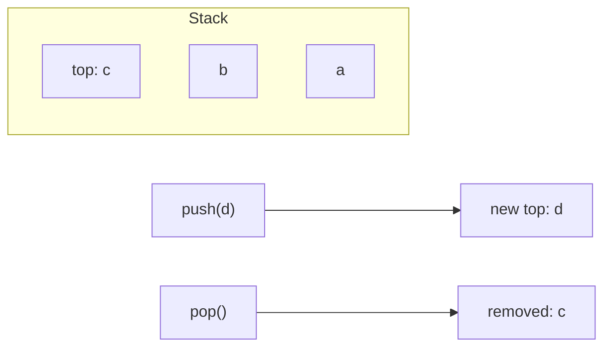

The stack is useful whenever the most recent unfinished item should be handled first: procedure calls, expression evaluation, backtracking, undo stacks, and depth-first traversal.

**Queues.** A queue is normally a first-in, first-out structure: elements are inserted at the rear and removed from the front. Queues may be simple, priority-based, or double-ended.

| Queue form | Main rule | Typical operations |
| --- | --- | --- |
| Simple queue | First inserted is removed first. | `enqueue`, `dequeue`, `front` |
| Deque | Both ends can be used. | `pushFront`, `pushBack`, `popFront`, `popBack` |
| Priority queue | Element with highest priority is removed first. | `insert`, `maximum`/`minimum`, `removeMax`/`removeMin` |

For a simple queue:

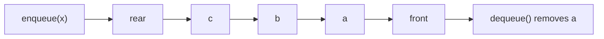

In a circular array implementation, the queue stores front and rear indexes modulo the capacity, so enqueue and dequeue are $O(1)$ unless resizing is used. In a linked implementation, maintaining pointers to both the first and last node also gives $O(1)$ enqueue and dequeue.

**Linked lists.** A list is represented by linked storage. It consists of nodes, and each node stores a data item plus at least one pointer to another node. In a singly linked list, each node points to the next node. In a doubly linked list, each node may also point to the previous node. The last node's next pointer is `NIL`.

Lists can be classified by three criteria:

| Criterion | Variants | Effect |
| --- | --- | --- |
| Head element | With head/sentinel or without one | A head/sentinel can simplify empty-list and boundary cases. |
| Direction of links | One-way or two-way | Doubly linked lists support backward movement and easier deletion when the node is known. |
| Cyclicity | Linear or cyclic | A cyclic list links the last node back to the first or head. |

Basic node layout:

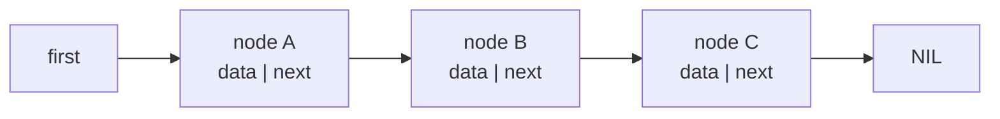

A list can insert or delete at a known position by changing pointers, often $O(1)$ once the position is known. Searching for a value or reaching the `i`-th element is usually $O(n)$, because the list must be followed node by node. This is the main contrast with arrays: arrays give fast indexing and compact storage, while lists give flexible pointer-based insertion and deletion but poorer random access and more pointer overhead.

### Summary Table

| Structure | Access | Insert/delete | Main advantage | Main limitation |
| --- | --- | --- | --- | --- |
| Array | $O(1)$ by index | Middle changes $O(n)$ | Fast indexing, compact storage | Fixed/simple capacity; shifting |
| Stack | Top only | $O(1)$ top changes | LIFO discipline | No arbitrary access |
| Queue | Front/rear | $O(1)$ with suitable representation | FIFO discipline | No arbitrary access |
| Linked list | Sequential | $O(1)$ at known node, $O(n)$ to find | Flexible node insertion/deletion | No constant-time indexing |

### What to Emphasize in an Oral Answer

- Start with the distinction: a data structure organizes storage, while a data type also includes the supported operations.
- Arrays: same-type elements in contiguous indexed positions; $O(1)$ random access, good locality, but middle insertion/deletion costs $O(n)$ because of shifting.
- Mention dynamic arrays if relevant: append is amortized $O(1)$, but a resize copies elements and costs $O(n)$.
- Stacks: LIFO discipline with `push`, `pop`, `top`, and `isEmpty`, normally all $O(1)$; use cases include calls, undo, DFS, and backtracking.
- Queues: FIFO `enqueue`/`dequeue`, with deques and priority queues as variants; circular-array or linked implementations can give $O(1)$ simple-queue operations.
- Linked lists: nodes plus pointers, singly/doubly, sentinel/no sentinel, linear/cyclic; insertion/deletion is $O(1)$ once the node is known, but search and indexing are $O(n)$.
- End with the core tradeoff: arrays give indexing and cache locality, lists give flexible pointer updates, stacks and queues restrict access by discipline.

::: details Suggested answer

A data structure is an organization of stored data, while a data type is that structure together with its operations. Arrays, stacks, queues, and linked lists are the basic linear structures. An array stores same-type elements in indexed, usually contiguous positions, so accessing an element by index is constant time. Its weakness is that inserting or deleting in the middle may require shifting many elements, and in the simple model its size is fixed.

A stack is a last-in, first-out structure. We insert with `push`, remove with `pop`, and inspect the top element with `top` or `peek`, normally all in constant time. It is useful when the most recent unfinished item must be handled first, such as function calls, undo operations, depth-first traversal, or backtracking. A queue is usually first-in, first-out: `enqueue` adds at the rear and `dequeue` removes from the front. With a circular array or linked representation, these operations can also be constant time. A priority queue is different, because removal is based on priority rather than arrival order.

A linked list stores elements in nodes connected by pointers. A singly linked list points forward, a doubly linked list also points backward, and lists may use a head or sentinel node or be cyclic. Lists make insertion and deletion easy once the position is known, but finding that position or the $i$-th element usually requires a linear traversal. So the main tradeoff is array indexing and locality against linked-list flexibility, while stacks and queues are defined mainly by the access discipline they impose.

:::

## 15.2 Binary Trees: Traversals and Representations

**Binary tree.** A tree is a hierarchical structure used for large data sets, multisets, indexes, expression trees, syntax trees, and many other representations. In a binary tree, every node has at most two successors: a left child and a right child.

Tree terminology:

| Term | Meaning |
| --- | --- |
| Root | The unique node with no parent. |
| Parent | The predecessor of a node. |
| Child | A successor of a node. In binary trees, left or right child. |
| Siblings | Children of the same parent. |
| Leaf | A node without children. |
| Internal node | A non-leaf node. |
| Descendants | A node's children and all nodes below them. |
| Ancestors | A node's parent and all nodes above it. |
| Level | Root is at level 0; children of level $i$ are at level $i + 1$. |
| Height | Level of the deepest leaf. The empty tree height is often defined as $h(empty) = -1$. |

**General tree.** A binary tree is a special case of an $r$-ary tree, where each node has at most $r$ children. The children are usually numbered from $0$ to $r - 1$. If a node has no $i$-th child, that subtree is empty. Binary trees correspond to $r = 2$, with left child as selector 0 and right child as selector 1. The trees discussed here are rooted trees: edges can be viewed as directed from root toward leaves, and every node is reachable from the root by exactly one path.

**Traversals.** Tree traversals visit every node in a defined order and apply the same constant-time operation at each node, such as printing a key. For an empty tree, traversal does nothing. For non-empty `r`-ary trees:

| Traversal | Order | Binary-tree intuition |
| --- | --- | --- |
| Preorder | Process root, then subtrees from `0` to $r - 1$. | Root, left, right. |
| Inorder | Traverse subtree 0, process root, then traverse subtrees 1 to $r - 1$. | Left, root, right. Most important for binary search trees. |
| Postorder | Traverse all subtrees, then process root. | Left, right, root. |
| Level order | Process nodes level by level from the root, left to right. | Breadth-first traversal using a queue. |

Example tree:

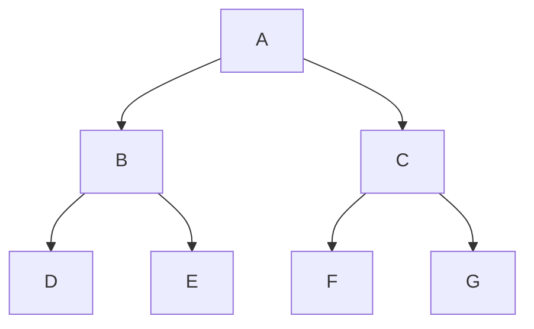

For this tree:

| Traversal | Visit order |
| --- | --- |
| Preorder | `A, B, D, E, C, F, G` |
| Inorder | `D, B, E, A, F, C, G` |
| Postorder | `D, E, B, F, G, C, A` |
| Level order | `A, B, C, D, E, F, G` |

**Representations.** There are three important representation views.

1. **Graphical / linked representation.** The natural drawing of a tree corresponds directly to linked nodes. Each node stores the data and references to its children. For a binary tree, a node can be represented as:

```text
Node {
  key
  left: Node*
  right: Node*
}
```

The empty tree is represented by a null pointer. Sometimes nodes also store a parent pointer:

```text
Node {
  key
  parent: Node*
  left: Node*
  right: Node*
}
```

A parent pointer makes upward movement efficient, which is useful in search trees, rotations, and some deletion algorithms. Its cost is additional memory and extra pointer maintenance after structural changes.

2. **Parenthesized textual representation.** The parenthesized representation of a non-empty binary tree is:

```text
( leftSubtree Root rightSubtree )
```

The empty tree is represented by the empty string. For example, the example tree above can be written as:

```text
((D B E) A (F C G))
```

The parentheses encode subtree boundaries, while labels encode node values. Different matching brackets may be used for readability, but the logical idea is the same.

3. **Array representation for complete trees.** Complete binary trees can be stored compactly in arrays, which is especially important for heaps. With zero-based indexing, the children of index $i$ are $2i + 1$ and $2i + 2$, and the parent is $\lfloor (i - 1) / 2 \rfloor$. With one-based indexing, the children are $2i$ and $2i + 1$, and the parent is $\lfloor i / 2 \rfloor$.

### Representation Tradeoffs

| Representation | Good for | Weakness |
| --- | --- | --- |
| Linked nodes | General sparse trees, dynamic insertion/deletion | Pointer overhead and less locality |
| Linked nodes with parent pointer | Upward navigation and rotations | Extra memory and maintenance |
| Parenthesized text | Serialization and compact human-readable examples | Not efficient for direct updates |
| Array complete-tree layout | Heaps and complete binary trees | Wastes space for non-complete trees |

### What to Emphasize in an Oral Answer

- Define a rooted tree and key terms: root, parent, child, leaf, internal node, level, height, ancestor, and descendant.
- State that a binary tree is the $r=2$ case, with at most a left and right child for each node.
- Compare traversals by the root's position: preorder root-left-right, inorder left-root-right, postorder left-right-root, and level order by queue.
- Mention the important BST connection: inorder traversal of a binary search tree yields sorted keys.
- Cover linked representation: nodes store data and child references, with optional parent pointers for upward movement at extra memory/maintenance cost.
- Cover textual parenthesized representation for serialization and array representation for complete trees.
- Give the complete-tree index formulas when useful: zero-based children $2i+1$, $2i+2$, parent $\lfloor(i-1)/2\rfloor$.

::: details Suggested answer

A binary tree is a rooted tree in which each node has at most two children, called the left and right child. The root has no parent, leaves have no children, internal nodes are non-leaves, and the height is the level of the deepest leaf. More generally, an r-ary tree allows up to r children per node, and a binary tree is the special case r equals two.

The main tree traversals differ by when the root is processed. In preorder, we process the root before the subtrees. In inorder, for a binary tree, we process the left subtree, then the root, then the right subtree; this gives sorted order in a binary search tree. In postorder, the root is processed after the subtrees. Level-order traversal visits nodes by increasing level, usually using a queue.

Trees can be represented graphically as linked nodes, where each node stores references to its children, optionally also to its parent. A parent pointer makes upward movement and rotations easier, but costs memory and has to be maintained. Trees can also be serialized textually by a parenthesized form such as left subtree, root, right subtree inside parentheses. Complete binary trees, especially heaps, can be stored in arrays; with zero-based indexing, the children of index $i$ are $2i+1$ and $2i+2$, and the parent is $\lfloor(i-1)/2\rfloor$. The right representation depends on whether we need dynamic updates, compact storage, traversal, or serialization.

:::

## 15.3 Binary Heaps and Priority Queues

**Priority queue.** A priority queue is an abstract data type where each element has a priority, and removal selects the element with best priority rather than the oldest element. Depending on convention, the best priority may be the maximum key or the minimum key. In a max-priority view, the highest-priority element is at the root and is removed by `remMax()`.

Essential priority queue operations:

| Operation | Meaning |
| --- | --- |
| `insert(x, priority)` | Add a new element with priority. |
| `maximum()` / `minimum()` | Inspect the best-priority element. |
| `removeMax()` / `removeMin()` | Remove and return the best-priority element. |
| `changePriority()` | Change an element's priority, if the implementation supports locating it. |

**Binary heap.** A binary heap is a concrete data structure commonly used to implement a priority queue. It is a complete binary tree with the heap-order property. In a max-heap, each parent has key at least as large as its children. In a min-heap, each parent has key at most as large as its children.

The two defining heap properties:

| Property | Meaning | Why it matters |
| --- | --- | --- |
| Shape property | The tree is complete: all levels are full except possibly the last, filled left to right. | Enables compact array representation. |
| Heap-order property | Parent priority dominates child priority. | The best element is always at the root. |

Example max-heap:

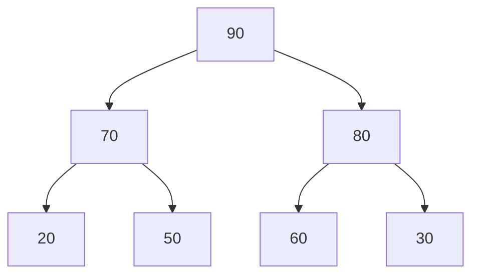

The same heap in an array, using level order, is:

```text
index:  0   1   2   3   4   5   6
value: 90  70  80  20  50  60  30
```

With zero-based indexing:

| Relation | Formula |
| --- | --- |
| Left child of `i` | $2i + 1$ |
| Right child of `i` | $2i + 2$ |
| Parent of `i` | $floor((i - 1) / 2)$ |

**Insertion / add.** The `add(x)` algorithm works as follows:

1. Put the new element into the nearest free leaf position, preserving completeness.
2. Compare it with its parent.
3. If the new element has higher priority than its parent, swap them.
4. Continue upward until the heap property holds or the root is reached.

This upward movement is often called `sift up`, `bubble up`, or `percolate up`.

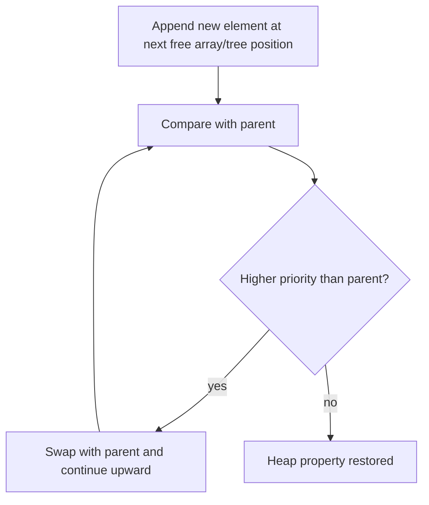

Because a complete binary tree with `n` nodes has height $\lfloor log2 n \rfloor$, insertion is $O(\log n)$.

**Deletion / remove maximum.** The `remMax()` algorithm removes the root:

1. The maximum element is at the root.
2. Remove the root value.
3. Move the last element from the bottom level into the root position.
4. Compare this replacement with its children.
5. Swap it with the child of higher priority if that child has higher priority.
6. Continue downward until the heap property is restored.

This downward movement is called `sink`, `sift down`, or `heapify down`.

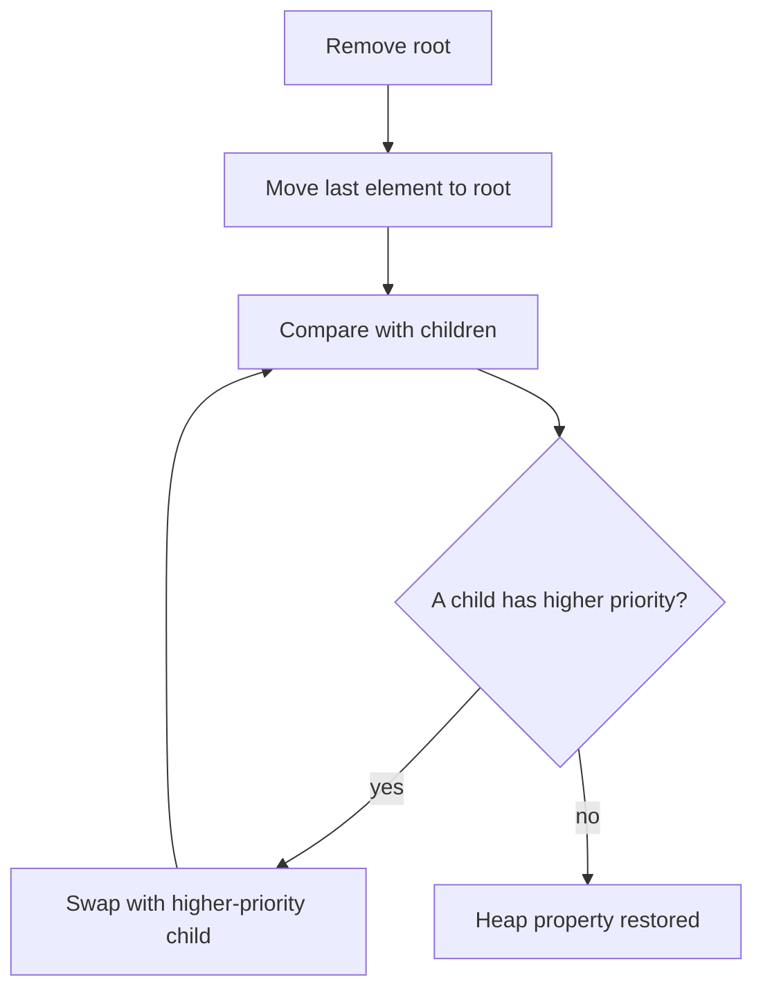

Removing the maximum is also $O(\log n)$. Inspecting the maximum is $O(1)$, because it is always at the root.

### Heap Operation Costs

| Operation | Cost | Explanation |
| --- | --- | --- |
| `maximum()` | $O(1)$ | Root stores best priority. |
| `insert()` | $O(\log n)$ | Sift up through heap height. |
| `removeMax()` | $O(\log n)$ | Sift down through heap height. |
| Build heap from array | $O(n)$ with bottom-up heapify | Each subtree is repaired from lower levels upward. |

For heaps, the main data-structure focus is their priority-queue behavior; heap sort is covered with sorting algorithms.

### What to Emphasize in an Oral Answer

- Distinguish the priority queue ADT from the binary heap data structure that commonly implements it.
- State the priority rule and max/min convention: removal selects the best-priority element, not the oldest element.
- Define both heap invariants: complete-tree shape and heap-order property.
- Explain why completeness enables compact array storage in level order, with parent/child index formulas.
- Describe insertion: append at the next free leaf, then sift/bubble up until heap order is restored.
- Describe `removeMax`/`removeMin`: remove root, move last element to root, then sink/sift down through the higher-priority child.
- State operation costs: inspect root $O(1)$, insert/remove $O(\log n)$, bottom-up heap build $O(n)$.

::: details Suggested answer

A priority queue is an abstract data type where elements are removed according to priority. A binary heap is a common implementation of a priority queue. It is a complete binary tree, usually stored in an array, and it satisfies the heap-order property: in a max-heap every parent has key at least as large as its children, so the maximum element is always at the root.

The complete-tree shape is important because it lets us store the heap compactly in level order. With zero-based indexing, the children of position i are at 2i plus 1 and 2i plus 2, and the parent is at floor of i minus 1 over 2. Insertion puts the new element into the next free leaf position and then moves it upward while it has higher priority than its parent. Removing the maximum removes the root, moves the last element to the root, and then sinks it downward by swapping with the higher-priority child until the heap property is restored.

The root can be inspected in constant time, while insertion and removal take logarithmic time because they move along one root-to-leaf path. Building a heap bottom-up from an array can be done in linear time. This is why heaps are efficient priority-queue implementations, although the heap property does not mean the whole array is sorted.

:::

## 15.4 Binary Search Trees, AVL Trees, and B+ Trees

### Binary Search Trees

A binary search tree (BST) is a binary tree used for efficient storage and lookup of ordered data. Each node has a key, and the ordering invariant is:

```text
all keys in left subtree < node key <= or < all keys in right subtree
```

The exact duplicate-key convention must be chosen by the implementation. One common convention rejects duplicate keys; another stores duplicates consistently on one side or stores a count/list at the node.

Example:

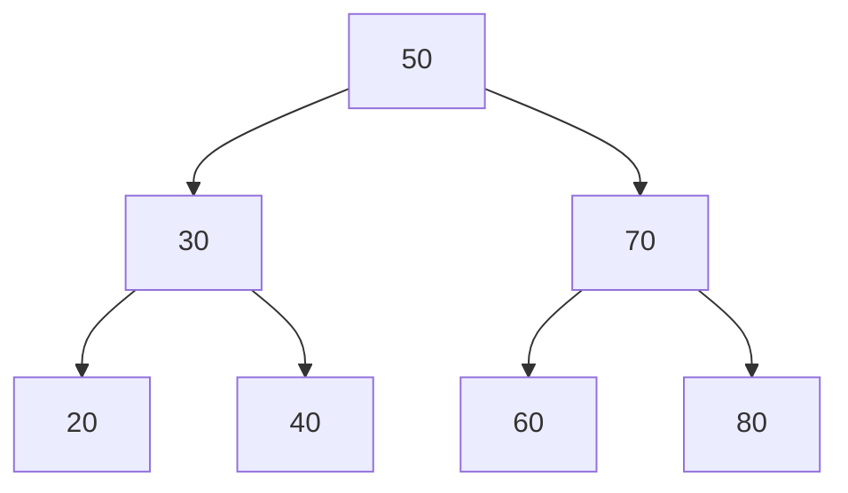

BST operations:

| Operation | Mechanism |
| --- | --- |
| Search | Compare the target key with the current node. Go left if smaller, right if larger, stop if equal or null. |
| Insert | Search for the position where the key should be, then attach a new leaf while preserving order. |
| Delete leaf | Remove the leaf directly. |
| Delete node with one child | Replace the node by its child. |
| Delete node with two children | Replace by inorder predecessor or successor, then delete that moved key from its old position. |
| Inorder traversal | Visits keys in sorted order. |

For the example tree, inorder traversal returns:

```text
20, 30, 40, 50, 60, 70, 80
```

The cost of search, insertion, and deletion is $O(h)$, where `h` is the tree height. In a balanced tree this is $O(\log n)$, but in a badly skewed tree the height can be $n - 1$, so operations become $O(n)$.

### AVL Trees

An AVL tree is a self-balancing binary search tree. It preserves the BST ordering and also keeps every node balanced by height. The height difference at every node may be at most 1.

The usual balance factor is:

```text
balance(v) = height(left(v)) - height(right(v))
```

For an AVL tree, each node has balance factor $-1$, $0$, or $+1$. After insertion or deletion, a node may become unbalanced. Rotations repair the tree while preserving inorder order.

Rotation cases:

| Case | Shape | Repair |
| --- | --- | --- |
| Left-left | Insertion/deletion makes left child's left side too high. | Single right rotation. |
| Right-right | Right child's right side too high. | Single left rotation. |
| Left-right | Left child's right side too high. | Left rotation on child, then right rotation. |
| Right-left | Right child's left side too high. | Right rotation on child, then left rotation. |

Single right rotation:

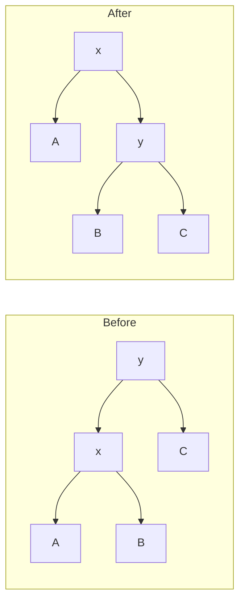

Single left rotation is symmetric. Double rotations combine two single rotations. AVL operations are $O(\log n)$ because the balance invariant keeps height logarithmic. The cost is that insertions and deletions must update heights/balance factors and may perform rotations.

### B+ Trees

A B+ tree is a balanced multiway search tree designed for high fanout. For a degree `d` with $4 \le d$, each internal node contains at most `d` pointers and at most $d - 1$ keys. Internal keys guide the search; every actual data key appears in a leaf. Leaves are ordered left to right, and in practical database/file-system implementations they are often linked for efficient range scans.

B+ tree invariants for degree `d`:

| Invariant | Meaning |
| --- | --- |
| Leaf capacity | Each leaf contains at most $d - 1$ keys and the same number of pointers to corresponding records. |
| Equal leaf depth | Every leaf is at the same distance from the root. |
| Internal-node shape | Every internal node has one more pointer than it has keys, and at most `d` pointers. |
| Separator meaning | Child subtrees cover key intervals separated by the node's keys. |
| Root minimum | The root has at least two children unless the tree is a single node. |
| Internal minimum | Every non-root internal node has at least $\lfloor d/2 \rfloor$ children. |
| Leaf minimum/order | Every leaf has at least $\lfloor d/2 \rfloor$ keys, and all data keys appear in leaves in increasing order. |

Small degree-4 sketch:

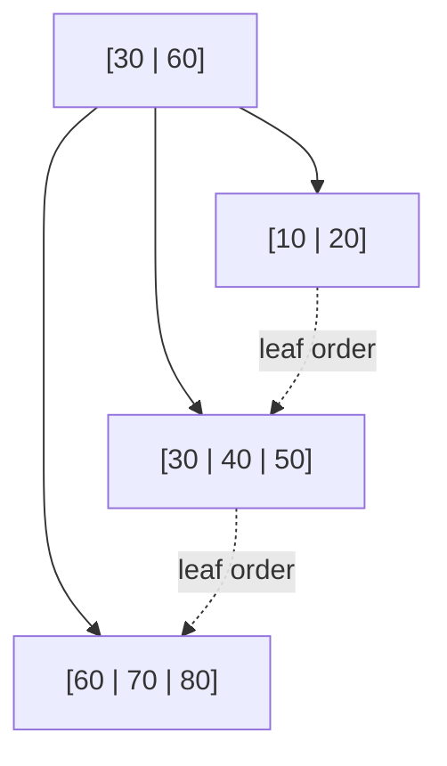

Search starts at the root and follows the interval pointer whose key range contains the searched key. Since nodes have many children, the tree has small height even for large data sets. This is why B+ trees are important for database and file-system indexes: one node can match a disk page or cache block, reducing I/O.

**B+ insertion.** The process is:

1. If the tree is empty, create a new leaf containing the key/pointer pair.
2. Otherwise find the leaf where the key belongs.
3. If the key already exists, insertion fails.
4. If the leaf has space, insert the pair in sorted order.
5. If the leaf is full, split it into two leaves and distribute the keys.
6. Copy the smallest key of the new right leaf into the parent as a separator.
7. If the parent overflows, split it too. For an internal-node split, the middle separator is promoted upward rather than kept in both children.
8. If the root splits, create a new root and increase the tree height.

**B+ deletion.** B+ deletion distinguishes leaf deletion, internal deletion, and root deletion:

1. Find the leaf containing the key. If it is absent, deletion fails.
2. Delete the key/pointer pair from the leaf.
3. If the leaf still satisfies minimum occupancy, finish.
4. If it underflows and an adjacent sibling has more than the minimum, redistribute keys and update the parent separator.
5. If adjacent siblings are also at minimum, merge with a sibling and delete the separator/pointer from the parent.
6. If this causes the parent to underflow, repeat the redistribution-or-merge logic upward.
7. If the root ends with only one child, remove the old root and make the child the new root, decreasing the height.

### Ordered Tree Comparison

| Structure | Balance guarantee | Search/insert/delete | Typical use |
| --- | --- | --- | --- |
| BST | None | $O(h)$, worst $O(n)$ | Simple ordered set/map |
| AVL tree | Height balance factor at most 1 | $O(\log n)$ | In-memory ordered set/map with strict balancing |
| B+ tree | All leaves same depth, multiway occupancy | $O(log_d n)$ node visits | Disk/page-oriented indexes, range queries |

### What to Emphasize in an Oral Answer

- For BSTs, state the ordering invariant and say the duplicate-key convention must be defined.
- Explain BST operations: search follows comparisons, insertion attaches a leaf, deletion has leaf/one-child/two-child cases, and inorder traversal yields sorted order.
- Give the height-dependent cost: search/insert/delete are $O(h)$, so balanced is $O(\log n)$ and skewed can be $O(n)$.
- For AVL trees, add the height-balance invariant: balance factor is $-1$, $0$, or $+1$ at every node.
- Name the AVL repair mechanisms: single rotations for left-left/right-right and double rotations for left-right/right-left; all preserve inorder order.
- For B+ trees, emphasize high fanout, internal separator keys, all real data in leaves, equal leaf depth, and linked ordered leaves for range scans.
- Compare uses: BST is simple, AVL gives strict in-memory logarithmic operations, B+ trees minimize page accesses for database and file-system indexes.

::: details Suggested answer

A binary search tree is a binary tree with an ordering invariant: keys smaller than a node are stored in the left subtree and larger keys are stored in the right subtree, according to the chosen duplicate convention. Searching compares the target key with the current node and follows one branch. Insertion follows the same path and attaches a new leaf. Deletion removes a leaf directly, replaces a one-child node by its child, or replaces a two-child node by its inorder predecessor or successor. The operation cost is proportional to the height, so a balanced tree is logarithmic but a skewed tree can become linear.

An AVL tree is a self-balancing binary search tree. At every node, the heights of the left and right subtrees differ by at most one. After insertion or deletion, rotations restore balance while preserving inorder order. The four cases are left-left, right-right, left-right, and right-left. Because the height remains logarithmic, search, insertion, and deletion are logarithmic.

A B+ tree is a balanced multiway search tree. Internal nodes contain separator keys and child pointers, while all data keys appear in the leaves. Leaves are at the same depth and are ordered, often linked, which makes range queries efficient. Insertion splits full nodes and promotes or copies separator keys upward; deletion redistributes with siblings or merges nodes and may shrink the root. B+ trees are especially useful for database and file-system indexes because high fanout keeps the number of page accesses small.

:::

## 15.5 Hash Tables, Hash Functions, Collision Resolution, and Probe Sequences

A hash table, or hash map, stores key-value pairs and uses a hash function to determine where a key should be stored. At its core, a hash table is an array. To insert, search, or delete a key, the algorithm computes a hash code and maps it to an array index.

**Hash function.** A hash function takes a key and produces a hash code. The table index is usually derived by compression, for example:

```text
index = hash(key) mod table_size
```

A good hash function should be deterministic, fast, and distribute expected keys evenly across the table. It cannot generally guarantee unique positions for all possible keys, so collisions must be expected.

**Collision.** A collision occurs when two different keys map to the same table position. Collision resolution determines how the table remains usable despite collisions.

### Chaining

In chaining, each table cell points to a chain of entries whose keys hash to that cell. The chain is often a linked list, but it can also be another dynamic structure.

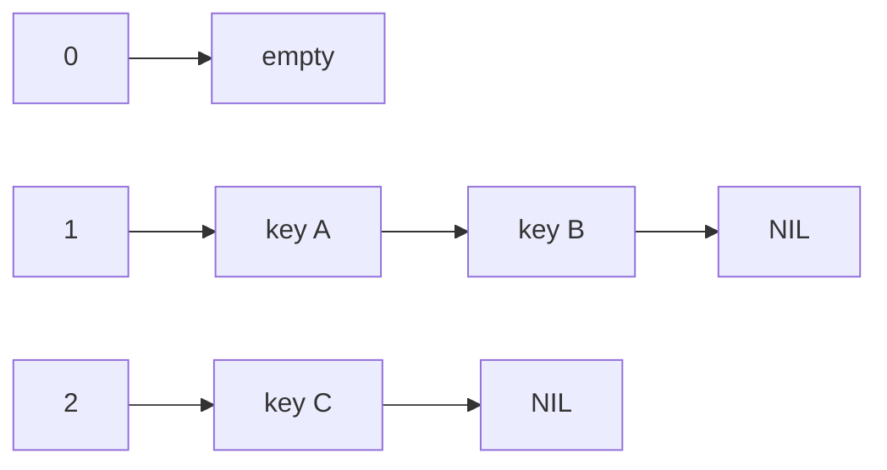

Chaining operation behavior:

| Operation | Mechanism |
| --- | --- |
| Insert | Compute bucket, insert into that bucket's chain. |
| Search | Compute bucket, scan chain comparing keys. |
| Delete | Compute bucket, find key in chain, relink/remove it. |

If the load factor $\alpha = n / m$ is small and hashing is uniform, expected operation time is $O(1 + \alpha)$. In the worst case all keys collide into one chain, and operations are $O(n)$.

### Open Addressing

In open addressing, all entries are stored directly in the table array. If the home position is occupied, a probe sequence determines alternative positions. Open addressing requires load factor below 1, and performance becomes poor as the table fills.

Open-addressing search follows the same probe sequence used by insertion. Search stops when it finds the key or reaches a position that proves the key is absent. Deletion needs care: simply emptying a slot may break later searches, so implementations often use tombstones to mark deleted positions.

### Probe Sequences

A probe sequence is the ordered sequence of table positions tried for a key. Common probe sequences are linear probing, quadratic probing, and double hashing.

| Probe sequence | Formula idea | Strength | Weakness |
| --- | --- | --- | --- |
| Linear probing | $h(k), h(k)+1, h(k)+2,\ldots$ modulo table size | Simple, cache-friendly | Primary clustering: long runs of occupied cells form. |
| Quadratic probing | $h(k)+1^2, h(k)+2^2,\ldots$ modulo table size | Reduces primary clustering | May not visit every slot unless table size/formula are chosen carefully; secondary clustering remains. |
| Double hashing | $h1(k) + i \cdot h2(k)$ modulo table size | Better distribution, less clustering | Needs a second hash function; step size must be compatible with table size. |

Example of linear probing:

```text
table size = 10
home index = 5
if 5 occupied, try 6, then 7, then 8, ...
```

### Load Factor, Resizing, and Complexity

The load factor is the ratio of stored elements to table capacity.

```text
alpha = number_of_entries / number_of_slots
```

For chaining, $\alpha$ can exceed 1, but long chains hurt performance. For open addressing, $\alpha$ must stay below 1, and practical implementations resize before the table becomes too full. Resizing allocates a larger table and reinserts entries because indexes depend on table size.

Expected complexity under a good hash function:

| Method | Search/insert/delete average | Worst case |
| --- | --- | --- |
| Chaining | $O(1 + \alpha)$ | $O(n)$ |
| Open addressing | $O(1)$ while load factor is controlled | $O(n)$ |

Hash tables are efficient for exact-key lookup. They are not naturally ordered, so they are not a replacement for search trees when sorted traversal, predecessor/successor queries, or range queries are needed.

### What to Emphasize in an Oral Answer

- Define a hash table as an array-based exact-lookup structure using a hash function and compression such as modulo table size.
- State qualities of a good hash function: deterministic, fast, and roughly uniform on expected keys.
- Explain collisions and load factor $\alpha=n/m$; collisions are expected, and performance depends on keeping load controlled.
- Chaining: each bucket stores a list or collection of colliding entries; expected time is $O(1+\alpha)$, worst case $O(n)$.
- Open addressing: all entries live in the array, insertion/search follow the same probe sequence, load factor must stay below 1, and deletion needs tombstones or careful repair.
- Compare probe sequences: linear probing is simple but clusters, quadratic reduces primary clustering, double hashing uses a second hash for better spread.
- Conclude with resizing/rehashing and the contrast with ordered trees: hash tables are good for exact lookup, not sorted traversal or range queries.

::: details Suggested answer

A hash table stores key-value pairs in an array and uses a hash function to map each key to an array index, often by taking a hash code modulo the table size. The hash function should be deterministic, fast, and distribute expected keys evenly, but different keys can still map to the same index, which is called a collision. The load factor $\alpha=n/m$ measures how full the table is and strongly affects performance.

The two main collision-resolution methods are chaining and open addressing. In chaining, each table cell refers to a list or other collection of entries with that hash value. Search computes the bucket and scans only that chain; with uniform hashing the expected cost is $O(1+\alpha)$, but the worst case is linear. In open addressing, all entries stay inside the array itself. If the home position is occupied, the algorithm follows a probe sequence until it finds the key or a usable empty slot. Search must follow the same sequence, and deletion needs care, often using tombstones, because simply clearing a slot can break later searches.

Typical probe sequences are linear probing, quadratic probing, and double hashing. Linear probing tries consecutive slots and is simple but suffers from clustering. Quadratic probing jumps by squared offsets and reduces primary clustering. Double hashing uses a second hash function as the step size and usually distributes probes better. Tables are resized and entries are rehashed when the load factor becomes too high. With a good hash function and controlled load factor, hash-table operations are constant time on average, but the worst case is linear. Hash tables are best for exact lookup, while trees are better for ordered operations and range queries.

:::

## 15.6 Graph Representations

A graph consists of vertices and edges. Edges may be directed or undirected, weighted or unweighted. A graph representation determines the memory cost and the cost of common operations such as testing adjacency, enumerating neighbors, and scanning all edges.

Four graph representations are adjacency matrix, edge list, adjacency list, and incidence matrix.

### Adjacency Matrix

An adjacency matrix is an `n x n` matrix for `n` vertices. Entry `(i, j)` indicates whether there is an edge from vertex `i` to vertex `j`, or stores the weight of that edge. In an undirected graph the matrix is symmetric. In a directed graph it need not be symmetric.

Example directed weighted matrix:

| From / to | A | B | C |
| --- | --- | --- | --- |
| A | 0 | 5 | infinity |
| B | infinity | 0 | 2 |
| C | 7 | infinity | 0 |

This means $A \to B$ has weight 5, $B \to C$ has weight 2, and $C \to A$ has weight 7. Missing edges are represented by `0`, `false`, `infinity`, or another sentinel depending on the graph type.

Properties:

| Feature | Cost |
| --- | --- |
| Space | $O(n^2)$ |
| Test whether edge `(u, v)` exists | $O(1)$ |
| Enumerate all neighbors of `u` | $O(n)$ |
| Good for | Dense graphs and frequent adjacency tests |

### Edge List

An edge list stores one record per edge. Each record contains start vertex, end vertex, and optionally weight or other edge attributes.

```text
(A, B, 5)
(B, C, 2)
(C, A, 7)
```

Properties:

| Feature | Cost |
| --- | --- |
| Space | $O(m)$ for `m` edges |
| Scan all edges | $O(m)$ |
| Test adjacency | Usually $O(m)$ unless indexed |
| Good for | Algorithms that process all edges, such as Kruskal's algorithm |

### Adjacency List

An adjacency list stores, for each vertex, the list of outgoing adjacent vertices or outgoing edges.

```text
A: (B, 5)
B: (C, 2)
C: (A, 7)
```

Properties:

| Feature | Cost |
| --- | --- |
| Space | $O(n + m)$ |
| Enumerate neighbors of `u` | $O(\deg(u))$ |
| Test adjacency | $O(\deg(u))$ unless neighbor set is hashed/sorted |
| Good for | Sparse graphs, BFS/DFS, most graph algorithms |

### Incidence Matrix

An incidence matrix has one row per vertex and one column per edge. In an undirected graph, an entry records whether a vertex is incident with an edge. In a directed graph, signs may represent orientation, for example $-1$ for the source and $+1$ for the target.

Example for directed edges $e1 = A \to B$, $e2 = B \to C$, $e3 = C \to A$:

| Vertex / edge | e1 | e2 | e3 |
| --- | --- | --- | --- |
| A | -1 | 0 | +1 |
| B | +1 | -1 | 0 |
| C | 0 | +1 | -1 |

Properties:

| Feature | Cost |
| --- | --- |
| Space | $O(nm)$ |
| Represents edge-vertex relationship directly | Yes |
| Good for | Algebraic graph methods, constraints, and some network formulations |
| Weakness | Usually too large for ordinary sparse graph traversal |

### Representation Comparison

| Representation | Space | Fast operation | Weak operation |
| --- | --- | --- | --- |
| Adjacency matrix | $O(n^2)$ | Edge existence test | Neighbor enumeration in sparse graphs |
| Edge list | $O(m)$ | Scanning/sorting all edges | Adjacency lookup |
| Adjacency list | $O(n + m)$ | Neighbor traversal | Constant-time edge lookup unless augmented |
| Incidence matrix | $O(nm)$ | Edge-vertex incidence algebra | General traversal/storage for large graphs |

### What to Emphasize in an Oral Answer

- Start from the graph model: vertices and edges may be directed/undirected and weighted/unweighted; representation determines memory and operation costs.
- Adjacency matrix: `n x n` table, $O(n^2)$ space, $O(1)$ adjacency test, $O(n)$ neighbor scan; good for dense graphs.
- Edge list: one record per edge, $O(m)$ space and $O(m)$ full-edge scan; useful for algorithms like Kruskal but poor for adjacency lookup unless indexed.
- Adjacency list: per-vertex neighbor lists, $O(n+m)$ space, $O(\deg(u))$ neighbor enumeration; usually best for sparse graphs and BFS/DFS.
- Incidence matrix: rows are vertices and columns are edges, with signs for directed orientation; useful for algebraic/constraint formulations but costs $O(nm)$ space.
- Make the tradeoff explicit: choose based on graph density and whether the main operation is edge testing, neighbor traversal, edge scanning, or incidence reasoning.

::: details Suggested answer

Graph representations encode vertices and edges in different ways, and the choice determines both memory use and operation costs. An adjacency matrix uses an $n$ by $n$ table where entry $i,j$ shows whether there is an edge from vertex $i$ to vertex $j$, or stores its weight. It uses $O(n^2)$ space but tests adjacency in constant time, so it is good for dense graphs or frequent edge-existence queries.

An edge list stores one record for each edge, such as source, target, and weight. It uses $O(m)$ space and is convenient for algorithms that process all edges, for example sorting edges in Kruskal's algorithm, but testing whether two vertices are adjacent is slow unless another index is added. An adjacency list stores, for each vertex, its outgoing neighbors or edges. It uses $O(n+m)$ space, enumerates neighbors of $u$ in $O(\deg(u))$, and is usually best for sparse graphs and graph searches like BFS and DFS.

An incidence matrix has rows for vertices and columns for edges, marking which vertices are incident with each edge, sometimes with signs for directed edges. It is useful in algebraic formulations but can be large, with $O(nm)$ space. So the choice depends on graph density and on whether we need fast edge lookup, neighbor traversal, edge scanning, or algebraic incidence information.

:::
