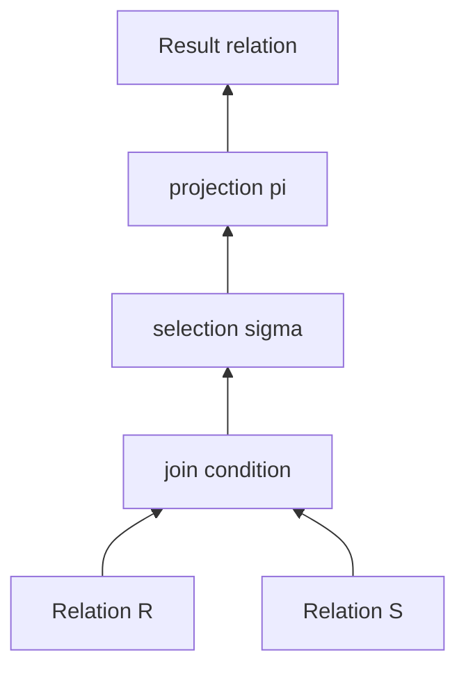

# 20. Databases: Design and Query

This subject covers database design and querying: the relational model, E/R modeling, SQL, embedded SQL and PSM, functional dependencies, decomposition, normal forms, and related design tradeoffs.

## 20.1 Relational Model and Relational Algebra

### Relational Data Model

The relational data model is a model that manages a collection of data. The central structural concept is the **relation**, normally represented as a table.

Important terms:

| Concept               | Meaning                                                                                                            |
| --------------------- | ------------------------------------------------------------------------------------------------------------------ |
| Data model            | A high-level representation of real-world concepts, relationships, and activities; a notation for describing data. |
| Relation              | A table-like collection of tuples/rows.                                                                            |
| Relation schema       | A relation name with attributes, written like $R(A_1,\ldots,A_n)$.                                                 |
| Occurrence / instance | A finite set of rows matching the schema.                                                                          |
| Attribute             | A named component of the row type, with values drawn from a domain/type.                                           |
| Tuple / row           | One occurrence of values for the attributes of a relation.                                                         |
| Database schema       | A set of relation schemas, often denoted as a collection $\{R_1,\ldots,R_k\}$.                                     |
| Database occurrence   | The actual relation instances belonging to the schemas at a given time.                                            |

A data model has three parts:

1. **Structure:** how data is represented.
2. **Operations:** what can be performed on the data.
3. **Constraints:** which database states are valid.

### Keys, Foreign Keys, and Referential Integrity

A **key** is an attribute set that uniquely identifies rows. A simple key has one attribute; a composite key has several. A **superkey** also uniquely identifies rows, but may contain unnecessary attributes. A key is a minimal superkey.

A **foreign key** is an attribute set in one relation that refers to a key or unique identifier in another relation. If relation $S(B_1,\ldots,B_n)$ has a foreign key $Y=\{B_{j1},\ldots,B_{jk}\}$ referring to key $X=\{A_{i1},\ldots,A_{ik}\}$ in relation $R(A_1,\ldots,A_m)$, then values are matched in that given order.

**Referential integrity** says that a referencing row must not point to a missing referenced row. Formally, for each row in the referencing relation, the foreign-key values must match key values of some row in the referenced relation, unless the schema permits special behavior such as `NULL` values.

### Why the Relational Model Is Useful

The relational model has several advantages:

- The structural part is simple and easy to understand because tables are natural to users.
- Conceptual, logical, and physical levels are separated.
- Logical and physical data independence are high: users work with relations, while physical file structures and indexes are hidden.
- The model has strong theoretical foundations.
- Abstract manipulation languages, especially relational algebra, support formal reasoning and query optimization.
- SQL gives a standardized operational interface.

Also note physical structures such as serial files and B+ trees. These explain why physical data independence matters, but the details of file organization and indexing belong mainly to subject 21.

### Relational Algebra: Purpose and Operands

Relational algebra is a formal query language. Its operands are relations, and every operation produces a relation, so operations can be composed into expressions.

Atomic operands:

- relation variables;
- relation constants, meaning explicitly given finite relations.

Relational algebra is important because:

- it gives a mathematical foundation for query languages;
- SQL queries can often be translated into algebraic plans;
- query optimizers use algebraic equivalences to transform plans.

### Core Relational Algebra Operations

Relational algebra has six basic operations that form a minimal set: omitting one makes some expressions inexpressible.

| Operation    | Notation                        | Meaning                                                                                  |
| ------------ | ------------------------------- | ---------------------------------------------------------------------------------------- |
| Union        | $R \cup S$                      | Rows in either relation; schemas must be compatible.                                     |
| Difference   | $R - S$                         | Rows in $R$ that are not in $S$; schemas must be compatible.                             |
| Projection   | $\pi_{\text{list}}(R)$          | Keep selected attributes; under set semantics duplicates are removed.                    |
| Selection    | $\sigma_{\text{condition}}(R)$  | Keep rows satisfying the condition.                                                      |
| Natural join | $R \bowtie S$                   | Combine rows that agree on same-named attributes, keeping one copy of common attributes. |
| Rename       | $\rho_{\text{T(B1,...,Bk)}}(R)$ | Rename relation and/or attributes to avoid ambiguity or align schemas.                   |

Intersection is derivable:

$$
R \cap S = R - (R - S)
$$

Cartesian product is also central:

$R \times S$

It concatenates every row of $R$ with every row of $S$. If attributes have the same name, renaming is needed. A theta join is a product followed by a selection:

$$
R \bowtie_{\text{condition}} S = \sigma_{\text{condition}}(R \times S)
$$

Natural join is convenient, but it can be dangerous when same-named attributes are matched accidentally.

### Selection Conditions

Elementary conditions compare attributes and constants:

- $A_i=A_j$, $A_i\ne A_j$, $A_i<A_j$, and similar comparisons;
- $A_i=c$, $A_i<c$, etc.

Complex conditions combine elementary ones using negation, conjunction, disjunction, and parentheses. In classical relational algebra, conditions are two-valued. SQL later adds three-valued logic because of `NULL`.

### Monotonicity and Difference

An expression is monotonic if adding rows to an input cannot remove rows from the output. Most positive relational algebra operations are monotonic. Difference is not monotonic: adding rows to the right-hand operand of $R - S$ can remove rows from the result. This is why difference cannot be expressed by the other positive operations.

### Division

Division supports "for all" queries.

If:

- $R(A, B)$ records which $A$ values are associated with which $B$ values;
- $S(B)$ is the required set of $B$ values;

then:

$R \div S$

returns those $A$ values that are associated with every $B$ in $S$.

Division can be expressed using projection, product, and difference:

$$
R(A,B) \div S(B) = \pi_A(R) - \pi_A((\pi_A(R) \times S) - R)
$$

Intuition: start with all candidate $A$ values, generate every required $(A,B)$ pair, subtract the pairs that actually exist, and remove any $A$ that is missing some required pair.

### Expression Trees

The term-tree diagram is represented as a query-plan tree:



Leaves are base relations or constants. Internal nodes are relational algebra operations. The result at every node is a relation.

### Set and Multiset Semantics

Classical relational algebra uses **set semantics**:

- duplicate tuples do not occur;
- projection removes duplicate projected tuples;
- union/intersection/difference use ordinary set behavior.

SQL usually uses **bag** or **multiset semantics**:

- the same row may occur more than once;
- projection does not automatically remove duplicates;
- joins multiply duplicate copies;
- `SELECT DISTINCT` removes duplicates explicitly.

Bag versions of set operations count multiplicities:

| Operation        | Multiplicity of tuple in result |
| ---------------- | ------------------------------- |
| Bag union        | $n + m$                         |
| Bag intersection | $\min(n, m)$                    |
| Bag difference   | $\max(0, n - m)$                |

SQL set operators normally remove duplicates unless `ALL` is used, for example `UNION ALL`.

### Extended Relational Algebra

Practical query languages need operators beyond the minimal algebra:

| Extension                         | SQL counterpart                    | Meaning                                                                            |
| --------------------------------- | ---------------------------------- | ---------------------------------------------------------------------------------- |
| Duplicate elimination $\delta$    | `SELECT DISTINCT`                  | Convert a multiset to a set.                                                       |
| Grouping and aggregation $\gamma$ | `GROUP BY`, aggregates             | Partition rows into groups and compute `SUM`, `COUNT`, `MIN`, `MAX`, `AVG`.        |
| Extended projection               | `SELECT expression AS name`        | Compute new attributes and rename attributes.                                      |
| Sorting $\tau$                    | `ORDER BY`                         | Sort rows by attributes; result is ordered, so it is not a pure relation/multiset. |
| Outer join                        | `LEFT`, `RIGHT`, `FULL OUTER JOIN` | Preserve dangling rows and pad missing side with `NULL`.                           |

Grouping result rule: each group produces one output row containing the grouping attributes and the aggregate results for that group.

Outer join is outside the pure relational model because it introduces `NULL` padding, but it is essential in SQL practice.

### What to Emphasize in an Oral Answer

- Define the relational model through relation schemas, relation instances, attributes/domains, tuples, database schemas, and database occurrences.
- Mention the three parts of a data model: structure, operations, and constraints.
- Explain keys, superkeys, foreign keys, and referential integrity as the basic constraint vocabulary.
- State why the model is useful: simple table structure, data independence, separation of logical and physical levels, standard SQL interface, and formal algebraic foundation.
- Present relational algebra as closed over relations: every operator takes relations and returns a relation, so expressions form query trees.
- Name the core operations: union, difference, projection, selection, natural join, and rename; mention product/theta join and derived intersection/division if time allows.
- Include the "for all" role of division and the danger of accidental natural joins on same-named attributes.
- Contrast classical set semantics with SQL bag semantics, including duplicate elimination with `DISTINCT` and extended operators such as grouping, sorting, and outer join.

::: details Suggested answer

The relational model represents data uniformly as relations, usually shown as tables. A relation schema gives the relation name and attributes, and an occurrence is a finite set of tuples matching that schema. Attributes have domains, rows contain atomic values, and a database schema is a collection of relation schemas. Keys identify rows, while foreign keys refer from one relation to a key of another relation. Referential integrity requires every foreign-key reference to point to an existing referenced row, unless the schema explicitly permits a special case such as `NULL`.

The relational model is useful because it separates conceptual, logical, and physical levels. Users and queries work with tables and declarative operations, while physical file structures and indexes are hidden by the DBMS. This gives data independence and makes the model mathematically clean.

Relational algebra is the formal query language for this model. Its operations take relations as input and produce relations as output. The basic operations include union, difference, projection, selection, natural join, and renaming. Intersection can be derived from difference, and theta join can be understood as Cartesian product followed by selection. Division is a derived operation for "for all" questions, such as finding values related to every value in another relation.

Classical relational algebra uses set semantics, so duplicate tuples do not occur. SQL usually uses bag or multiset semantics, so duplicates may remain unless `DISTINCT` is used. This changes behavior: bag union adds multiplicities, bag intersection keeps the minimum, and bag difference subtracts counts down to zero. Practical query languages also extend the algebra with duplicate elimination, sorting, computed projection, grouping and aggregation, and outer joins. Outer joins preserve unmatched rows by filling the missing side with `NULL`.

:::

## 20.2 Entity-Relationship Model and Transformation to the Relational Model

### ER Model Purpose

The entity-relationship model is a conceptual design model. It is used before relational schemas are finalized, so the designer can describe:

- what entity types exist;
- what attributes describe them;
- how entities relate;
- what multiplicity and integrity constraints hold;
- which identifiers and weak entities exist.

The ER model is not primarily a query language. It is a modeling notation for database design.

### Entity Sets, Attributes, Relationships

| ER concept             | Meaning                                                                                         |
| ---------------------- | ----------------------------------------------------------------------------------------------- |
| Entity                 | A concrete object or thing in the modeled reality.                                              |
| Entity set             | A set of similar entities, comparable to a class.                                               |
| Attribute              | Observable property of an entity set or relationship.                                           |
| Entity-set schema      | Written like $E(A_1,\ldots,A_n)$, where $E$ is the name and attributes have domains.            |
| Entity-set occurrence  | A set of concrete entities with values for the attributes.                                      |
| Relationship           | Association between entity sets.                                                                |
| Relationship set       | A set of tuples of participating entities.                                                      |
| Relationship attribute | An attribute that belongs to the relationship itself, not to either participating entity alone. |

Example: $\text{teach}(\text{teacher}, \text{subject})$ connects teachers and subjects. A relationship such as $\text{sells}(\text{bar}, \text{beer})$ may have an attribute $\text{price}$, because the price belongs to the pair, not to the bar or beer separately.

### Keys, Superkeys, Roles, and Relationship Types

In an entity set, all attributes together are always a superkey, because two distinct entities cannot match on every attribute. A **key** is a minimal superkey. In diagrams, key attributes are often underlined.

A **role** is needed when an entity set relates to itself. For example, an employee can supervise another employee. Both participants come from the same entity set, so roles such as `supervisor` and `subordinate` make the two positions clear. This replaces the role image.

For a binary relationship $K(E_1, E_2)$:

| Multiplicity | Constraint                                                                    | Example                                                    |
| ------------ | ----------------------------------------------------------------------------- | ---------------------------------------------------------- |
| Many-to-one  | Each $E_1$ entity is associated with at most one $E_2$ entity.                | $\text{born}(\text{person}, \text{country})$               |
| One-to-many  | Symmetric view: each $E_2$ may have many $E_1$, each $E_1$ at most one $E_2$. | country of birth                                           |
| One-to-one   | Each side has at most one partner.                                            | $\text{couple}(\text{male}, \text{female})$ in the example |
| Many-to-many | No uniqueness constraint on either side.                                      | $\text{learn}(\text{student}, \text{language})$            |

A **multiway relationship** has more than two participating entity sets, for example $K(E_1, E_2, E_3)$. multiway relationships can be rewritten into binary relationships, but this can lose meaning if the ternary association is not equivalent to independent binary associations. The relational transformation often creates a relation for the multiway relationship.

### Subclasses and Isa Relationships

A subclass represents an **is-a** relationship: each entity in the subclass is also an entity in the superclass. Describe it as a special one-to-one relationship. Example: $\text{boss}\ \operatorname{isa}\ \text{worker}$.

Important points:

- subclass entities inherit the identifying key of the superclass;
- a superclass entity may or may not be in a given subclass, depending on the model;
- subclasses may overlap or be disjoint, depending on constraints;
- subtype mapping choices affect relational schema design.

### Referential Integrity and Weak Entity Sets

Referential integrity in the ER model is represented as a constraint saying that a relationship participant or reference must exist. In the relational model it becomes a foreign-key constraint.

A **weak entity set** cannot be identified clearly by its own attributes. It depends on an owner entity set and an identifying relationship. Its relational key is formed from:

- the owner entity key;
- the weak entity's partial key/discriminator.

Example pattern:

| ER element                                                                 | Relational result                                                |
| -------------------------------------------------------------------------- | ---------------------------------------------------------------- |
| Strong owner entity $\text{Owner}(\text{ownerId},\ldots)$                  | $\text{Owner}(\text{ownerId},\ldots)$                            |
| Weak entity $\text{Dependent}(\text{name},\ldots)$ owned by $\text{Owner}$ | $\text{Dependent}(\text{ownerId}, \text{name},\ldots)$           |
| Identifying relationship                                                   | Usually represented by the foreign key from weak entity to owner |

### ER Design Principles

ER design principles:

| Principle                   | Meaning                                                                                                                                                                                                                                                                        |
| --------------------------- | ------------------------------------------------------------------------------------------------------------------------------------------------------------------------------------------------------------------------------------------------------------------------------ |
| Realistic modeling          | Put properties where they naturally belong. A teacher's name should not be stored as a student property.                                                                                                                                                                       |
| Avoid redundancy            | Do not repeat the same fact unnecessarily. Split $\text{index}(\text{etrCode}, \text{address}, \text{subject}, \text{date}, \text{grade})$ into $\text{student}(\text{etrCode}, \text{address})$ and $\text{exam}(\text{etrCode}, \text{subject}, \text{date}, \text{grade})$. |
| Simplicity                  | Do not add entity classes unnecessarily. If a date property is enough, do not create $\text{calendar}(\text{year}, \text{month}, \text{day})$ without reason.                                                                                                                  |
| Attribute versus entity set | Use an attribute for simple values unless the thing needs its own identity, relationships, or attributes.                                                                                                                                                                      |

### Transforming ER to Relations

Basic transformation rules:

| ER construct                                    | Relational construct                                                                   |
| ----------------------------------------------- | -------------------------------------------------------------------------------------- |
| Entity set schema                               | Relation schema                                                                        |
| Entity attribute                                | Relation attribute                                                                     |
| Entity occurrence                               | Row                                                                                    |
| Entity key/superkey                             | Relation key/superkey                                                                  |
| Relationship $R(E_1,\ldots,E_p,A_1,\ldots,A_q)$ | Relation containing the keys of participating entity sets plus relationship attributes |
| Referential integrity                           | Foreign key constraint                                                                 |

If the same entity set appears twice in a relationship, role names or renaming are needed to distinguish the two key copies.

### Composite and Multivalued Attributes

Composite attributes are flattened. For example, address `(city, street, houseNumber)` becomes separate attributes.

Multivalued attributes have several mapping options:

| Option              | Meaning                                             | Problem / use                                      |
| ------------------- | --------------------------------------------------- | -------------------------------------------------- |
| Store as one value  | Put all authors of a book into one field.           | Bad for searching, constraints, and length limits. |
| Duplicate rows      | Create one book row per author.                     | Causes redundancy.                                 |
| New relation        | `Book(bookNo, title)` and `Author(bookNo, author)`. | Normal relational solution.                        |
| Add sequence number | `Author(bookNo, position, author)`.                 | Use when order matters.                            |

### Mapping Relationships

| Relationship type | Mapping rule                                                                                                                                                                    |
| ----------------- | ------------------------------------------------------------------------------------------------------------------------------------------------------------------------------- |
| One-to-one        | Can merge relationship attributes into either side, usually the side chosen by participation/NULL considerations, because the key of either side can identify the relationship. |
| Many-to-one       | Merge into the "many" side by adding a foreign key and relationship attributes.                                                                                                 |
| Many-to-many      | Create a new relation containing participating keys and relationship attributes.                                                                                                |
| Multiway          | Usually create a new relation containing keys of all participating entity sets and relationship attributes.                                                                     |

Example:

- If each book can be borrowed by at most one reader at a time, borrowing can be merged into `Book`.
- If historical borrowings are stored, the relationship becomes many-to-many over time and needs a new relation such as `Borrow(bookNo, readerNo, checkoutDate, returnDate)`.

### Mapping Weak Entity Sets

A weak entity set relation includes:

- key of the owner entity;
- weak entity partial key;
- weak entity attributes.

The owner key also becomes a foreign key. The weak-entity diagram is represented by the rule table above and this pattern:

```text
Owner(ownerKey, ownerAttributes...)
Weak(ownerKey, partialKey, weakAttributes...)
foreign key Weak(ownerKey) references Owner(ownerKey)
primary key Weak(ownerKey, partialKey)
```

### Mapping Subclasses

Three subtype mapping strategies.

| Strategy                               | Relations                                                                                                             | Advantages                                                        | Disadvantages                                                                    |
| -------------------------------------- | --------------------------------------------------------------------------------------------------------------------- | ----------------------------------------------------------------- | -------------------------------------------------------------------------------- |
| ER style / class-table inheritance     | One relation for superclass and one for each subclass; subclass table stores superclass key plus subclass attributes. | Avoids NULLs; supports entities appearing in multiple subclasses. | Queries often require joins across several tables.                               |
| Null-valued single-table style         | One relation contains superclass and all subclass attributes; absent subclass values are `NULL`.                      | Simple queries over one table.                                    | Many NULLs; type information can be lost if NULL has another meaning.            |
| Object-oriented / concrete-table style | One relation for each subclass, each containing inherited and own attributes.                                         | Each entity appears in one subtype table.                         | Common superclass queries need unions; combined subtypes may require new tables. |

The correct choice depends on overlap/disjointness, total/partial coverage, query patterns, and tolerance for NULLs.

### What to Emphasize in an Oral Answer

- Define ER modeling as conceptual database design before choosing final relational schemas.
- Distinguish entities, entity sets, attributes, relationships, relationship sets, relationship attributes, keys, superkeys, and roles.
- Explain relationship multiplicities: one-to-one, one-to-many/many-to-one, many-to-many, and multiway relationships.
- Include weak entity sets: they depend on an owner and use the owner key plus a partial key.
- Include subclasses/isa relationships and inherited superclass keys.
- State the design principles: realistic modeling, avoiding redundancy, simplicity, and choosing attribute versus entity set based on identity and relationships.
- Explain transformation rules: entities become relations, attributes become columns, keys stay keys, relationships become relations or foreign keys depending on multiplicity.
- Mention special mappings: composite attributes are flattened, multivalued attributes usually need a new relation, weak entities include the owner key, and subclasses have class-table, single-table-with-NULLs, or concrete-table strategies.

::: details Suggested answer

The entity-relationship model is a conceptual design model. It describes the objects in the domain, their properties, their relationships, and the constraints that should hold before the design is translated into relational tables.

An entity is a concrete object, and an entity set is a collection of similar entities. Attributes describe entity sets. A relationship connects two or more entity sets and can also have its own attributes, such as a price on a relationship between a bar and a beer. A role is needed when the same entity set participates more than once in a relationship, such as an employee supervising another employee.

Multiplicity constraints describe how many partners an entity may have in a relationship: one-to-one, one-to-many, many-to-one, or many-to-many. Multiway relationships involve more than two entity sets. Subclasses express an is-a relationship, where each subclass entity is also an entity of the superclass. Weak entity sets cannot be identified by their own attributes alone, so their key includes the key of an owner entity plus a partial key.

Transformation to the relational model follows systematic rules. Entity sets become relations, attributes become columns, and keys become keys. A relationship generally becomes a relation containing the keys of participating entity sets plus relationship attributes. However, one-to-one and many-to-one relationships can often be merged into one participating entity table. Many-to-many and multiway relationships normally need a separate relation. Composite attributes are flattened, and multivalued attributes are best represented by a separate relation.

Subclasses have several relational mappings. In ER style, the superclass has a table and each subclass has a table containing the superclass key and subclass attributes. In the null-valued style, one table contains all attributes and uses NULL for missing subtype attributes. In object-oriented style, each concrete subclass has its own table containing inherited and own attributes. These choices trade off NULLs, joins, unions, and type information.

:::

## 20.3 SQL: Data Types, NULL, Logic, Queries, DML, Constraints, Triggers, and Views

### SQL Components

SQL divides into several parts:

| Component                       | Commands / role                        |
| ------------------------------- | -------------------------------------- |
| DDL, Data Definition Language   | `CREATE`, `ALTER`, `DROP`              |
| DML, Data Manipulation Language | `INSERT`, `UPDATE`, `DELETE`, `SELECT` |
| DCL, Data Control Language      | `GRANT`, `REVOKE`                      |
| Transaction management          | `COMMIT`, `ROLLBACK`, `SAVEPOINT`      |
| Procedural extensions           | PL/SQL, SQL/PSM                        |

Subject 20 focuses on query and design. Transaction implementation, logging, locking, and recovery belong mainly to subject 21, but transaction commands appear in SQL and are therefore summarized here.

SQL relations can be:

- **base tables**, stored permanently;
- **views**, virtual or materialized tables defined by queries;
- **temporary/common tables**, such as those introduced by a `WITH` clause.

### Data Types and CREATE TABLE

Common SQL data-type families:

| Family                 | Examples                                                        |
| ---------------------- | --------------------------------------------------------------- |
| Exact numeric          | `INTEGER`, `SMALLINT`, `BIGINT`, `NUMERIC(p,s)`, `DECIMAL(p,s)` |
| Approximate numeric    | `REAL`, `FLOAT`, `DOUBLE PRECISION`                             |
| Character strings      | `CHAR(n)`, `VARCHAR(n)`                                         |
| Dates and times        | `DATE`, `TIME`, `TIMESTAMP`, intervals where supported          |
| Boolean                | `BOOLEAN` where supported                                       |
| Binary / large objects | `BLOB`, `CLOB`, vendor-specific large types                     |

`CREATE TABLE` defines schema and constraints:

```sql
CREATE TABLE Student (
  id INTEGER PRIMARY KEY,
  name VARCHAR(100) NOT NULL,
  email VARCHAR(200) UNIQUE,
  birth_date DATE,
  CHECK (name <> '')
);
```

Primary key versus unique:

- A table can have one primary key.
- Primary-key attributes cannot be `NULL`.
- A table can have several `UNIQUE` constraints.
- SQL systems often allow `NULL` in a `UNIQUE` column, because `NULL` means unknown/missing rather than an ordinary value.

### SELECT-FROM-WHERE

A basic SQL query maps to relational algebra:

```sql
SELECT list
FROM table_product
WHERE condition;
```

Conceptually:

```text
pi_list(sigma_condition(cartesian product of FROM tables))
```

The visible clause order is `SELECT`, `FROM`, `WHERE`, but logical evaluation starts by forming the `FROM` relation, filtering with `WHERE`, then projecting with `SELECT`.

When multiple tables contain an attribute with the same name, qualify it:

```sql
SELECT R.a, S.a
FROM R JOIN S ON R.id = S.r_id;
```

### Joins in SQL

| SQL form                            | Meaning                                   |
| ----------------------------------- | ----------------------------------------- |
| `R CROSS JOIN S` or `R, S`          | Cartesian product.                        |
| `R NATURAL JOIN S`                  | Natural join on same-named attributes.    |
| `R JOIN S ON condition`             | Theta/equi join using explicit condition. |
| `R LEFT OUTER JOIN S ON condition`  | Preserve unmatched rows from $R$.         |
| `R RIGHT OUTER JOIN S ON condition` | Preserve unmatched rows from $S$.         |
| `R FULL OUTER JOIN S ON condition`  | Preserve unmatched rows from both sides.  |

Natural join is concise but risky because schema changes or accidental same names can change query meaning.

### Set Operators and Duplicates

SQL set operators:

- `UNION`;
- `INTERSECT`;
- `EXCEPT` or vendor-specific `MINUS`.

By default these usually eliminate duplicates. `ALL` preserves multiset behavior:

```sql
SELECT city FROM Supplier
UNION ALL
SELECT city FROM Customer;
```

`SELECT DISTINCT` explicitly removes duplicates from a query result.

### Ordering, Aggregation, GROUP BY, HAVING

`ORDER BY` sorts the final result and comes after the other main clauses. It can specify ascending or descending order.

Aggregates:

- `SUM`;
- `COUNT`;
- `MIN`;
- `MAX`;
- `AVG`;
- `COUNT(*)`, meaning number of rows.

Grouping:

```sql
SELECT department, COUNT(*) AS employee_count
FROM Employee
GROUP BY department
HAVING COUNT(*) > 5;
```

Rules:

- `GROUP BY` partitions rows into groups with equal grouping attributes.
- Each group produces one output row.
- If a query uses aggregation, non-aggregated selected attributes must normally appear in `GROUP BY`.
- `WHERE` filters rows before grouping.
- `HAVING` filters groups after grouping.

### WHERE Specialties and NULL

SQL conditions include ordinary comparisons plus:

- `BETWEEN ... AND ...`;
- `IN (...)`;
- `LIKE` for string patterns;
- `IS NULL` and `IS NOT NULL`;
- `EXISTS`;
- `ANY` / `ALL` with subqueries.

`NULL` represents missing, unknown, or inapplicable information. Because of `NULL`, SQL uses three-valued logic, often written as **3-valued logic**:

| Expression          | Result                |
| ------------------- | --------------------- |
| `5 = NULL`          | `UNKNOWN`, not true   |
| `NULL = NULL`       | `UNKNOWN`, not true   |
| `x IS NULL`         | `TRUE` if `x` is NULL |
| `TRUE AND UNKNOWN`  | `UNKNOWN`             |
| `FALSE AND UNKNOWN` | `FALSE`               |
| `TRUE OR UNKNOWN`   | `TRUE`                |
| `FALSE OR UNKNOWN`  | `UNKNOWN`             |
| `NOT UNKNOWN`       | `UNKNOWN`             |

`WHERE` keeps only rows where the condition is `TRUE`; rows where the condition is `FALSE` or `UNKNOWN` are not selected.

### Subqueries

Subqueries are SQL queries in parentheses.

In `FROM`, a subquery creates a derived table and must have a tuple/table alias in most SQL dialects:

```sql
SELECT x.name
FROM (SELECT * FROM Student WHERE active = TRUE) AS x;
```

In `WHERE`, a subquery result can act as:

| Subquery result               | Typical use                                                         |
| ----------------------------- | ------------------------------------------------------------------- |
| Scalar value                  | `salary > (SELECT AVG(salary) FROM Employee)`                       |
| Set/multiset of scalar values | `x IN (SELECT ...)`, `x > ANY (SELECT ...)`, `x > ALL (SELECT ...)` |
| Table relation                | `EXISTS (SELECT ...)`, tuple comparisons where supported            |

A subquery is **uncorrelated** if it can be evaluated independently of the outer query. It is **correlated** if it refers to an outer tuple variable and may be evaluated for each outer row.

### DML Statements

Modification statements change database contents:

| Statement | Meaning                                                 |
| --------- | ------------------------------------------------------- |
| `INSERT`  | Add rows.                                               |
| `DELETE`  | Delete rows satisfying a condition.                     |
| `UPDATE`  | Change attribute values in rows satisfying a condition. |

Examples:

```sql
INSERT INTO Student(id, name) VALUES (1, 'Ada');

DELETE FROM Student
WHERE id = 1;

UPDATE Student
SET name = 'Ada Lovelace'
WHERE id = 1;
```

`INSERT` can insert one row or the result of a subquery. If an attribute is omitted and has a default, the default is used; otherwise `NULL` may be used if permitted.

### Transactions in SQL

The SQL section includes transactions and ACID:

| ACID property | Meaning                                                                 |
| ------------- | ----------------------------------------------------------------------- |
| Atomicity     | All statements in the transaction happen, or none do.                   |
| Consistency   | Constraints are preserved.                                              |
| Isolation     | Concurrent transactions appear appropriately separated, ideally serial. |
| Durability    | Committed changes are not lost.                                         |

`COMMIT` finalizes a transaction. `ROLLBACK` aborts and undoes its changes.

Isolation levels:

- `SERIALIZABLE`;
- `REPEATABLE READ`;
- `READ COMMITTED`;
- `READ UNCOMMITTED`.

Detailed concurrency-control mechanisms belong to subject 21, but SQL syntax and the ACID vocabulary are useful context here.

### Constraints

A constraint is a relationship between data elements that the DBMS must maintain.

| Constraint type         | Example                                             |
| ----------------------- | --------------------------------------------------- |
| Key constraint          | `PRIMARY KEY`, `UNIQUE`                             |
| Value/domain constraint | `NOT NULL`, type/domain restrictions                |
| Row constraint          | `CHECK (salary >= 0)`                               |
| Foreign key constraint  | `FOREIGN KEY (...) REFERENCES ...`                  |
| Assertion               | `CREATE ASSERTION ... CHECK (...)`, where supported |

Foreign-key violations can occur:

1. inserting/updating the referencing table with a value not present in the referenced table;
2. deleting/updating the referenced table so referencing rows become dangling.

Common referential actions:

- reject the operation by default;
- cascade the change/delete;
- set the referencing value to `NULL`;
- set a default value where supported.

### Triggers

Triggers are event-condition-action rules.

| Part      | Meaning                                                                             |
| --------- | ----------------------------------------------------------------------------------- |
| Event     | Usually `INSERT`, `DELETE`, or `UPDATE`; may be `BEFORE`, `AFTER`, or `INSTEAD OF`. |
| Condition | `WHEN` condition, evaluated when the event occurs.                                  |
| Action    | SQL statement, block, or stored procedure executed if condition holds.              |

Trigger vocabulary:

- `OLD ROW`, `NEW ROW`;
- `FOR EACH ROW`;
- `OLD TABLE`, `NEW TABLE`;
- `FOR EACH STATEMENT`.

Triggers differ from ordinary constraints because they are checked only on specified events, they may first test a condition, and their action may modify data or prevent/repair the triggering operation.

### Views

A view is a relation defined using base tables and possibly other views:

```sql
CREATE VIEW ActiveStudent AS
SELECT id, name
FROM Student
WHERE active = TRUE;
```

Types:

| View type         | Meaning                                                      |
| ----------------- | ------------------------------------------------------------ |
| Virtual view      | Stores the query definition, not the result.                 |
| Materialized view | Stores the computed result and must be refreshed/maintained. |

Views can be queried like base tables. Some views are updatable if the system can translate the modification to base tables. If not, an `INSTEAD OF` trigger can define what modification should mean.

### What to Emphasize in an Oral Answer

- Frame SQL as the standard relational database language covering DDL, DML, DCL, transaction control, and procedural extensions.
- Explain basic query evaluation with `SELECT`, `FROM`, and `WHERE`, plus joins using `ON`, natural joins, cross joins, and outer joins.
- Contrast SQL bag semantics with classical set semantics; mention `DISTINCT`, `UNION`/`INTERSECT`/`EXCEPT`, and `ALL`.
- Cover grouping and aggregation: aggregates, `GROUP BY`, and the `WHERE` before grouping versus `HAVING` after grouping distinction.
- Explain `NULL` and three-valued logic: comparisons with `NULL` yield unknown, and `WHERE` keeps only true rows; use `IS NULL`.
- Include subqueries and correlated subqueries as common query mechanisms if time allows.
- Name DML statements: `INSERT`, `DELETE`, and `UPDATE`, and mention transactions with `COMMIT`/`ROLLBACK`.
- Cover integrity mechanisms: data types, `CREATE TABLE`, primary/foreign keys, `NOT NULL`, `UNIQUE`, `CHECK`, triggers, and views.

::: details Suggested answer

SQL is the standard language for relational databases. It includes DDL for schema definition, such as `CREATE`, `ALTER`, and `DROP`; DML for querying and modification, such as `SELECT`, `INSERT`, `UPDATE`, and `DELETE`; DCL for permissions; transaction commands such as `COMMIT` and `ROLLBACK`; and procedural extensions such as PL/SQL and SQL/PSM.

A basic query has `SELECT`, `FROM`, and `WHERE`. Conceptually, `FROM` forms the input relation, `WHERE` filters rows, and `SELECT` projects or computes the result columns. Joins connect tables: cross joins form products, natural joins match same-named attributes, explicit joins use `ON` conditions, and outer joins preserve unmatched rows by filling missing values with `NULL`.

SQL differs from classical relational algebra because it normally uses bag semantics, so duplicates are kept unless `DISTINCT` or duplicate-eliminating set operators are used. `UNION`, `INTERSECT`, and `EXCEPT` normally behave as set operations, while `ALL` variants preserve multiplicities. SQL also supports grouping and aggregation. `WHERE` filters rows before grouping, while `HAVING` filters groups after grouping.

`NULL` is a special missing or unknown value, so SQL uses three-valued logic: true, false, and unknown. Comparisons with `NULL` usually produce unknown, and `WHERE` keeps only rows where the condition is true. Therefore `IS NULL` is needed to test for nullness.

SQL modifications use `INSERT`, `DELETE`, and `UPDATE`. `CREATE TABLE` defines attributes, data types, keys, foreign keys, `NOT NULL`, `UNIQUE`, and `CHECK` constraints. Foreign keys enforce referential integrity. Triggers are event-condition-action rules that run on events such as insert, delete, or update. Views are query-defined relations; virtual views store the query, while materialized views store the result.

:::

## 20.4 Procedural SQL Extensions: PL/SQL and PSM

### Why Procedural SQL Exists

Pure SQL is declarative and set-oriented. When SQL is used inside application programs or database-side logic, several problems arise:

- application variables must be shared with SQL statements;
- host-language types and SQL table/multiset results do not match directly;
- a query may return a scalar, one row, or many rows;
- many-row results need row-by-row traversal through a cursor;
- some logic needs loops, branches, variables, error handling, or stored modules.

Three programming approaches:

| Approach                 | Meaning                                                                                         |
| ------------------------ | ----------------------------------------------------------------------------------------------- |
| Procedural SQL extension | Store procedure/function code in the database schema, e.g. SQL/PSM or Oracle PL/SQL.            |
| Embedded SQL             | Put SQL in a host language with special syntax such as `EXEC SQL`; a precompiler translates it. |
| Call-level interface     | Use a library/API from a normal language, e.g. CLI, JDBC, PHP database APIs.                    |

### SQL/PSM

PSM means Persistent Stored Modules. It mixes SQL statements with conventional procedural constructs such as variables, branches, loops, procedures, and functions.

Procedure/function skeleton:

```sql
CREATE PROCEDURE procedure_name(IN p INTEGER, OUT q INTEGER)
BEGIN
  DECLARE x INTEGER;
  SET x = p + 1;
  SET q = x;
END;
```

Parameters:

| Mode    | Meaning                |
| ------- | ---------------------- |
| `IN`    | Input parameter.       |
| `OUT`   | Output parameter.      |
| `INOUT` | Both input and output. |

Stored functions use input parameters and define a return type/value.

Important PSM constructs:

- call procedure with `CALL procedureName(arguments)`;
- declare variables with `DECLARE name type`;
- assignment with `SET variable = expression`;
- statements inside `BEGIN ... END`, separated by semicolons;
- labels before statements or loops;
- SQL statements including DML and `MERGE`;
- `WHILE ... DO` loops;
- `REPEAT ... UNTIL` loops;
- exit loops with `LEAVE label`.

### PSM Exception / Condition Handling

SQL/PSM uses SQLSTATE values, five-character strings. A condition is not always a fatal error; it can represent abnormal behavior such as "no data".

Handler form:

```sql
DECLARE handler_action HANDLER
FOR condition_list
statement;
```

Handler actions:

- `CONTINUE`;
- `EXIT`;
- `UNDO` where supported.

### Cursors in PSM

If a `SELECT` returns many rows, a cursor traverses them row by row.

Cursor structure:

```sql
DECLARE c CURSOR FOR
  SELECT id, name FROM Student;

OPEN c;

-- loop:
--   FETCH c INTO variables
--   process current row

CLOSE c;
```

The tricky part is ending the loop. Describe a boolean condition tied to SQLSTATE `02000`, meaning no next tuple found.

### PL/SQL

Oracle PL/SQL is a procedural SQL extension. It can store procedures and functions and can also run blocks through the generic query interface. Triggers are part of PL/SQL.

PL/SQL block shape:

```sql
DECLARE
  -- optional declarations
BEGIN
  -- statements
EXCEPTION
  -- optional handlers
END;
```

Differences from PSM:

| Feature                  | PL/SQL form                                               |
| ------------------------ | --------------------------------------------------------- |
| Declaration section      | Optional `DECLARE` section appears once at the beginning. |
| Assignment               | Uses `:=`.                                                |
| Parameter order          | `name mode type`, with `IN OUT` written in two words.     |
| Types                    | `NUMBER` can represent integer or real-like numeric data. |
| Attribute type reference | `R.x%TYPE`.                                               |
| Row type reference       | `R%ROWTYPE`.                                              |
| Tuple field access       | Use field notation such as `rowVar.attribute`.            |
| Else-if                  | `ELSIF`.                                                  |
| Loop exit                | `EXIT WHEN condition`.                                    |

PL/SQL cursor:

```sql
CURSOR c IS
  SELECT id, name FROM Student;

OPEN c;
LOOP
  FETCH c INTO v_id, v_name;
  EXIT WHEN c%NOTFOUND;
  -- process row
END LOOP;
CLOSE c;
```

### Stored Procedures, Functions, and Cursors in Design

Procedural SQL should be used when logic naturally belongs close to the data:

- enforcing complex database-side behavior;
- avoiding many application/database round trips;
- encapsulating common data operations;
- trigger actions;
- cursor-based row processing when set-oriented SQL is not enough.

But set-oriented SQL should be preferred when possible. Procedural row-by-row loops are often slower and harder to optimize than declarative set operations.

### What to Emphasize in an Oral Answer

- Start from the mismatch: SQL is declarative and set-oriented, while procedural programs need variables, branching, loops, exceptions, and one-row-at-a-time control.
- Define SQL/PSM as Persistent Stored Modules: stored procedures/functions with SQL statements and conventional control flow.
- Mention PSM details likely to be examined: `IN`/`OUT`/`INOUT`, `CALL`, `DECLARE`, `SET`, `BEGIN ... END`, `WHILE`/`REPEAT`, labels, `LEAVE`, and SQLSTATE handlers.
- Explain cursors as the bridge from a multirow query result to procedural row-by-row processing: declare, open, fetch, detect no more rows, close.
- Name SQLSTATE `02000` as the no-next-tuple/no-data condition in the cursor loop.
- Contrast PL/SQL with PSM: block shape `DECLARE`/`BEGIN`/`EXCEPTION`/`END`, `:=`, `ELSIF`, `%TYPE`, `%ROWTYPE`, cursor `%NOTFOUND`.
- State the design tradeoff: use procedural SQL for database-side logic, triggers, encapsulation, and round-trip reduction, but prefer set-oriented SQL when it expresses the task cleanly.

::: details Suggested answer

Procedural SQL extensions exist because pure SQL is declarative and set-oriented, while real applications sometimes need variables, branches, loops, stored procedures, functions, cursors, and exception handling. There is also a type mismatch between SQL and ordinary programming languages: SQL works with tables and multisets of rows, while host languages usually expect scalar values, objects, or one row at a time.

SQL/PSM, Persistent Stored Modules, is a procedural extension with SQL statements plus conventional programming constructs. A stored procedure can have `IN`, `OUT`, and `INOUT` parameters and is called with `CALL`. Variables are declared with `DECLARE`, assignments use `SET`, and statements are grouped inside `BEGIN ... END`. PSM supports loops such as `WHILE` and `REPEAT`, labels, `LEAVE`, DML statements, and exception handlers based on SQLSTATE values. A handler may continue, exit, or undo where supported.

Cursors solve the problem of queries returning multiple rows when procedural code wants to handle one row at a time. A cursor is declared for a query, opened, fetched row by row into variables, and closed. The loop must detect the no-more-rows condition, commonly SQLSTATE `02000`.

PL/SQL is Oracle's procedural SQL extension. It uses a block structure with optional `DECLARE`, then `BEGIN`, optional `EXCEPTION`, and `END`. Assignment uses `:=`, parameters are written as name-mode-type, and it has useful type references such as `%TYPE` and `%ROWTYPE`. PL/SQL cursors use `CURSOR name IS query`, `FETCH ... INTO ...`, and `EXIT WHEN cursor%NOTFOUND`.

Procedural SQL is useful for stored database-side logic, triggers, and operations that need control flow near the data. But when a task can be expressed cleanly as a set-oriented SQL query, that is usually preferable because the DBMS can optimize it better.

:::

## 20.5 Designing Relational Models: Functional Dependencies, Keys, Closure, and Anomalies

### Goal of Relational Schema Design

Schema design tries to avoid redundancy and anomalies while preserving needed information and constraints. Functional dependencies and multivalued dependencies are the main formal tools for reasoning about keys, closure, inference, dependency projection, redundancy, and decomposition.

Bad schema example:

```text
BeerDrinkers(name, address, favoriteBeers, manufacturer, favoriteBeer)
```

This can repeat a drinker's address across many rows and repeat manufacturer information across many beers, which leads to anomalies.

### Functional Dependencies

A functional dependency $X \to Y$ on relation schema $R(U)$ says: if two rows agree on all attributes in $X$, they must also agree on all attributes in $Y$.

Formal intuition:

$$
\forall t_1,t_2:\ t_1[X] = t_2[X] \Rightarrow t_1[Y] = t_2[Y]
$$

This means the value of $X$ determines the value of $Y$.

Notation:

- $X$, $Y$, $Z$ denote attribute sets;
- $A$, $B$, $C$ denote single attributes;
- instead of $\{A,B,C\}$, write $ABC$.

### Right-Hand Splitting

$X \to A_1 A_2 \ldots A_n$ holds if and only if all single-right-side dependencies hold:

$$
\begin{aligned}
X &\to A_1 \\
X &\to A_2 \\
&\vdots \\
X &\to A_n
\end{aligned}
$$

There is no corresponding general rule for splitting the left-hand side. $AB \to C$ does not imply $A \to C$ or $B \to C$.

Therefore FD algorithms often assume a single attribute on the right-hand side.

### Keys and Superkeys from FDs

For relation schema $R(U)$:

- $K$ is a **superkey** if $K \to U$.
- $K$ is a **key** if $K \to U$ and no proper subset of $K$ functionally determines all attributes.

Example:

If $name \to address$ and $name \to favoriteBeer$, and $favoriteBeer \to manufacturer$, then ${name, favoriteBeer}$ may be a superkey for a beer-drinker schema depending on the full attribute set and dependencies. The exact key depends on which attributes must be determined.

### Implication of Dependencies

A set of dependencies $F$ implies $X \to Y$, written conceptually as $F \models X \to Y$, if every relation instance satisfying all dependencies in $F$ also satisfies $X \to Y$.

Example:

$$
A \to B,\quad B \to C \quad \therefore \quad A \to C
$$

The goal is to decide which dependencies follow from a given set.

### Armstrong's Axioms

Armstrong's axioms are sound and complete for functional dependencies:

| Axiom                        | Rule                                        |
| ---------------------------- | ------------------------------------------- |
| Reflexivity                  | If $Y \subseteq X$, then $X \to Y$.         |
| Augmentation / extensibility | If $X \to Y$, then $XZ \to YZ$ for any $Z$. |
| Transitivity                 | If $X \to Y$ and $Y \to Z$, then $X \to Z$. |

Sound means every derived dependency is actually implied. Complete means every implied dependency can be derived.

Useful derived rules:

| Rule                         | Meaning                                          |
| ---------------------------- | ------------------------------------------------ |
| Union / convergence          | If $X \to Y$ and $X \to Z$, then $X \to YZ$.     |
| Decomposition / separability | If $X \to Y$ and $Z\subseteq Y$, then $X \to Z$. |
| Pseudotransitivity           | If $X \to Y$ and $WY \to Z$, then $XW \to Z$.    |

### Attribute Closure

The closure $X^+$ with respect to $F$ is the set of all attributes $A$ such that $F$ derives $X \to A$.

Closure decides implication:

$$
F \vdash X \to Y \quad \text{iff} \quad Y \subseteq X^+
$$

Closure algorithm:

```text
Xplus = X
repeat
  for each FD Y -> A in F:
    if Y subset Xplus:
      add A to Xplus
until Xplus no longer changes
```

Uses:

- test whether $X$ is a superkey;
- test whether an FD follows from $F$;
- support normalization algorithms.

### Projecting Functional Dependencies

When decomposing a relation $R$ into a smaller schema $R_i$, we need the dependencies that hold on $R_i$.

Projection:

$$
\Pi_{R_i}(F) = \{\, X \to Y \mid F \vdash X \to Y \text{ and } X \cup Y \subseteq R_i \,\}
$$

The example:

$$
\begin{aligned}
R &= ABCD \\
F &= \{AB \to C,\ C \to D,\ D \to A\}
\end{aligned}
$$

Decompose into $ABC$ and $AD$.

On $ABC$, not only $AB \to C$ holds; $C \to A$ also holds because $C \to D$ and $D \to A$.

### Redundancy and Anomalies

Functional dependencies can reveal redundancy. If $name \to address$, then repeating the same address for every row involving that name stores one fact many times.

Anomalies:

| Anomaly              | Meaning                                                                                          |
| -------------------- | ------------------------------------------------------------------------------------------------ |
| Modification anomaly | Updating one occurrence of a repeated fact but missing another occurrence creates inconsistency. |
| Deletion anomaly     | Deleting a row also deletes a fact that should have been preserved.                              |
| Insertion anomaly    | A fact cannot be inserted unless unrelated data is also present.                                 |

BeerDrinkers example:

| Problem      | Example                                                                             |
| ------------ | ----------------------------------------------------------------------------------- |
| Modification | If Janeway changes address/name, every repeated row must be updated.                |
| Deletion     | If no one likes a beer anymore, deleting rows may lose who manufactures that beer.  |
| Insertion    | Adding a manufacturer may be impossible without also adding a drinker/favorite row. |

### Multivalued Dependencies

Multivalued dependencies (MVDs) are also useful for understanding 4NF and decomposition.

$X \twoheadrightarrow Y$ means that for each $X$ value, the set of $Y$ values is independent of the remaining attributes $Z = R - X - Y$.

Example:

```text
BeerDrinkers(name, address, phoneNumber, favoriteBeer)
```

If a drinker's phone numbers are independent of the beers they like, then every phone number combines with every favorite beer. This is an MVD-style redundancy and is not necessarily caused by ordinary FDs.

Rules:

- every FD is also an MVD;
- complementation: if $X \twoheadrightarrow Y$, then $X \twoheadrightarrow Z$ for the remaining attributes $Z$;
- right-hand sides of MVDs cannot generally be split;
- MVDs are not transitive in the same way as FDs.

### What to Emphasize in an Oral Answer

- Frame schema design as reducing redundancy and modification/deletion/insertion anomalies while preserving information and constraints.
- Define a functional dependency $X \to Y$ precisely: rows agreeing on $X$ must agree on $Y$.
- Mention right-hand splitting and the common trap that left-hand sides cannot generally be split.
- Define superkey and key using FDs: $K$ is a superkey if $K$ determines all attributes, and a key is a minimal superkey.
- State Armstrong's axioms: reflexivity, augmentation, and transitivity; mention soundness/completeness and derived union, decomposition, and pseudotransitivity.
- Explain attribute closure $X^+$ and how it tests implication and superkeys.
- Explain FD projection during decomposition: dependencies over a smaller schema must be derived from the original set, not merely copied.
- Tie dependencies to anomalies: repeated address/manufacturer facts show FD redundancy, while multivalued dependencies show independent value-set redundancy; every FD is also an MVD.

::: details Suggested answer

Relational schema design tries to avoid redundancy and anomalies while preserving information and constraints. The main formal tool is the functional dependency. A functional dependency $X \to Y$ says that if two rows agree on all attributes of $X$, they must also agree on all attributes of $Y$. In other words, $X$ determines $Y$.

Keys can be defined through functional dependencies. A set of attributes $K$ is a superkey if $K$ determines all attributes of the relation. It is a key if it is a minimal superkey. Functional dependencies also show redundancy: if $name \to address$, then storing the same address in many rows for the same name repeats one fact unnecessarily.

Armstrong's axioms are the inference rules for dependencies. Reflexivity says that a set determines its own subsets. Augmentation says we may add the same attributes to both sides. Transitivity says that if $X \to Y$ and $Y \to Z$, then $X \to Z$. These rules are sound and complete. Useful derived rules include union, decomposition, and pseudotransitivity.

The closure of an attribute set $X$, written $X^+$, is the set of all attributes functionally determined by $X$. To compute it, start with $X$, then repeatedly apply dependencies whose left side is already contained in the current closure. If all attributes are reached, $X$ is a superkey. If $Y$ is contained in $X^+$, then $X \to Y$ follows from the dependency set.

When relations are decomposed, dependencies must be projected to the smaller schemas. Projection means collecting all dependencies over the smaller attribute set that follow from the original dependencies. This matters because decomposition can lose dependencies. Poor schema design causes modification, deletion, and insertion anomalies; normalization uses dependencies to decompose schemas into better ones.

Multivalued dependencies describe a different kind of redundancy. If, for a fixed $X$, the $Y$ values are independent of the remaining attributes, the relation may repeat every combination of those independent values. Every functional dependency is also a multivalued dependency, but MVDs are not handled by the same transitivity and left/right splitting rules as ordinary FDs.

:::

## 20.6 Normal Forms and Decompositions

### Decomposition

A decomposition of relation schema $R$ is a set of schemas:

$$
d = \{R_1,\ldots,R_k\}
$$

such that no attribute is lost:

$$
R_1 \cup \cdots \cup R_k = R
$$

The actual table is decomposed by projection.

Good decomposition should satisfy:

1. **Lossless join:** decomposed relations can be joined back without losing or inventing information.
2. **Good normal forms:** decomposed schemas avoid redundancy and anomalies.
3. **Dependency preservation:** original constraints can be enforced using constraints on the decomposed relations.

Emphasize that losslessness and dependency preservation do not imply each other.

### Lossless-Join Property

For decomposition $\{R_1,\ldots,R_k\}$, lossless join means:

$$
r = \pi_{R_1}(r) \bowtie \cdots \bowtie \pi_{R_k}(r)
$$

for every legal relation $r$ of schema $R$.

For a binary decomposition $\{R_1, R_2\}$, a common FD-based condition is:

$$
(R_1 \cap R_2) \to R_1
\quad \text{or} \quad
(R_1 \cap R_2) \to R_2
$$

with respect to the dependencies. Intuitively, the shared attributes must identify one side so the join does not create spurious combinations.

### Chase Test

The chase test is an algorithmic way to test losslessness:

1. Make a tableau for the decomposition.
2. Put common symbols where attributes are known to match.
3. Apply dependencies to force equalities.
4. If the tableau shows a row that represents the original relation tuple, the decomposition is lossless.

The chase can be summarized as a test for whether joining projected components can create spurious tuples.

### Dependency Preservation

A decomposition is dependency-preserving if all original dependencies can be derived from the projected dependencies:

$$
\Pi_{R_1}(F) \cup \cdots \cup \Pi_{R_k}(F) \vdash F
$$

Dependency preservation is practical because constraints can then be checked locally on decomposed relations. If dependencies are not preserved, enforcing the original constraints may require joins.

### Boyce-Codd Normal Form

A relation schema $R$ is in BCNF if for every nontrivial FD:

$X \to Y$

the left-hand side $X$ is a superkey.

Nontrivial means $Y$ is not already contained in $X$.

To test BCNF:

1. Consider nontrivial FDs that hold.
2. Compute $X^+$.
3. If $X^+$ does not contain all attributes, $X$ is not a superkey and the FD violates BCNF.

If a schema violates BCNF because of $X \to Y$, a standard decomposition is:

$$
\begin{aligned}
R_1 &= X \cup Y \\
R_2 &= R - (Y - X)
\end{aligned}
$$

This decomposition is lossless, but BCNF decomposition may lose dependency preservation.

### Third Normal Form

3NF relaxes BCNF to preserve dependencies.

An attribute is **prime** if it belongs to at least one key.

For a dependency $X \to A$, it violates 3NF only if:

- $X$ is not a superkey; and
- $A$ is not prime.

Thus, 3NF allows some dependencies that BCNF would reject, specifically when the dependent attribute is part of a key. This can preserve dependencies while still reducing many redundancies.

The important theorem:

- there is always a lossless BCNF decomposition;
- there is always a lossless dependency-preserving 3NF decomposition.

There is not always a decomposition that is both BCNF and dependency-preserving.

### Basis and Minimal Basis

A **basis** or cover for a set of FDs is another set of FDs that implies the same dependencies.

A **minimal basis** / minimal cover is a simplified equivalent set, typically satisfying:

1. every FD has a single attribute on the right side;
2. no left-hand attribute is extraneous;
3. no FD is redundant;
4. sometimes left sides with the same determinant are combined after minimization.

Minimal bases are used in 3NF synthesis:

1. compute a minimal cover;
2. create a relation for each FD group $X \to A_1\ldots A_n$;
3. ensure some relation contains a key of the original schema;
4. remove redundant contained relations.

### Fourth Normal Form

Also include 4NF. It is based on multivalued dependencies:

A relation is in 4NF if for every nontrivial MVD:

$X \twoheadrightarrow Y$

$X$ is a superkey.

Every 4NF relation is also in BCNF, but MVD redundancy is not necessarily removed by BCNF. there is not always a dependency-preserving and lossless 4NF decomposition.

4NF is beyond the explicit topic clause, but it is retained because it appears in the normal-forms section and helps explain why multivalued dependencies were introduced.

### Decomposition and Anomaly Example

Anomaly table:

```text
BeerDrinkers(name, address, favoriteBeers, manufacturer, favoriteBeer)
```

Potential decomposition:

```text
Drinkers(name, address)
Favorites(name, favoriteBeer)
Beers(favoriteBeer, manufacturer)
```

This reduces repeated addresses and repeated manufacturer facts. The design must still be checked for losslessness and dependency preservation.

### What to Emphasize in an Oral Answer

- Define decomposition as replacing $R$ by schemas whose union of attributes is the original schema.
- State the three desired properties: lossless join, good normal forms, and dependency preservation.
- Explain lossless join and the binary FD condition: the common attributes must determine one side, otherwise the join may create spurious tuples; mention chase as the general test.
- Explain dependency preservation: projected dependencies on the components should imply the original dependencies so constraints can be checked locally.
- Define BCNF: every nontrivial FD has a superkey on the left; BCNF decomposition is lossless but may not preserve dependencies.
- Define 3NF: for $X \to A$, allow it when $X$ is a superkey or $A$ is prime; this supports lossless dependency-preserving synthesis using a minimal cover.
- Include 4NF if MVDs are in scope: every nontrivial MVD must have a superkey on the left, and 4NF can remove redundancy that BCNF misses.
- Close with anomaly motivation: normalization moves repeated facts into appropriate relations while preserving reconstruction.

::: details Suggested answer

A decomposition replaces one relation schema with several smaller schemas whose attributes together cover the original schema. The goal is to remove redundancy and anomalies without losing information. Three properties matter: the decomposition should be lossless, the resulting schemas should be in good normal forms, and dependencies should preferably be preserved.

Lossless join means that if we project a legal relation onto the decomposed schemas and join the projections back, we get exactly the original relation, with no missing information and no spurious tuples. For a binary decomposition, a common sufficient and necessary FD-based condition is that the common attributes determine one of the sides. The chase test is a general algorithmic way to test losslessness by applying dependencies to a tableau.

Dependency preservation means that every original functional dependency can be derived from the dependencies that hold on the decomposed schemas. This is practical because it lets the DBMS check constraints locally without recomputing joins.

BCNF is a strong normal form. A relation is in BCNF if for every nontrivial functional dependency $X \to Y$, $X$ is a superkey. If a dependency violates BCNF, the schema can be decomposed using the determinant and dependent attributes. BCNF decomposition can always be made lossless, but it may lose dependency preservation.

3NF relaxes BCNF. For a dependency $X \to A$, 3NF allows it if $X$ is a superkey or $A$ is prime, meaning $A$ belongs to some key. This relaxation is useful because there is always a lossless dependency-preserving 3NF decomposition. A minimal basis, or minimal cover, is used for 3NF synthesis by simplifying dependencies and creating relations from them.

Fourth normal form extends the same idea to multivalued dependencies. A relation is in 4NF if every nontrivial multivalued dependency has a superkey on the left. This matters because some redundancies come from independent multivalued facts rather than ordinary functional dependencies, so BCNF alone may not remove them.

The purpose of all these definitions is to avoid anomalies. In a badly designed table, one fact may be repeated many times, causing modification, deletion, and insertion anomalies. Normalization decomposes schemas so each fact is stored in a more appropriate place while preserving the ability to reconstruct and constrain the data.

:::
