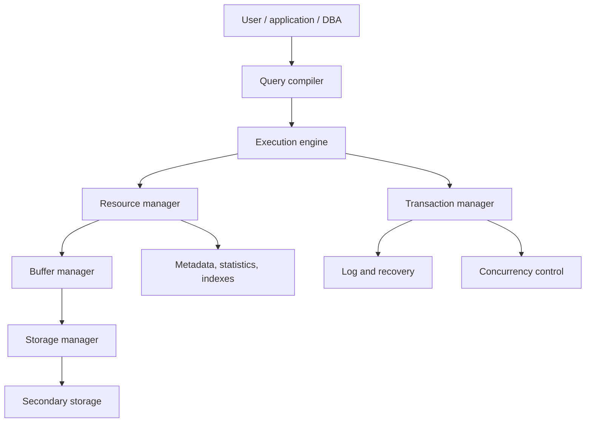
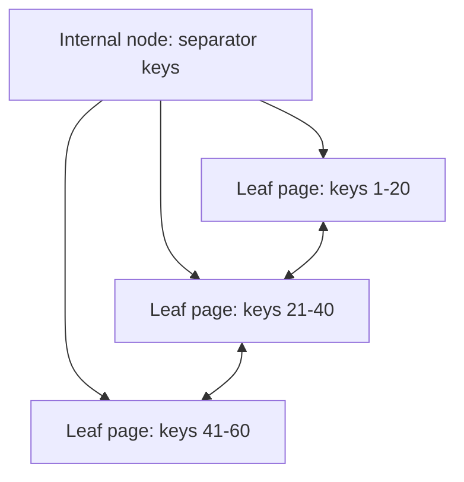
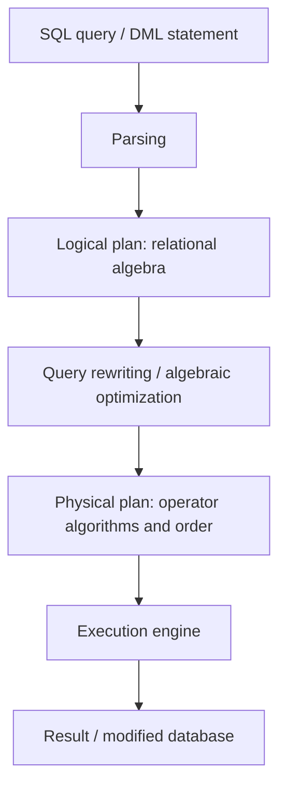
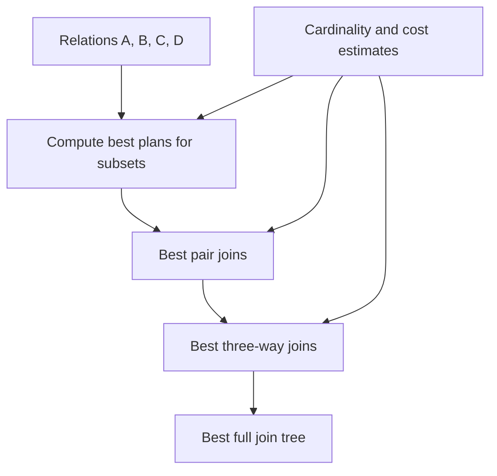
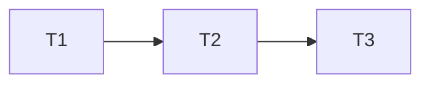
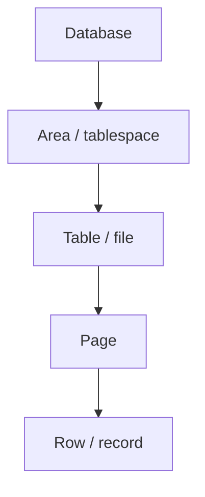

# 21. Databases: Optimization and Concurrency Control

This subject covers DBMS storage, indexes, physical operators, query optimization, transactions, recovery, serializability, and locking. It also includes data storage and buffer replacement, static versus dynamic hashing, and hierarchical/intention/tree locking protocols.

## 21.1 Data Storage and Buffer Management

Start with the purpose and components of a database management system. A **DBMS** is a program system for secure storage, fast querying, and modification of large amounts of data, usually by multiple users at the same time.

Database language activity is divided into:

| Language class                  | Purpose                                            |
| ------------------------------- | -------------------------------------------------- |
| DML, Data Manipulation Language | Query and modify data.                             |
| DDL, Data Definition Language   | Create or modify database structures and metadata. |

### DBMS Components

The architecture figure is represented as:



| Component           | Role                                                                                                         |
| ------------------- | ------------------------------------------------------------------------------------------------------------ |
| Query compiler      | Parses and optimizes a query, then produces a query execution plan.                                          |
| Execution engine    | Executes the plan and sends requests for records/pages to lower managers.                                    |
| Resource manager    | Knows data files, record formats and sizes, and index files; translates logical requests into page requests. |
| Buffer manager      | Brings required disk pages into main-memory buffers and decides which pages stay in memory.                  |
| Storage manager     | Reads and writes secondary storage; may use OS commands or direct disk-manager commands.                     |
| Transaction manager | Executes transactions and provides logging, recovery, and concurrency control.                               |

### Secondary Storage, Blocks, Pages, Files, and Records

Storage details are included here because they are needed for understanding DBMS storage and buffer management.

| Concept                     | Meaning                                                                                                                  |
| --------------------------- | ------------------------------------------------------------------------------------------------------------------------ |
| Secondary storage           | Persistent storage, traditionally disks or SSDs, where the database normally resides.                                    |
| Page / block                | Fixed-size unit of transfer between disk and memory. Database texts often use "page" and "block" nearly interchangeably. |
| Buffer frame                | A page-sized region in main memory that can hold a copy of one disk page.                                                |
| File                        | A collection of pages containing records of a relation, index pages, metadata, or log pages.                             |
| Record / tuple              | A row stored inside a page. Records may be fixed-length or variable-length.                                              |
| Page directory / slot table | Metadata that helps find records inside a page, especially when records are variable length or can be moved.             |

The main cost model is usually **number of disk page reads/writes**, because reading one tuple normally requires reading its whole page. If the page is already in the buffer pool, access is much cheaper.

### Buffer Manager Operation

The buffer manager partitions available memory into buffer frames. When an operator needs page `P`:

1. If `P` is already in the buffer pool, it is used directly.
2. Otherwise, the buffer manager chooses a free frame or evicts an unpinned page.
3. If the evicted page is dirty, it must be written back before replacement.
4. The requested page is read into the frame.
5. The page is pinned while in use so it cannot be evicted.
6. When the operator is finished, the page is unpinned; if it was modified, it is marked dirty.

The buffer manager handles more than base data:

| Page type        | Why it is buffered               |
| ---------------- | -------------------------------- |
| Data pages       | Store table rows.                |
| Metadata pages   | Store schema and constraints.    |
| Log pages        | Support recovery and durability. |
| Statistics pages | Support optimization decisions.  |
| Index pages      | Support efficient access paths.  |

### Page Replacement Algorithms

When no free frame exists, a replacement policy chooses an unpinned victim.

| Policy | Idea                                                                                   | Strength / weakness                                                                |
| ------ | -------------------------------------------------------------------------------------- | ---------------------------------------------------------------------------------- |
| LRU    | Evict the least recently used unpinned page.                                           | Simple and intuitive; can perform poorly on scans that flood the cache.            |
| Clock  | Approximation of LRU using reference bits and a clock hand.                            | Lower overhead than exact LRU.                                                     |
| MRU    | Evict most recently used page.                                                         | Can help in some sequential or nested-loop patterns, but is not a general default. |
| LRU-K  | Use the time of the K-th most recent reference to distinguish frequently reused pages. | Better estimates reuse, with more metadata.                                        |

The key correctness rule is that pinned pages cannot be evicted.

### File Organization

| Organization           | Meaning                                                    | Search cost                                                        | Insert/delete behavior                                                                  |
| ---------------------- | ---------------------------------------------------------- | ------------------------------------------------------------------ | --------------------------------------------------------------------------------------- |
| Heap / unsorted file   | Records are placed wherever there is space.                | Search usually scans pages unless an index exists.                 | Insert is easy; deletion may leave free slots.                                          |
| Sorted file            | Records are physically ordered by a search key.            | Binary search or range scans can be efficient on the ordering key. | Insert/delete may require shifting records, overflow pages, or periodic reorganization. |
| Clustered organization | Records with similar key values are stored close together. | Helps range queries and non-key indexes with many matching rows.   | Maintaining clustering can be expensive.                                                |

### What to Emphasize in an Oral Answer

- Define the DBMS goal: secure storage, querying, and modification of large persistent data for multiple users.
- Place storage/buffer management inside the DBMS architecture: compiler, execution engine, resource manager, buffer manager, storage manager, and transaction manager.
- State the cost model: disk I/O is counted in page/block reads and writes, because records are accessed through pages.
- Explain the buffer pool: page-sized frames, buffer hits, reading missing pages, pinning while in use, dirty bits, and writing dirty victims before eviction.
- Mention that data, metadata, log, statistics, and index pages all pass through buffering.
- Compare replacement policies: LRU, Clock as an approximation, MRU for special scan patterns, and LRU-K using repeated-reference history.
- Compare file organization: heap files are easy to insert but scan-heavy; sorted files support ordered search/ranges but make updates harder; clustered organization helps locality but costs maintenance.

::: details Suggested answer

A DBMS stores persistent data on secondary storage but must bring pages into memory to process queries. The query compiler parses and optimizes a query; the execution engine runs the plan; the resource manager knows files, record formats, and indexes; the buffer manager brings pages into memory; the storage manager reads and writes disk; and the transaction manager handles recovery and concurrency.

The unit of disk transfer is normally a page or block. A file is a collection of pages, and pages contain records. Because reading one tuple requires bringing its page into memory, the main cost model for query execution is the number of page reads and writes.

The buffer manager maintains a buffer pool of page-sized frames. If a requested page is already in memory, it can be used immediately. Otherwise the buffer manager reads it from disk, possibly evicting an unpinned page. Dirty pages must be written back before eviction, and pinned pages cannot be evicted. Replacement policies such as LRU, Clock, MRU, and LRU-K decide which unpinned page to remove.

Files may be heap-organized or sorted. Heap files make insertion easy but usually require scans without indexes. Sorted files make search and range access efficient on the ordering key, but insertion and deletion are more expensive and may require overflow pages or reorganization.

:::

## 21.2 Indexes: Hashing, B+ Trees, and Bitmap Indexes

indexes is auxiliary structures that speed up searches. Index records have the form `(a, p)`, where `a` is a value in the indexed column and `p` is a block pointer to the block where a matching record is stored. The index itself must also be maintained, so indexes speed reads at the cost of extra storage and slower writes.

### Primary and Secondary Indexes

| Index type      | Main file order                                          | Density                                          | Main facts                                                                                 |
| --------------- | -------------------------------------------------------- | ------------------------------------------------ | ------------------------------------------------------------------------------------------ |
| Primary index   | Main file is sorted by the index field.                  | Usually sparse: one index record per data block. | Only one primary index can exist because the file can be sorted in only one primary order. |
| Secondary index | Main file is unordered or not sorted by the index field. | Usually dense: one index record per record.      | Many secondary indexes can exist, but search may touch more data pages.                    |

With a primary index, search uses the largest index value less than or equal to the target, then reads the pointed data block. With a secondary index, the index may identify exact record pointers, but many pointers may point to different pages.

### Bitmap Indexes

A bitmap index is useful for low-cardinality columns or analytic workloads. For a value $v$, the bitmap has bit $i=1$ if row $i$ has value $v$, otherwise $0$.

Example:

| Row | Color |
| --- | ----- |
| 1   | red   |
| 2   | blue  |
| 3   | red   |
| 4   | green |

Bitmap for `red`:

```text
1010
```

Queries combine bitmaps with logical operations:

| Predicate                      | Bitmap operation     |
| ------------------------------ | -------------------- |
| `color = red AND size = large` | AND the two bitmaps. |
| `color = red OR color = blue`  | OR the two bitmaps.  |

Run-length compression is often effective because real bitmap indexes can contain long runs of zeros or ones.

### Multilevel Indexes

An index file is itself a sorted file, so it can be indexed. A level-`t` index means several index levels point downward until the data file is reached. If the top level fits in one block, search needs roughly $t + 1$ block reads. This is why multilevel indexes are faster than binary searching a large flat sorted file.

### B-Trees, B+ Trees, and B\* Trees

Describe tree-structured indexes through B-trees and B+ trees.

| Structure | Meaning                                                                                                                                                                           |
| --------- | --------------------------------------------------------------------------------------------------------------------------------------------------------------------------------- |
| B-tree    | Balanced multiway search tree; nodes contain multiple keys and child pointers.                                                                                                    |
| B+ tree   | Data-file addresses or record pointers are kept at the leaf level; internal nodes guide search. Leaves are linked for sequential/range access. Nodes are at least about 50% full. |
| B\* tree  | Variant with higher minimum occupancy, about 66%, usually by redistributing before splitting.                                                                                     |

Why B+ trees are central:

- all root-to-leaf paths have the same length;
- high fanout keeps height small;
- internal nodes are small routing tables;
- leaf links support range scans;
- insertion/deletion maintain balance through splitting, merging, or redistribution.



### Hash Indexes: Static and Dynamic

Describe hash indexes as partitioning records into buckets by a hash function on the index field. Hashing is excellent for equality search but not for range search.

| Hashing type    | Bucket structure                                                                                              | Main tradeoff                                                                                |
| --------------- | ------------------------------------------------------------------------------------------------------------- | -------------------------------------------------------------------------------------------- |
| Static hashing  | Number of buckets $K$ is fixed. $h(x)$ maps keys into $1,\ldots,K$.                                           | Simple; performance degrades if data grows or distribution changes because buckets overflow. |
| Dynamic hashing | Directory or bucket structure can grow and split as data grows, such as extendible hashing or linear hashing. | More complex; avoids long overflow chains by adapting bucket count.                          |

For static hashing, if data is uniformly distributed, each bucket has about $B/K$ blocks and equality search is accelerated by a factor near $K$. If $K$ is too large, many buckets may be mostly empty; if too small, overflow chains become long.

### Index Selection Tradeoff

Indexes are not free.

| Benefit                                                            | Cost                                                                                   |
| ------------------------------------------------------------------ | -------------------------------------------------------------------------------------- |
| Faster equality search, range search, joins, and query predicates. | Extra storage, extra reads/writes on insert/delete/update, and maintenance complexity. |

An index is most useful when:

- queries often filter or join on the indexed field;
- the indexed field is a key or almost a key;
- matching tuples are clustered into few pages;
- the workload has many reads compared with writes.

### What to Emphasize in an Oral Answer

- Define an index as an auxiliary access path of key/value entries plus pointers, and state the read/write tradeoff.
- Distinguish primary and secondary indexes: primary follows the main file order and is often sparse; secondary is independent of file order and is often dense.
- Explain multilevel indexes: index pages are themselves indexed, so search follows a short path of pages instead of scanning a large flat index.
- Present B+ trees as the central ordered dynamic index: balanced, high fanout, internal routing keys, data pointers at linked leaves, efficient equality/range access, and higher B\* occupancy as a variant.
- Explain hash indexes: static hashing is simple but can overflow as data grows; dynamic hashing splits/grows buckets to avoid long chains.
- State the key distinction: hash indexes are good for equality predicates, B+ trees are good for equality and range predicates.
- Explain bitmap indexes for low-cardinality/analytic columns, using AND/OR operations and compression.
- Mention index selection factors: selectivity, clustering, joins/predicates, storage overhead, and modification cost.

::: details Suggested answer

An index is an auxiliary access structure that helps find records without scanning an entire relation. A primary index is built on the field by which the main file is sorted, so it is usually sparse: one index entry per data block is enough. A secondary index is built on a field that does not determine the physical order, so it is usually dense and has an entry for each record or value occurrence.

Multilevel indexes index the index itself, reducing search to following a short path of index pages. B+ trees are the most important dynamic ordered indexes. They are balanced, have high fanout, store routing keys in internal nodes, keep data pointers at the leaves, and link leaves for range scans. They support equality and range queries while keeping search, insertion, and deletion logarithmic.

Hash indexes partition records into buckets by a hash function. Static hashing fixes the number of buckets, which is simple but vulnerable to overflow chains as data grows. Dynamic hashing lets bucket structure grow by splitting buckets, which costs more metadata but keeps equality search efficient. Hash indexes are good for equality predicates and poor for range predicates.

Bitmap indexes represent value membership as bit vectors. They are especially useful for low-cardinality columns and analytic queries because predicates can be evaluated by ANDing and ORing bitmaps. Every index speeds some reads but slows modifications, so index choice depends on workload.

:::

## 21.3 Physical Operators: Costs, Output Size, and Joins

query execution is the algorithms that manipulate the database after compilation. Physical operator choice matters because different algorithms for the same relational algebra operator can have very different page costs.

### Cost Model

The simplest useful cost model counts:

- page reads;
- page writes;
- sorting cost;
- index traversal cost;
- memory buffer requirements;
- size of intermediate results.

CPU cost can matter, but for classical DBMS query optimization, I/O page cost is usually dominant.

### Output-Size Estimation

Output-size estimation follows directly from query optimization.

Optimizers estimate cardinality using statistics:

| Statistic                          | Use                                                    |
| ---------------------------------- | ------------------------------------------------------ |
| Number of tuples $T(R)$            | Base size of relation.                                 |
| Number of pages $B(R)$             | I/O cost estimate.                                     |
| Number of distinct values $V(R,A)$ | Selectivity estimates for predicates on attribute $A$. |
| Histograms                         | Better estimates for skewed values and ranges.         |
| Min/max values                     | Range predicate estimation.                            |

Typical simplified estimates:

| Operation                             | Rough estimate                                                           |
| ------------------------------------- | ------------------------------------------------------------------------ |
| Equality selection $A = c$            | $T(R) / V(R,A)$ if values are uniform.                                   |
| Range selection                       | Fraction of range times $T(R)$, adjusted by histogram if available.      |
| Join $R.A = S.B$                      | Approximately $T(R) \cdot T(S) / \max(V(R,A), V(S,B))$ under uniformity. |
| Projection with duplicate elimination | At most $T(R)$, often estimated by distinct-value statistics.            |

Bad estimates can produce bad plans, especially when joins create large intermediate results.

### Selection

The list includes these selection implementations:

| Method          | When usable                             | Cost idea                                                                                                                            |
| --------------- | --------------------------------------- | ------------------------------------------------------------------------------------------------------------------------------------ |
| Linear search   | Always usable.                          | Read all pages; if equality on key and no index, average can be about half a file scan if search stops after finding the unique row. |
| Binary search   | Field is sorted.                        | Logarithmic page search plus matching pages.                                                                                         |
| Primary index   | Predicate uses primary indexed field.   | Traverse sparse/primary index, then read target block(s).                                                                            |
| Secondary index | Predicate uses secondary indexed field. | Traverse dense/secondary index, then fetch matching records/pages.                                                                   |

Composite selection:

| Predicate                              | Implementation                                                                                                                                 |
| -------------------------------------- | ---------------------------------------------------------------------------------------------------------------------------------------------- |
| $\theta_1 \land \cdots \land \theta_n$ | Choose the cheapest simple selection first, then filter by remaining conditions; or intersect row-id sets if all relevant fields have indexes. |
| $\theta_1 \lor \cdots \lor \theta_n$   | Linear scan, or union row-id sets if all relevant fields have indexes.                                                                         |

### Projection and Set Operations

Projection and set operations may need duplicate elimination.

Projection implementation:

1. Scan input and discard unnecessary attributes.
2. Sort the result by all remaining fields.
3. Remove adjacent duplicates.

The cost is the initial scan plus sorting and duplicate elimination. Hash-based duplicate elimination is also common, but Emphasize sorting.

### Join Algorithms

Also cover three join families.

| Join                   | Algorithm                                                                                          | Cost intuition                                                                         |
| ---------------------- | -------------------------------------------------------------------------------------------------- | -------------------------------------------------------------------------------------- |
| Tuple nested-loop join | For each tuple of outer relation, scan inner relation.                                             | Very expensive if inner relation cannot stay in memory.                                |
| Block nested-loop join | Read a block group of outer relation into memory, build a search structure, scan inner pages.      | Better than tuple nested-loop because it amortizes inner scans over many outer tuples. |
| Merge join             | Sort both inputs by join keys, then scan and merge matching groups.                                | Good if inputs are already sorted or sorting is not too costly.                        |
| Hash join              | Partition both inputs on join key; join corresponding buckets, often with an in-memory hash table. | Good for equality joins when buckets fit in memory.                                    |

For multi-table joins, join order is often more important than the local join algorithm. A poor join order can produce huge intermediate relations.

### What to Emphasize in an Oral Answer

- Define physical operators as concrete implementations of logical relational algebra operators.
- State the cost model: page reads/writes, sorting, index traversal, buffer needs, and intermediate result size.
- Explain cardinality estimation using tuple counts, page counts, distinct-value counts, histograms, min/max values, and formulas such as equality selection or join-size estimates under uniformity.
- Compare selection methods: linear scan, binary search on sorted fields, primary index, and secondary index; mention AND via cheapest predicate or RID intersection, OR via scan or RID union.
- Explain projection with duplicate elimination: discard columns, sort or hash on remaining fields, then remove duplicates.
- Compare join algorithms: tuple nested-loop, block nested-loop, merge join, and hash join, with when each is attractive.
- Emphasize that multi-join order can matter more than the local join algorithm because bad intermediate sizes dominate page I/O.

::: details Suggested answer

Physical operators are concrete algorithms for relational algebra operations. Their cost is usually estimated in page reads and writes, because disk or buffer I/O dominates. Optimizers also estimate output sizes using statistics such as relation cardinality, page count, distinct values, histograms, and min/max values.

Selection can be implemented by a linear scan, binary search on a sorted field, a primary index, or a secondary index. For conjunctive predicates, the optimizer often chooses the cheapest condition first and then filters by the rest, or intersects row-id sets when indexes exist. For disjunctions, it can scan or union indexed row-id sets.

Projection first discards unneeded fields and then removes duplicates, commonly by sorting. Joins have several physical implementations. Tuple nested-loop join is simple but can be very expensive. Block nested-loop join reads blocks of the outer relation and scans the inner relation for each block group. Merge join sorts both inputs on the join attributes and scans them in order. Hash join partitions both inputs by hash value and joins matching buckets.

The main optimization problem is choosing algorithms and join order so that intermediate results stay small and page I/O is minimized.

:::

## 21.4 Optimization: Equivalences, Rule-Based Rewriting, and Multi-Table Queries

The **query processor** is the DBMS subsystem that translates user queries and data modification statements into database operations and executes them.

### Query Compilation

The query-processing and query-compilation images are represented as:



Compilation steps:

1. **Parsing:** build a parse tree that describes query structure.
2. **Query rewriting:** transform the parsed query into an equivalent logical plan expected to be cheaper.
3. **Physical planning:** choose concrete algorithms, access paths, sort decisions, and operator order.

### Algebraic Equivalence Rules

Describe algebraic optimization as applying equivalent transformations so that intermediate relations are expected to be smaller.

Important equivalences and heuristics:

| Rule                                                                            | Why it helps                                                 |
| ------------------------------------------------------------------------------- | ------------------------------------------------------------ |
| Selection cascade: split $\sigma(A \land B)$ into $\sigma(A)$ then $\sigma(B)$. | Lets selections move independently.                          |
| Selection pushdown                                                              | Apply filters as early as possible to reduce tuple counts.   |
| Projection pushdown                                                             | Drop unused attributes early to reduce tuple width.          |
| Join from product + selection                                                   | Replace $\sigma(\bowtie-condition)(R \times S)$ with a join. |
| Join commutativity and associativity                                            | Reorder joins to reduce intermediate results.                |
| Combine consecutive selections/projections                                      | Avoid unnecessary operator layers.                           |
| Common subexpression reuse                                                      | Compute shared subplans once.                                |

Emphasize that this is often heuristic: the result is equivalent, and usually better, but not guaranteed unique because rule order matters.

### Rule-Based Optimization

Rule-based optimization applies transformations without fully enumerating all costs. Typical rule-based principles:

- perform selections as early as possible;
- turn selection after product into joins;
- merge unary operations;
- project away unused attributes;
- reuse common subexpressions.

Rule-based optimization is fast and conceptually simple, but it can miss cases where a locally attractive rule creates a globally worse plan. Cost-based optimization improves on this by using statistics and estimated operator costs.

### Multi-Table Query Optimization

joins are commutative and associative, so the result does not depend on join order, but efficiency can depend heavily on it.

For a set $S$ of relations, one dynamic-programming approach is:

1. Consider plans of the form $S_1 \bowtie (S - S_1)$ for every nonempty subset $S_1$.
2. Recursively compute cheapest plans for subsets.
3. Store best plans for subsets and reuse them.
4. Choose the cheapest full plan.



This is more expensive than simple rules, but it avoids recomputing the same subset plans and is the basis for many join-order optimizers.

### What to Emphasize in an Oral Answer

- Define query optimization as translating SQL/DML into an efficient logical and physical execution plan.
- Mention compilation stages: parse, logical relational-algebra plan, algebraic rewrites, physical operator/access-path choice, and execution.
- State important equivalence rules: push selections, push projections, combine adjacent selections/projections, replace product plus selection with join, remove unused attributes, and avoid repeated common subexpressions.
- Explain why these rules help: they reduce tuple counts, tuple width, and intermediate results before expensive operations.
- Contrast rule-based and cost-based optimization: heuristics are fast but blind to statistics; cost-based optimization uses cardinality and I/O estimates.
- For multi-table queries, mention join associativity/commutativity, many possible join trees, and dynamic programming over relation subsets.
- Include the important distinction that equivalent logical plans may have very different physical costs.

::: details Suggested answer

Query optimization converts a high-level query into an efficient execution plan. First the query is parsed. Then it is rewritten into a logical relational algebra plan. Finally, the DBMS chooses physical operators, access paths, and operator order.

Algebraic optimization uses equivalence rules. Selections should be pushed down because they reduce the number of tuples early. Projections should be pushed down because they reduce tuple width. A selection over a Cartesian product should become a join. Consecutive selections or projections can be merged, and common subexpressions should be computed once. These rules preserve the result but usually reduce intermediate relation sizes.

Rule-based optimization applies such rules heuristically. It is fast but may miss the best plan. Cost-based optimization estimates cardinalities and operation costs, then chooses the cheapest plan. Multi-table joins are especially important because joins are associative and commutative, so many join trees are possible. A dynamic-programming optimizer computes cheapest plans for smaller subsets and reuses them to choose the cheapest full join tree.

:::

## 21.5 Logging, Recovery, and Failure Types

A **consistent database** is a database satisfying all specified constraints. A **transaction** is a sequence of database operations that preserves consistency when run alone.

Consistency may be violated by:

| Failure type         | Meaning                                                                    |
| -------------------- | -------------------------------------------------------------------------- |
| Transaction failure  | Incorrectly written, badly scheduled, aborted, or interrupted transaction. |
| DBMS failure         | A DBMS component fails or performs incorrectly.                            |
| Hardware failure     | Stored data is lost or corrupted.                                          |
| Data-sharing failure | Concurrent access creates inconsistency.                                   |

### ACID

| Property    | Meaning                                                    |
| ----------- | ---------------------------------------------------------- |
| Atomicity   | All-or-nothing execution.                                  |
| Consistency | A transaction preserves database constraints.              |
| Isolation   | Concurrent transactions appear to run without interfering. |
| Durability  | Once a transaction commits, its effects are not lost.      |

consistency is treated as a property of correct transactions and constraints; the DBMS mainly enforces atomicity, isolation, and durability.

### Transaction Data Movement

Distinguish three places:

1. Disk blocks containing database elements.
2. Buffer-manager memory area.
3. Transaction local memory area.

Basic operations:

| Operation           | Meaning                                                                                          |
| ------------------- | ------------------------------------------------------------------------------------------------ |
| $\text{INPUT}(X)$   | Copy disk block containing database element $X$ into a buffer.                                   |
| $\text{READ}(X,t)$  | Copy $X$ from buffer into transaction variable $t$; includes $\text{INPUT}$ if needed.           |
| $\text{WRITE}(X,t)$ | Copy transaction variable $t$ into the buffer containing $X$; includes $\text{INPUT}$ if needed. |
| $\text{OUTPUT}(X)$  | Write the block containing $X$ from buffer to disk.                                              |

The buffer manager decides when dirty buffers are written to disk, so logging is needed to recover correctly after failure. The common discipline is **write-ahead logging**: the necessary log information must reach stable storage before the corresponding database page update is allowed to reach stable storage.

### Log Records

The log is append-only and records important transaction events.

| Log record                                       | Meaning                                              |
| ------------------------------------------------ | ---------------------------------------------------- |
| $\langle \text{START } T\rangle$                 | Transaction $T$ begins.                              |
| $\langle \text{COMMIT } T\rangle$                | Transaction $T$ completed normally.                  |
| $\langle \text{ABORT } T\rangle$                 | Transaction $T$ aborted.                             |
| $\langle T, X, v\rangle$ in undo logging         | $T$ changed $X$; old value was $v$.                  |
| $\langle T, X, v\rangle$ in redo logging         | $T$ changed $X$ to new value $v$.                    |
| $\langle T, X, v, w\rangle$ in undo/redo logging | $T$ changed $X$ from old value $v$ to new value $w$. |

### Undo Logging

Undo logging rolls back incomplete transactions.

Rules:

1. If $T$ modifies $X$, the log record $\langle T, X, \text{old-value}\rangle$ must reach disk before the new value of $X$ reaches disk.
2. $\langle \text{COMMIT } T\rangle$ may reach disk only after all modifications of $T$ have reached disk.

Recovery without checkpoint:

1. Scan log backward.
2. If $\langle T, X, v\rangle$ is found and $T$ has no commit record, restore $X$ to $v$.
3. Write $\langle \text{ABORT } T\rangle$ for incomplete transactions and force the log to disk.

### Checkpointing for Undo Logging

Simple checkpoint:

1. Stop new transactions.
2. Wait for active transactions to finish and write commit/abort records.
3. Force the log to disk.
4. Write $\langle \text{CKPT}\rangle$ and force it.
5. Resume new transactions.

Because simple checkpointing stops the system, DBMSs also use checkpointing while running:

1. Write $\langle \text{START CKPT}(T_1,\ldots,T_k)\rangle$ for active transactions and force the log.
2. Let those transactions finish while new transactions may start.
3. When the original active transactions finish, write $\langle \text{END CKPT}\rangle$ and force it.

Recovery only needs to scan far enough back to cover transactions active at the checkpoint.

### Redo Logging

Redo logging repeats committed changes that may not have reached disk.

Differences from undo:

| Undo logging                                     | Redo logging                                     |
| ------------------------------------------------ | ------------------------------------------------ |
| Stores old values.                               | Stores new values.                               |
| Undoes incomplete transactions.                  | Redoes completed transactions.                   |
| Data pages must reach disk before commit record. | Commit record must reach disk before data pages. |

Redo rule:

Before modifying $X$ on disk, both $\langle T, X, \text{new-value}\rangle$ and $\langle \text{COMMIT } T\rangle$ must be on disk. This is another form of the write-ahead logging rule.

Recovery:

1. Find committed transactions.
2. Scan forward through the log.
3. Redo modifications of committed transactions.
4. Ignore incomplete transactions and write abort records for them.

Redo checkpointing writes completed dirty data pages and records checkpoint boundaries so recovery can avoid scanning the whole log.

### Undo/Redo Logging

Undo/redo logging stores both old and new values in $\langle T, X, v, w\rangle$.

Rule:

- Before modifying $X$ on disk, the corresponding undo/redo log record must be on disk.

$\langle \text{COMMIT } T\rangle$ may be written before or after data pages, because recovery has enough information to both undo incomplete and redo complete transactions.

Recovery principles:

1. Redo completed transactions from earliest to latest.
2. Undo incomplete transactions from latest to earliest.

Checkpointing for undo/redo writes $\langle \text{START CKPT}(T_1,\ldots,T_k)\rangle$, flushes dirty buffers, then writes $\langle \text{END CKPT}\rangle$.

### What to Emphasize in an Oral Answer

- Frame recovery around failures and ACID: logging mainly protects atomicity and durability after transaction, DBMS, hardware, or data-sharing failures.
- Mention the data movement layers: disk page, buffer page, and transaction local variable; `READ`/`WRITE` differ from `INPUT`/`OUTPUT`.
- State write-ahead logging: required log information must reach stable storage before the corresponding database page is written.
- Explain log record types: start, commit, abort, and update records with old values, new values, or both depending on the logging scheme.
- For undo logging, say old values are logged before dirty pages reach disk, commit follows flushed data pages, and recovery undoes incomplete transactions backward.
- For redo logging, say new values and commit are forced before data pages reach disk, and recovery redoes committed transactions forward.
- For undo/redo logging, say both old and new values are stored, enabling redo of committed and undo of incomplete transactions.
- Include checkpoints as recovery acceleration: they record active transactions and limit how far the log scan must go.

::: details Suggested answer

Logging and recovery protect atomicity and durability. A transaction should be all-or-nothing, and committed changes must survive failures. The log is an append-only history of important events such as start, commit, abort, and updates.

Failures may come from an aborted or interrupted transaction, a DBMS crash, hardware loss or corruption, or bad concurrent data sharing. The reason logging is necessary is that data moves through several places: disk pages, buffer pages, and transaction local variables. A `WRITE` may update only the buffer, while `OUTPUT` writes a dirty page to disk. Write-ahead logging requires the necessary log information to reach stable storage before the corresponding database page update is allowed to reach disk.

Undo logging stores old values. Before a changed page reaches disk, the old value must already be on disk in the log. Also, a commit record is written only after the transaction's changed pages reach disk. After a crash, incomplete transactions are undone by scanning the log backward and restoring old values.

Redo logging stores new values. A committed transaction's log records and commit record must be forced to disk before its data pages are written. After a crash, committed transactions are redone by scanning forward, while incomplete transactions are ignored.

Undo/redo logging stores both old and new values. It only requires the update log record to reach disk before the data page. Recovery can redo all committed transactions and undo all incomplete transactions. Checkpoints reduce recovery work by recording which transactions were active and by forcing log and dirty-page information so recovery does not need to scan the whole log.

:::

## 21.6 Concurrency Control: Schedules, Serializability, and Precedence Graphs

The concurrency-control problem directly: transactions may individually preserve consistency, and the system may not fail, but interleaving their operations can still produce an inconsistent result. The scheduler controls the order of transaction steps.

The correctness principle:

- If every transaction run alone preserves consistency, then concurrent execution should have the same effect as some serial execution.

### Schedules

| Concept               | Meaning                                                                                                                                        |
| --------------------- | ---------------------------------------------------------------------------------------------------------------------------------------------- |
| Schedule              | Chronological sequence of essential operations of one or more transactions. For serializability, usually only reads and writes are considered. |
| Serial schedule       | Transactions do not interleave; one completes before another starts.                                                                           |
| Serializable schedule | Has the same effect as some serial schedule, independently of the initial state.                                                               |

Notation:

| Notation | Meaning                                        |
| -------- | ---------------------------------------------- |
| $r_i(X)$ | Transaction $T_i$ reads database element $X$.  |
| $w_i(X)$ | Transaction $T_i$ writes database element $X$. |

### Conflicts

Two operations conflict if swapping their order could change behavior.

Operations of different transactions **do not conflict** when:

- both are reads, even of the same item;
- they access different database elements.

Operations of different transactions **do conflict** when:

- they access the same database element, and
- at least one operation is a write.

Operations inside the same transaction are also treated as non-swappable because transaction order must be preserved.

### Conflict Equivalence and Conflict Serializability

| Concept                        | Meaning                                                                               |
| ------------------------------ | ------------------------------------------------------------------------------------- |
| Conflict-equivalent schedules  | One can be transformed into the other by swapping adjacent nonconflicting operations. |
| Conflict-serializable schedule | Conflict-equivalent to some serial schedule.                                          |

Conflict serializability is sufficient but not necessary for true serializability. Commercial systems usually target conflict serializability because it is checkable and enforceable.

### Precedence Graph

The precedence graph has:

- one node for each transaction;
- an edge $T_i \to T_j$ if an operation of $T_i$ precedes and conflicts with an operation of $T_j$.



Rule:

| Graph property            | Schedule property                                                              |
| ------------------------- | ------------------------------------------------------------------------------ |
| Acyclic precedence graph  | Conflict-serializable; any topological order gives an equivalent serial order. |
| Cycle in precedence graph | Not conflict-serializable.                                                     |

### What to Emphasize in an Oral Answer

- Define the problem: individually correct transactions can still violate consistency when their reads and writes are interleaved.
- State the correctness target: the concurrent schedule should have the same effect as some serial schedule.
- Define schedule, serial schedule, serializable schedule, and the notation $r_i(X)$ and $w_i(X)$.
- Define conflicts precisely: different transactions, same database element, and at least one write; read-read and different-element operations do not conflict.
- Explain conflict equivalence through swapping adjacent nonconflicting operations.
- State that conflict serializability is sufficient but not necessary for true serializability, yet it is practical because it is checkable/enforceable.
- Explain the precedence graph: nodes are transactions, edges follow conflicting operation order, acyclic means conflict-serializable, and a topological order gives the equivalent serial order.

::: details Suggested answer

Concurrency control is needed because individually correct transactions can interact badly when their reads and writes are interleaved. The goal is to make the result equivalent to some serial execution, while still allowing parallelism.

A schedule is the chronological order of the important operations of transactions, usually reads and writes. A serial schedule runs one transaction completely before another. A serializable schedule has the same effect as some serial schedule. Conflict serializability is the practical version: two schedules are conflict-equivalent if one can be obtained from the other by swapping adjacent nonconflicting operations.

Two operations from different transactions conflict when they access the same database element and at least one is a write. Reads with reads do not conflict, and operations on different elements do not conflict. The precedence graph captures these constraints: nodes are transactions, and an edge from $T_i$ to $T_j$ means $T_i$ has a conflicting operation before $T_j$. A schedule is conflict-serializable exactly when this graph is acyclic. A topological ordering of the graph gives the equivalent serial order.

:::

## 21.7 Locks, Deadlocks, Hierarchical Locks, and Tree Protocols

Locks are a mechanism for enforcing conflict serializability. Transactions request and release locks before reading or writing database elements.

Two correctness requirements:

| Requirement             | Meaning                                                                                               |
| ----------------------- | ----------------------------------------------------------------------------------------------------- |
| Transaction consistency | A transaction may read/write an element only after locking it, and every lock must later be released. |
| Legality of schedules   | The scheduler grants locks only when doing so respects lock compatibility.                            |

Notation:

| Notation | Meaning                                        |
| -------- | ---------------------------------------------- |
| $l_i(X)$ | Transaction $T_i$ requests/gets a lock on $X$. |
| $u_i(X)$ | Transaction $T_i$ releases its lock on $X$.    |

### Lock Scheduler and Lock Table

The lock scheduler grants a lock request only if the request is compatible with locks already held by other transactions. The lock table records, for each database element:

- current lock mode(s);
- holding transaction(s);
- waiting transaction(s);
- possibly conversion requests such as shared-to-exclusive upgrade.

### Shared and Exclusive Locks

| Lock mode       | Purpose                                                                               |
| --------------- | ------------------------------------------------------------------------------------- |
| Shared ($S$)    | Read lock. Several transactions may hold shared locks on the same element.            |
| Exclusive ($X$) | Write lock. Only one transaction may hold it, and it excludes shared locks by others. |

Compatibility matrix:

| Held by another transaction | Request $S$ | Request $X$ |
| --------------------------- | ----------- | ----------- |
| $S$                         | Yes         | No          |
| $X$                         | No          | No          |

### Two-Phase Locking

A transaction follows **two-phase locking** if all lock operations occur before all unlock operations.

| Phase           | Meaning                                                  |
| --------------- | -------------------------------------------------------- |
| Growing phase   | Transaction may acquire locks but not release them.      |
| Shrinking phase | Transaction may release locks but not acquire new locks. |

Every legal schedule of consistent 2PL transactions is conflict-serializable. However, 2PL does not prevent deadlocks.

### Deadlock and Wait-For Graph

deadlock is a situation where a transaction waits forever for a lock held by another transaction. A typical case is two transactions each holding a lock the other wants.


The topic explicitly requires a **wait-for graph**:

| Wait-for graph element | Meaning                                    |
| ---------------------- | ------------------------------------------ |
| Node                   | Transaction.                               |
| Edge $T_i \to T_j$     | $T_i$ is waiting for a lock held by $T_j$. |
| Cycle                  | Deadlock exists.                           |

Deadlock handling options:

- prevention by ordering resources or restricting lock acquisition;
- detection by periodically checking the wait-for graph and aborting a victim;
- timeout-based abort;
- avoidance if future lock needs are known, which is uncommon in DBMS workloads.

### Hierarchical Locks and Intention Locks

Hierarchical locks extend shared/exclusive locking to objects organized in a tree or containment hierarchy.

Databases have natural granularity levels:



Locking a coarse object, such as a whole table, implicitly affects its descendants. Locking a fine object, such as a row, must be visible to transactions that want coarse locks above it. **Intention locks** solve this by marking ancestors.

Common modes:

| Mode           | Meaning                                                                                                 |
| -------------- | ------------------------------------------------------------------------------------------------------- |
| $\mathrm{IS}$  | Intention shared: transaction intends to acquire shared locks below this node.                          |
| $\mathrm{IX}$  | Intention exclusive: transaction intends to acquire exclusive locks below this node.                    |
| $S$            | Shared lock on this node and, implicitly, its descendants for reading.                                  |
| $\mathrm{SIX}$ | Shared on this node plus intention exclusive below; read the whole subtree and update some descendants. |
| $X$            | Exclusive lock on this node and descendants.                                                            |

Simplified compatibility matrix:

| Held \ Requested | IS  | IX  | S   | SIX | X   |
| ---------------- | --- | --- | --- | --- | --- |
| IS               | Yes | Yes | Yes | Yes | No  |
| IX               | Yes | Yes | No  | No  | No  |
| S                | Yes | No  | Yes | No  | No  |
| SIX              | Yes | No  | No  | No  | No  |
| X                | No  | No  | No  | No  | No  |

Protocol:

1. To lock a node in $S$, first acquire $\mathrm{IS}$ on all ancestors.
2. To lock a node in $X$, first acquire $\mathrm{IX}$ on all ancestors.
3. Release locks from lower levels upward, preserving two-phase behavior if required.

This supports mixed workloads: one transaction can lock a whole table for reading while another cannot quietly take a row-exclusive lock under it without making that intention visible at ancestors.

### Tree Protocol

The topic explicitly requires the tree protocol. It is a graph-based locking protocol over a tree of data items.

Rules:

1. Only exclusive locks are used in the simple tree protocol.
2. A transaction's first lock may be on any node.
3. After that, a transaction may lock a node only if it currently holds the lock on that node's parent.
4. A transaction may unlock nodes at any time.
5. Once a transaction has unlocked a node, it may not relock that node.

Properties:

| Property                                       | Meaning                                                                                                               |
| ---------------------------------------------- | --------------------------------------------------------------------------------------------------------------------- |
| Conflict-serializable                          | The access discipline imposes an order compatible with serial execution.                                              |
| Deadlock-free                                  | Transactions move downward in the tree and cannot create cyclic waits in the same way arbitrary lock acquisition can. |
| More concurrency than strict 2PL in some cases | Nodes can be released earlier.                                                                                        |
| Not automatically recoverable/cascadeless      | Extra discipline may be needed if recoverability is required.                                                         |

### What to Emphasize in an Oral Answer

- Define locks as a scheduler mechanism for legal conflicting access, with two requirements: transactions lock before accessing and unlock later, and the scheduler grants only compatible locks.
- Explain shared and exclusive locks with the compatibility matrix: shared/shared is allowed, any request against another transaction's exclusive lock is not.
- Define two-phase locking with growing and shrinking phases, and state its theorem: legal schedules of consistent 2PL transactions are conflict-serializable.
- Mention the limitation: 2PL can deadlock, so wait-for graph cycles, detection/recovery, prevention, or timeouts matter.
- Explain hierarchical locking as mixed granularity locking over database/table/page/row trees, with intention locks marking ancestors.
- Name intention modes and purpose: $\mathrm{IS}$, $\mathrm{IX}$, $S$, $\mathrm{SIX}$, and $X$, especially how row-level exclusive intentions block incompatible table-level locks.
- Explain the tree protocol rules: first exclusive lock anywhere, later lock only children while holding the parent, unlock anytime, and never relock an unlocked node.
- State tree protocol properties and tradeoffs: conflict-serializable and deadlock-free, but not automatically recoverable/cascadeless.

::: details Suggested answer

Locks enforce safe interleavings by making transactions request permission before accessing data. A shared lock is enough for reading and is compatible with other shared locks. An exclusive lock is required for writing and is incompatible with locks held by other transactions. The lock scheduler uses a lock table and a compatibility matrix to decide whether to grant or delay a request.

Two-phase locking requires every transaction to acquire all needed locks before releasing any lock. Its growing phase acquires locks, and its shrinking phase releases them. Legal schedules of consistent two-phase-locking transactions are conflict-serializable, but 2PL can deadlock. Deadlock is represented with a wait-for graph: if $T_1$ waits for a lock held by $T_2$, draw $T_1 \to T_2$. A cycle means deadlock, so the system must prevent it, detect it and abort a victim, or use timeouts.

Hierarchical locking handles different granularities such as database, table, page, and row. Intention locks mark ancestors to show that a transaction intends to lock descendants. $\mathrm{IS}$ means shared locks below, $\mathrm{IX}$ means exclusive locks below, $\mathrm{SIX}$ means shared on the node plus exclusive intentions below. This lets table-level and row-level locks coexist safely.

The tree protocol is another locking discipline. A transaction's first exclusive lock may be anywhere, but later it may lock a node only while holding the parent. Nodes may be unlocked early, and unlocked nodes cannot be relocked. This protocol is conflict-serializable and deadlock-free, though it does not by itself guarantee recoverability.

:::
