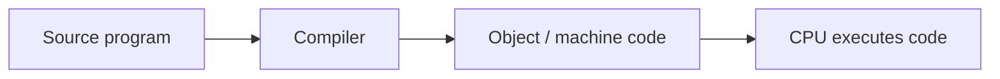
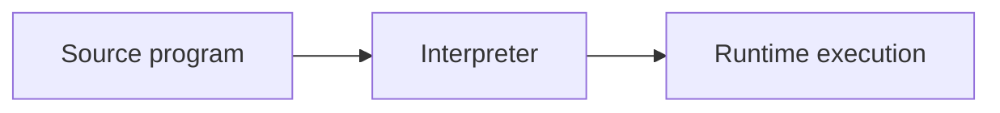
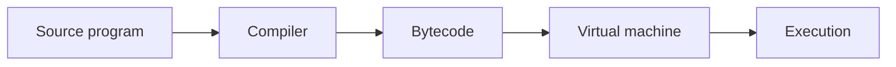

# 10. Fundamentals of Programming Languages

This subject covers programming-language rules, expression evaluation, type systems, storage models, subprograms, exceptions, and the compiler/control-structure background needed to connect them.

## 10.1 Rules of a Programming Language

A programming language is defined by several rule systems.

| Rule class | Meaning | Typical error |
| --- | --- | --- |
| Lexical rules | Define valid character sequences: identifiers, literals, keywords, operators, separators. | Illegal character sequence, malformed literal. |
| Syntactic rules | Define how tokens form phrases, expressions, statements, declarations, and programs. | Missing parenthesis, invalid statement form. |
| Semantic rules | Define meaning and context-sensitive constraints: type correctness, declarations, visibility, assignability. | Undeclared variable, type mismatch. |
| Pragmatics | Practical language-use conventions and implementation concerns: readability, style, libraries, idioms, performance expectations. | Code may be legal but inappropriate or non-idiomatic. |

Compiler construction commonly uses these rules as lexical analysis, syntax analysis, and semantic analysis stages.

### Compilation, Interpretation, and Bytecode

**Compilation.** During compilation, a high-level program is translated into machine code or another lower-level representation before execution. Lexical, syntactic, and semantic analysis run before the program is executed, and optimization can be performed. Compiled code is usually faster, and many errors are found early. The disadvantage is that generated machine code is platform-specific.



**Interpretation.** During interpretation, an interpreter executes the source program or an intermediate representation at run time. The interpreter must exist for the platform. This can improve portability and interactivity, but run-time execution is usually slower and some errors are detected later.



**Compilation and interpretation together.** Some languages translate source code to bytecode, then execute the bytecode on a virtual machine. Java is a standard example.



This combines compile-time checking with portability, because the bytecode is not direct machine code for one processor.

### Compilation Units and Linking

A compilation unit is the source unit from which one object file or compiled unit is produced. Object code may still contain unresolved references to functions, variables, classes, or modules defined elsewhere.

The linker resolves these references and creates executable code or a loadable unit.

| Linking kind | Meaning |
| --- | --- |
| Static linking | Referenced code is copied/resolved into the executable before running. |
| Dynamic linking | Referenced code is loaded and resolved at load time or run time, often from shared libraries such as DLLs/shared objects. |

Dynamic linking loads missing code at load time or run time, not at compile time.

### Compiler Components

The classic compiler pipeline:

```mermaid
flowchart LR
  Source["Source code"] --> Lex["Lexical analyzer"]
  Lex --> Tokens["Tokens"]
  Tokens --> Syn["Syntactic analyzer"]
  Syn --> Tree["Syntax tree"]
  Tree --> Sem["Semantic analyzer"]
  Sem --> IR["Checked representation"]
  IR --> Gen["Code generation"]
  Gen --> Obj["Object code"]
  Obj --> Opt["Optimization, if performed"]
```



**Lexical analyzer.** The lexical analyzer splits source code into tokens. A regular grammar or regular expressions describe valid token forms. Tokens may carry attributes, such as identifier name or literal value. If no token matches a character sequence, this is a lexical error. The longest-match rule says that if both a token and its prefix match, choose the longer one.

Common lexical elements:

| Element | Examples |
| --- | --- |
| Literals | `42`, `3.14`, `'x'`, `"hello"` |
| Identifiers | `count`, `maxValue` |
| Operators | `+`, `*`, `&&`, `:=` |
| Parentheses/separators | `(`, `)`, `{`, `}`, `,`, `;` |
| Keywords | `if`, `while`, `class`, `return` |

**Syntactic analyzer.** Receives tokens and builds a syntax tree according to a context-free grammar. If no valid tree can be built, it reports a syntactic error. LR(0), LR(1), shift/reduce actions, lookahead, and canonical item sets are compiler-construction details; the core point here is that syntax is checked structurally after lexical analysis.

**Semantic analyzer.** Performs context-sensitive checks such as declarations, visibility rules, type checking, arithmetic checks, and other constraints not captured by grammar alone. Attribute translation grammars, synthesized and inherited attributes, and symbol tables are common semantic-analysis tools. Symbol tables are often stack-structured by block: entering a block pushes a level, and lookup starts from the innermost level.

### Extra Compiler Notes

Code generation and optimization complete the translation pipeline:

- Code generation converts the checked program representation into object code.
- Local optimization transforms code inside a basic block where side effects and control flow are limited.
- Global optimization considers broader program regions but must preserve semantics.

### What to Emphasize in an Oral Answer

- Define the four language-rule layers: lexical tokens, syntactic structure, semantic/context-sensitive meaning, and pragmatics.
- Connect those rule layers to compiler stages: lexical analysis, syntax analysis, semantic analysis, code generation, and optimization.
- Contrast compilation and interpretation: before-execution translation/early checking/optimization versus runtime execution/portability/interactivity.
- Mention the mixed bytecode/virtual-machine model, with Java as the standard example.
- Explain compilation units and linking: object code may contain unresolved references that a linker resolves.
- Distinguish static and dynamic linking: static before running, dynamic at load time or runtime.
- Include symbol tables and scope lookup as semantic-analysis mechanisms if the answer needs more compiler detail.

::: details Suggested answer

A programming language is defined by lexical, syntactic, and semantic rules, plus pragmatics. Lexical rules define tokens such as identifiers, literals, operators, keywords, and parentheses. Syntactic rules define how tokens form expressions, statements, declarations, and programs. Semantic rules define meaning and context-sensitive restrictions, such as type correctness, declarations, and visibility. Pragmatics are practical conventions about how the language is used effectively.

Programs can be compiled, interpreted, or both. Compilation translates source code before execution, often to machine code, so lexical, syntactic, and semantic errors can be caught early and optimized code can be produced. Interpretation executes the program through an interpreter at run time, which is more portable but often slower. A mixed model, such as Java bytecode, compiles source to bytecode and then executes it on a virtual machine.

Separate compilation produces object code from compilation units, and linking resolves references between units. Static linking resolves and copies referenced code into the executable before running, while dynamic linking loads or resolves shared code at load time or run time. A compiler pipeline usually contains lexical analysis, syntax analysis, semantic analysis, code generation, and sometimes optimization. Symbol tables support semantic checks such as declarations and scope.

:::

## 10.2 Expressions and Their Evaluation

Expression concepts:

| Concept | Meaning |
| --- | --- |
| Operand | Variable, constant, function call, or procedure call participating in an expression. |
| Operator | Symbol denoting an operation on operands. |
| Expression | Sequence/tree of operands and operators that denotes a value or computation. |
| Precedence | Priority among operators, such as multiplication before addition. |
| Associativity | Direction for grouping operators with the same precedence. |

### Arity and Fixity

**Arity** is the number of operands an operator takes.

| Arity | Example |
| --- | --- |
| Unary | `-x`, `not p` |
| Binary | `a + b`, `x && y` |
| Ternary | `cond ? a : b` in C-like languages |

**Fixity** is where the operator is written relative to operands.

| Fixity | Meaning | Example |
| --- | --- | --- |
| Prefix | Operator before operands. | `-x`, `not p`, `+ A B` in prefix notation |
| Infix | Operator between operands. | `A + B` |
| Postfix | Operator after operands. | `i++`, reverse Polish notation `A B +` |

Call postfix "Polish form"; more precisely, postfix is reverse Polish notation. Prefix is Polish notation.

Parentheses override default precedence and associativity:

```text
A * (B + C) / D
```

### Precedence and Associativity

Precedence determines which operator binds first. Associativity determines grouping among operators with the same precedence.

Examples:

| Expression | Interpretation |
| --- | --- |
| `A + B * C` | `A + (B * C)` because `*` has higher precedence. |
| `A - B - C` | `(A - B) - C` if `-` is left-associative. |
| `A = B = C` | `A = (B = C)` in languages where assignment is right-associative. |

### Lazy and Eager Evaluation in Logical Expressions

For logical operators, "lazy" usually means short-circuit evaluation. This is narrower than full general lazy evaluation, but it is the expression-evaluation contrast needed here.

| Evaluation | Meaning |
| --- | --- |
| Short-circuit / lazy logical evaluation | The second operand is evaluated only if needed. |
| Eager logical evaluation | Both operands are evaluated regardless of the first operand. |

Example:

```cpp
if ((i >= 0) && (T[i] >= 10)) {
    // ...
}
```

If `i >= 0` is false, `T[i]` would be out of bounds. With short-circuit `&&`, the second expression is not evaluated.

Side-effect example:

```cpp
if ((i > 0) || (++j > 0)) {
    T[j] = 100;
}
```

If `i > 0` is true, `++j` is not evaluated with short-circuit `||`, so `j` is not incremented. With an eager operator, the side effect would happen.

### Side Effects, Order of Evaluation, and Sequence Points

A side effect is a change to program state or interaction outside the expression's returned value, such as assignment, incrementing a variable, output, input, or mutation through a pointer/reference.

Order of evaluation determines when subexpressions are evaluated. Some languages specify it strictly; others leave parts unspecified. This matters when side effects are present.

A sequence point, in C/C++ terminology, is a point where earlier side effects are complete before later evaluation proceeds. Modern C++ describes this through "sequenced before" relationships. Expressions with unsequenced conflicting side effects can be undefined or language-dependent.

Example of dangerous expression in C-like languages:

```c
i = i++ + 1;
```

The problem is not arithmetic but ambiguous/unsequenced modification and use of `i`.

### Statements and Control Structures

Statements and control structures are language fundamentals:

| Construct | Meaning |
| --- | --- |
| Assignment | Store the value of an expression in a variable, possibly requiring conversion. |
| Empty statement | A statement that does nothing, such as Ada `null`. |
| Subprogram call | Invoke a function/procedure/operation with arguments. |
| Return | Terminate a subprogram, optionally with a value. |
| Block | Group declarations and statements and often introduce scope. |
| Selection | `if`, `case`, `switch`. |
| Loop | `while`, `do-while`, `for`. |
| Recursion | A subprogram calls itself instead of using an explicit loop. |
| Unstructured control | `goto`, `break`, `continue`; useful in limited cases but can harm clarity. |

### What to Emphasize in an Oral Answer

- Define expressions as operand/operator structures that denote values or computations.
- Mention operator arity and fixity: unary/binary/ternary and prefix/infix/postfix notation.
- Explain precedence, associativity, and parentheses with a short example such as `A + B * C` or `A - B - C`.
- Contrast short-circuit/lazy logical evaluation with eager logical evaluation.
- Emphasize side effects and order of evaluation: evaluating, skipping, or reordering a subexpression can change state.
- Explain sequence points or sequencing rules as boundaries where earlier side effects must be complete.
- Briefly connect expressions to statements/control structures: assignment, calls, returns, blocks, selection, loops, recursion, and limited unstructured control.

::: details Suggested answer

An expression is built from operands and operators. Operands can be variables, constants, or function calls, and operators describe operations on them. Operators have arity, meaning the number of operands, and fixity, meaning whether the operator is prefix, infix, or postfix. Precedence determines which operations bind more strongly, and associativity determines grouping among operators with the same precedence. Parentheses override these defaults.

Evaluation rules matter especially when logical operators or side effects are involved. Short-circuit logical evaluation evaluates the second operand only if needed. For example, in `i >= 0 && T[i] >= 10`, the array access is skipped if `i` is negative. Eager evaluation would evaluate both operands and could cause an error. Side effects such as `++j` make order of evaluation important because evaluating or skipping a subexpression can change program state.

Sequence points, or more generally sequencing rules, state when side effects must be complete before later evaluation continues. Without clear sequencing, expressions that both read and modify the same variable can be undefined or language-dependent. So expression evaluation is not just mathematical precedence; it also includes evaluation order and side effects. These expression rules feed into larger statements and control structures such as assignment, calls, returns, blocks, selections, loops, recursion, and carefully limited unstructured control.

:::

## 10.3 Types

The topic includes basic types and their representation, automatic and explicit conversions, arrays, records/structures, and pointers. Basic type material is included here directly.

### Basic Types and Representation

Typical primitive/basic types:

| Type category | Examples | Representation idea |
| --- | --- | --- |
| Boolean | `bool`, `Boolean` | Usually one byte or machine word even if logically one bit. |
| Integer | `int`, `long`, `Integer` | Fixed-width binary two's complement in most modern systems; arbitrary precision in some languages. |
| Floating point | `float`, `double` | IEEE-754-like sign, exponent, significand. |
| Character | `char`, `Character` | Numeric code point or code unit, such as ASCII/Unicode encoding. |
| Enumeration | `enum Color { Red, Green }` | Usually small integers associated with named constants. |

Representation affects overflow, precision, memory use, and valid operations. Fixed-width integers can overflow; floating-point values can round.

### Type Conversions

Conversions can be implicit or explicit.

| Conversion kind | Meaning | Example |
| --- | --- | --- |
| Implicit / automatic | The language inserts conversion when allowed. | `int` to `double` in many languages. |
| Explicit / cast | The programmer requests conversion. | `(int)x`, `Integer.parseInt(s)`. |
| Widening | Converts to a type that can represent at least as many values. | `int` to `long`. |
| Narrowing | May lose information. | `double` to `int`. |

Also note assignment compatibility: the right-hand expression must have the required type or an allowed implicit conversion.

### Arrays

An array is a named group of elements referenced by ordinal numbers or indexes. A one-dimensional array is also called a vector; a multidimensional array may be called a matrix.

Properties:

| Property | Meaning |
| --- | --- |
| Homogeneous elements | In most languages every element has the same type. |
| Indexed access | Elements are referenced by index. |
| Contiguous storage | Common representation, enabling direct address calculation. |
| Static or dynamic size | Static arrays have declaration-controlled size; dynamic arrays can grow or are heap-allocated. |

Address idea for a one-dimensional array:

```text
address(A[i]) = base(A) + (i - lowerBound) * elementSize
```

### Records and Structures

A record is a compound value with named, typed components called fields. The value set is the Cartesian product of the fields' value sets.

Example in C:

```c
struct Point {
    int xCoord;
    int yCoord;
};

const struct Point ORIGIN = {0, 0};
```

Operations:

| Operation | Meaning |
| --- | --- |
| Field selection | Access a component, often with `.field`. |
| Construction | Build a record from field values. |
| Whole-record operations | Assignment, comparison, copying, or transformation if the language defines them. |

Record layout may include padding for alignment.

### Pointers and References

Pointers are related to call by address and dynamic memory, but they deserve explicit treatment as values that store addresses or references to other values.

A pointer is a value that stores the address of another value. A reference is a language-level alias or handle to another object; exact semantics differ by language.

Pointer operations may include:

| Operation | Meaning |
| --- | --- |
| Address-of | Obtain the address of an object. |
| Dereference | Access the object pointed to. |
| Pointer assignment | Make a pointer refer to another object. |
| Null value | A pointer/reference that refers to no object. |
| Dynamic allocation | Obtain heap storage and store its address/reference. |

Risks include dangling pointers, null dereference, memory leaks, and aliasing errors. Garbage-collected languages reduce some manual memory risks but still have references and aliasing.

### Classes as Type Material

Classes and inheritance illustrate user-defined compound types.

A class defines attributes and methods. Instances are objects. Inheritance creates a subclass from a parent class and can allow method redefinition. In the type-system context, classes introduce named object types, inheritance relations, and method interfaces.

### What to Emphasize in an Oral Answer

- Define a type as a set of values together with allowed operations and representation constraints.
- Cover basic types and representation consequences: booleans, integers, floating point, characters, and enumerations; mention overflow, rounding, and encoding.
- Distinguish implicit/automatic from explicit conversions, and widening from narrowing conversions.
- Explain arrays as homogeneous indexed collections, often contiguous, with direct address calculation.
- Explain records/structures as heterogeneous named fields with field selection and possible alignment padding.
- Explain pointers/references as address or alias-like values supporting dynamic structures but causing null, dangling, leak, and aliasing risks.
- Mention classes only as user-defined compound types here, leaving full OO behavior to the OO language topic.

::: details Suggested answer

Types define sets of values and the operations allowed on them. Basic types include booleans, integers, floating-point numbers, characters, and enumerations. Their representation matters: fixed-width integers can overflow, floating-point values can round, and characters depend on an encoding.

Conversions can be automatic or explicit. Widening conversions, such as integer to a larger integer type, are usually safer, while narrowing conversions may lose information and often require an explicit cast. Assignment is legal only if the right-hand expression has the required type or an allowed conversion exists.

Arrays store homogeneous elements indexed by ordinal positions, often contiguously in memory, which allows direct address calculation. Records or structures combine named fields of possibly different types, and field selection accesses components. Pointers store addresses of objects, and references are language-level handles or aliases. They support dynamic structures and parameter passing, but they also introduce risks such as null references, dangling pointers, aliasing, and memory leaks. Classes are also user-defined compound types, although detailed object-oriented behavior belongs to the object-oriented language topic.

:::

## 10.4 Memory Model, Subprograms, and Exceptions

### Program Structure, Scope, and Visibility

Definitions:

| Term | Meaning |
| --- | --- |
| Scope | Part of the source text where a declaration's name association is in effect. |
| Visibility | Part of the scope where that name actually refers to the declared entity. |
| Hiding | A nested declaration with the same name can make an outer declaration not visible by that simple name. |

Qualified names can sometimes access hidden outer or class-level names.

Program structure is built from compilation units, modules/packages/namespaces, blocks, classes, and subprograms. These structures control naming, separate compilation, visibility, and dependencies.

### Lifetimes and Memory Areas

lifetime is the part of execution during which storage allocated for a variable belongs to that variable.

| Lifetime | Storage area | Meaning |
| --- | --- | --- |
| Automatic | Execution stack / activation record | Local variables in blocks/subprograms; storage exists during block/subprogram activation. |
| Static | Static/global storage | Exists for the entire program execution. |
| Dynamic | Heap | Allocated and released independently of scope. |

An activation record, or stack frame, is created for a subprogram call. It typically contains:

- return address;
- parameters;
- local variables;
- saved registers/control information;
- temporary values.

Recursion works because each call gets its own activation record.

### Heap and Garbage Collection

Dynamic lifetime uses the heap. In manual memory management, the programmer allocates and frees heap storage. Forgetting to free unreachable storage causes a memory leak. Freeing too early can cause dangling pointers.

Garbage collection automates reclamation. A garbage collector identifies objects that are no longer reachable from program roots and reclaims them later. Collection is usually nondeterministic: the program cannot rely on exactly when an unreachable object is freed.

Languages such as Java and C# use garbage collection. C and C++ normally require manual memory management unless libraries or smart pointers are used. Ada implementations and profiles vary, so it should not be treated simply as a garbage-collected language.

### Subprograms

Functions, procedures, and operations are subprograms. Subprograms divide a program into reusable tasks and have formal parameters. At a call site, actual parameters are supplied.

Subprogram concepts:

| Concept | Meaning |
| --- | --- |
| Formal parameter | Parameter name in the subprogram definition. |
| Actual parameter | Argument expression/value supplied at the call. |
| Return value | Value produced by a function. |
| Overloading | Same subprogram name with different signatures. |

Overload resolution chooses the matching version from the call's argument types. If none matches or several match equally, this is a compile-time error in many languages.

### Parameter Passing

Also cover several parameter-passing modes.

| Mode | Meaning | Semantics |
| --- | --- | --- |
| Textual parameter passing | Macro-like substitution of actual text. | Text substitution, can be surprising. |
| Call by name | Actual expression is re-evaluated each time the formal is used. | Delayed expression semantics, Algol-style. |
| Call by value | Copy actual value into formal parameter. | Input only; changes to formal do not change caller variable. |
| Call by address / reference | Pass address/alias of actual object. | Input-output; formal and actual refer to same object. |
| Call by result | Formal local is copied out to actual at return. | Output. |
| Call by value-result | Copy in at call and copy out at return. | Input-output without alias during call. |
| Call by sharing | Object reference is passed by value; object mutation is shared, rebinding is local. | Common description for Java/Python-like object passing. |
| Call by need | Actual expression is evaluated only when first needed, then shared. | Lazy languages such as Haskell/Clean. |

Java clarification: Java does not have call by address. It passes values. For object variables, the value is a reference, so object mutation through the reference can be observed by the caller, but reassigning the parameter itself does not change the caller's variable.

### Exceptions

Exception handling manages events or errors that interrupt normal execution. An exception is an exceptional condition where the current context cannot continue and must transfer control to a broader handler.

Basic steps:

1. Code detects an exceptional condition.
2. It raises/throws an exception, often represented as an exception object.
3. Normal execution in the current context stops.
4. The runtime searches the call stack for a matching handler.
5. A handler catches and handles the exception, possibly rethrowing it.
6. Cleanup/finalization code may run during propagation.

Example:

```java
try {
    riskyOperation();
} catch (IllegalArgumentException e) {
    handleBadArgument(e);
} catch (Exception e) {
    handleOtherError(e);
} finally {
    cleanup();
}
```

Exception kinds:

| Classification | Meaning |
| --- | --- |
| Checked exception | Must be declared or handled in languages like Java. |
| Unchecked/runtime exception | Does not need explicit declaration; often programming errors or common runtime failures. |
| Error/system-level problem | Serious runtime or VM/system problem; usually not recoverable by ordinary code. |
| Application exception | Domain-specific problem represented by program-defined exception types. |
| Synchronous exception | Caused by executing a particular operation, such as division by zero. |
| Asynchronous exception | Arrives independently of the current operation, such as external interruption; language support varies. |

The statement that Java `Error` represents compile-time and system errors. More precisely, Java `Error` represents serious problems that ordinary application code is not expected to catch; compile-time errors are not Java `Error` objects thrown at run time.

### What to Emphasize in an Oral Answer

- Distinguish scope, visibility, hiding, lifetime, and storage area; do not collapse these concepts.
- Describe automatic, static, and dynamic lifetimes and their storage areas: stack activation records, static/global storage, and heap.
- Explain activation records and recursion: each call has its own parameters, locals, return address, and control information.
- Contrast manual heap management with garbage collection, including leaks, dangling pointers, reachability, nondeterministic collection, and external-resource cleanup.
- Define subprogram basics: functions/procedures/operations, formal versus actual parameters, return values, and overloading.
- Name key parameter-passing modes: value, address/reference, result, value-result, sharing, name, need, and textual/macro-like passing.
- Include the Java distinction: object references are passed by value, so mutation can be shared but parameter rebinding is local.
- Explain exception handling as stack unwinding from throw/raise to a matching handler, with cleanup/finally and checked/unchecked or synchronous/asynchronous classifications.

::: details Suggested answer

The memory model distinguishes scope, visibility, lifetime, and storage area. Scope is the part of the source text where a declaration is in effect. Visibility is where the name actually refers to that declaration; nested declarations can hide outer names. Program structure uses blocks, modules, packages, classes, compilation units, and subprograms to manage names and separate code.

Lifetime is the execution interval during which storage belongs to a variable. Automatic variables live in activation records on the stack, usually during a block or subprogram call. Static variables live for the whole program execution. Dynamically allocated objects live on the heap and are independent of scope. Manual management can cause leaks or dangling pointers; garbage collection reclaims unreachable heap objects later and nondeterministically.

Subprograms include functions, procedures, and operations. Calls bind actual parameters to formal parameters using a parameter-passing mode, such as call by value, call by address, call by result, value-result, sharing, name, need, or textual macro-like passing. Overloading lets several subprograms share a name when their signatures differ. Java is often described imprecisely here: it passes values, and for objects the value is a reference, so object mutation can be observed by the caller but rebinding the parameter is local. Exceptions handle abnormal conditions by throwing an exception object and searching the call stack for a handler. Handlers catch specific exception types, and cleanup code can be placed in `finally`-style regions. Exceptions may be checked, unchecked, application-level, system-level, synchronous, or asynchronous depending on the language.

:::
