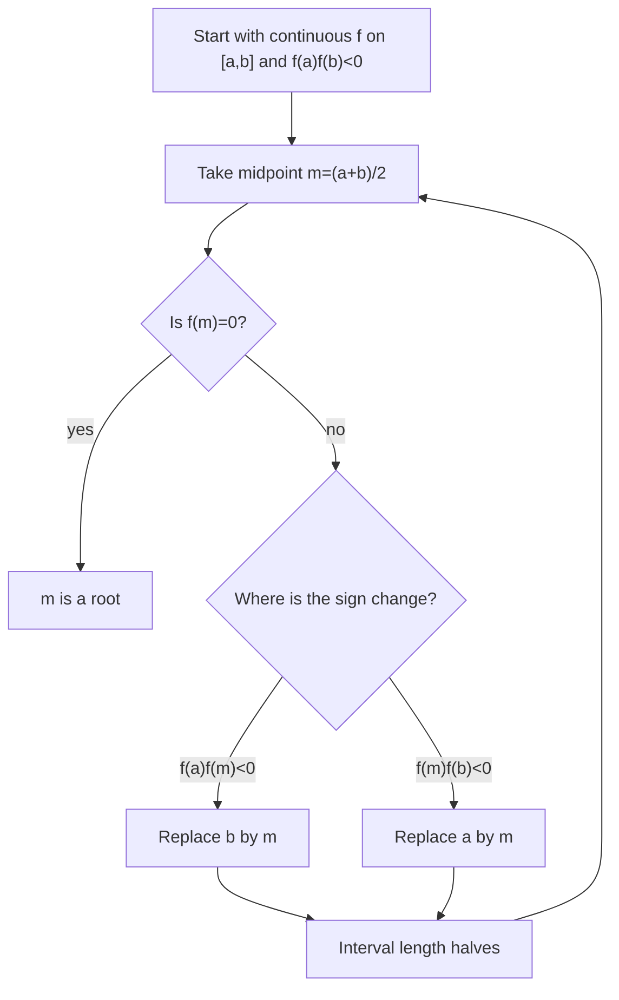

# 1. Limits and Continuity of Functions

## 1.1 Limits of Functions

A function limit describes what values of a function approach near a point, independently of whether the function is defined at that point. Start from a general neighborhood definition: let $f$ be a function and let $a$ be a cluster point of its domain. The limit of $f$ at $a$ is $A$ if every neighborhood of $A$ contains all values $f(x)$ for all domain points $x$ close enough to $a$, except possibly $x=a$ itself.

A finite real limit at a finite point can be written in epsilon-delta form:

$$
\lim_{x\to a} f(x) = A \Longleftrightarrow
\forall \epsilon>0\ \exists \delta>0\ \forall x \in D_f:
0 < |x - a| < \delta \Rightarrow |f(x) - A| < \epsilon.
$$

The exclusion $0 < |x - a|$ is essential: limits look at the punctured neighborhood around $a$. The value $f(a)$ is irrelevant for the existence and value of the limit.

Useful prerequisites:

| Concept                | Meaning                                                               |
| ---------------------- | --------------------------------------------------------------------- |
| Neighborhood of $a$    | A set of points close to $a$, typically $K_r(a)={x:\| x-a \| <r}$.    |
| Cluster point of $D$   | Every neighborhood of $a$ contains a point of $D$ different from $a$. |
| Punctured neighborhood | A neighborhood of $a$ with $a$ itself removed.                        |
| One-sided neighborhood | A neighborhood restricted to the left or right side of $a$.           |

The special cases of limits are best remembered as the same neighborhood idea with the target or source allowed to be infinite.

| Case                           | Definition pattern                                                                                                   |
| ------------------------------ | -------------------------------------------------------------------------------------------------------------------- |
| Finite limit at finite point   | For every small target error $\varepsilon$, there is a small source distance $\delta$.                               |
| Infinite limit at finite point | For every large bound $M$, there is a $\delta$ such that $0 <\| x - a\| < \delta$ implies $f(x) > M$ or $f(x) < -M$. |
| Finite limit at infinity       | For every $\varepsilon$, there is a bound $R$ such that $x > R$ or $x < -R$ implies $\| f(x) - A\| < \varepsilon$.   |
| Infinite limit at infinity     | For every $M$, there is $R$ such that sufficiently large $x$ forces $f(x) > M$ or $f(x) < -M$.                       |
| One-sided finite limit         | The same finite-point definition, but using only $x > a$ or only $x < a$.                                            |

For a two-sided limit at a finite point, both one-sided limits must exist and be equal:

$$
\lim_{x\to a}f(x) = A \Longleftrightarrow \lim_{x\to a-}f(x) = A \text{ and } \lim_{x\to a+}f(x) = A.
$$

The sequential characterization says that a function limit can be tested by sequences. If $a$ is a cluster point of $D_f$, then

$$
\lim_{x\to a} f(x) = A
$$

if and only if for every sequence $(x_n)$ in $D_f \setminus \{a\}$ with $x_n \to a$, the sequence $(f(x_n))$ converges to $A$. This is often called the Heine characterization of function limits. It is useful for disproving a limit: if two sequences approach the same point but their function values approach different limits, then the function limit does not exist.

Examples:

| Function     | Point     | Reason                                                                                                 |
| ------------ | --------- | ------------------------------------------------------------------------------------------------------ |
| $\sin x / x$ | $x \to 0$ | Has finite limit $1$, although the expression is undefined at $0$.                                     |
| $1 / x^2$    | $x \to 0$ | Goes to $+\infty$, because values exceed every bound near $0$.                                         |
| $1 / x$      | $x \to 0$ | No two-sided infinite limit in the signed sense: right side goes to $+\infty$, left side to $-\infty$. |
| $\sin(1/x)$  | $x \to 0$ | No limit: sequences can force values toward different accumulation values.                             |

Limits interact well with algebraic operations. If $\lim f=A$ and $\lim g=B$ at the same point, and the expressions are meaningful, then:

$$
\lim(f+g)=A+B,\ \lim(cf)=cA,\ \lim(fg)=AB,\ \lim\frac{f}{g}=\frac{A}{B}\quad(B\ne 0).
$$

The same principle applies to powers and roots under the usual domain restrictions. These rules are not a substitute for checking denominator limits: a quotient rule is valid only when the denominator limit is nonzero. Forms such as $0/0$, $\infty/\infty$, $0 * \infty$, $\infty - \infty$, and $1^\infty$ are indeterminate; extra transformation or theorems are needed.

### What to Emphasize in an Oral Answer

- Define the limit at a cluster point using the punctured-neighborhood or epsilon-delta condition; emphasize that $f(a)$ is irrelevant.
- Treat finite, infinite, one-sided, and $x\to\pm\infty$ limits as the same neighborhood idea with changed source or target neighborhoods.
- State that a two-sided finite limit exists exactly when the two one-sided limits exist and are equal.
- Include the sequential/Heine characterization, especially its use in disproving limits with two approaching sequences.
- Mention algebraic limit laws, but also the caveat about nonzero denominator limits and indeterminate forms.

::: details Suggested answer

A limit of a function describes the value approached by $f(x)$ as $x$ approaches a cluster point $a$ of the domain. In the usual finite case, $\lim_{x\to a} f(x)=A$ means that for every tolerance around $A$, no matter how small, there is a punctured neighborhood of $a$ such that every domain point in that neighborhood has its function value inside the tolerance. The point $a$ itself is excluded, so the value $f(a)$ is irrelevant for the limit.

The same definition gives the special cases by changing the source or target neighborhoods. If the limit is infinite at a finite point, then near $a$ the values exceed every positive bound, or fall below every negative bound. If $x$ tends to infinity, then the source condition is not closeness to a point but being sufficiently far out on the real line. One-sided limits restrict the source to the left or the right, and a two-sided finite limit exists exactly when both one-sided limits exist and are equal.

The sequential characterization is another way to say the same thing: $\lim_{x\to a} f(x)=A$ if and only if every sequence of domain points different from $a$ and converging to $a$ has image sequence converging to $A$. This is especially useful for proving nonexistence of limits, because two sequences approaching the same point with different image limits are enough to refute the limit.

Finally, limits are compatible with algebraic operations. Sums, scalar multiples, products, and quotients have the expected limits, as long as the denominator limit is nonzero and the expression is defined near the point. When a direct operation produces an indeterminate form such as $0/0$ or $\infty/\infty$, the algebraic rules alone do not decide the limit.

:::

## 1.2 Continuity of Functions

Continuity at a point is defined directly by epsilon-delta language. A function $f$ is continuous at $a \in D_f$ if

$$
\forall \epsilon>0\ \exists \delta>0\ \forall x\in D_f:
|x-a|<\delta \Rightarrow |f(x)-f(a)|<\epsilon.
$$

If $a$ is also a cluster point of the domain, continuity is equivalent to the limit relation

$$
f \text{ is continuous at } a
\quad\Longleftrightarrow\quad
\lim_{x\to a}f(x)=f(a).
$$

The sequential characterization of continuity follows the limit version. A function is continuous at $a$ if and only if every sequence $(x_n)$ in $D_f$ with $x_n \to a$ satisfies $f(x_n) \to f(a)$. This form includes the value at $a$, unlike the limit definition.

Continuity is preserved by algebraic operations. If $f$ and $g$ are continuous at $a$, then $f+g$, $f-g$, $fg$, and $cf$ are continuous at $a$. If additionally $g(a) \ne 0$, then $f/g$ is continuous at $a$. Compositions are also continuous: if $f$ is continuous at $a$ and $g$ is continuous at $f(a)$, then $g\circ f$ is continuous at $a$.

The preservation of sign theorem is important for exam answers. If $f$ is continuous at $a$ and $f(a)>0$, then $f(x)>0$ in some neighborhood of $a$; if $f(a)<0$, then $f(x)<0$ in some neighborhood of $a$. This is a local consequence of continuity: choose an error smaller than $|f(a)|$, so the function cannot cross zero near $a$.

Continuity at endpoints is understood one-sidedly. For a function on $[a,b]$, continuity at $a$ means right-continuity, continuity at $b$ means left-continuity, and continuity inside $(a,b)$ is ordinary two-sided continuity.

Discontinuities are points where the function is not continuous. The main types are:

| Type                                  | What happens                                                                   | Example pattern                                                      |
| ------------------------------------- | ------------------------------------------------------------------------------ | -------------------------------------------------------------------- |
| Removable discontinuity               | The finite limit exists, but $f(a)$ is missing or unequal to the limit.        | $\sin x / x$ at $0$ before defining the value.                       |
| Jump discontinuity                    | Both one-sided finite limits exist, but they are different.                    | Step function at the jump point.                                     |
| Infinite discontinuity                | At least one one-sided limit is infinite.                                      | $1/x$ at $0$.                                                        |
| Oscillatory / essential discontinuity | The limiting behavior does not settle to a finite or infinite one-sided value. | $\sin(1/x)$ at $0$.                                                  |
| Dirichlet-type discontinuity          | Values depend on dense subsets in incompatible ways.                           | $1$ on rationals and $0$ on irrationals is discontinuous everywhere. |

A function can often be made continuous at a removable discontinuity by assigning the missing limit value. A jump, infinite, or oscillatory discontinuity cannot be repaired by changing only the value at the point.

### What to Emphasize in an Oral Answer

- Define continuity at $a\in D_f$ by epsilon-delta language and, at cluster points, by $\lim_{x\to a}f(x)=f(a)$.
- Contrast continuity with a plain limit: for continuity the value at $a$ matters and must equal the limiting value.
- State the sequential characterization: every sequence in the domain converging to $a$ must have images converging to $f(a)$.
- Mention stability under algebraic operations, quotients with nonzero denominator, and composition, plus local sign preservation.
- Distinguish endpoint continuity as one-sided continuity when the domain is an interval.
- Classify discontinuities by failure mode: removable, jump, infinite, oscillatory/essential; only removable ones are repaired by redefining $f(a)$.

::: details Suggested answer

Continuity at a point means that small changes in the input produce small changes in the function value. Formally, $f$ is continuous at $a$ if for every error tolerance around $f(a)$ there is a neighborhood of $a$ such that every domain point in that neighborhood is mapped inside the tolerance. If $a$ is a cluster point of the domain, this is equivalent to saying that the limit of $f(x)$ as $x$ tends to $a$ exists and equals $f(a)$.

There is also a sequential characterization: $f$ is continuous at $a$ exactly when every sequence of domain points converging to $a$ has image sequence converging to $f(a)$. This makes clear that continuity preserves limiting processes. At endpoints of an interval, continuity is interpreted one-sidedly: right-continuity at the left endpoint and left-continuity at the right endpoint.

Continuous functions are stable under the usual algebraic operations. Sums, differences, products, scalar multiples, and quotients by a nonzero continuous denominator are continuous, and compositions of continuous functions are continuous. A useful local consequence is preservation of sign: if $f(a)$ is positive, then $f$ remains positive in some neighborhood of $a$, and similarly for negative values.

Discontinuities are classified by what goes wrong. If the finite limit exists but the value is missing or wrong, the discontinuity is removable. If the two one-sided finite limits exist but differ, it is a jump discontinuity. If the function tends to infinity near the point, it is an infinite discontinuity. If the values oscillate without approaching any limit, it is an essential or oscillatory discontinuity.

:::

## 1.3 Continuous Functions on Compact Sets

Sequential compactness means that every sequence in the set has a convergent subsequence whose limit is still in the set. In the real line, compact sets are exactly closed and bounded sets.

The core compact-set properties of continuous functions are:

| Theorem                                      | Statement                                                                                     | Consequence                                                          |
| -------------------------------------------- | --------------------------------------------------------------------------------------------- | -------------------------------------------------------------------- |
| Boundedness theorem                          | If $f$ is continuous on a compact set $K$, then $f(K)$ is bounded.                            | A continuous function on $[a,b]$ cannot grow without bound.          |
| Weierstrass theorem                          | If $f$ is continuous on compact $K$, then $f$ attains a minimum and a maximum.                | There exist $x_min,x_max \in K$ with $f(x_min)\le f(x)\le f(x_max)$. |
| Bolzano-Darboux / intermediate value theorem | If $f$ is continuous on $[a,b]$, then every value between $f(a)$ and $f(b)$ is attained.      | Continuous functions cannot jump over intermediate values.           |
| Bolzano zero theorem                         | If $f$ is continuous on $[a,b]$ and $f(a)f(b)<0$, then some $c \in (a,b)$ satisfies $f(c)=0$. | A sign change forces a zero.                                         |
| Heine theorem                                | If $f$ is continuous on compact $K$, then $f$ is uniformly continuous on $K$.                 | The same $\delta$ works for all points of the compact set.           |

The important statements are Weierstrass, Bolzano's zero theorem, Heine's theorem, the boundedness theorem, and the Bolzano-Darboux theorem.

Uniform continuity is stronger than pointwise continuity. Pointwise continuity allows $\delta$ to depend on both $\varepsilon$ and the point $a$; uniform continuity allows $\delta$ to depend only on $\varepsilon$. Compactness is what lets continuous functions on a compact domain be uniformly continuous.

The bisection method is the numerical version of Bolzano's zero theorem. Suppose $f$ is continuous on $[a,b]$ and $f(a)f(b)<0$. Then:

1. Set $a_0=a$, $b_0=b$.
2. Let $m_k=(a_k+b_k)/2$.
3. If $f(m_k)=0$, stop.
4. Otherwise choose the half-interval where the sign change remains:
   - if $f(a_k)f(m_k)<0$, set $[a_{k+1},b_{k+1}]=[a_k,m_k]$;
   - otherwise set $[a_{k+1},b_{k+1}]=[m_k,b_k]$.
5. Repeat until the interval is short enough.

The invariant is that each interval contains a root and has half the length of the previous interval. After $n$ steps, the interval length is $(b-a)/2^n$, so the midpoint error is at most $(b-a)/2^{n+1}$.

### What to Emphasize in an Oral Answer

- Define compactness on the real line as closed and bounded, equivalently sequential compactness.
- State boundedness and Weierstrass: a continuous function on a compact set is bounded and attains its minimum and maximum.
- State the intermediate value/Bolzano-Darboux theorem and the zero theorem as the sign-change corollary.
- Include Heine's theorem and contrast pointwise continuity with uniform continuity through the dependence of $\delta$.
- Explain bisection as the numerical use of the zero theorem: preserve a sign-change bracket and halve the error interval each step.

::: details Suggested answer

On the real line, compactness means closed and boundedness, and equivalently every sequence has a convergent subsequence with limit still in the set. Continuous functions behave especially well on compact sets. First, a continuous function on a compact set is bounded. Second, by the Weierstrass theorem it attains its bounds, so it has both a minimum and a maximum. Third, by the Bolzano-Darboux or intermediate value theorem, a continuous function on an interval takes every value between two of its values; in particular, if $f(a)$ and $f(b)$ have opposite signs, then there is a zero between $a$ and $b$.

These theorems express the same geometric idea: continuity prevents jumps, and compactness prevents escape to infinity or to a missing endpoint. The Heine theorem adds that a continuous function on a compact set is uniformly continuous, so one input tolerance can be chosen for the whole domain.

The bisection method uses the zero theorem numerically. Starting with an interval where a continuous function changes sign, take the midpoint. If the midpoint is not a root, one of the two half-intervals still has opposite signs at its endpoints. Keep that half and repeat. The root remains inside every chosen interval, and the interval length halves at each step, giving a simple guaranteed error bound.

:::

## 1.4 Power Series

A power series is defined from a center $a$ and coefficients $(a_n)$:

$$
\sum_{n=0}^{\infty} a_n (x-a)^n.
$$

For each fixed $x$, the power series becomes an ordinary numerical series. The set of points where it converges is its domain of convergence. The central result is that this domain is controlled by a radius of convergence $R$. Inside the open interval or disk $|x-a|<R$, the series converges absolutely. Outside $|x-a|>R$, it diverges. At boundary points $|x-a|=R$, the Cauchy-Hadamard theorem alone does not decide convergence; endpoints must be checked separately in the real case.

The Cauchy-Hadamard formula is:

$$
R=\frac{1}{\limsup_{n\to\infty}\sqrt[n]{|a_n|}},
$$

with the conventions $1/0=\infty$ and $1/\infty=0$. The simpler form where the ordinary limit of $\sqrt[n]{|a_n|}$ exists:

| Limit of $\sqrt[n]{       | a_n        | }$ | Radius |
| ------------------------- | ---------- |
| $0$                       | $R=\infty$ |
| positive finite value $L$ | $R=1/L$    |
| $\infty$                  | $R=0$      |

A useful shortcut, when it exists, is the ratio-test form:

$$
R=\lim_{n\to\infty}\left|\frac{a_n}{a_{n+1}}\right|.
$$

This is not more general than Cauchy-Hadamard, but it is often easier for factorial-type coefficients.

Analytic functions are defined through power series with nonzero radius of convergence. On the interior of the convergence interval, the sum function of a power series is continuous. In standard calculus, it is also differentiable and integrable term by term inside the radius of convergence. For continuity, the key point is uniform convergence on every smaller closed interval $|x-a|\le \rho<R$; uniform limits of continuous partial sums are continuous.

Important analytic functions:

$$
\exp x=\sum_{n=0}^{\infty}\frac{x^n}{n!},
$$

$$
\sin x=\sum_{n=0}^{\infty}(-1)^n\frac{x^{2n+1}}{(2n+1)!},
$$

$$
\cos x=\sum_{n=0}^{\infty}(-1)^n\frac{x^{2n}}{(2n)!}.
$$

The same list includes the hyperbolic functions:

$$
\sinh x=\sum_{n=0}^{\infty}\frac{x^{2n+1}}{(2n+1)!},
\qquad
\cosh x=\sum_{n=0}^{\infty}\frac{x^{2n}}{(2n)!}.
$$

For all five listed examples, the root-test limit is $0$, so the radius of convergence is infinite.

Taylor series are useful context for analytic functions: a Taylor series at $a$ has the form

$$
\sum_{n=0}^{\infty}\frac{f^{(n)}(a)}{n!}(x-a)^n.
$$

When the Taylor series converges to the function in a neighborhood of $a$, the function is analytic there. This is stronger than merely being infinitely differentiable.

### What to Emphasize in an Oral Answer

- Define a power series $\sum a_n(x-a)^n$ by center, coefficients, and pointwise convergence as a numerical series for each $x$.
- State Cauchy-Hadamard: $R=1/\limsup\sqrt[n]{|a_n|}$, with absolute convergence inside $|x-a|<R$ and divergence outside.
- Emphasize that real boundary points $|x-a|=R$ require separate tests; the radius formula does not decide them.
- Mention the ratio-test shortcut when $\lim |a_n/a_{n+1}|$ exists.
- Explain why the sum is continuous inside the radius: uniform convergence on every smaller closed interval.
- Give standard analytic examples such as $\exp x$, $\sin x$, and $\cos x$, all with infinite radius.

::: details Suggested answer

A power series is a function series of the form $\sum a_n (x-a)^n$, where $a$ is the center and the $a_n$ are coefficients. For each fixed $x$, it becomes a numerical series, so convergence can depend on the distance from $x$ to the center.

The Cauchy-Hadamard theorem gives the radius of convergence. In general, $R$ is the reciprocal of $\limsup \sqrt[n]{|a_n|}$. If $|x-a|<R$, the series converges absolutely; if $|x-a|>R$, it diverges. Boundary points must be checked separately. When the ordinary root limit exists, this becomes a simpler rule: if the limit is $0$, the radius is infinite; if the limit is a positive finite number, the radius is its reciprocal.

When the ratio limit exists, the radius can also be computed as $\lim |a_n/a_{n+1}|$, which is often the quickest route for factorial-type coefficients.

Inside the radius of convergence, a power series defines a continuous sum function. The reason is that on every smaller closed interval inside the radius, the series converges uniformly and its partial sums are polynomials, hence continuous. Analytic functions are precisely functions represented locally by such convergent power series.

The standard examples are the exponential, sine, and cosine series. The coefficients contain factorials, so the root-test limit is zero and the radius of convergence is infinite. Thus the series define continuous functions on the whole real line: $\exp x=\sum x^n/n!$, $\sin x=\sum (-1)^n x^{2n+1}/(2n+1)!$, and $\cos x=\sum (-1)^n x^{2n}/(2n)!$.

:::
