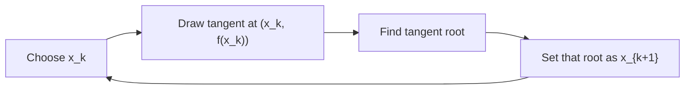

# 3. Numerical Methods

## 3.1 Solution of Nonlinear Equations

Start with equations of the form

$$
f(x)=0,\quad f:R\to R.
$$

Numerical methods construct a sequence $(x_k)$ that should converge to a root $x^*$.

Bolzano's theorem provides existence: if $f$ is continuous on $[a,b]$ and $f(a)f(b)<0$, then there is a root $x^* \in (a,b)$. If $f$ is also strictly monotone on the interval, the root is unique.

A fixed-point formulation rewrites the problem as

$$
x=g(x).
$$

Then the iteration is

$$
x_{k+1}=g(x_k).
$$

A function $g:[a,b]\to [a,b]$ is a contraction if there is a number $0\le q<1$ such that

$$
|g(x)-g(y)|\le q|x-y| \quad (x,y\in [a,b]).
$$

The Banach fixed-point theorem on $[a,b]$ says:

1. There is exactly one fixed point $x^* \in [a,b]$.
2. For every starting value $x_0 \in [a,b]$, the iteration $x_{k+1}=g(x_k)$ converges to $x^*$.
3. The error decreases at least geometrically:

$$
|x_k-x^*|\le q^k|x_0-x^*|\le q^k(b-a).
$$

Convergence order describes how fast iterates approach the limit. A sequence converging to $x^*$ has order $p$ if

$$
\lim_{k\to\infty}
\frac{|x_{k+1}-x^*|}{|x_k-x^*|^p}=c>0.
$$

$p=1$ is linear convergence, $p=2$ is quadratic convergence, and $1<p<2$ is superlinear convergence.

Newton's method is derived from tangent lines. At $x_k$, approximate $f$ by its tangent:

$$
y-f(x_k)=f'(x_k)(x-x_k).
$$

The next iterate is the zero of this tangent, so

$$
x_{k+1}=x_k-\frac{f(x_k)}{f'(x_k)}.
$$

This is also a fixed-point iteration with $g(x)=x-f(x)/f'(x)$. It is not defined if $f'(x_k)=0$, and it can be numerically unstable when $f'(x_k)$ is close to zero. Multiple roots are especially delicate because $f'(x^*)=0$.

Two useful convergence theorems for Newton's method. A monotone convergence theorem uses $f \in C^2[a,b]$, a root in the interval, constant signs of $f'$ and $f''$, and a starting point with $f(x_0)$ and $f''(x_0)$ of the same sign. Under those conditions Newton's method converges monotonically to the root. A local convergence theorem gives quadratic convergence when the start is close enough to a simple root and $f'$ stays bounded away from zero.

Additional related methods:

| Method              | Formula / idea                                                                    | Main point                                                            |
| ------------------- | --------------------------------------------------------------------------------- | --------------------------------------------------------------------- |
| Chord method        | Use a line through two points with opposite signs and keep a bracketing interval. | Preserves a sign-change bracket.                                      |
| Secant method       | $x_{k+1}=x_k - f(x_k)(x_k-x_{k-1})/(f(x_k)-f(x_{k-1}))$                           | Avoids explicit derivative; superlinear order about $(1+\sqrt{5})/2$. |
| Multivariate Newton | $x^{k+1}=x^k - [F'(x^k)]^{-1}F(x^k)$                                              | In practice solve $F'(x^k)(x^{k+1}-x^k)=-F(x^k)$.                     |

### What to Emphasize in an Oral Answer

- Frame the problem as solving $f(x)=0$ by constructing iterates $x_k\to x^*$.
- Mention existence and uniqueness checks: Bolzano sign change gives a root, and strict monotonicity on the interval gives uniqueness.
- Explain fixed-point iteration $x_{k+1}=g(x_k)$ and Banach's contraction condition, including uniqueness and geometric error decay.
- Define convergence order and distinguish linear, superlinear, and quadratic convergence.
- Derive Newton's method from the tangent line and state $x_{k+1}=x_k-f(x_k)/f'(x_k)$.
- State Newton's strengths and caveats: quadratic near a simple root, but sensitive to poor starts, zero/small derivatives, and multiple roots.
- Compare related methods: bracketing/chord methods preserve sign intervals, secant avoids explicit derivatives, multivariate Newton solves a linearized system.

::: details Suggested answer

For nonlinear equations we want to solve $f(x)=0$ numerically by constructing a sequence converging to a root. Bolzano's theorem gives a basic existence test: if $f$ is continuous on $[a,b]$ and changes sign, then there is a root in the interval, and strict monotonicity gives uniqueness. Another approach is to rewrite the problem as a fixed-point equation $x=g(x)$ and iterate $x_{k+1}=g(x_k)$. If $g$ maps $[a,b]$ into itself and is a contraction, meaning $|g(x)-g(y)|\le q|x-y|$ with $q<1$, then the Banach fixed-point theorem guarantees a unique fixed point in $[a,b]$, convergence from every starting point in the interval, and a geometric error bound.

Convergence order describes the speed of this approach to the root: linear convergence has order one, the secant method is superlinear, and Newton's method is often quadratic near a simple root. Newton's method is based on tangent approximation. At the current point $x_k$, replace the function by its tangent line and take the root of that tangent as the next approximation. This gives $x_{k+1}=x_k-f(x_k)/f'(x_k)$. Near a simple root and under smoothness assumptions, Newton's method has quadratic convergence, so the number of correct digits can grow very quickly. But the method is not defined when the derivative is zero and can behave badly when the derivative is very small, the root is multiple, or the starting point is poor.

Also include bracketing and derivative-free variants. The chord method keeps a sign-change interval and uses chords, while the secant method uses the last two iterates to approximate the derivative. The secant method avoids computing $f'$ and has superlinear convergence, though typically slower than Newton's quadratic convergence.

:::

## 3.2 Polynomial Interpolation

Interpolation replaces an unknown or expensive function by a simpler function matching known values. It is motivated by function values measured at selected nodes and the desire to approximate values between nodes.

The polynomial interpolation problem is:

Given distinct nodes $x_0,\ldots,x_n$ and values $f(x_0),\ldots,f(x_n)$, find a polynomial $p_n$ of degree at most $n$ such that

$$
p_n(x_k)=f(x_k) \quad (k=0,\ldots,n).
$$

The interpolation polynomial exists and is unique.

The Lagrange basis polynomials are

$$
l_k(x)=
\prod_{\substack{j=0\\j\ne k}}^n
\frac{x-x_j}{x_k-x_j}.
$$

They satisfy $l_k(x_j)=1$ if $j=k$ and $0$ otherwise. Therefore the interpolation polynomial is

$$
L_n(x)=\sum_{k=0}^n f(x_k)l_k(x).
$$

Error estimate: if $f \in C^{n+1}[a,b]$, then

$$
|f(x)-L_n(x)|
\le
\frac{M_{n+1}}{(n+1)!}
|\omega_n(x)|,
$$

where

$$
\omega_n(x)=\prod_{i=0}^n(x-x_i), \quad M_{n+1}=\max_{[a,b]}|f^{(n+1)}(x)|.
$$

Divided differences build the Newton form. First-order divided differences are

$$
f[x_i,x_{i+1}]
=
\frac{f(x_{i+1})-f(x_i)}{x_{i+1}-x_i}.
$$

Higher-order divided differences are recursive:

$$
f[x_i,\ldots,x_{i+k}]
=
\frac{f[x_{i+1},\ldots,x_{i+k}]
-f[x_i,\ldots,x_{i+k-1}]}
{x_{i+k}-x_i}.
$$

The divided-difference table is triangular:

| Node     | Value    | 1st divided difference | 2nd divided difference | ...      |
| -------- | -------- | ---------------------- | ---------------------- | -------- |
| $x_0$    | $f(x_0)$ |                        |                        |          |
| $x_1$    | $f(x_1)$ | $f[x_0,x_1]$           |                        |          |
| $x_2$    | $f(x_2)$ | $f[x_1,x_2]$           | $f[x_0,x_1,x_2]$       |          |
| $\cdots$ | $\cdots$ | $\cdots$               | $\cdots$               | $\cdots$ |

The Newton interpolation polynomial is

$$
N_n(x)=
f(x_0)+
\sum_{k=1}^n
f[x_0,x_1,\ldots,x_k]\,
\omega_{k-1}(x),
$$

where

$$
\omega_j(x)=(x-x_0)(x-x_1)\cdots(x-x_j).
$$

The Lagrange and Newton forms represent the same unique interpolation polynomial. Lagrange form is direct and symmetric in the nodes. Newton form is computationally convenient because adding a new node only adds one more term.

Also include Hermite interpolation, where derivative values are prescribed in addition to function values. It generalizes Lagrange interpolation: if only function values are prescribed, it reduces to the ordinary Lagrange problem; if function and first derivative values are given at each node, it becomes a Hermite-Fejer-type problem.

### What to Emphasize in an Oral Answer

- State the interpolation problem: for $n+1$ distinct nodes, find the unique polynomial of degree at most $n$ matching the prescribed values.
- Present the Lagrange basis idea: $l_k(x_j)=\delta_{kj}$, so $L_n(x)=\sum f(x_k)l_k(x)$ automatically interpolates.
- Give the error form and what controls it: the $(n+1)$st derivative bound and the node polynomial $\omega_n(x)=\prod_{i=0}^n(x-x_i)$.
- Explain Newton form through divided differences and why it is computationally convenient when adding nodes.
- Mention that Lagrange and Newton are two forms of the same unique polynomial.
- Include Hermite interpolation as the extension where derivative values are also prescribed.

::: details Suggested answer

Polynomial interpolation asks for a polynomial of degree at most $n$ that matches given function values at $n+1$ distinct nodes. The interpolation problem has a unique solution. In Lagrange form, we build basis polynomials $l_k$ that are one at the $k$-th node and zero at all other nodes. Then the polynomial is $L_n(x)=\sum f(x_k)l_k(x)$, which automatically matches every prescribed value.

The error depends on the next derivative of the original function and on the node polynomial $\omega_n(x)=\prod (x-x_i)$. If $f$ is $n+1$ times continuously differentiable, the error is bounded by $M_{n+1}|\omega_n(x)|/(n+1)!$.

The Newton form uses divided differences. First divided differences are slopes between neighboring nodes, and higher ones are built recursively. The interpolation polynomial becomes $f(x_0)+\sum f[x_0,\ldots,x_k]\omega_{k-1}(x)$. It is the same polynomial as the Lagrange form, but it is often better for computation because if a new node is added, the existing terms can be kept and only a new divided-difference term is appended. Hermite interpolation extends the same idea by prescribing derivative data in addition to function values.

:::

## 3.3 Least-Squares Method

Least squares is motivated by measurement errors: measured points usually do not lie exactly on one line or on one low-degree polynomial. Instead of enforcing exact interpolation, we choose a function that minimizes the sum of squared residuals.

For line fitting with points $(x_i,y_i)$, choose

$$
p_1(x)=a+bx
$$

to minimize

$$
\sum_{i=1}^m (y_i-p_1(x_i))^2.
$$

The general polynomial fitting problem is: given $m$ data points with $m \gg n$, find

$$
p_n(x)=a_0+a_1x+\cdots+a_nx^n
$$

minimizing

$$
\sum_{i=1}^m (y_i-p_n(x_i))^2.
$$

This can be written as an overdetermined linear system

$$
Az\approx b,
$$

where $z=(a_0,\ldots,a_n)^T$, $b=(y_1,\ldots,y_m)^T$, and $A$ is the rectangular Vandermonde matrix

$$
A=
\begin{bmatrix}
1 & x_1 & x_1^2 & \cdots & x_1^n\\
1 & x_2 & x_2^2 & \cdots & x_2^n\\
\vdots & \vdots & \vdots & \ddots & \vdots\\
1 & x_m & x_m^2 & \cdots & x_m^n
\end{bmatrix}.
$$

The least-squares solution minimizes

$$
\|Az-b\|_2^2.
$$

The Gaussian normal equations:

$$
A^TAz=A^Tb.
$$

If $A$ has full column rank, then $A^TA$ is invertible and the solution is unique. For $n=1$, this is ordinary linear regression. The normal-equation matrix and right-hand side are

$$
A^TA=
\begin{bmatrix}
m & \sum x_i\\
\sum x_i & \sum x_i^2
\end{bmatrix},
\quad
A^Tb=
\begin{bmatrix}
\sum y_i\\
\sum x_i y_i
\end{bmatrix}.
$$

Normal equations are the basic least-squares technique. For numerical accuracy, it is also standard to solve least squares using QR factorization: write $A=QR$ with orthonormal columns in $Q$, then solve

$$
Rz=Q^Tb.
$$

QR avoids squaring the condition number, which is a weakness of normal equations. In rank-deficient or ill-conditioned cases, singular value decomposition is the most robust technique.

### What to Emphasize in an Oral Answer

- Contrast least squares with interpolation: it fits noisy or overdetermined data instead of forcing every point to match exactly.
- State the objective: minimize the sum of squared residuals, equivalently $\|Az-b\|_2^2$.
- For polynomial fitting, identify the coefficient vector $z$, observation vector $b$, and rectangular Vandermonde matrix $A$.
- State the normal equations $A^TAz=A^Tb$ and the full-column-rank condition for uniqueness.
- Include the line-fitting case as ordinary linear regression when $n=1$.
- Mention numerical stability: normal equations are basic but can worsen conditioning; QR is preferred, and SVD is most robust for ill-conditioned or rank-deficient cases.

::: details Suggested answer

Least squares is used when exact interpolation is inappropriate, usually because data contains measurement error or because there are more data points than parameters. Instead of requiring a polynomial to pass through every point, we choose coefficients that minimize the sum of squared residuals.

For polynomial fitting, write $p_n(x)=a_0+a_1x+\cdots+a_nx^n$. Evaluating this polynomial at all measured $x_i$ gives an overdetermined linear system $Az\approx b$, where $A$ is a rectangular Vandermonde matrix and $z$ is the vector of coefficients. The objective is to minimize $\|Az-b\|_2^2$.

The normal equations are $A^T A z = A^T b$. If $A$ has full column rank, these equations have a unique solution and produce the least-squares polynomial; for $n=1$ this is ordinary linear regression. For numerical work, QR factorization is often preferred because it is more stable: with $A=QR$, one solves $Rz=Q^Tb$. For very ill-conditioned or rank-deficient problems, SVD is the most robust method.

:::

## 3.4 Numerical Integration

Numerical integration approximates a definite integral

$$
\int_a^b f(x)\,dx
$$

when an antiderivative is not known or not convenient, but function values can be computed.

A quadrature formula approximates the integral by weighted function values:

$$
Q_n(f)=\sum_{i=1}^n w_i f(x_i),
$$

where $x_i$ are the nodes and $w_i$ are the weights.

An interpolation-type quadrature formula is built by interpolating $f$ at the chosen nodes, integrating the interpolation polynomial, and using that value as the approximation. If $L_i(x)$ are the Lagrange basis polynomials for the nodes, then

$$
\int_a^b f(x)\,dx
\approx
\int_a^b \sum_{i=1}^n f(x_i)L_i(x)\,dx
=
\sum_{i=1}^n f(x_i)\int_a^b L_i(x)\,dx.
$$

Thus the weights are

$$
w_i=\int_a^b L_i(x)\,dx.
$$

Newton-Cotes formulas are interpolation-type quadrature formulas where the nodes are equally spaced. They are:

| Type                | Node choice                                      |
| ------------------- | ------------------------------------------------ |
| Closed Newton-Cotes | The endpoints $a$ and $b$ are included as nodes. |
| Open Newton-Cotes   | The endpoints are not used as nodes.             |

Named quadrature formulas:

| Formula          | Nodes         | Approximation                    | Degree of exactness              | Local error order |
| ---------------- | ------------- | -------------------------------- | -------------------------------- | ----------------- |
| Midpoint rule    | $m=(a+b)/2$   | $(b-a)f(m)$                      | exact for degree $1$ polynomials | $O(h^3)$          |
| Trapezoidal rule | $a,b$         | $(b-a)(f(a)+f(b))/2$             | exact for degree $1$ polynomials | $O(h^3)$          |
| Simpson rule     | $a,(a+b)/2,b$ | $(b-a)(f(a)+4f((a+b)/2)+f(b))/6$ | exact for degree $3$ polynomials | $O(h^5)$          |

Here $h=b-a$ for a single interval. The usual error forms, when the required derivatives exist, are:

$$
E_M=-\frac{(b-a)^3}{24}f''(\xi),
$$

$$
E_T=-\frac{(b-a)^3}{12}f''(\xi),
$$

$$
E_S=-\frac{(b-a)^5}{2880}f^{(4)}(\xi),
$$

for suitable $\xi$ in $(a,b)$, up to sign conventions depending on whether error is written as exact minus approximate or approximate minus exact.

Composite formulas improve accuracy by splitting $[a,b]$ into subintervals and applying a simple rule on each piece. This avoids using one high-degree interpolation polynomial over a large interval, which can oscillate badly.

For composite trapezoidal rule, split $[a,b]$ into $n$ equal parts with

$$
h=\frac{b-a}{n},\quad x_i=a+ih.
$$

Then

$$
T_n
=
h\left(
\frac{f(x_0)+f(x_n)}{2}
+\sum_{i=1}^{n-1}f(x_i)
\right),
$$

with global error order $O(h^2)$.

For composite midpoint rule, use midpoints $m_i=(x_{i-1}+x_i)/2$:

$$
M_n=h\sum_{i=1}^n f(m_i),
$$

with global error order $O(h^2)$.

For composite Simpson rule, split into $n$ subintervals and apply Simpson on each subinterval, or equivalently use $2n+1$ equally spaced nodes with half-step $h/2$. In the common form with an even number $N$ of subintervals and $h=(b-a)/N$,

$$
S_N=
\frac{h}{3}
\left(
f(x_0)+f(x_N)
+4\sum_{\substack{i=1\\i\text{ odd}}}^{N-1}f(x_i)
+2\sum_{\substack{i=2\\i\text{ even}}}^{N-2}f(x_i)
\right),
$$

with global error order $O(h^4)$.

Accuracy summary:

| Rule        | Single-panel order | Composite global order | Practical note                                                              |
| ----------- | ------------------ | ---------------------- | --------------------------------------------------------------------------- |
| Midpoint    | $O(h^3)$           | $O(h^2)$               | One interior node; often better than trapezoid for similar cost.            |
| Trapezoidal | $O(h^3)$           | $O(h^2)$               | Uses endpoints; simple and robust.                                          |
| Simpson     | $O(h^5)$           | $O(h^4)$               | More accurate for smooth functions; requires paired intervals or midpoints. |

### What to Emphasize in an Oral Answer

- Define quadrature as approximating $\int_a^b f(x)\,dx$ by weighted function values $Q_n(f)=\sum w_i f(x_i)$.
- Explain interpolation-type quadrature: interpolate at chosen nodes and integrate the interpolation polynomial; weights are integrals of Lagrange basis functions.
- Distinguish closed and open Newton-Cotes formulas by whether endpoints are used as nodes.
- State the midpoint, trapezoidal, and Simpson formulas, especially Simpson's $1,4,1$ weights.
- Mention degree of exactness/error behavior: midpoint and trapezoid are lower order; Simpson is exact through degree $3$ and has higher smooth-function accuracy.
- Explain composite rules: subdivide the interval, apply a simple rule on each part, and get global orders $O(h^2)$ for midpoint/trapezoid and $O(h^4)$ for Simpson.
- Note the practical reason for composite formulas: avoid one high-degree interpolant over a large interval.

::: details Suggested answer

Numerical integration approximates a definite integral when an antiderivative is unavailable or inconvenient. A quadrature formula uses function values at selected nodes and weights them: $Q_n(f)=\sum w_i f(x_i)$.

Interpolation-type quadrature formulas choose nodes, interpolate the function at those nodes by a Lagrange polynomial, and integrate that polynomial exactly. This explains why the weights are integrals of the Lagrange basis polynomials. Newton-Cotes formulas are the interpolation quadrature formulas with equally spaced nodes. They are closed if the endpoints are included and open if the endpoints are omitted.

The main simple formulas are midpoint, trapezoidal, and Simpson. The midpoint rule uses the middle point and gives $(b-a)f((a+b)/2)$. The trapezoidal rule uses the endpoints and gives $(b-a)(f(a)+f(b))/2$. Simpson's rule uses the endpoints and midpoint with weights $1,4,1$, giving $(b-a)(f(a)+4f((a+b)/2)+f(b))/6$. Midpoint and trapezoidal rules have local error of order $h^3$ and composite global error $h^2$; Simpson has local error $h^5$ and composite global error $h^4$.

Composite formulas split the interval into smaller pieces and apply a simple formula on each piece. This improves accuracy without fitting one high-degree polynomial over the entire interval. Composite trapezoid and midpoint have second-order global accuracy, while composite Simpson has fourth-order global accuracy for sufficiently smooth functions.

:::

## Additional Material: Linear Systems and Splines

Iterative methods for linear systems and splines are included here as related numerical-methods material.

For linear systems $Ax=b$, iterative methods rewrite the system as

$$
x=Bx+c
$$

and iterate

$$
x^{(k+1)}=Bx^{(k)}+c.
$$

If $B$ is a contraction, or more generally if the spectral radius $\rho(B)<1$, the iteration converges from every starting vector to the solution.

Main methods:

| Method           | Iteration idea                                                                                                  |
| ---------------- | --------------------------------------------------------------------------------------------------------------- |
| Jacobi           | Split $A=L+D+U$; use old values on the right side: $x^{k+1}=-D^{-1}(L+U)x^k+D^{-1}b$.                           |
| Damped Jacobi    | Blend Jacobi with old values using a parameter $\omega$.                                                        |
| Gauss-Seidel     | Use newly computed components immediately: $x^{k+1}=-(L+D)^{-1}Ux^k+(L+D)^{-1}b$.                               |
| Relaxation / SOR | Damped Gauss-Seidel with parameter $\omega$; convergence for symmetric positive definite $A$ when $0<\omega<2$. |
| Richardson       | $x^{k+1}=x^k+p(b-Ax^k)$ using the residual.                                                                     |

Spline interpolation uses a spline of degree $l$ on a partition

$$
a=x_0<x_1<\cdots<x_n=b
$$

is a piecewise polynomial of degree $l$ on each subinterval, with global smoothness $C^{l-1}$. Spline interpolation asks for a spline matching the data values at the nodes. Extra boundary conditions are needed for uniqueness; cubic splines require two, such as natural boundary conditions $s''(a)=s''(b)=0$, Hermite endpoint slopes, or periodic endpoint conditions.

B-splines are spline basis functions with minimal support, nonnegativity, and partition-of-unity behavior.
