# 9. Object-Oriented Design

This subject emphasizes design work around large systems: development phases, development methods, design principles, architectural patterns, design patterns, project coordination, DevOps, version control, CI/CD, and Clean Code.

## 9.1 Development Phases of Large Systems

Large-system development is a sequence of related activities. The following are phases and the information that should be produced or checked in each phase.

| Phase | Main purpose | Important output or question |
| --- | --- | --- |
| Feasibility and background study | Decide whether and how the problem can be solved. | Required hardware, software, experts, cost, deadline, and operational constraints. |
| Requirements specification | Describe the problem, constraints, and acceptable solution from the user's and environment's viewpoint. | Functional and non-functional requirements. |
| Requirements analysis and prototyping | Check whether the requirements are usable before implementation. | Consistency, completeness, validation, feasibility, testability, and openness/extensibility. |
| Program specification | Translate requirements into precise input/output and mapping expectations. | What inputs exist, what outputs are expected, and how inputs determine outputs. |
| Design | Decide static, dynamic, and functional structure. | Program units, responsibilities, relationships, cooperation, messages, states, data flows, language/testing recommendations. |
| Implementation | Realize the design in code. | Data representation, event mappings, algorithms, optimizations, visibility, encapsulation, and style decisions. |
| Verification and validation | Check whether the system satisfies its specification and quality expectations. | Unit testing, system testing, black-box testing, white-box testing. |
| Tracking and maintenance | Support the deployed system over time. | Fix hidden faults, adapt to new environments, further develop, manage configurations, versions, and documentation. |
| Documentation | Make the software product usable and maintainable. | User documentation and developer documentation. |

Distinguish functional and non-functional requirements.

| Requirement type | Meaning | Typical content |
| --- | --- | --- |
| Functional requirement | Describes a service that the system must provide and the mapping from input to response. | Triggering the service, input data and form, preconditions, restrictions, result, output form, relationship between input and response. |
| Non-functional requirement | Describes qualities or constraints on the system or its development. | Product requirements, management requirements, external requirements; examples include performance, reliability, usability, portability, standards, legal constraints, and development-process constraints. |

Requirements analysis should ask five exam-relevant questions:

| Check | Question |
| --- | --- |
| Consistency | Do requirements contradict each other? |
| Completeness | Are all necessary services and constraints described? |
| Validation | Does the specification match the user's real problem? |
| Feasibility | Can a solution satisfying the requirements be implemented with available resources? |
| Testability | Can each requirement be checked by tests, review, measurement, or acceptance criteria? |

Prototyping is a tool of requirements analysis. A prototype is a high-level, partial solution that is correct enough in external behavior to clarify requirements. It is not necessarily the final architecture.

Requirements refinement can be represented as:

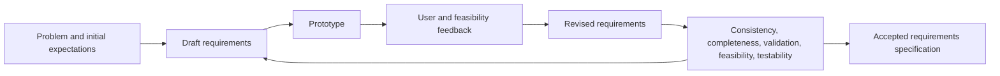

The design phase itself has three complementary models:

| Design model | Question it answers |
| --- | --- |
| Static model | What units exist, what are their responsibilities, and how are they related? |
| Dynamic model | How do units cooperate, what messages are exchanged, what states exist, and what events cause changes? |
| Functional model | Through what data flows are services implemented, what mappings participate, and what implementation/testing strategy is recommended? |

Procedural design starts mainly from functions and decomposes operations into modules. Object-oriented design puts data and the objects representing that data closer to the center: classes group state with operations, and design decisions allocate responsibilities among objects.

Implementation style should support maintainability. Important mechanisms include different abstraction levels, inheritance-based abstraction hierarchies, separation of declaration and implementation inside classes, restricted visibility, information hiding, and encapsulation.

### What to Emphasize in an Oral Answer

- Frame large-system development as a lifecycle, not just coding, from feasibility through maintenance and documentation.
- Distinguish functional requirements from non-functional requirements with examples of each.
- Name the five requirements-analysis checks: consistency, completeness, validation, feasibility, and testability.
- Explain the role of prototyping as requirements clarification, not necessarily final architecture.
- Describe design through static, dynamic, and functional models, and contrast object-oriented design with purely procedural decomposition.
- Include implementation, verification/validation, maintenance, and documentation as later phases that protect quality and usability.

::: details Suggested answer

Large-system development starts before coding. First we examine whether the problem is feasible: what resources, costs, deadlines, operational constraints, and experts are needed. Then we write requirements. Functional requirements describe the services of the system: how a service is invoked, what input it receives, what preconditions exist, what result it produces, and how input relates to output. Non-functional requirements describe qualities and constraints such as performance, reliability, usability, development constraints, external rules, or standards.

The requirements must then be analyzed. They should be consistent, complete, valid with respect to the user's real problem, feasible with available resources, and testable. Prototyping is useful here because a high-level prototype can clarify external behavior before the final architecture is chosen. After that, the program specification states inputs, outputs, and their relationship more precisely.

Design decides how the solution will be structured. The static model describes program units, responsibilities, and relationships. The dynamic model describes cooperation, messages, states, and events. The functional model describes data flows and mappings and may recommend an implementation and testing strategy. Object-oriented design differs from a purely procedural approach because it does not start only from functions; it centers the design on objects that combine data with behavior.

Implementation realizes the design through data representations, algorithms, event mappings, and coding style. Good style uses abstraction, restricted visibility, information hiding, and encapsulation. Finally, verification and validation check the product through unit and system testing, black-box and white-box methods, while maintenance and documentation keep the system usable after deployment. Documentation is part of the product: users need installation and usage information, while developers need module, class, dynamic behavior, implementation, and testing information.

:::

## 9.2 Classical and Agile Development Methods

The main development-method families are Waterfall, evolutionary development, Boehm's Spiral model, the V-model, and agile approaches such as Scrum, Kanban, and XP.

### Classical Models

| Model | Core idea | Strength | Risk or disadvantage |
| --- | --- | --- | --- |
| Waterfall | Phases follow each other in a mostly linear order. Changes in one phase affect later phases. | Clear milestones and documentation; useful when requirements are stable and regulation is strong. | Late validation can force repetition of the lifecycle; new services require changes in many phases. |
| V-model | Development phases are paired with corresponding test phases: requirements with acceptance testing, architecture with system/integration testing, design with component testing, implementation with unit testing. | Makes verification and validation planning explicit from the beginning. | Still assumes relatively stable requirements; can be heavy when discovery continues during development. |
| Spiral | Iterative, risk-driven model. Each loop defines goals and constraints, analyzes risks, develops/validates, then plans the next iteration. | Strong for large, uncertain, risky projects because risks are addressed early. | Labor-intensive and complex; requires expertise to perform economically. |
| Evolutionary / prototyping | Produce versions or prototypes step by step until the final solution is approached. Specification, development, and validation happen partly in parallel. | Good when requirements are unclear and user feedback is necessary. | Harder to oversee; rapid development can weaken documentation. |

Waterfall can be summarized as:

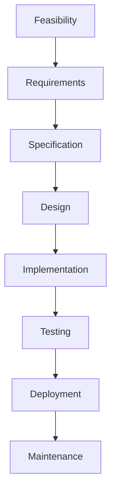

V-model makes test planning visible:

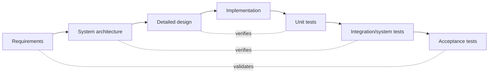

Spiral can be represented as repeated risk-managed loops:

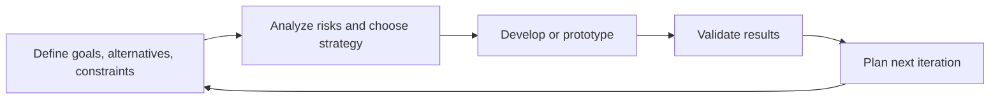

### Agile Approaches

Agile methods are iterative and adaptive. They assume that feedback, changing priorities, and learning during the project are normal. They usually favor short cycles, working software, customer collaboration, transparent work tracking, and frequent integration.

| Approach | Main mechanism | Best exam contrast |
| --- | --- | --- |
| Scrum | Work is organized in sprints. A product backlog is prioritized, sprint planning selects work, daily Scrum synchronizes the team, review inspects the product, retrospective improves the process. | Time-boxed iteration and roles such as Product Owner, Scrum Master, and Developers. |
| Kanban | Work items flow through visible states such as To Do, In Progress, Review, Done. Work-in-progress limits prevent overload. | Continuous flow rather than fixed sprints; focus on throughput, cycle time, and limiting work in progress. |
| XP, Extreme Programming | Engineering-centered agile method. Emphasizes test-driven development, pair programming, continuous integration, simple design, refactoring, small releases, coding standards, and close customer feedback. | Strongest focus on concrete coding practices and technical quality. |

Classical and agile approaches are not only opposites; projects often combine them. For example, a regulated project may use phase gates and formal documentation but still perform implementation in agile iterations with CI and frequent reviews.

### What to Emphasize in an Oral Answer

- Define development methods as ways to order, control, and validate development activities.
- Contrast Waterfall's linear phase order and documentation with its late-validation risk.
- Explain the V-model as classical but test-paired: requirements to acceptance tests, architecture to integration/system tests, design to component tests, implementation to unit tests.
- Explain Spiral as iterative and risk-driven, with each loop setting goals, analyzing risks, building/prototyping, validating, and planning.
- Include evolutionary/prototyping development as feedback-oriented but harder to oversee and document.
- Compare agile methods: Scrum uses sprints and roles; Kanban uses continuous flow and WIP limits; XP emphasizes engineering practices.
- Mention that real projects often mix classical governance with agile implementation practices.

::: details Suggested answer

Development methods describe how the phases of software development are ordered and controlled. In the Waterfall model, phases follow one another: feasibility, requirements, specification, design, implementation, testing, deployment, and maintenance. Its advantage is clarity and documentation, but its weakness is that validation comes late; if requirements are wrong, later phases may have to be repeated.

The V-model is also classical, but it pairs development activities with test activities. Requirements are checked by acceptance tests, architecture by system and integration tests, detailed design by component tests, and implementation by unit tests. This makes verification planning explicit, but it is still best when requirements are stable.

The Spiral model is iterative and risk-driven. Each loop defines goals and constraints, analyzes risks, develops or prototypes a solution, validates it, and plans the next loop. It is useful for large uncertain projects, but it is complex and expert-intensive. Evolutionary development is also iterative: a sequence of prototypes or versions is produced, with specification, development, and validation partly in parallel. It is good for unclear requirements, but the project can become hard to oversee and documentation may suffer.

Agile approaches accept change and organize work around short feedback cycles. Scrum uses sprints, a product backlog, sprint planning, daily synchronization, review, and retrospective. Kanban uses a visual workflow and work-in-progress limits to improve continuous flow. XP focuses on engineering practices such as test-driven development, pair programming, continuous integration, refactoring, simple design, and coding standards. In practice, a project can combine classical governance with agile development practices.

:::

## 9.3 SOLID Design Principles

SOLID consists of five object-oriented design principles whose purpose is to make software easier to understand, extend, and maintain.

| Principle | Meaning | Design consequence |
| --- | --- | --- |
| Single Responsibility Principle | A class or module should have one responsibility and one main reason to change. | Separate unrelated reasons for change into separate classes/modules. |
| Open/Closed Principle | Software entities should be open for extension but closed for modification. | Add new behavior through new implementations, strategies, subclasses, composition, configuration, or plugins instead of editing stable code repeatedly. |
| Liskov Substitution Principle | A subtype should be usable wherever the base type is expected without breaking correct behavior. | Subclasses must preserve the base contract, not only the method signatures. |
| Interface Segregation Principle | Clients should not depend on methods they do not use. | Prefer small, role-specific interfaces over one large interface. |
| Dependency Inversion Principle | High-level modules should not depend on low-level modules; both should depend on abstractions. | Business logic should depend on interfaces/ports, while concrete databases, files, web APIs, or UI adapters implement those abstractions. |

SOLID principles are related but distinct:

| Pair | Relationship |
| --- | --- |
| SRP and ISP | Both reduce unnecessary coupling. SRP separates responsibilities; ISP separates client-facing contracts. |
| OCP and DIP | OCP is easier when code depends on abstractions; DIP provides that abstraction boundary. |
| LSP and inheritance | Inheritance is not only code reuse. If substitutability is broken, the inheritance relationship is unsafe even if the compiler accepts it. |

SOLID should not be applied mechanically. Over-splitting a small program can make it harder to understand. The goal is maintainability under change: separate what changes for different reasons and use abstractions at places where multiple implementations or future extension are realistic.

### What to Emphasize in an Oral Answer

- Define SOLID as five object-oriented design principles aimed at maintainability under change.
- Name all five principles: single responsibility, open/closed, Liskov substitution, interface segregation, and dependency inversion.
- For SRP/OCP, mention one reason to change and extension through new implementations or composition instead of repeated modification.
- For LSP, emphasize behavioral substitutability, not just matching method signatures.
- For ISP/DIP, contrast small client-specific interfaces with depending on abstractions instead of concrete low-level details.
- Explain how the principles support each other, especially DIP helping OCP and ISP/SRP reducing coupling.
- Add the caution that SOLID should not be applied mechanically when it only adds unnecessary indirection.

::: details Suggested answer

SOLID is a set of five object-oriented design principles for understandable, flexible, and maintainable software. The Single Responsibility Principle says that a class or module should have one responsibility and one main reason to change. The Open/Closed Principle says that software should be open for extension but closed for modification, so new behavior should often be added through new implementations or composition rather than repeated edits to stable code.

The Liskov Substitution Principle says that a subtype must be usable wherever its base type is expected without breaking the program's correctness. This is stronger than matching method signatures: the subclass must preserve the contract of the superclass. The Interface Segregation Principle says clients should not be forced to depend on methods they do not use, so smaller role-specific interfaces are preferred. The Dependency Inversion Principle says high-level modules and low-level modules should both depend on abstractions rather than high-level policy depending directly on details such as a database or file system implementation.

These principles support each other. Dependency inversion helps the open/closed principle because stable business logic can work through interfaces. Interface segregation and single responsibility both reduce unnecessary coupling. Liskov substitution keeps inheritance safe. The goal is not to create many tiny classes for their own sake, but to design boundaries that make real change easier and less risky.

:::

## 9.4 Architectural Patterns: MV, MVC, MVP, MVVM, and Layers

Architectural patterns include MV, MVC, MVP, MVVM, layered architecture, and related organization styles.

Architectural patterns describe the high-level organization of a system. They are broader than ordinary design patterns: they shape layers, dependency directions, component responsibilities, and major communication paths.

| Pattern | Main idea | Use |
| --- | --- | --- |
| Model-View (MV) | Separate the model from the view. The model represents domain data and behavior; the view presents it. | Small UI systems or as the shared base idea behind MVC, MVP, and MVVM. |
| Model-View-Controller (MVC) | Separate domain model, presentation view, and input/controller logic. | Web and desktop UI applications where user actions are handled separately from display and model logic. |
| Model-View-Presenter (MVP) | View is passive or thin; presenter contains UI logic and talks to the model. | UI systems where testability of presentation logic matters. |
| Model-View-ViewModel (MVVM) | View binds to a ViewModel that exposes state and commands tailored for the UI. | Data-binding UI frameworks; separates UI representation state from domain model. |
| Layered architecture | Organize code into layers such as presentation, application/service, domain, and infrastructure/data access. | Systems where dependency boundaries and separation of concerns matter. |

### MVC in More Detail

MVC separates:

| MVC part | Responsibility |
| --- | --- |
| Model | Domain-specific representation of application information and domain logic. It may include or coordinate persistence, although many modern systems separate data access explicitly. |
| View | Displays the model in a form suitable for interaction. Multiple views can present the same model differently. |
| Controller | Processes user events and requests, coordinates changes in the model, and selects or triggers the view response. |

Typical MVC control flow:

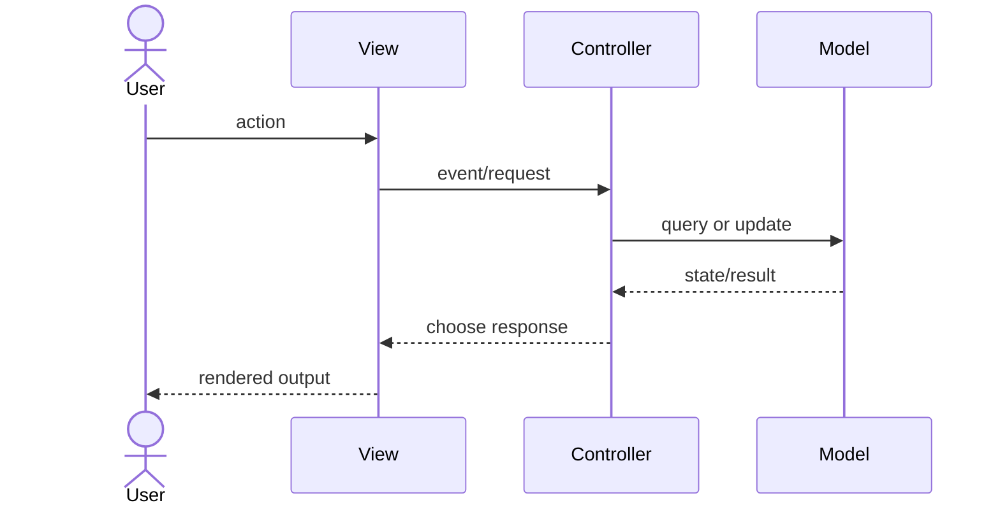

Also note a service layer between controller and model. This is not part of the original MVC core, but it is common in larger systems because it separates data retrieval/application operations from UI request handling.

MVC advantages:

| Advantage | Meaning |
| --- | --- |
| Concurrent development | Developers can work on model, controller, and views separately. |
| High cohesion | Related functions can be grouped in a controller; views for a model can be grouped. |
| Independence | Elements are more independent than in a mixed UI-and-domain structure. |
| Easier modification | Responsibility separation makes future changes easier. |
| Multiple views | One model can support several views. |
| Testability | Separate elements are easier to test independently. |

MVC disadvantages:

| Disadvantage | Meaning |
| --- | --- |
| More layers and code | The pattern introduces extra structure and often boilerplate. |
| Readability cost | New developers must understand framework conventions and multiple technologies. |
| Misplaced logic risk | One part may contain most of the real work while the others exist only formally. |

### Contrasting MV, MVP, and MVVM

| Pattern | Input handling | UI logic location | Typical dependency idea |
| --- | --- | --- | --- |
| MV | View directly observes or asks model. | Often mixed into view or model boundary. | Simple separation between representation and display. |
| MVC | Controller handles input and coordinates model/view. | Controller plus model. | View and controller depend on model; model should not depend on UI. |
| MVP | Presenter handles UI logic and updates a passive view. | Presenter. | View exposes an interface; presenter is testable without real UI. |
| MVVM | ViewModel exposes observable state and commands; view binds to them. | ViewModel. | View binds declaratively; ViewModel adapts domain state for display. |

### What to Emphasize in an Oral Answer

- Define architectural patterns as high-level organization rules for responsibilities, dependency directions, layers, and communication paths.
- Start from MV: separate domain model from presentation view.
- Explain MVC roles and control flow: controller handles input, model holds domain state/logic, view presents results.
- Mention MVC benefits and costs: separation, multiple views, testability, and parallel work versus extra layers, conventions, and misplaced-logic risk.
- Contrast MVP and MVVM: presenter drives a passive view; ViewModel exposes bindable state and commands.
- Include layered architecture as presentation, application/service, domain, and infrastructure separation with controlled dependencies.
- Distinguish architectural patterns from ordinary design patterns: whole-system organization versus local collaboration solutions.

::: details Suggested answer

Architectural patterns describe the high-level organization of a system. They are broader than ordinary design patterns because they decide major responsibilities and dependency directions. The basic model-view idea is to separate the domain model from the user interface view. The model represents domain data and behavior; the view presents it to the user.

MVC refines this into model, view, and controller. The model contains domain information and domain logic. The view displays the model, and there may be several views for the same model. The controller receives user actions or requests, updates or queries the model, and coordinates the response. In web applications, the controller often handles an HTTP request, uses model or service logic, and selects the view or response. MVC improves separation, testability, reuse, and parallel development, but it adds code, framework conventions, and possible boilerplate.

MVP and MVVM solve similar UI separation problems with different responsibility placement. In MVP, the presenter contains most presentation logic and talks to a passive view through an interface, which improves testability. In MVVM, the ViewModel exposes state and commands tailored for binding by the view; this is common in data-binding frameworks. Layered architecture is another architectural pattern: presentation, application or service logic, domain logic, and infrastructure are separated so dependencies are controlled. The important contrast is that architectural patterns shape the whole system, while design patterns solve smaller recurring design problems inside that architecture.

:::

## 9.5 Role and Classification of Design Patterns

Design patterns are reusable, documented solutions to recurring design problems. A design pattern is not finished code; it is a template or description of cooperating classes and objects that must be adapted to the concrete problem.

Main roles of design patterns:

| Role | Explanation |
| --- | --- |
| Capture experience | Patterns collect solutions that experienced designers have found useful repeatedly. |
| Shorten design time | A known pattern gives a ready design vocabulary and known consequences. |
| Support communication | Pattern names such as Observer or Decorator let developers discuss designs precisely. |
| Raise abstraction level | A pattern describes a relationship structure above individual algorithms and statements. |
| Record tradeoffs | Patterns include consequences, not only benefits. They may add classes or indirection. |

Emphasize the Gang of Four classification:

| Category | Purpose | Examples |
| --- | --- | --- |
| Creational | Control or abstract object creation. | Singleton, Factory Method, Builder, Prototype. |
| Structural | Compose classes and objects into larger structures. | Proxy, Decorator, Composite. |
| Behavioral | Organize responsibility, control flow, and communication among objects. | Strategy, Template Method, Observer, Iterator, Command, Chain of Responsibility, State. |

Design patterns are lower-level than architectural patterns. MVC, MVVM, or layered architecture usually shape the whole application. Patterns such as Observer, Command, or Decorator usually solve a more local collaboration or extensibility problem inside that architecture.

Patterns should be used when their problem context actually appears. A pattern can improve extensibility and clarity, but unnecessary patterns can make a small design more complex.

### What to Emphasize in an Oral Answer

- Define a design pattern as a reusable design template for a recurring problem, not finished code.
- Mention what a pattern records: context, cooperating classes/objects, consequences, and tradeoffs.
- Explain why patterns are useful: shared vocabulary, captured design experience, faster design discussion, and clearer consequences.
- State the Gang of Four categories with examples: creational, structural, and behavioral.
- Distinguish design patterns from architectural patterns: local design structures versus whole-application organization.
- Include the caution that patterns should be applied only when the problem context justifies the added indirection or classes.

::: details Suggested answer

A design pattern is a documented, reusable solution to a recurring design problem. It is not finished code and not a complete application design. Instead, it describes a useful structure of cooperating classes and objects, the situation where it applies, and the consequences of using it.

Patterns are useful because they capture experience. They shorten design time, make the consequences of a solution clearer, and give developers a shared vocabulary. Saying that a class is an Observer, Decorator, Proxy, or Command communicates a lot about its intended role. Patterns also raise the level of design discussion above individual statements and algorithms.

The classic Gang of Four classification divides patterns into creational, structural, and behavioral patterns. Creational patterns abstract or control object creation; examples are Singleton, Factory Method, Builder, and Prototype. Structural patterns compose objects and classes into larger structures; examples are Proxy, Decorator, and Composite. Behavioral patterns organize communication and responsibility among objects; examples are Strategy, Template Method, Observer, Iterator, Command, Chain of Responsibility, and State.

Patterns must still be chosen carefully. If the problem context is present, a pattern can make change easier. If it is used only because the pattern is known, it can add unnecessary classes and indirection.

:::

## 9.6 Creational Design Patterns

Creational patterns abstract the process of creating objects. They are useful when direct constructor calls would expose too much concrete type knowledge, when construction has several steps, or when instance control is important.

| Pattern | Problem | Solution idea | Consequences |
| --- | --- | --- | --- |
| Singleton | Exactly one instance should exist and clients need a global access point. | Hide the constructor and expose a class-level `getInstance`-style operation returning the same instance. | Controls instance count, but can introduce global state, testing difficulty, and hidden dependencies. |
| Factory Method | A superclass or client knows it needs an object but should not know the exact concrete class. | Define a creation method that subclasses or implementations override to produce concrete products. | Decouples client from concrete product classes; adds subclass/creator structure. |
| Builder | An object has complex construction with optional parts or ordered steps. | A builder object constructs the product step by step; the final product is obtained after configuration. | Avoids telescoping constructors and clarifies construction; may add an extra class. |
| Prototype | The exact type may be known only at runtime, and new objects should be created by copying an example. | Store a prototype object and create new objects by cloning/copying it. | Useful for runtime-configured objects; must handle shallow vs deep copy carefully. |

Singleton and Prototype are both creational patterns. Singleton controls instance count through a shared access point; Prototype creates new objects by copying an existing example, which makes copying semantics important.

### Singleton

Singleton restricts a class to one object and provides access to that object. The usual structure is:

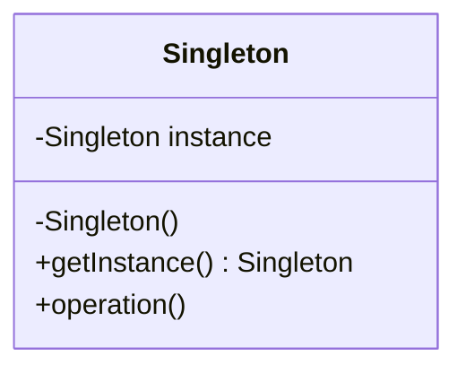

The constructor is private or otherwise inaccessible, so clients cannot create arbitrary instances. A class-level method returns the unique instance.

Exam caution: Singleton is easy to overuse. It can hide dependencies and make tests harder because shared state persists across calls. It is best reserved for resources that are genuinely unique in the application context or when the design explicitly needs one shared coordinator.

### Factory Method

Factory Method defines an operation for creating an object, but lets subclasses or concrete creators decide which class to instantiate.

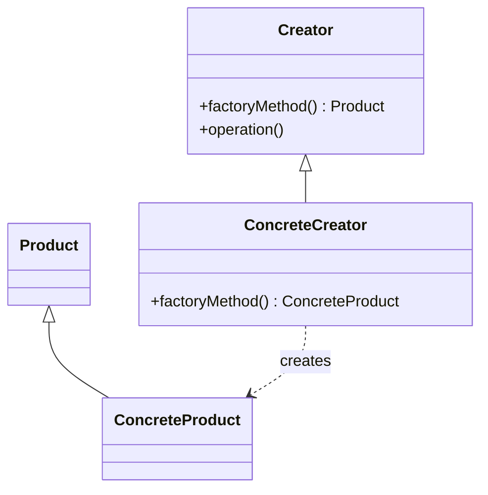

Use it when a framework or base class wants to work with a product abstraction but leave concrete product selection to subclasses.

### Builder

Builder separates complex construction from the final product representation. It is useful when constructors would have many parameters or when construction should follow a sequence.

Example idea: building a report may require title, sections, output format, metadata, and optional appendices. The client configures a `ReportBuilder`; the builder validates and creates the final report.

### Prototype

Prototype creates objects by copying an existing example object. The important distinction is between assignment/reference copy and actual cloning. A shallow copy duplicates the object's immediate fields; references inside the object still point to the same nested objects. A deep copy duplicates the nested object graph that should be independent.

### What to Emphasize in an Oral Answer

- Define creational patterns as patterns that abstract or control object creation instead of exposing direct constructor calls everywhere.
- Explain Singleton structure and caution: hidden/inaccessible constructor, class-level access point, one instance, but possible global state and testing difficulty.
- Explain Factory Method: creator works through a product abstraction while subclasses or concrete creators choose the concrete product.
- Explain Builder: step-by-step construction for complex objects, many optional parts, or validation before final creation.
- Include Prototype: create objects by cloning an existing example when the exact concrete type may be known only at runtime.
- State the shallow-versus-deep copy distinction for Prototype.
- Mention the tradeoff: less concrete coupling and clearer construction at the cost of extra structure.

::: details Suggested answer

Creational patterns control how objects are created. Singleton is used when there should be only one instance of a class. It hides the constructor and provides a class-level operation such as `getInstance` that returns the same instance to every caller. This controls instance count, but it must be used carefully because it can create global state and make testing harder.

Factory Method is used when code should depend on a product abstraction, not on concrete product classes. A creator defines a creation method, and subclasses or concrete creators decide which concrete product to instantiate. This keeps client code independent from concrete classes.

Builder is useful when object construction is complex or has many optional parts. Instead of a long constructor with many parameters, a builder collects construction steps and then creates the final object. This makes construction clearer and easier to validate.

Also include Prototype. Prototype creates new objects by copying an existing prototype object, which is useful when the exact type is known only at runtime. The important issue is copying semantics: shallow copy copies references to nested objects, while deep copy creates independent nested objects where necessary.

:::

## 9.7 Structural Design Patterns

Structural patterns compose objects or classes while preserving useful interfaces.

| Pattern | Problem | Solution idea | Consequences |
| --- | --- | --- | --- |
| Proxy | Access to an object must be controlled, delayed, remote, cached, or protected. | A proxy has the same interface as the real subject and forwards requests while adding control. | Transparent access control; extra indirection. |
| Decorator | Responsibilities should be added dynamically without modifying the original class. | Wrap a component in one or more decorators that implement the same interface and add behavior before/after delegation. | Flexible extension without subclass explosion; many wrappers can make tracing harder. |
| Composite | Clients should treat individual objects and groups uniformly. | Define a common component interface for leaves and composites; composite stores child components. | Uniform tree processing; may make leaf/composite operations less explicit. |

### Proxy

Describe Proxy as transparent wrapping of an interesting object. The proxy and real object share a common interface or ancestor, so clients believe they are using the real object.

Types of proxy:

| Proxy kind | Purpose |
| --- | --- |
| Virtual proxy | Delays creating or loading expensive objects, such as images in a document. |
| Remote proxy | Represents an object located elsewhere, such as remote method invocation. |
| Protection proxy | Controls access according to permissions. |
| Smart reference | Performs extra operations when the object is accessed. |
| Cache proxy | Stores expensive computed or downloaded results. |

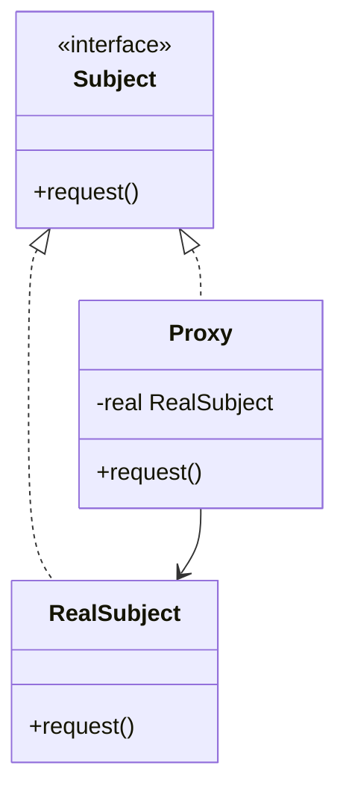

### Decorator

Decorator is transparent wrapping. A decorator has the same type as the decorated object and delegates to the wrapped component while adding behavior.

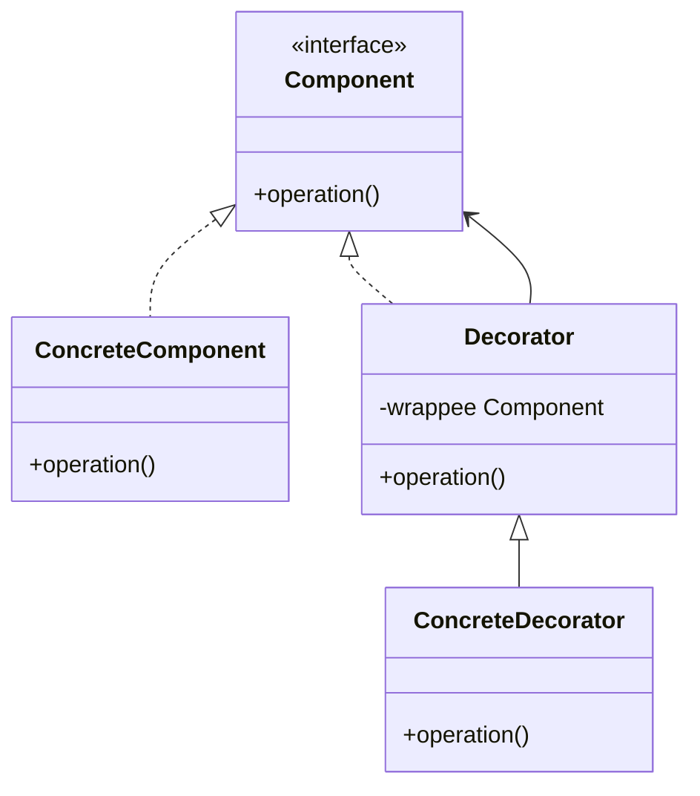

Decoration may extend existing operations or add additional behavior around them. A common benefit is avoiding a combinatorial explosion of subclasses for every possible combination of features.

### Composite

Composite represents part-whole trees. Leaves perform actual work, while composites contain child components and implement the same interface by delegating to the children.

Example: a file system can treat both files and directories as file-system entries. A file has size directly; a directory computes size from its children.

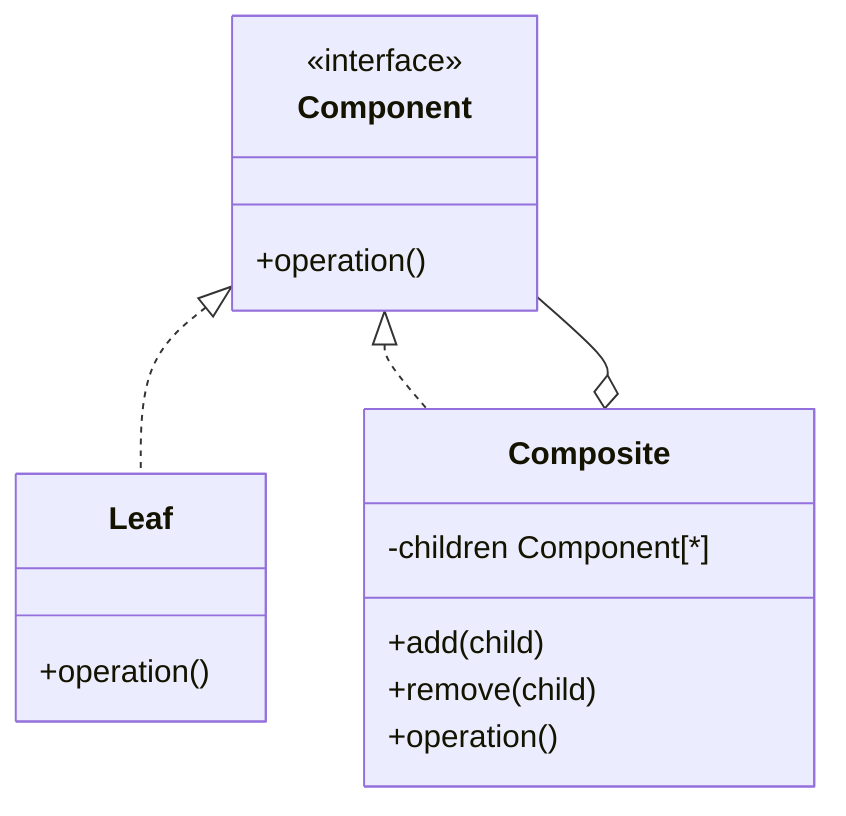

### What to Emphasize in an Oral Answer

- Define structural patterns as ways to compose classes/objects into larger structures while preserving useful interfaces.
- Explain Proxy as a same-interface substitute that controls, delays, protects, caches, or represents access to a real subject.
- Explain Decorator as same-interface wrapping that delegates to a component while adding behavior dynamically.
- Contrast Proxy and Decorator: both wrap transparently, but Proxy controls access and Decorator adds responsibilities.
- Explain Composite as a part-whole tree with a common component interface for leaves and composites.
- Mention the main tradeoff: uniform access and flexibility versus extra indirection or less obvious object chains.

::: details Suggested answer

Structural patterns describe how classes and objects are composed into larger structures. Proxy, Decorator, and Composite are central examples.

Proxy provides a substitute object with the same interface as the real object. Clients call the proxy as if it were the real object, but the proxy can delay loading, represent a remote object, check permissions, cache results, or perform extra reference-management work. The important idea is transparent control of access.

Decorator also uses transparent wrapping, but its purpose is extension rather than access control. A decorator implements the same interface as the wrapped component, delegates to it, and adds behavior before, after, or around the delegated call. This allows responsibilities to be combined dynamically without creating a separate subclass for every feature combination.

Composite is used for tree-like part-whole structures. It defines a common component interface for both leaves and composites. A leaf performs the operation directly, while a composite stores child components and usually delegates the operation to them. This lets clients treat individual objects and groups uniformly, such as files and directories through a common file-system-entry interface.

:::

## 9.8 Behavioral Design Patterns

Behavioral patterns organize algorithms, responsibilities, requests, and object communication.

| Pattern | Problem | Solution idea |
| --- | --- | --- |
| Strategy | Several interchangeable algorithms are possible. | Encapsulate each algorithm in a strategy object behind a common interface. |
| Template Method | Several algorithms share a skeleton but differ in steps. | Put the algorithm skeleton in a base class method and let subclasses override selected steps. |
| Observer | Many objects must react when one object changes. | Subject stores observers and notifies them on changes. |
| Iterator | Clients need traversal without knowing container representation. | Iterator object exposes operations for moving through elements. |
| Command | A request should be represented as an object. | Encapsulate operation, receiver, and parameters in a command object. |
| Chain of Responsibility | A request may be handled by one of several handlers. | Pass the request along a handler chain until one handles it or the chain ends. |
| State | Object behavior depends on internal state. | Move state-specific behavior into state objects and delegate to the current state. |

### Strategy

Strategy is appropriate when an operation has several algorithms that should be interchangeable. For example, a route planner may choose fastest, cheapest, or shortest path strategy. The context depends on a strategy interface, not concrete algorithms.

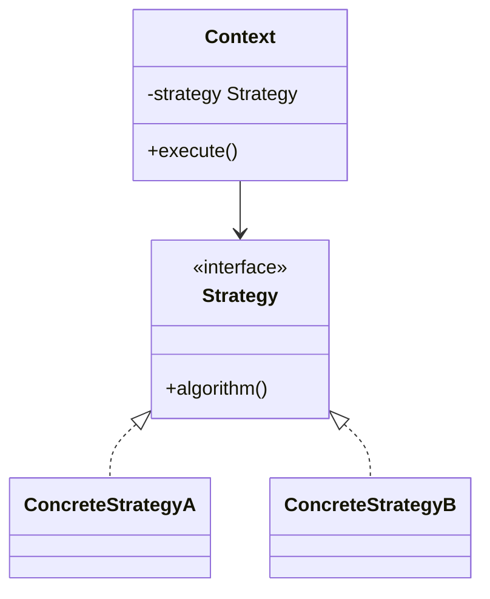

### Template Method

Template Method places the invariant algorithm skeleton in a superclass. Some steps are fixed, while selected primitive operations or hooks are implemented by subclasses. This supports reuse when the order of steps is stable but individual steps vary.

### Observer

Observer defines a one-to-many dependency: when the subject changes, registered observers are notified and update themselves.

Parts:

| Part | Role |
| --- | --- |
| Subject | Stores observers and provides register, unregister, and notify operations. |
| Observer | Defines an update operation for objects that react to subject changes. |

Observer variants:

| Variant | Meaning |
| --- | --- |
| Pull observer | The subject passes itself or a reference; the observer queries what changed. |
| Push observer | The subject sends changed data directly to the observer. |

### Iterator

Iterator separates traversal from container representation. A list, tree, or collection can expose `hasNext`/`next`-style traversal without exposing its internal nodes or arrays. This supports generic algorithms over different containers.

### Command

Command represents a request as an object. It can store receiver, parameters, and execution behavior. This is useful for queues, undo/redo, logging, menu actions, transaction-like operations, and delayed execution. Complex controllers are often designed with Command so operations can be encapsulated and extended.

### Chain of Responsibility

Chain of Responsibility passes a request through handlers. Each handler either handles the request or forwards it to the next handler. It is useful for event handling, middleware, validation pipelines, and authorization checks where the sender should not know exactly which object will handle the request.

### State

Include State. State lets an object's behavior change when its internal state changes. Instead of a large conditional over a state field, each state has its own object and behavior. A standard example is a TCP connection with states such as Listening, Established, and Closed.

Advantages:

| Advantage | Meaning |
| --- | --- |
| Encapsulation of state-dependent behavior | Each state's behavior is localized. |
| Easier new states | New state behavior can often be added with a new class. |
| Clearer code | Avoids large switch/case conditionals over state. |
| Shareable state objects | Stateless state objects may be reused. |

Disadvantage: the number of classes increases, so it should be used when state-dependent behavior is substantial enough to justify it.

### What to Emphasize in an Oral Answer

- Define behavioral patterns as patterns for algorithms, requests, responsibilities, control flow, and object communication.
- Contrast Strategy and Template Method: Strategy swaps whole algorithms via composition; Template Method fixes a skeleton and lets subclasses fill steps.
- Explain Observer as one-to-many notification, including push versus pull variants.
- Explain Iterator as traversal without exposing container representation.
- Explain Command as representing a request with operation, receiver, and parameters for queues, undo, logging, or UI actions.
- Explain Chain of Responsibility as passing a request through handlers until one handles it.
- Include State: state-dependent behavior moves into state objects instead of a large conditional, at the cost of more classes.

::: details Suggested answer

Behavioral patterns organize algorithms, requests, and communication among objects. Strategy encapsulates interchangeable algorithms behind a common interface. A context can use a sorting, routing, or pricing strategy without depending on the concrete algorithm. Template Method is different: it fixes the skeleton of an algorithm in a base class and lets subclasses override selected steps.

Observer defines a one-to-many dependency. A subject stores observers, and when the subject changes it notifies them. In a pull version, the observer queries the subject for details; in a push version, the subject sends the changed data directly. Iterator separates traversal from container representation, so clients can process elements without knowing whether the container is an array, list, or tree.

Command turns a request into an object containing the operation, receiver, and parameters. This is useful for queues, undo, logging, and UI actions. Chain of Responsibility passes a request along a chain of handlers until one handles it, which decouples the sender from the concrete handler. State moves state-dependent behavior into separate state objects, so an object can change behavior when its internal state changes without a large conditional structure. Together these patterns improve flexibility by moving variable behavior into explicit cooperating objects.

:::

## 9.9 Project Management, DevOps, Version Control, CI/CD, and Clean Code

Project management, DevOps, version control, CI/CD, and Clean Code are part of this subject because design also includes team workflow and delivery discipline.

### Project Management

Project management coordinates scope, time, cost, quality, risk, people, and communication. In software projects, it usually includes:

| Area | Meaning |
| --- | --- |
| Scope management | What the system must and must not include. |
| Schedule and iteration planning | When increments, milestones, releases, and reviews happen. |
| Risk management | Technical, organizational, staffing, security, integration, and requirement risks. |
| Work tracking | Tasks, owners, states, priorities, estimates, and dependencies. |
| Quality management | Definition of done, reviews, test strategy, acceptance criteria, and defect handling. |
| Communication | Keeping users, developers, testers, and maintainers aligned. |

### Version Control Systems

A version control system records the history of files and changes.

| Concept | Meaning |
| --- | --- |
| Revision / commit | A recorded change set with metadata such as author, time, message, and parent revision. |
| Repository | The stored project history and current branches/tags. |
| Branch | A movable line of development used for features, releases, fixes, or experiments. |
| Merge | Combining changes from different branches. |
| Conflict | A situation where changes cannot be combined automatically and require human resolution. |
| Tag | A named, fixed reference to a revision, often used for releases. |

Generations of version control systems:

| Generation | Model | Examples | Main property |
| --- | --- | --- | --- |
| Local | Version database is local to one machine. | RCS-style systems. | Simple but poor for teams. |
| Centralized | One central server stores authoritative history. | CVS, Subversion. | Clear central control, but the server is a bottleneck and offline work is limited. |
| Distributed | Each clone has full history; synchronization happens by push/pull/fetch/merge. This is distributed version control. | Git, Mercurial. | Strong branching, offline commits, flexible collaboration. |

### Branching and Conflict Resolution

Common branch purposes:

| Branch kind | Purpose |
| --- | --- |
| Main/trunk | Stable integration line, often deployable. |
| Feature branch | Isolates a feature until review/integration. |
| Release branch | Stabilizes a release while later development continues elsewhere. |
| Hotfix branch | Fixes an urgent production problem. |

GitFlow is a feature-branching model with long-lived `main` and `develop`, feature branches from `develop`, release branches for stabilization, and hotfix branches from production. It is useful for scheduled releases, but it can be heavy for teams practicing continuous delivery. Simpler trunk-based development keeps integration close to `main` and uses small changes, feature flags, and frequent CI.

A merge conflict should be resolved semantically, not only textually. The developer must understand both sides of a conflict, preserve intended behavior, run tests, and avoid deleting unrelated work.

### DevOps and CI/CD

DevOps joins development and operations around fast, reliable delivery. It emphasizes automation, observability, shared responsibility, infrastructure as code, continuous improvement, and short feedback loops.

| Practice | Meaning |
| --- | --- |
| Continuous integration (CI) | Developers integrate frequently; automated build and tests run on changes. |
| Continuous delivery (CD) | Software is kept releasable; deployment may require a manual approval step. |
| Continuous deployment | Every change that passes the pipeline can be deployed automatically. |
| Pipeline | Ordered automated steps such as install, lint, build, unit tests, integration tests, packaging, security checks, deployment. |
| Artifact | A built, versioned output such as a package, image, or release bundle. |
| Rollback/roll-forward | Operational strategy for recovering from bad releases. |

CI/CD makes design feedback faster: if a design causes tight coupling, fragile tests, or hard deployment, that pain appears frequently and can guide refactoring.

### Clean Code Principles

Clean Code principles are practical coding guidelines that support object-oriented design:

| Principle | Meaning |
| --- | --- |
| Intention-revealing names | Names should communicate purpose, not only type or implementation. |
| Small focused functions/classes | Keep one level of abstraction and one responsibility where practical. |
| Low coupling and high cohesion | Related behavior belongs together; unrelated modules should not depend unnecessarily. |
| Avoid duplication | Repeated knowledge should have one source of truth. |
| Prefer clarity over cleverness | Code should be understandable by maintainers. |
| Keep boundaries explicit | Isolate frameworks, I/O, databases, and external services behind clear interfaces. |
| Tests as design feedback | Tests should confirm behavior and make risky changes safer. |

Clean Code complements SOLID. SOLID gives design-level dependency and responsibility principles; Clean Code gives day-to-day readability and maintainability practices.

### What to Emphasize in an Oral Answer

- Frame the topic as design in a team/delivery context: project management, version control, DevOps, CI/CD, and Clean Code.
- Cover project management areas: scope, schedule, cost, quality, risk, people, communication, work tracking, and definition of done.
- Define version-control basics: commit/revision, repository, branch, merge, conflict, tag.
- Contrast local, centralized, and distributed version control; mention Git as distributed with full-history clones.
- Explain branching and conflict handling: feature/release/hotfix branches, GitFlow versus trunk-based development, and semantic conflict resolution.
- Distinguish CI, continuous delivery, and continuous deployment, and mention pipelines and artifacts.
- Summarize Clean Code as intention-revealing names, small focused units, high cohesion, low coupling, avoiding duplication, clear boundaries, and tests as design feedback.

::: details Suggested answer

The current topic also requires project management and DevOps. Project management coordinates scope, schedule, cost, quality, risks, people, communication, and work tracking. In software this means deciding what is in scope, planning iterations or releases, assigning tasks, managing risks, defining quality criteria, and keeping stakeholders aligned.

Version control records the history of changes. A revision or commit is a recorded change set. Branches are separate lines of development; merges combine them; conflicts occur when changes cannot be combined automatically. Local version control works on one machine, centralized systems such as Subversion use one central server, and distributed systems such as Git give every clone full history. Branching models include feature branches, release branches, hotfix branches, GitFlow, and simpler trunk-based development. Conflicts should be resolved semantically: understand both sides, preserve intended behavior, and run tests.

DevOps connects development and operations through automation and shared responsibility. Continuous integration means changes are integrated frequently and verified by automated build and tests. Continuous delivery keeps the system releasable, while continuous deployment can release automatically after the pipeline passes. Pipelines usually install dependencies, build, test, package, check quality or security, and deploy artifacts.

Clean Code is the coding discipline that supports maintainable design. It emphasizes intention-revealing names, small focused functions and classes, high cohesion, low coupling, avoiding duplication, clear boundaries, and tests as design feedback. Together, project management, version control, DevOps, CI/CD, and Clean Code make object-oriented design practical in a team setting.

:::
