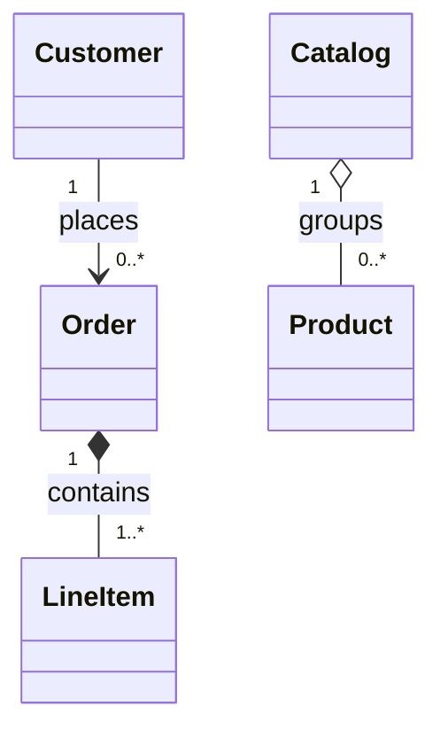
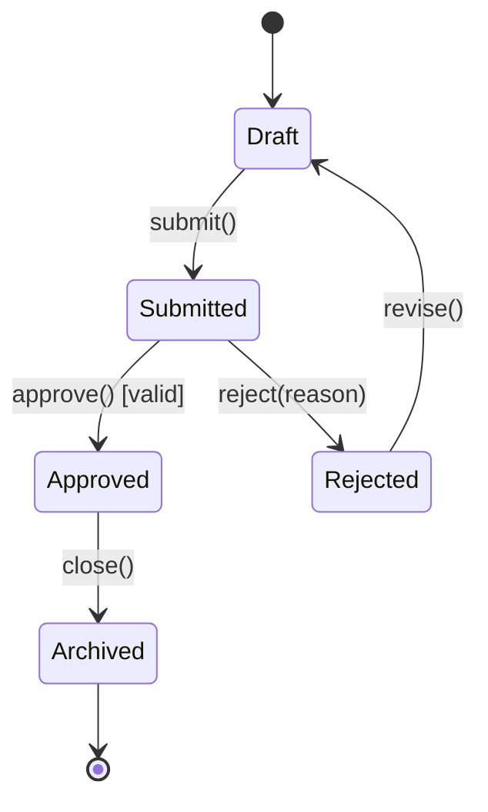
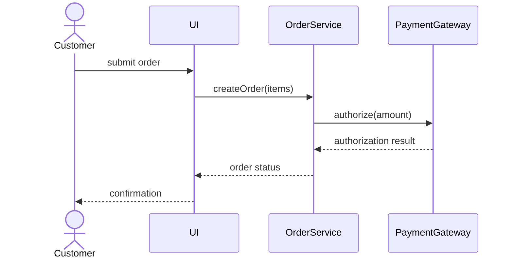

# 8. Object-Oriented Modeling

## 8.1 Views of Object-Oriented Modeling

Object-oriented modeling represents a system through several connected views. The point is not to draw every possible detail, but to choose a model that answers a particular question about the system.

Object-oriented thinking is based on three ideas:

| Idea               | Meaning for modeling                                                                                                                                                  |
| ------------------ | --------------------------------------------------------------------------------------------------------------------------------------------------------------------- |
| Abstraction        | Ignore details that are irrelevant at the current level and describe the system through stable concepts.                                                              |
| Abstract data type | Treat a type through its values and operations, not only through its storage representation. A type can be seen as a set of values plus operations over those values. |
| Inheritance        | Express specialization and reuse. A subclass can take over properties and operations from a superclass and refine them.                                               |

Inheritance explains two important runtime ideas that appear in object-oriented models. A variable may have a static type from its declaration and a dynamic type from the actual object it refers to at runtime. Polymorphism means the same operation can be applied through a common type to objects of different subclasses. Dynamic binding means the implementation selected for an operation depends on the object's dynamic type.

Main modeling perspectives:

| Perspective                      | Main question answered                                                                               | Typical diagram                                                                          |
| -------------------------------- | ---------------------------------------------------------------------------------------------------- | ---------------------------------------------------------------------------------------- |
| Use perspective                  | Who uses the system, and what services does the system provide?                                      | Use case diagram                                                                         |
| Structural or static perspective | What classes, objects, packages, and components exist, and how are they connected?                   | Class, object, package, component diagrams                                               |
| Dynamic perspective              | How does behavior unfold over time? What states can an object have, and what messages are exchanged? | State and sequence diagrams                                                              |
| Implementation perspective       | What replaceable software units provide and require services?                                        | Component diagram                                                                        |
| Environmental perspective        | What hardware and software resources are needed around the system?                                   | Often handled by deployment or architecture models, outside this subject's required list |

The static and dynamic views should be consistent. For example, a message in a sequence diagram should normally be supported by a relationship or navigability in the class or object model, and an object shown in an object diagram should instantiate a class from the class model.

### What to Emphasize in an Oral Answer

- Frame object-oriented modeling as selecting abstractions that describe structure, behavior, and externally visible services.
- Mention the OO foundations: abstraction, abstract data types, inheritance, polymorphism, static/dynamic type, and dynamic binding.
- Organize the answer by views: use perspective, static/structural perspective, dynamic perspective, implementation perspective, and environmental concerns.
- Stress that each diagram answers a different question; no single diagram is the whole model.
- State the consistency requirement between views, especially messages in dynamic diagrams matching possible relationships/interfaces in static diagrams.
- Use a small example if needed: class composition in a class diagram should be reflected by compatible object links in object diagrams.

::: details Suggested answer

Object-oriented modeling is the process of describing a system through objects, classes, relationships, behavior, and externally visible services. It is based on abstraction: at each level we keep the details that matter for understanding the system and hide the rest. The object-oriented foundation is that a type is understood through its values and operations, and inheritance lets us express specialization and reuse between types.

The most important point is that one diagram does not answer every question. The use perspective asks who uses the system and what services it provides. This is captured by use case diagrams. The static perspective asks what structural units exist and how they are related; class, object, package, and component diagrams belong here. The dynamic perspective asks how behavior changes over time; state diagrams describe the lifecycle of one object or component, while sequence diagrams describe message exchange between cooperating objects.

These views must be consistent. If the class model says an order is composed of line items, then object diagrams should show concrete orders linked to concrete line items in a compatible way. If a sequence diagram sends a message from one object to another, the static model should explain how such communication is possible. Inheritance also connects the models: it supports polymorphism, where a variable of a superclass type can refer to a subclass object, and dynamic binding, where the operation implementation is chosen from the actual runtime type. The goal of object-oriented modeling is therefore to give a coherent picture of structure, behavior, and user-visible functionality before or during implementation.

:::

## 8.2 Static Model Diagrams

Static model diagrams describe structure rather than step-by-step behavior. They answer what the system is made of, how the elements are connected, and how those elements are grouped or implemented.

| Diagram           | Purpose                                                                   | Main notation and semantics                                                                                            | What it answers                                                                                        |
| ----------------- | ------------------------------------------------------------------------- | ---------------------------------------------------------------------------------------------------------------------- | ------------------------------------------------------------------------------------------------------ |
| Class diagram     | Describes the type-level structure of the solution.                       | Classes with attributes and operations; relationships such as inheritance, association, aggregation, and composition.  | What classes exist, what responsibilities do they have, and how are their instances allowed to relate? |
| Object diagram    | Shows a concrete snapshot of objects at one moment.                       | Objects written as `objectName : ClassName`, underlined in UML notation; attribute values and links between objects.   | What concrete objects and links exist in this example state?                                           |
| Package diagram   | Groups model elements and shows dependencies between namespaces.          | Tabbed packages, nested packages, qualified names using `::`, dashed dependency arrows, `<<import>>` and `<<access>>`. | How is the model organized, and which parts depend on or import which others?                          |
| Component diagram | Shows replaceable implementation or subsystem units and their interfaces. | Components, ports, provided interfaces, required interfaces, and connectors.                                           | Which software units provide services, which services do they require, and how can units be replaced?  |

#### Class Diagram

A class diagram is the central static model. A class is usually drawn as a rectangle with three compartments:

| Compartment | Content                                                                                                                                                                          |
| ----------- | -------------------------------------------------------------------------------------------------------------------------------------------------------------------------------- |
| Name        | The class name. An abstract class may be marked as abstract, often by italic text or a stereotype.                                                                               |
| Attributes  | Data fields in the form `attributeName : Type`. Visibility may be shown with `+` public, `-` private, and `#` protected. Static attributes are often underlined in UML notation. |
| Operations  | Methods in the form `operationName(parameterName : Type) : ReturnType`. Visibility, abstractness, and staticness can be marked similarly to attributes.                          |

Important class relationships:

| Relationship                  | Meaning                                                                                                                          | UML idea                                               |
| ----------------------------- | -------------------------------------------------------------------------------------------------------------------------------- | ------------------------------------------------------ |
| Inheritance or generalization | A subclass specializes a superclass and inherits its public abstract contract.                                                   | Solid line with hollow triangle toward the superclass. |
| Association                   | A general structural connection between classes. It may have a name, direction, roles, multiplicities, and navigability.         | Solid line, sometimes with arrowheads and labels.      |
| Aggregation                   | A loose whole-part relationship where parts can exist independently and may be shared.                                           | Association with a hollow diamond at the whole.        |
| Composition                   | A strong whole-part relationship where the part's lifetime is tied to the whole, and a part belongs to at most one whole object. | Association with a filled diamond at the whole.        |

Multiplicity states how many instances may participate in a relationship. Common examples are `1`, `0..1`, `1..*`, `0..*`, and exact ranges such as `1..4`. Navigability says which object can directly know or reach the other. If it is not shown, a bidirectional association is often assumed in simple course-level notation.

In this example, a customer may place many orders, an order is composed of one or more line items, and a catalog aggregates products in a looser way.

#### Object Diagram

An object diagram is an instance-level snapshot. It shows concrete objects as nodes and links as edges. An object is written in the form `objectName : ClassName`; the object name may be omitted when identity is not important. The object box may also show concrete attribute values such as `status = paid`.

Object diagrams must conform to the class diagram. If the class diagram permits one customer to have many orders, an object diagram may show `alice : Customer` linked to `order17 : Order` and `order18 : Order`. Inheritance itself is not usually meaningful as a link between individual objects; object diagrams show links that instantiate associations, aggregations, or compositions.

Object diagrams are useful for examples, test situations, and explaining a difficult structure because they replace general multiplicity rules with a concrete state.

#### Package Diagram

A package diagram organizes model elements. A package may contain classes, use cases, components, or other packages. Packages form a tree-like hierarchy: a model element belongs to one package, and the package name contributes to the element's namespace.

Qualified names use package paths, commonly written with `::`, for example `Sales::Order`. This avoids ambiguity when different packages contain elements with the same local name.

Package dependencies are shown with dashed arrows. Import relationships refine dependency:

| Relationship | Meaning                                                                                                        |
| ------------ | -------------------------------------------------------------------------------------------------------------- |
| `<<import>>` | Public import. The importing package can use the imported element and may re-export it.                        |
| `<<access>>` | Private import. The importing package can use the imported element, but it does not make it visible to others. |

Package diagrams answer organization and dependency questions. They are especially useful when the model is too large to understand as one flat set of classes.

#### Component Diagram

A component is a replaceable unit that groups services behind interfaces. It may represent a low-level implementation unit, a deployable library, or a complete subsystem such as accounting. A component can contain smaller components.

The key semantic idea is interface-based replacement. If another component provides the same interface with the same services, it can replace the original from the viewpoint of its clients. A provided interface is often drawn as a small circle, while a required interface is drawn as a socket or semicircle. Ports and connectors show where services enter and leave the component.

Component diagrams connect object-oriented modeling to implementation architecture. They answer which units provide services, which units depend on services, and where stable interface boundaries exist.

### What to Emphasize in an Oral Answer

- Define static diagrams as structural views: what elements exist, how they relate, and how they are grouped.
- Cover the class diagram as the central type-level diagram: compartments for name, attributes, operations, and relationships.
- Name the key class relationships and distinctions: inheritance, association, aggregation, composition, multiplicity, and navigability.
- Contrast class and object diagrams: classes describe allowed structure; object diagrams show one concrete snapshot with objects, attribute values, and links.
- Explain package diagrams as namespace/dependency organization, including qualified names and `<<import>>` versus `<<access>>`.
- Explain component diagrams as implementation-facing structure with replaceable components, provided/required interfaces, ports, and connectors.
- Finish with the consistency point: object, package, and component views should not contradict the class-level model.

::: details Suggested answer

Static model diagrams describe the structure of an object-oriented system. The most important one is the class diagram. It shows classes as types, with attributes and operations, and it shows relationships between those classes. Inheritance expresses specialization, associations express general structural connections, aggregation expresses a loose whole-part relationship, and composition expresses strong containment where the part's lifetime is controlled by the whole. Multiplicity, roles, direction, and navigability refine what object links are allowed.

An object diagram is the instance-level counterpart of a class diagram. Instead of saying that customers can have orders in general, it shows concrete objects at a particular moment, such as one customer object linked to two order objects. The object box can contain actual attribute values. This makes object diagrams useful for examples and for checking whether a class diagram permits the intended object structure.

Package diagrams organize the model into namespaces and dependency groups. A package may contain classes, use cases, components, or other packages, and qualified names such as `Sales::Order` identify elements across package boundaries. Dashed dependencies and import relationships show which package needs which other package. Public import can re-export an element, while private access is only for the importing package.

Component diagrams move the static view toward implementation. A component is a replaceable unit that provides and requires services through interfaces. Ports and connectors show how components communicate, while provided and required interfaces show what each unit offers and needs. The practical value is that the model identifies stable interface boundaries: a component can be replaced if another component provides the same services through the same interface.

Together these diagrams answer different structural questions. Class diagrams define the type structure, object diagrams show example runtime snapshots, package diagrams organize the model, and component diagrams describe replaceable service-providing units.

:::

## 8.3 Dynamic Model Diagrams

Dynamic diagrams describe behavior. They answer how the system changes over time, either from the viewpoint of one object's lifecycle or from the viewpoint of cooperation between objects.

| Diagram          | Purpose                                                                                     | Main notation and semantics                                                                                   | What it answers                                                         |
| ---------------- | ------------------------------------------------------------------------------------------- | ------------------------------------------------------------------------------------------------------------- | ----------------------------------------------------------------------- |
| State diagram    | Describes the states of one object or component and the events that move it between states. | States as rounded rectangles; initial and final states; transitions labeled with events, guards, and actions. | What states can this object have, and which events cause state changes? |
| Sequence diagram | Describes the time order of messages between objects or roles.                              | Participants/lifelines, activation bars, messages, parameters, returns, and ordering from top to bottom.      | Who communicates with whom, in what order, and for what operation?      |

#### State Diagram

A state diagram is a directed graph. Nodes are states, and edges are transitions caused by events. A state represents a condition that persists while the object's relevant attribute values satisfy that state's invariant. Special pseudo-states mark the start and possible termination of the behavior.

A transition label is commonly read as:

`event(parameters) [guard] / action`

The event triggers the transition. The guard is a condition that must be true for the transition to be taken. The action is work performed as part of the transition. Course-level notation may also emphasize that events are ordered and may have preconditions.

This kind of diagram is useful when correctness depends on allowed lifecycle transitions. For example, an order should not be archived before it has been approved, and a rejected document may need revision before it can be submitted again.

#### Sequence Diagram

A sequence diagram shows collaboration as messages ordered in time. Participants are shown horizontally, and each participant has a vertical lifeline. Time flows downward. An activation bar marks the period when a participant is executing an operation or is under another object's control. A message arrow shows information or control transfer from sender to receiver, usually labeled with a method or message name and optional parameters.

Sequence diagrams are useful because they expose responsibility allocation. They show which object initiates an operation, which objects must cooperate, which messages must happen before later messages, and where a missing association or interface may be needed in the static model.

### What to Emphasize in an Oral Answer

- Define dynamic diagrams as behavior-over-time views rather than structural snapshots.
- Explain state diagrams as lifecycle models for one object or component: states, initial/final pseudo-states, events, guards, actions, and transitions.
- Use the transition-label form `event(parameters) [guard] / action` if notation is expected.
- Explain sequence diagrams as scenario/collaboration models: participants, lifelines, activation bars, messages, replies, and top-to-bottom time order.
- Contrast their use: state diagrams answer legal lifecycle transitions; sequence diagrams answer who communicates with whom in a scenario.
- Mention consistency with static diagrams: participants and messages should be justified by classes, associations, interfaces, or components.

::: details Suggested answer

Dynamic model diagrams describe behavior over time. The two central diagrams here are state diagrams and sequence diagrams, and they answer different questions.

A state diagram focuses on one object or component. It shows the possible states of that object and the transitions between them. A state is a condition that remains true while the object's relevant attribute values satisfy an invariant. A transition is caused by an event, may be restricted by a guard condition, and may perform an action. Initial and final states mark the boundary of the lifecycle. This kind of diagram is useful when the allowed order of events matters, for example when an order can move from draft to submitted, then to approved or rejected, and only later to archived.

A sequence diagram focuses on cooperation between objects. It places participants across the top, gives each participant a lifeline, and orders messages from top to bottom. Activation bars show when an object is executing or is under control, and message arrows show requests, calls, replies, or information transfer. The sequence diagram therefore explains how a scenario is carried out: who asks whom to do something, what messages are exchanged, and in which order.

The two diagrams complement each other. A state diagram is best when the central issue is one object's lifecycle and legal transitions. A sequence diagram is best when the central issue is a scenario involving several objects. Both must be compatible with the static model: the objects and messages in the dynamic diagrams should be explainable by classes, associations, interfaces, or components in the static diagrams.

:::

## 8.4 Use Case Diagram

A use case diagram describes the system from the user's viewpoint. It shows what services the system provides, not how those services are implemented internally.

Main elements:

| Element         | Meaning                                                                                                                                                    | Notation                                                    |
| --------------- | ---------------------------------------------------------------------------------------------------------------------------------------------------------- | ----------------------------------------------------------- |
| Actor           | An external entity that interacts with the system. It may be a person, another program, another subsystem, or a class outside the modeled system boundary. | Stick figure or named external role.                        |
| Use case        | A service unit or function of the system, usually a sequence of actions through which the system cooperates with actors.                                   | Oval with a verb phrase or service name.                    |
| System boundary | The rectangle that separates the modeled system from external actors.                                                                                      | Rectangle enclosing use cases.                              |
| Association     | Communication between an actor and a use case.                                                                                                             | Simple line.                                                |
| Generalization  | One actor or use case is a more specialized form of another.                                                                                               | Solid line with hollow triangle toward the general element. |
| `<<include>>`   | A use case always includes behavior factored into another use case. It is useful for mandatory shared behavior.                                            | Dashed arrow toward the included use case.                  |
| `<<extend>>`    | A use case conditionally adds behavior to another use case at extension points. It is useful for optional or exceptional behavior.                         | Dashed arrow toward the extended use case.                  |

What each part answers:

| Question                                                 | Use case diagram answer      |
| -------------------------------------------------------- | ---------------------------- |
| Who is outside the system but interacts with it?         | Actors.                      |
| What services does the system expose?                    | Use cases.                   |
| What is inside the modeled system?                       | System boundary.             |
| Which actors use which services?                         | Actor-use case associations. |
| Which behavior is shared and mandatory?                  | `<<include>>`.               |
| Which behavior is optional, conditional, or exceptional? | `<<extend>>`.                |
| Which actors or use cases are specializations of others? | Generalization.              |

Use cases should be named from the actor's goal, such as `Withdraw cash`, `Place order`, or `Generate report`, rather than from internal implementation steps. They are especially helpful early in analysis because they define the visible service inventory before internal class and component decisions are made.

### What to Emphasize in an Oral Answer

- Frame a use case diagram as a user/external viewpoint: what services the system offers, not how they are implemented.
- Define the main elements: actors, use cases, system boundary, and actor-use-case associations.
- Emphasize actor breadth: a person, external system, subsystem, or outside class can be an actor.
- Explain relationship distinctions: generalization specializes; `<<include>>` is mandatory shared behavior; `<<extend>>` is optional or conditional behavior at extension points.
- Mention naming: use cases should be goal-oriented service names such as `Place order`, not internal implementation steps.
- Close with the boundary role: it identifies external roles, visible services, and shared/optional behavior before class or component design.

::: details Suggested answer

A use case diagram describes a system from the viewpoint of its users. Its purpose is to show what services the system provides and who uses those services, while deliberately avoiding internal implementation details.

The external users of the system are actors. An actor can be a person, another software system, a subsystem, or any outside role that communicates with the modeled system. The system boundary is drawn as a rectangle, and the use cases inside it are the services or function units the system offers. A use case represents a goal-oriented sequence of actions, such as withdrawing cash, placing an order, or generating a report. An association line between an actor and a use case says that the actor participates in that service.

Use case relationships refine the service model. Generalization says that one actor or use case is a specialized version of another. Include means that one use case always reuses another use case's behavior, so it is good for mandatory common steps. Extend means that one use case optionally or conditionally adds behavior to another at extension points, so it is good for exceptional or alternative behavior.

The use case diagram answers functional boundary questions. It tells us who interacts with the system, what goals the system supports, which behavior is shared, and which behavior is optional. It does not decide which classes or components implement the behavior. That is why it works well with the other diagrams: use cases define visible services, class and component diagrams define structure, and sequence and state diagrams explain how selected services behave.

:::

## 8.5 Related Dynamic Diagrams

Collaboration, communication, and activity diagrams are related dynamic views that complement state and sequence diagrams.

| Diagram               | Role                                                                               | Compact meaning                                                                                                       |
| --------------------- | ---------------------------------------------------------------------------------- | --------------------------------------------------------------------------------------------------------------------- |
| Collaboration diagram | Shows cooperating objects and their links, with numbered messages.                 | Similar scenario information to a sequence diagram, but emphasizing object links rather than time as a vertical axis. |
| Activity diagram      | Shows a workflow as actions, decisions, forks/joins, and control flow.             | Useful for business processes or algorithm-like behavior where the control flow matters more than object lifelines.   |
| Communication diagram | Shows interactions among objects with message numbering over a structural network. | A UML successor/variant close to collaboration diagrams; emphasizes who communicates with whom.                       |

The key relationship is the viewpoint difference. Sequence diagrams emphasize temporal order, collaboration/communication diagrams emphasize the network of participating objects, and activity diagrams emphasize workflow/control flow.

### What to Emphasize in an Oral Answer

- Identify collaboration, communication, and activity diagrams as related dynamic views.
- Contrast collaboration/communication diagrams with sequence diagrams: they show similar interactions but emphasize object links and numbered messages rather than vertical time.
- Explain activity diagrams as workflow/control-flow diagrams with actions, decisions, forks, joins, and branches.
- Keep the distinction clear: sequence focuses on temporal order, communication on participating object network, activity on process flow.

::: details Suggested answer

The dynamic-model family also includes collaboration, communication, and activity diagrams. They are related to the central dynamic diagrams but emphasize different aspects. A sequence diagram shows messages in time order using lifelines. A collaboration or communication diagram represents a similar interaction but focuses more on the objects and links participating in the scenario, with message numbering to recover order. An activity diagram represents workflow: actions, decisions, forks, joins, and branches. These diagrams are useful background, while state diagrams and sequence diagrams remain central.

:::
