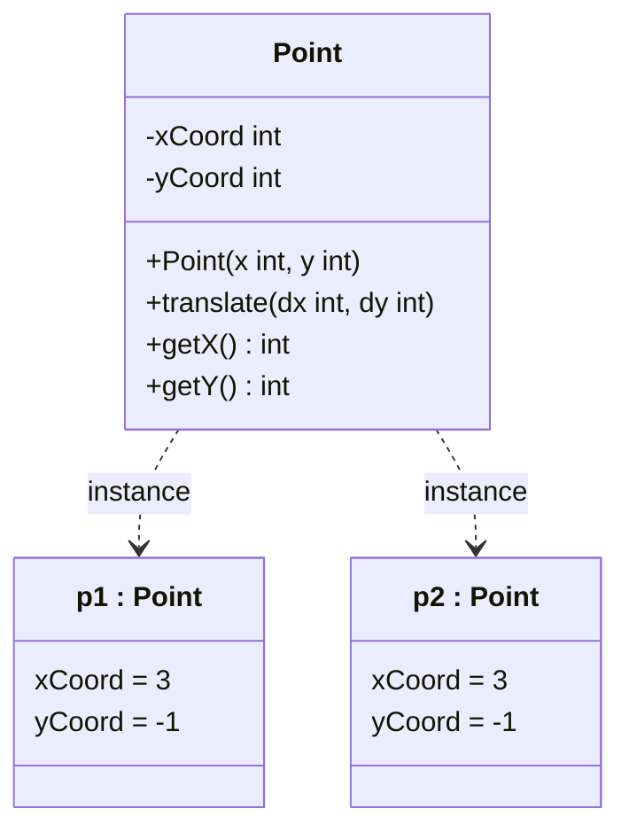
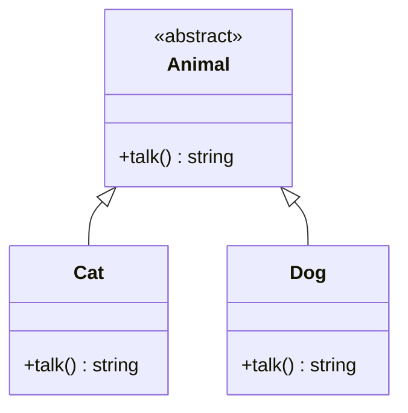
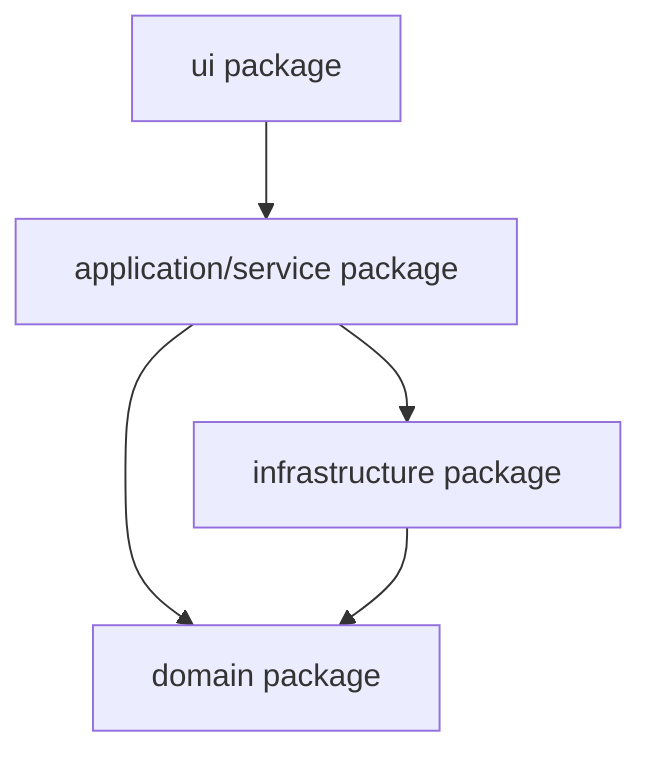

# 11. Object-Oriented Programming Languages

This subject covers class-based programming-language concepts, including abstraction, object interfaces, static members, substitutability, binding, polymorphism, program structure, copying, and testing.

## 11.1 Classes, Objects, and Instantiation

A class is a user-defined type from which objects, also called instances, are created. A class describes the state and behavior of its objects.

| Concept            | Meaning                                                                      |
| ------------------ | ---------------------------------------------------------------------------- |
| Class              | A type definition containing attributes/data members and methods/operations. |
| Object / instance  | A runtime entity created from a class. It has identity, state, and behavior. |
| Attribute / field  | A named piece of state stored by an object or class.                         |
| Method / operation | Behavior that can be requested from an object or class.                      |
| Message            | A request sent to an object; the object responds by executing an operation.  |

The object-oriented paradigm builds programs from objects that communicate through operations. The main OOP principles are encapsulation, inheritance, and polymorphism.

Instantiation is the creation of an object from a class. The runtime allocates storage, initializes fields, and invokes a constructor. The new object receives its own identity. Two objects can have the same field values but still be different objects.



Here `p1` and `p2` can be value-equal points but still have different object identity.

### What to Emphasize in an Oral Answer

- Define a class as a user-defined type containing fields/attributes and methods/operations.
- Define an object as a runtime instance with identity, state, and behavior.
- Mention messages as requests sent to objects; the receiver responds by executing an operation.
- Explain instantiation steps: allocate storage, initialize fields, call a constructor, and create a distinct identity.
- Include the equality/identity distinction: two objects may have equal field values but still be different instances.
- Name the main OOP principles in context: encapsulation, inheritance, and polymorphism.

::: details Suggested answer

A class is a user-defined type that describes what state and behavior its objects have. It contains attributes or fields for state and methods or operations for behavior. An object, also called an instance, is a runtime entity created from a class. It has identity, state, and behavior.

Object-oriented programs can be viewed as objects communicating through messages. One object sends a request to another object, and the receiving object executes the appropriate operation. This is why classes define not only data representation, but also the operations that may be requested.

Instantiation is the act of creating an object from a class. The runtime allocates storage for the new object, initializes its fields, and calls a constructor. The object then has its own identity. Two objects may store the same values but still be different instances. This distinction between a class as a type description and an object as a runtime instance is the foundation of object-oriented languages.

:::

## 11.2 Encapsulation, Members, and Constructors

Encapsulation means grouping related data and operations in one program unit. In OOP that unit is usually the class/object: the object's state is kept together with the methods that maintain it.

| Idea            | Meaning                                                           |
| --------------- | ----------------------------------------------------------------- |
| Encapsulation   | Data and methods are packaged together.                           |
| Object state    | The current values of the object's data members.                  |
| Object behavior | The methods through which the object responds to requests.        |
| Invariant       | A condition that should remain true for every valid object state. |

Members are named class contents:

| Member kind                           | Meaning                                                           |
| ------------------------------------- | ----------------------------------------------------------------- |
| Data member / field                   | Stores state.                                                     |
| Method member                         | Defines behavior.                                                 |
| Constructor                           | Initializes a newly created object.                               |
| Destructor / finalizer-like operation | Releases resources or cleanup logic in languages that support it. |

A constructor is the initialization operation of an object. It runs when a new object is instantiated. A default constructor has no parameters. Overloaded constructors provide several valid initialization forms. A good constructor should establish the object's invariant, so the object starts its life in a valid state.

Destructors are important in resource-managing languages. In C++, a destructor runs before an object is destroyed and often releases resources acquired by the constructor. In garbage-collected languages, finalization is usually nondeterministic and should not be treated like C++ deterministic destruction. Non-memory resources such as files and sockets should normally be released explicitly or by scoped resource constructs.

### What to Emphasize in an Oral Answer

- Define encapsulation as packaging state and operations together so methods maintain the object's invariant.
- Name member kinds: data fields, methods, constructors, and destructors/finalizers or cleanup operations where supported.
- Explain constructors as initialization operations, including default and overloaded constructors.
- State that a constructor should establish a valid initial state and preserve the class invariant.
- Contrast deterministic destructors, especially C++ RAII, with nondeterministic finalization in garbage-collected languages.
- Mention that non-memory resources such as files, sockets, and locks need explicit or scoped cleanup.

::: details Suggested answer

Encapsulation means that related data and operations are placed into one unit. In object-oriented programming this unit is the class and its objects. The object's state is stored in fields, and its behavior is provided by methods. This keeps the representation and the operations that maintain it close together.

Members are the contents of a class: fields, methods, constructors, and sometimes destructors or similar cleanup operations. A constructor initializes a new object when it is instantiated. A default constructor has no parameters, while overloaded constructors allow several initialization forms. A constructor should establish the object's invariant so that the object starts in a valid state.

Some languages have destructors. In C++, a destructor is called deterministically before an object is destroyed and is often used to release resources. In garbage-collected languages, memory reclamation is automatic but cleanup timing is usually not deterministic, so files, locks, sockets, and similar resources should still be managed explicitly. Encapsulation, constructors, and resource management together make objects usable as reliable units.

:::

## 11.3 Instance and Static Members

The topic explicitly names instance and static members. Static members include static data members and static methods; static data members are shared by instances of the class.

| Member type         | Belongs to | Receiver object needed? | Typical use                                                           |
| ------------------- | ---------- | ----------------------- | --------------------------------------------------------------------- |
| Instance field      | One object | Yes                     | Object-specific state such as a point's coordinates.                  |
| Instance method     | One object | Yes                     | Behavior that reads or modifies the receiver object's state.          |
| Static/class field  | The class  | No                      | Shared counters, constants, registries, or class-level configuration. |
| Static/class method | The class  | No                      | Factory helpers, utilities, or operations over static data.           |

Instance methods usually have an implicit receiver such as `this` or `self`. Static methods do not operate on a receiver object. They can often be called before any instance is created.

Static members are useful but can create risks:

| Risk                 | Explanation                                                                                   |
| -------------------- | --------------------------------------------------------------------------------------------- |
| Shared mutable state | All users of the class can observe or change the same state.                                  |
| Hidden dependency    | Code can depend on global-like class state without explicit parameters.                       |
| Testing difficulty   | Static mutable state may leak between tests.                                                  |
| Dispatch difference  | Static methods are usually not dynamically dispatched like ordinary virtual instance methods. |

### What to Emphasize in an Oral Answer

- Start with the ownership distinction: instance members belong to one object, while static/class members belong to the class.
- Explain instance fields and instance methods with the implicit receiver `this` or `self`.
- Explain static fields as shared class-level state and static methods as operations callable without a receiver object.
- Give typical uses: constants, counters, registries, factories, utilities, and class-level configuration.
- Name the risks of static mutable state: global-like coupling, hidden dependencies, test leakage, and concurrency concerns.
- Mention dispatch: static methods are usually not dynamically dispatched like virtual instance methods.

::: details Suggested answer

Members can belong either to individual objects or to the class itself. Instance fields are stored separately for each object, and instance methods operate on a particular receiver object, often through an implicit `this` or `self` parameter. For example, each `Point` object has its own coordinates.

Static or class members belong to the class. A static field is shared by all instances, and a static method can usually be called without creating an object. Static members are useful for constants, counters, factory helpers, and operations that do not depend on one receiver object's state.

The danger is that static mutable state behaves like global state. It can create hidden dependencies and make tests interfere with each other. Also, static methods are usually not dynamically dispatched like ordinary virtual instance methods. So instance members model object-specific behavior, while static members model class-level data or operations and should be used deliberately.

:::

## 11.4 Information Hiding and Visibility Modifiers

Information hiding means that an object hides its representation and selected operations. Clients use controlled public operations instead of depending on private data layout.

| Visibility               | Meaning                                                                        |
| ------------------------ | ------------------------------------------------------------------------------ |
| `public`                 | Visible to all clients.                                                        |
| `private`                | Visible only inside the defining class or its language-specific private scope. |
| `protected`              | Visible inside the class and descendants, depending on language rules.         |
| package/default/internal | Visible inside a package, module, or assembly.                                 |

Common visibility modifiers appear in Java, C++, and C#. Python often relies on conventions such as leading underscores rather than strict enforcement.

Visibility is not the same as scope. Scope asks where a name can be referenced. Visibility/access control asks who is allowed to use a member even if its name is known.

Information hiding supports:

| Benefit              | Explanation                                                             |
| -------------------- | ----------------------------------------------------------------------- |
| Refactoring          | Internal representation can change while the public API remains stable. |
| Invariant protection | Clients cannot freely place the object into invalid states.             |
| Lower coupling       | Clients depend on behavior, not representation.                         |
| Clear API            | The public surface communicates what the class promises.                |

### What to Emphasize in an Oral Answer

- Define information hiding as keeping representation and selected operations inaccessible to clients.
- Explain the design goal: clients depend on a stable public API, not on private data layout.
- Name common visibility levels: public, private, protected, and package/module/internal.
- Mention language variation, including convention-based privacy such as Python leading underscores.
- Distinguish visibility/access control from scope/name lookup.
- State the benefits: invariant protection, lower coupling, easier refactoring, and a clearer object interface.

::: details Suggested answer

Information hiding means that an object hides its internal representation and selected operations from clients. Clients should work through the public interface instead of directly modifying private state. This protects invariants, lowers coupling, and makes refactoring possible.

Visibility modifiers are language mechanisms for information hiding. Public members are visible to all clients. Private members are visible only inside the defining class or its private scope. Protected members are available to descendants according to the language's rules. Many languages also have package, module, or internal visibility. Python-like languages may rely more on naming conventions, such as a leading underscore, than on strict enforcement.

Visibility should be distinguished from scope. Scope is where a name can be referred to; visibility is whether code is allowed to access a member. The design goal is to expose a stable API while keeping representation decisions private.

:::

## 11.5 Overloading

Overloading means defining several functions or methods with the same name but different signatures.

| Property          | Meaning                                                                                                                 |
| ----------------- | ----------------------------------------------------------------------------------------------------------------------- |
| Signature         | Usually the name plus number and types of parameters; in some languages, such as Ada, return type can also participate. |
| Binding time      | Usually compile time.                                                                                                   |
| Selection rule    | Actual argument types and count determine which overload is called.                                                     |
| Error cases       | No matching overload or several equally good overloads.                                                                 |
| Polymorphism kind | Ad-hoc polymorphism.                                                                                                    |

For example, overloaded `Translate` operations may accept either coordinate deltas or a `Point` delta.

Overloading must be contrasted with overriding:

| Feature               | Overloading                                               | Overriding                                              |
| --------------------- | --------------------------------------------------------- | ------------------------------------------------------- |
| Where variants appear | Same scope/class or overload set.                         | Class hierarchy.                                        |
| Signature             | Same name, different parameters.                          | Same or compatible signature.                           |
| Selection             | Usually compile-time.                                     | Usually run-time for dynamically dispatched methods.    |
| Purpose               | Same conceptual operation with different parameter forms. | Subclass-specific implementation of inherited behavior. |

### What to Emphasize in an Oral Answer

- Define overloading as several functions or methods with the same name but different signatures.
- Explain signature contents: usually parameter number and types, and in some languages possibly return type.
- State the selection rule: actual argument types/count choose the overload, usually at compile time.
- Mention error cases: no matching overload or several equally good matches.
- Identify overloading as ad-hoc polymorphism.
- Contrast it explicitly with overriding, which occurs in an inheritance hierarchy with the same or compatible signature and often runtime dispatch.

::: details Suggested answer

Overloading means that several methods or functions have the same name but different signatures. A signature usually contains the method name and the number and types of parameters, although some languages also include the return type. When a call is compiled, the compiler chooses the overload whose signature matches the actual arguments. If none matches, or more than one is equally good, this is an error.

Overloading is a form of ad-hoc polymorphism: the same operation name has several separately defined implementations. It is useful when the same conceptual action can be parameterized in different ways, such as translating a point by two coordinates or by another point.

It should not be confused with overriding. Overloading selects among different signatures, usually at compile time. Overriding occurs in an inheritance hierarchy when a subclass redefines an inherited method with the same or compatible signature, and dynamic binding may choose the implementation at runtime.

:::

## 11.6 Memory Management and Garbage Collection

lifetime is the part of program execution during which storage allocated for a variable belongs to that variable.

| Lifetime kind      | Storage area                        | Meaning                                                                                |
| ------------------ | ----------------------------------- | -------------------------------------------------------------------------------------- |
| Automatic lifetime | Execution stack / activation record | Local block variables usually live from declaration to the end of the enclosing block. |
| Static lifetime    | Static/global storage               | Global and static variables exist for the whole execution of the program.              |
| Dynamic lifetime   | Heap / dynamic storage              | Storage is allocated and released independently of lexical scope.                      |

Manual dynamic memory management gives control but creates risks:

| Problem             | Meaning                                                       |
| ------------------- | ------------------------------------------------------------- |
| Memory leak         | Allocated storage is no longer released.                      |
| Dangling reference  | A pointer/reference still points to storage already released. |
| Double free         | The same storage is released twice.                           |
| Ownership confusion | It is unclear which object is responsible for release.        |

The statement that a garbage collector automates deallocation and reduces responsibility from the programmer, but has computational cost and nondeterministic timing.

Correction/clarification: a garbage collector normally reclaims heap objects that are no longer reachable from live roots such as stack variables, registers, static variables, and runtime structures. It does not simply free every variable that goes out of scope, and it should not be relied on to release every resource at a precise time.

| Garbage collection property | Meaning                                                                                           |
| --------------------------- | ------------------------------------------------------------------------------------------------- |
| Reachability-based          | Reachable objects are kept; unreachable heap objects can be reclaimed.                            |
| Nondeterministic timing     | Collection usually happens later, according to runtime policy.                                    |
| Runtime overhead            | The collector needs CPU time and memory metadata.                                                 |
| Safety benefit              | Reduces leaks and dangling references compared with manual memory management.                     |
| Resource caution            | Files, sockets, locks, and transactions should be closed explicitly or through scoped constructs. |

Examples: Java and C# use garbage collection. Standard C and C++ require manual or library-managed ownership; C++ often uses deterministic destructors and RAII rather than ordinary GC.

### What to Emphasize in an Oral Answer

- Define memory management through storage area and lifetime: automatic stack, static/global storage, and dynamic heap storage.
- Explain manual heap management responsibilities and risks: leaks, dangling references, double free, and ownership confusion.
- Explain garbage collection as reachability-based heap reclamation from live roots, not simply freeing every out-of-scope variable.
- Mention GC tradeoffs: fewer memory-safety errors, runtime overhead, and nondeterministic reclamation timing.
- Distinguish memory reclamation from resource cleanup; files, sockets, locks, and transactions still need explicit/scoped handling.
- Contrast language styles: Java/C# use GC; C/C++ rely on manual or library-managed ownership, often with RAII in C++.

::: details Suggested answer

Memory management concerns where objects are stored and how long their storage remains valid. Automatic lifetime usually applies to local variables stored in stack activation records; their lifetime normally ends when the enclosing block ends. Static lifetime applies to global or static variables that exist for the whole program execution. Dynamic lifetime applies to heap objects, which are allocated and released independently of lexical scope.

In manually managed languages, the programmer is responsible for releasing heap storage. This gives control, but it can cause memory leaks, dangling references, double frees, and ownership confusion. Constructors and destructors are therefore important for resource ownership.

A garbage collector automates memory reclamation. It usually keeps objects reachable from live roots and reclaims heap objects that are no longer reachable. This reduces common memory errors, but collection has runtime cost and nondeterministic timing. It also manages memory, not every external resource. Files, locks, sockets, and transactions usually still need explicit or scoped cleanup. The usual language contrast is that Java and C# use garbage collection, while C and C++ rely on manual or library-managed ownership; C++ often uses deterministic destructors and RAII.

:::

## 11.7 Inheritance and Multiple Inheritance

inheritance is creating a new class from an existing class.

| Term                       | Meaning                                                                    |
| -------------------------- | -------------------------------------------------------------------------- |
| Base / parent / superclass | More general class.                                                        |
| Derived / child / subclass | More specific class derived from the base.                                 |
| Inherited member           | Non-private member taken over by the subclass according to language rules. |
| Abstract class             | Class that cannot be instantiated and may contain abstract operations.     |
| Concrete class             | Class that can be instantiated.                                            |
| Final class                | Class that cannot be further derived.                                      |
| Sealed class               | Class that restricts which other classes are allowed to inherit from it.   |

Inheritance supports code reuse and specialization. A subclass can add data and operations and can override inherited behavior.

Single vs multiple inheritance:

| Form                                   | Meaning                                                       | Example language style                                         |
| -------------------------------------- | ------------------------------------------------------------- | -------------------------------------------------------------- |
| Single inheritance                     | One direct superclass.                                        | Java class inheritance.                                        |
| Multiple inheritance                   | More than one direct superclass.                              | C++ class inheritance.                                         |
| Interface inheritance / implementation | A class has one superclass but implements several interfaces. | Java-style alternative to multiple implementation inheritance. |

Multiple inheritance risks:

| Risk                        | Meaning                                                              |
| --------------------------- | -------------------------------------------------------------------- |
| Diamond problem             | A class inherits from two classes that share a common ancestor.      |
| Name conflict               | Different bases define members with the same name.                   |
| Repeated state              | The same base state may appear more than once without special rules. |
| Ambiguous method resolution | The language must decide which inherited operation is meant.         |

C++ supports multiple inheritance and uses rules such as virtual inheritance to handle shared bases. Java avoids multiple class inheritance but supports multiple interfaces. Other languages may use traits or mixins.

Important correction: in C++, runtime overriding through a base pointer/reference requires a `virtual` function. A non-virtual method in a subclass may hide/redeclare a base method name, but calls through the base type remain statically bound.

### What to Emphasize in an Oral Answer

- Define inheritance as deriving a subclass from a base/superclass and inheriting members according to language rules.
- Mention subclass roles: add members, specialize behavior, override inherited methods, and possibly be abstract/concrete/final.
- Contrast single inheritance, multiple inheritance, and interface inheritance/implementation.
- Name multiple-inheritance risks: diamond problem, name conflicts, repeated state, and ambiguous method resolution.
- Include language distinctions: C++ supports multiple inheritance; Java avoids multiple class inheritance but supports multiple interfaces.
- Emphasize that inheritance is not only code reuse; public inheritance should preserve the superclass contract.
- Mention the C++ dispatch caution: runtime overriding through a base pointer/reference requires `virtual`.

::: details Suggested answer

Inheritance creates a new class from an existing class. The existing class is the base, parent, or superclass; the new class is the derived class, child, or subclass. The subclass inherits members according to the language rules, can add new state and behavior, and can override inherited behavior. This supports both code reuse and specialization.

Single inheritance means a class has one direct superclass. Multiple inheritance means it has several direct superclasses. Multiple inheritance is expressive, but it introduces problems such as the diamond problem, name conflicts, repeated inherited state, and ambiguous method resolution. C++ supports multiple inheritance and has rules to handle these cases. Java avoids multiple class inheritance but allows a class to implement several interfaces.

Inheritance should not be treated as only code reuse. It also implies a type relationship when public inheritance is used. If the subclass is meant to be used wherever the superclass is expected, it must preserve the superclass contract. In C++, dynamic overriding through a base reference requires virtual functions; otherwise calls are statically bound.

:::

## 11.8 Subtyping

Subtyping is a type relationship. If $S$ is a subtype of $T$, a value of type $S$ can be used where a $T$ is expected. It is often written as $S <: T$.

| Concept             | Meaning                                                                         |
| ------------------- | ------------------------------------------------------------------------------- |
| Subtype             | More specific type usable as a more general type.                               |
| Supertype           | More general type.                                                              |
| Substitutability    | Subtype instances can replace supertype instances without breaking correctness. |
| Liskov substitution | Behavioral form of substitutability: subtypes preserve the expected contract.   |

Inheritance and subtyping are related but distinct:

| Concept     | Focus                                   |
| ----------- | --------------------------------------- |
| Inheritance | Class derivation and code/member reuse. |
| Subtyping   | Safe use through a more general type.   |

A `Number`, `Rational`, `Integer` hierarchy and an `Animal`, `Cat`, `Dog` example. A function expecting `Animal` can accept `Cat` and `Dog` if they satisfy the `Animal` contract.

Private inheritance in C++ shows the distinction: it can reuse implementation without exposing a public subtype relationship.

### What to Emphasize in an Oral Answer

- Define subtyping with notation: if $S <: T$, values of $S$ may be used where $T$ is expected.
- Explain substitutability and Liskov substitution as the behavioral requirement, not just compatible method names.
- Use a short example such as `Animal` accepting `Cat` or `Dog`, or `Number` accepting `Integer`.
- Distinguish subtype from supertype and more-specific from more-general type.
- Contrast subtyping with inheritance: inheritance is class derivation/reuse; subtyping is safe use through a general type.
- Mention private inheritance or implementation reuse as evidence that inheritance need not expose a public subtype relationship.

::: details Suggested answer

Subtyping means that one type can be used where another, more general type is expected. If $S$ is a subtype of $T$, then values of $S$ can be passed to code that expects $T$. This is written as $S <: T$.

The important semantic idea is substitutability. A subtype should not only have compatible method names; it should preserve the behavior expected from the supertype. This is the Liskov substitution idea. If a function expects an `Animal`, then `Cat` and `Dog` objects should be usable there without breaking the correctness of the function.

Subtyping and inheritance often occur together, but they are not the same. Inheritance is a class mechanism for deriving one class from another and possibly reusing implementation. Subtyping is a type-system relation about safe replacement. Public inheritance usually creates a subtype relationship, while private inheritance or implementation reuse may not.

:::

## 11.9 Static and Dynamic Type, and Type Checking

Static and dynamic type:

| Type concept | Meaning                                                                                            |
| ------------ | -------------------------------------------------------------------------------------------------- |
| Static type  | The declared or inferred type known at compile time. It determines which operations may be called. |
| Dynamic type | The actual runtime type/class of the object currently referenced.                                  |

Example:

```java
Object value = new String("Hello");
```

The static type of `value` is `Object`; the dynamic type of the object referenced at that moment is `String`.

Clarification: an object's dynamic type does not normally change after creation. A variable's referenced object can change, so the variable can later refer to another object with a different dynamic type.

Type checking:

| Type-checking idea    | Meaning                                                                         |
| --------------------- | ------------------------------------------------------------------------------- |
| Static type checking  | Type errors are caught before execution, usually by the compiler.               |
| Dynamic type checking | Type compatibility is checked at runtime for some operations.                   |
| Cast / type narrowing | The program asks to treat a value as a more specific type; may fail at runtime. |
| Strong typing         | Operations are restricted so unrelated values are not silently misused.         |

The static type controls what members are accessible. Even if the dynamic type has more methods, code cannot call them through a variable whose static type does not expose them unless a cast or type refinement is used.

### What to Emphasize in an Oral Answer

- Define static type as the declared or inferred compile-time type that controls allowed operations.
- Define dynamic type as the actual runtime class/type of the object currently referenced.
- Clarify that an object's dynamic type normally does not change after creation, but a variable may later reference another object.
- Explain static type checking versus dynamic type checking, including runtime casts or narrowing checks.
- Mention that strong typing restricts unrelated operations instead of silently misusing values.
- Emphasize the important distinction: accessible members are determined by static type unless a cast/refinement changes it.

::: details Suggested answer

The static type is the type known from a declaration or type inference at compile time. It determines which operations the compiler allows. The dynamic type is the actual runtime type of the object currently referenced. For example, if an `Object` variable refers to a `String` object, the static type of the variable is `Object`, while the dynamic type of the object is `String`.

An object's dynamic type normally does not change after creation. What can change is the object referenced by a variable. The same variable may later point to another object with another dynamic type, as long as the static type permits it.

Static type checking detects type errors before execution. Dynamic type checking performs checks at runtime, for example when a cast is attempted. The static type also limits accessible operations: even if the runtime object has more methods, code cannot call them through a reference whose static type does not contain those methods without a safe cast or refinement.

:::

## 11.10 Overriding and Dynamic Binding

Overriding occurs when a subclass redefines an inherited method with the same or compatible signature. Dynamic binding means that the method implementation is selected according to the dynamic type of the receiver at runtime.

| Concept              | Meaning                                                                                                |
| -------------------- | ------------------------------------------------------------------------------------------------------ |
| Overriding           | Subclass-specific implementation of an inherited operation.                                            |
| Static/early binding | Called operation is chosen at compile time.                                                            |
| Dynamic/late binding | Called operation is chosen at runtime.                                                                 |
| Receiver             | The object receiving the method call/message.                                                          |
| Virtual table        | A common implementation technique: objects/classes refer to a table of dynamically dispatched methods. |

The statement that a method call can be seen as message passing, where the client sends a message to the object participating in binding.

Language differences:

| Language example | Rule                                                                                                                                                                                |
| ---------------- | ----------------------------------------------------------------------------------------------------------------------------------------------------------------------------------- |
| Java             | Ordinary instance methods are dynamically dispatched unless restricted. Fields, static methods, private methods, final methods, and constructors are not ordinary virtual dispatch. |
| C++              | Dynamic binding requires `virtual`; non-virtual calls are statically bound.                                                                                                         |
| Ada              | Dispatching depends on tagged types and the call/type context.                                                                                                                      |

Dispatch forms:

| Dispatch form     | Meaning                                                                                 |
| ----------------- | --------------------------------------------------------------------------------------- |
| Single dispatch   | Method selection considers the receiver's dynamic type. This is common in OO languages. |
| Multiple dispatch | Method selection can consider dynamic types of several arguments.                       |

Dynamic binding is the implementation mechanism behind subtype polymorphism: code can call an operation through a base/interface type, and the object chooses the concrete method appropriate to its dynamic type.

### What to Emphasize in an Oral Answer

- Define overriding as a subclass redefining an inherited method with the same or compatible signature.
- Define dynamic binding/late binding as choosing the implementation at runtime from the receiver object's dynamic type.
- Contrast static/early binding, where the called operation is fixed at compile time.
- Include language distinctions: Java ordinary instance methods are dynamically dispatched unless restricted; C++ requires `virtual`; Ada dispatch depends on tagged types/context.
- Mention non-virtual cases: fields, static/private/final methods, and constructors are not ordinary virtual dispatch in Java-like languages.
- Explain virtual tables as a common implementation mechanism.
- Relate dynamic binding to subtype polymorphism and note single versus multiple dispatch.

::: details Suggested answer

Overriding happens in an inheritance hierarchy when a subclass provides its own implementation of an inherited method with the same or compatible signature. Dynamic binding means that when the method is called, the implementation is selected at runtime according to the dynamic type of the receiver object.

This differs from static binding, where the called operation is fixed at compile time. In Java, ordinary instance methods are dynamically dispatched unless restricted, but fields, static methods, private methods, final methods, and constructors are not ordinary virtual dispatch. In C++, a method must be declared `virtual` for dynamic dispatch through a base pointer or reference.

Many languages implement dynamic binding with a virtual table: the object or its class points to a table of method implementations, and the runtime uses the receiver's dynamic type to choose the correct entry. Most object-oriented languages use single dispatch, considering the receiver's dynamic type. Some systems support multiple dispatch, where several argument types participate. Dynamic binding is what makes subtype polymorphism work in practice.

:::

## 11.11 Interfaces

An interface is a behavior contract: a set of operation declarations. If a class implements an interface, its instances provide the behavior specified by that interface.

| Interface role       | Meaning                                                                     |
| -------------------- | --------------------------------------------------------------------------- |
| Contract             | Specifies operations clients may call.                                      |
| Object interface     | The set of operations that can be performed on an object.                   |
| Abstraction boundary | Clients depend on behavior, not concrete classes.                           |
| Subtype source       | A class implementing an interface can be used through the interface type.   |
| Testing support      | Interfaces allow substituting fakes, mocks, or alternative implementations. |

Abstract class vs interface:

| Feature           | Abstract class                                   | Interface                                                       |
| ----------------- | ------------------------------------------------ | --------------------------------------------------------------- |
| Main role         | Partial implementation plus abstract operations. | Behavioral contract.                                            |
| State             | May have instance state.                         | Traditionally no instance state; modern languages vary.         |
| Inheritance limit | Often one superclass.                            | Often multiple interfaces can be implemented.                   |
| Use               | Share code and define a common base.             | Decouple clients from implementations and express capabilities. |

Interfaces are central for dependency inversion: high-level code can depend on an interface, while low-level concrete classes implement it.

### What to Emphasize in an Oral Answer

- Define an interface as a behavioral contract: a set of operations clients may call.
- Mention object interface as the externally available operations of an object.
- Explain how implementing an interface creates an abstraction boundary and often a subtype relationship.
- Connect interfaces to dependency inversion and testing: clients depend on contracts, and tests can substitute fakes/mocks.
- Contrast interface with abstract class: contract/capability versus partial implementation and possible state.
- Mention that many languages allow multiple interfaces even when only one superclass is allowed.

::: details Suggested answer

An interface defines a behavioral contract. It lists operations that implementing classes must provide, without requiring clients to know the concrete class. An object's interface is the set of operations that can be performed on it.

Interfaces support abstraction and subtype polymorphism. If a variable has an interface type, it can refer to any object whose class implements that interface. This lets code depend on behavior rather than implementation. It also supports dependency inversion and testing because a real implementation can be replaced with a fake or mock implementation in tests.

An abstract class and an interface are related but not identical. An abstract class may provide partial implementation and state, and subclasses complete the missing operations. An interface is mainly a contract or capability. Many languages allow a class to implement several interfaces even if it has only one superclass. This makes interfaces a common alternative to multiple implementation inheritance.

:::

## 11.12 Generics

generic programming is writing algorithms and data structures in a generalized form so that they work with several types. The general unit is a generic or template.

| Generic concept         | Meaning                                                         |
| ----------------------- | --------------------------------------------------------------- |
| Type parameter          | A type supplied to a generic class/function, such as `List<T>`. |
| Generic class/type      | A family of types parameterized by one or more types.           |
| Generic function/method | An operation parameterized by types.                            |
| Constraint/bound        | Restriction on which types may instantiate the generic.         |
| Specialization          | A specific implementation for a particular type or case.        |

Language contrasts:

| Language family | Generic mechanism                                                                                                                                        |
| --------------- | -------------------------------------------------------------------------------------------------------------------------------------------------------- |
| Ada             | Generic specification is a contract; the body may use only what the specification allows, and instantiation supplies required types/objects/subprograms. |
| C++             | Templates are instantiated; the full definition is normally needed at instantiation time, often in headers.                                              |
| Java            | Generics use type parameters, but type erasure removes most type-parameter information at runtime.                                                       |

Reified vs erased generics:

| Model   | Meaning                                                                                             |
| ------- | --------------------------------------------------------------------------------------------------- |
| Reified | Type arguments are available at runtime.                                                            |
| Erased  | Type arguments are checked mostly at compile time and removed or represented indirectly at runtime. |

Generics support type-safe reuse: a `Stack<T>` can be written once and used as `Stack<Integer>`, `Stack<String>`, and so on, while preserving element type checking.

### What to Emphasize in an Oral Answer

- Define generic programming as writing classes/functions over type parameters such as `List<T>` or `Stack<T>`.
- Explain the benefit: type-safe reuse without duplicating the algorithm or container for each element type.
- Mention constraints/bounds as contracts that state what operations a type argument must support.
- Contrast Ada generics, C++ templates, and Java generics at a high level.
- Include reified versus erased generics, especially Java's type erasure.
- Mention specialization where a generic has a particular implementation for a concrete type or case.

::: details Suggested answer

Generics allow algorithms and data structures to be written in a generalized form over types. A generic class such as `List<T>` or `Stack<T>` is parameterized by an element type, and a generic function can work with several types while preserving type safety.

Different languages implement this differently. Ada generic units have a specification that acts as a contract: the body may use only the operations allowed by the specification, and an instantiation must provide the required types, objects, or subprograms. C++ templates are instantiated for concrete types and usually require the full template definition at the point of instantiation, which is why templates often live in header files. Java generics use type parameters but erase most type-argument information at runtime. This is the erased-generics model, in contrast to reified generics where type arguments remain available at runtime.

Generics may also have bounds or constraints, stating what operations the type parameter must support. This is parametric reuse: the code is written once, but it can be applied safely to many types satisfying the required contract.

:::

## 11.13 Subtype and Parametric Polymorphism

Polymorphism means that one operation or interface can apply to values of several types.

| Polymorphism kind       | Mechanism                                                                    | Binding tendency                     |
| ----------------------- | ---------------------------------------------------------------------------- | ------------------------------------ |
| Ad-hoc polymorphism     | Several separate implementations, often overloading.                         | Usually static.                      |
| Parametric polymorphism | One generic implementation works for type parameters satisfying constraints. | Generic/static or language-specific. |
| Subtype polymorphism    | A base class or interface reference can refer to subtype objects.            | Usually dynamic dispatch.            |

The topic specifically names subtype and parametric polymorphism.

Subtype polymorphism example:



A function expecting `Animal` can call `talk()` on a `Cat` or `Dog`, and dynamic binding selects the appropriate method.

Parametric polymorphism example idea:

```ts
function first<T>(items: T[]): T {
  return items[0]
}
```

The same function body works for arrays of many element types.

### What to Emphasize in an Oral Answer

- Define polymorphism as one interface, operation, or piece of code working with values of several types.
- Distinguish the three named forms: ad-hoc, subtype, and parametric polymorphism.
- Explain subtype polymorphism through base/interface references and dynamic dispatch on subtype objects.
- Explain parametric polymorphism through generics/type parameters with one reusable implementation.
- Contrast ad-hoc polymorphism as overloading or type-class-like separate implementations selected by type.
- Mention binding tendency: subtype polymorphism often uses runtime dispatch; overloading is often static; generics are language-specific.
- Use short examples: `Animal`/`Cat`/`Dog` for subtype and `first<T>` or `List<T>` for parametric.

::: details Suggested answer

Polymorphism means many forms: one interface or operation can work with values of several types. The main forms here are subtype polymorphism and parametric polymorphism.

Subtype polymorphism uses subtyping. A variable of a base class or interface type can refer to objects of subtype classes. A function expecting `Animal` can receive a `Cat` or a `Dog`, and when it calls an overridden method such as `talk`, dynamic binding selects the implementation belonging to the actual object. This connects subtyping, overriding, and dynamic binding.

Parametric polymorphism uses type parameters. A generic data structure such as `List<T>` or a generic function such as `first<T>` is written once and works for many element types. Constraints or bounds may specify what operations the type parameter must support. Ad-hoc polymorphism, such as overloading, is separate: it uses the same name for several independently defined implementations. Together these forms let object-oriented languages express reuse without giving up type discipline.

:::

## 11.14 Program Structure, Packages, and Compilation Units

Object-oriented programs are organized above individual classes.

| Unit                          | Meaning                                                                  |
| ----------------------------- | ------------------------------------------------------------------------ |
| Class                         | Defines object state and behavior.                                       |
| Interface                     | Defines a behavioral contract.                                           |
| Package / namespace / module  | Groups related classes/interfaces and avoids name collisions.            |
| Compilation unit              | Source unit processed by the compiler.                                   |
| Library / assembly / artifact | Reusable or deployable unit produced from one or more compilation units. |

Packages support:

| Package role          | Meaning                                                                                      |
| --------------------- | -------------------------------------------------------------------------------------------- |
| Namespace management  | Same class names can exist in different packages.                                            |
| Imports/exports       | Code can use declarations from another package/module; modules may control what is exported. |
| Visibility            | Some languages provide package-private or internal access.                                   |
| Dependency management | Packages make high-level dependencies visible.                                               |
| Reuse and deployment  | Packages/modules can form library boundaries.                                                |

Example dependency direction:



Compilation units differ by language:

| Language style | Compilation-unit idea                                                                                                      |
| -------------- | -------------------------------------------------------------------------------------------------------------------------- |
| Java           | Often a `.java` file; a public class name normally matches the file name; packages organize files.                         |
| C++            | A `.cpp` source after preprocessing is a compilation unit; headers are included into units; linking combines object files. |
| Ada            | Package specification and package body separate public interface and implementation.                                       |

Compilation units matter for separate compilation, name visibility, dependency cost, and information hiding. A change to a widely imported or included unit may force recompilation of many dependent units.

### What to Emphasize in an Oral Answer

- Frame OO program structure above individual classes: packages, namespaces, modules, compilation units, libraries, and artifacts.
- Explain packages/namespaces as grouping related classes/interfaces and preventing name collisions.
- Mention imports/exports, package/module visibility, and dependency management.
- Define a compilation unit as the source unit processed by the compiler.
- Contrast language examples: Java `.java` files and packages, C++ preprocessed `.cpp` units plus headers/linking, Ada package specifications and bodies.
- State why the structure matters: separate compilation, recompilation cost, information hiding, reuse, deployment, and controlled dependency direction.

::: details Suggested answer

Object-oriented programs are not only collections of classes. They are organized into packages, namespaces, modules, compilation units, and libraries. A package or namespace groups related classes and interfaces, avoids name collisions, and may define visibility boundaries such as package-private or internal access. Imports and exports describe which declarations are used or exposed.

A compilation unit is the source unit processed by the compiler. In Java this is commonly a `.java` file in a package. In C++, a source file after preprocessing is compiled into an object file, and headers are included into compilation units. In Ada, package specifications and bodies separate interface from implementation.

These structures matter because they control names, dependencies, separate compilation, and information hiding. A well-designed package structure makes dependencies visible and keeps stable domain code from depending directly on UI or infrastructure details.

:::

## 11.15 Comparing and Copying Objects

Comparing and copying objects are both covered here, because they are separate object-oriented programming concerns.

### Comparing Objects

Object equality is separate from object identity; in other words, object equality asks whether two objects represent the same logical value, not whether two references point to the same instance. A class must define which state participates in logical equality and whether equal objects may still be distinct instances.

| Comparison             | Question                                                              | Example                                           |
| ---------------------- | --------------------------------------------------------------------- | ------------------------------------------------- |
| Identity comparison    | Are two references pointing to the same object?                       | Java `==` on object references, Python `is`.      |
| Value/logical equality | Do two objects represent the same value according to class semantics? | Java `equals`, Python `__eq__`, C++ `operator==`. |
| Ordering comparison    | Which object comes before the other?                                  | `compareTo`, comparator, ordering operators.      |

Equality contract:

| Property        | Meaning                                                          |
| --------------- | ---------------------------------------------------------------- |
| Reflexive       | An object equals itself.                                         |
| Symmetric       | If $a$ equals $b$, then $b$ equals $a$.                          |
| Transitive      | If $a$ equals $b$ and $b$ equals $c$, then $a$ equals $c$.       |
| Consistent      | Repeated comparisons agree while relevant state does not change. |
| Hash-compatible | Equal objects used in hash tables must have equal hash values.   |

Immutable value objects are often easier to compare safely because their equality-relevant state cannot change after construction.

### Copying Objects

Copy constructors, shallow copy, and deep copy:

| Copy kind            | Meaning                                                                  | Risk                                                           |
| -------------------- | ------------------------------------------------------------------------ | -------------------------------------------------------------- |
| Reference assignment | Only the reference is copied; both variables refer to the same object.   | Mutating through one reference affects the same object.        |
| Shallow copy         | Immediate fields are copied, but referenced nested objects are shared.   | Nested mutable state remains shared accidentally.              |
| Deep copy            | The object and the nested objects that should be independent are copied. | More expensive and must handle cycles and ownership carefully. |

In C++, a copy constructor receives an object of the same class and initializes the new object from it. If the compiler-generated copy only copies fields, dynamically allocated state may require a custom copy constructor and copy assignment operator. Otherwise copies may share owned memory, leak memory, or free the same memory twice.

In managed languages, copying still matters: object references can share mutable nested state even without manual deallocation.

### What to Emphasize in an Oral Answer

- Distinguish identity comparison from logical/value equality and ordering comparison.
- Mention equality-contract obligations: reflexive, symmetric, transitive, consistent, and hash-compatible.
- Explain that classes must decide which state participates in logical equality.
- Distinguish reference assignment, shallow copy, and deep copy.
- Explain why mutable nested state makes shallow copies risky.
- Include C++ copy constructor and copy assignment for owned resources, and the danger of default fieldwise copy.
- Note that managed languages avoid manual free errors but still have shared-reference copy semantics.

::: details Suggested answer

Object comparison has two main meanings. Identity comparison asks whether two references point to the same object. Logical equality asks whether two objects represent the same value according to the class's semantics. Some classes also define ordering, for example through a comparator or `compareTo` method. Equality should be reflexive, symmetric, transitive, consistent, and compatible with hashing when objects are used in hash tables.

Copying also has several meanings. Assignment may copy only a reference, so both variables still refer to the same object. A shallow copy creates a new object and copies immediate fields, but referenced nested objects are shared. A deep copy also copies nested mutable objects that should become independent.

In C++, copying is often implemented with a copy constructor and copy assignment operator. If a class owns dynamic memory, the default fieldwise copy may be unsafe because two objects can end up sharing owned memory. Managed languages avoid manual deallocation errors, but shallow copies can still share mutable state accidentally. Therefore comparison and copying must match the intended object semantics.

:::

## 11.16 Testing Object-Oriented Programs

Testing is part of the subject and is covered here explicitly.

| Test level       | Meaning                                                      |
| ---------------- | ------------------------------------------------------------ |
| Unit test        | Tests one class, method, or small object group in isolation. |
| Integration test | Tests collaboration between classes/components.              |
| System test      | Tests larger end-to-end behavior.                            |
| Regression test  | Preserves behavior after bug fixes and future changes.       |

Object-oriented testing concerns:

| Concern                     | Test focus                                                                         |
| --------------------------- | ---------------------------------------------------------------------------------- |
| Constructors and invariants | Object starts in a valid state and rejects invalid initialization.                 |
| Encapsulation               | Tests verify public behavior rather than private fields where possible.            |
| State changes               | Methods move the object through valid states and reject invalid transitions.       |
| Inheritance/subtyping       | Subclasses satisfy the contract of base classes and interfaces.                    |
| Dynamic binding             | Calls through base/interface references dispatch correctly.                        |
| Equality/copying            | Equality, hashing, shallow copy, and deep copy match the intended semantics.       |
| Error paths                 | Exceptions and invalid inputs are handled as specified.                            |
| Memory/resources            | Owned resources are released; leaks and use-after-free are avoided where relevant. |

Interaction testing uses mocks, stubs, fakes, or spies when an object collaborates with external services or slow dependencies. Interfaces make this easier because tests can substitute a controlled implementation.

Black-box testing checks externally visible behavior against a contract. White-box testing uses knowledge of internal structure, branches, or state transitions. Object-oriented code should usually be tested through public interfaces, but white-box knowledge can help cover complex state-dependent behavior.

### What to Emphasize in an Oral Answer

- Cover test levels: unit, integration, system, and regression tests.
- Emphasize object-specific concerns: constructors, invariants, encapsulated public behavior, and state transitions.
- Include inheritance/subtyping tests: subclasses must satisfy base/interface contracts and dynamic dispatch must call the correct implementation.
- Mention equality, hashing, shallow copy, deep copy, and error/exception paths.
- Include resource and memory concerns where relevant, especially ownership, leaks, and use-after-free in manual languages.
- Explain interaction testing with mocks, stubs, fakes, or spies through interfaces.
- Distinguish black-box behavior testing from white-box tests based on internal branches or state knowledge.

::: details Suggested answer

Testing object-oriented programs means checking both individual objects and their collaborations. Unit tests focus on one class, method, or small group. Integration tests check cooperation between components. System tests check larger behavior, and regression tests protect behavior that has already been fixed or implemented.

OO tests should check constructors and invariants, because objects should start in a valid state. They should test public behavior rather than private representation where possible, so encapsulation is preserved. State-changing methods should be tested for valid transitions and rejected invalid transitions. If a class has subclasses, the subclasses should satisfy the contract of the base class or interface. Calls through base or interface references should dispatch correctly.

Comparison and copying also deserve tests: equality, hashing, shallow copy, and deep copy must match the intended semantics. When objects collaborate with slow or external dependencies, interfaces allow mocks, stubs, fakes, or spies. Black-box tests verify behavior through the public contract; white-box tests can add coverage for internal branches or state transitions. Good object-oriented design and good testing reinforce each other because clear interfaces make objects easier to verify.

:::
