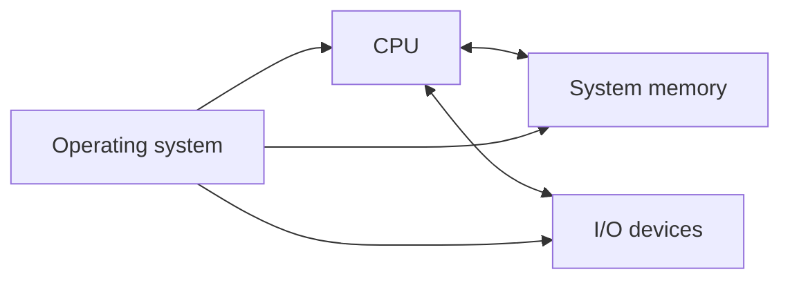
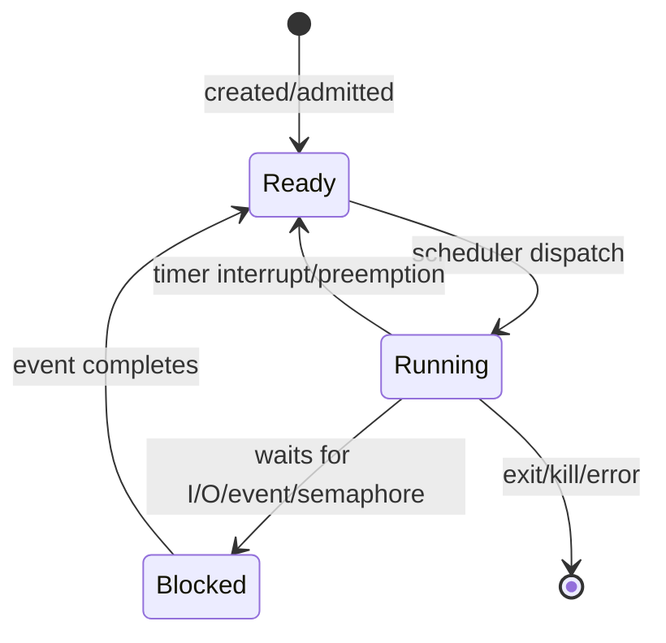
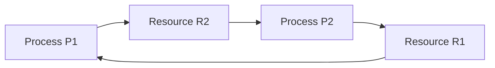
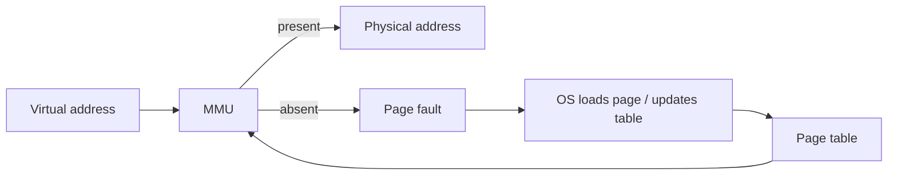
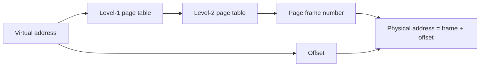

# 17. Operating Systems

## 17.1 Classification of Operating Systems and the Role of the CPU in Their Evolution

### Core Definition

An operating system is the software system that controls the execution of programs in a computer system. It schedules program execution, distributes resources, and provides communication between users and the computer system. It also gives users a simpler interface by hiding the concrete tools of the computer system.

Two standard views make that definition exam-ready:

| View                  | Meaning                                                              | Examples                                                                                                                                              |
| --------------------- | -------------------------------------------------------------------- | ----------------------------------------------------------------------------------------------------------------------------------------------------- |
| Virtual machine view  | The OS hides raw hardware and exposes convenient abstractions.       | Files instead of disk sectors, processes instead of CPU register snapshots, windows instead of display controllers, sockets instead of network cards. |
| Resource-manager view | The OS decides how scarce hardware and logical resources are shared. | CPU time, memory frames, address spaces, files, storage blocks, devices, terminals, printers, network connections.                                    |

An operating system therefore has to do both abstraction and control. It must make the machine convenient, but it must also prevent one program from corrupting another program's memory, monopolizing the CPU, or using devices without coordination.

### Classification by Purpose and Interaction Style

Process-control systems may be foreground-only, cooperative, preemptive, or real-time. The broader operating-system classification also includes batch, multiprogrammed, time-sharing, personal-computer, network/distributed, and embedded systems.

| Class                                    | Main idea                                                                          | Typical exam point                                                                                            |
| ---------------------------------------- | ---------------------------------------------------------------------------------- | ------------------------------------------------------------------------------------------------------------- |
| Batch system                             | Jobs are collected and processed with little direct user interaction.              | Optimizes throughput and CPU utilization, historically important on mainframes.                               |
| Multiprogrammed system                   | Several programs stay in memory, and the CPU switches among them.                  | If one job waits for I/O, another can use the CPU.                                                            |
| Time-sharing system                      | Many users or processes receive short CPU intervals.                               | Gives interactive users the impression of simultaneous service.                                               |
| Foreground-only context-switching system | Only the foreground application runs.                                              | Simpler model; background responsiveness is poor.                                                             |
| Cooperative multitasking system          | A running process voluntarily yields the CPU.                                      | Works only if programs cooperate; one bad program can freeze others. Windows 3.1 is a historical example.     |
| Preemptive multitasking system           | The kernel can take the CPU away after a timer interrupt or event.                 | Basis of modern robust interactive systems.                                                                   |
| Real-time system                         | Correctness depends on meeting deadlines.                                          | Hard real time has strict deadlines; soft real time tolerates small deadline misses with quality degradation. |
| Personal-computer / GUI system           | Provides applications, windows, device drivers, files, and local user interaction. | Became practical with microprocessors and cheap memory.                                                       |
| Network or distributed system            | Coordinates resources across multiple machines.                                    | Remote files, servers, distributed computation, network services.                                             |
| Embedded system                          | Special-purpose system built into a device or controller.                          | Often optimized for narrow tasks and predictable behavior.                                                    |

### CPU Role in OS Evolution

Describe the system model as one processor, one system memory, and I/O devices under OS control. The additional material fills in the required historical CPU evolution.

The historical development of operating systems follows CPU and hardware modernization:

| Period                                       | Hardware / CPU state                                                          | OS consequence                                                                                                          |
| -------------------------------------------- | ----------------------------------------------------------------------------- | ----------------------------------------------------------------------------------------------------------------------- |
| Mechanical and earliest electronic systems   | Specialized hardware, switching tables, direct operator control.              | No real operating system in the modern sense.                                                                           |
| First electronic generation, about 1940-1955 | Relays, vacuum tubes, machine code, punched cards.                            | The CPU was rare and expensive; abstractions were minimal.                                                              |
| Second generation, about 1955-1965           | Transistors made hardware more reliable.                                      | Mainframe computer centers and batch systems became practical.                                                          |
| Third generation, about 1965-1980            | Integrated circuits and compatible computer families, such as IBM System/360. | Multiprogramming, spooling, multitasking, and time sharing appeared to keep the CPU busy and share it among jobs/users. |
| Fourth generation, from about 1980           | LSI/VLSI, microprocessors, cheaper memory.                                    | Personal computers, graphical interfaces, networking, distributed services, and virtualization became practical.        |

The CPU is central because it executes instructions, handles traps and interrupts, and enforces privilege levels. Modern operating systems depend on CPU protection:

- **Kernel mode** permits privileged operations such as interrupt handling, I/O control, and memory-management changes.
- **User mode** restricts ordinary programs so they cannot directly control devices or modify kernel memory.
- **System calls/traps** provide a controlled transition from user code to kernel service.
- **Interrupts** let devices and timers force kernel attention, which enables preemptive scheduling and asynchronous I/O.
- **Memory-management hardware** such as base/bounds registers, MMUs, page tables, and TLBs lets the OS isolate processes and implement virtual memory.

### Why the Classification Matters

Classification is not just naming. It explains design tradeoffs:

- Batch systems prefer throughput over immediate response.
- Interactive systems prefer short response time and fairness.
- Real-time systems care about deadlines, even if average throughput is not maximal.
- Preemptive systems require timer interrupts, process state saving, and a trusted kernel.
- Network/distributed systems add communication failures and partial failures.
- Embedded systems may trade generality for predictability and small resource use.

### What to Emphasize in an Oral Answer

- Frame an operating system in both standard views: a virtual machine that hides hardware details and a resource manager that allocates CPU, memory, storage, files, and devices.
- Classify systems by purpose and workload: batch, multiprogrammed, time-sharing, real-time, personal-computer, network/distributed, and embedded systems.
- Classify systems by CPU-control style: foreground-only, cooperative multitasking, preemptive multitasking, and real-time scheduling.
- Contrast the goals behind the classes: throughput for batch, response time and fairness for interactive systems, deadlines for real time, and predictability or small footprint for embedded systems.
- Connect OS evolution to hardware evolution: from direct operation, to transistor mainframes and batch, to integrated-circuit multiprogramming/time sharing, to microprocessor PCs, networking, and virtualization.
- Mention the CPU features that make modern OS design possible: interrupts, traps/system calls, kernel/user mode, and memory-management hardware.
- Make the hard-real-time versus soft-real-time distinction if real-time systems are named.

::: details Suggested answer

An operating system is the system software layer that makes hardware usable and shareable. It hides low-level hardware details behind abstractions such as files, processes, windows, devices, and system calls. At the same time it manages scarce resources: CPU time, memory, storage, files, terminals, printers, and other I/O devices. So it is both a virtual machine for users and programs, and a resource manager for the real machine.

Operating systems can be classified by purpose. Batch systems process collected jobs with little interaction and are optimized for throughput. Multiprogrammed systems keep several programs in memory and switch the CPU when one waits for I/O. Time-sharing systems use short CPU intervals to give interactive users the impression of simultaneous service. Real-time systems are organized around deadlines; in hard real time a late result is a failure, while in soft real time a small delay may only reduce quality. Personal-computer systems focus on direct user productivity, network and distributed systems coordinate resources across machines, and embedded systems are tailored to narrow device or control tasks.

They can also be classified by how CPU control moves between activities. In a foreground-only system only the active application runs. In cooperative multitasking, the running process voluntarily gives up the CPU, so a badly written process can block others. In preemptive multitasking, the kernel uses timer interrupts and scheduling decisions to take the CPU away and run another process. That is the basis of modern responsive systems.

The role of the CPU explains OS evolution. Early machines had little or no operating system because hardware was specialized and directly operated. With transistors, reliable mainframes and batch systems became useful. With integrated circuits, the CPU became powerful enough for multiprogramming, spooling, multitasking, and time sharing. With microprocessors and large-scale integration, personal computers, graphical interfaces, networking, and virtualization became practical. Modern CPUs also provide kernel/user modes, interrupts, traps, and memory-management hardware. These features let the operating system safely share one physical computer among many programs.

:::

## 17.2 Implementation of Processes, Scheduling Algorithms, and Avoidance of Starvation

### Program, Process, and System Model

Distinguish:

- **Program:** a passive set of bytes in a file system.
- **Process:** a running program in memory, including code, I/O data, state, instruction counter, stack, registers, address-space information, open files, ownership data, and other metadata.

Only one instruction stream can run on one CPU core at a single instant. Call the common OS model pseudo-multitasking: the OS switches quickly among processes so the user experiences several activities as running. On multiprocessor or multicore machines, more than one process can actually execute at the same time, but each CPU still needs scheduling.

The simplified system model is:



The scheduler is the kernel component that decides which process receives CPU time. Call it the "soul" of the operating system because process switching is what makes multiprogramming and time sharing work.

### Process Creation, Relations, and Termination

Processes can be created for several reasons:

- **System initialization:** the OS creates initial system processes and service processes.
- **System call by an existing process:** in UNIX-like systems, `fork` creates a child process and `exec` / `execve` replaces the process image with a new program.
- **User request:** a user starts a command or background command, for example `command &`.
- **Batch job:** large systems admit queued jobs.

Foreground processes interact directly with the user. Background service processes are commonly called **daemons**.

Processes form a parent-child tree:

- Each process has one parent.
- A process can have several children.
- Related children may belong to process groups.
- A supervising launcher may restart driver programs or servers if they die; Call this a **reincarnation server**.

Process termination can be:

| Type                             | Examples                                                                           |
| -------------------------------- | ---------------------------------------------------------------------------------- |
| Voluntary normal exit            | Returning from the main routine, calling `exit`, completing the assigned task.     |
| Voluntary error exit             | A program detects an error and terminates itself.                                  |
| Involuntary failure              | Illegal instruction, division by zero, invalid memory access, fatal runtime error. |
| Involuntary external termination | Another process or the OS kills the process.                                       |

### Process States

The basic states are:

| State   | Meaning                                                                                                                                       |
| ------- | --------------------------------------------------------------------------------------------------------------------------------------------- |
| Running | The process currently has the CPU.                                                                                                            |
| Ready   | The process could run, but it is waiting for the scheduler to give it CPU time.                                                               |
| Blocked | The process cannot continue until an event occurs, such as I/O completion, a semaphore becoming available, or another process producing data. |

The state-transition diagram is represented as:



Other relevant states:

- **Sleeping:** the process waits without consuming CPU.
- **Stopped:** execution is suspended.
- **Zombie:** a child process has terminated, but the parent has not collected its status with `wait`; the process table entry remains until the parent or `init`/a reaper cleans it.

### Process Control Block and Context Switching

The CPU itself does not understand "processes"; it executes instructions using registers, the program counter, and memory. Therefore the OS stores process information in a process table entry, also called a **process control block (PCB)**.

Important PCB data:

- process identifier (PID);
- program/process name;
- owner and group;
- instruction counter / program counter;
- CPU registers;
- stack and address-space information;
- memory state;
- open files and I/O state;
- signal handlers, alarms, child-process information;
- scheduling data such as priority and accounting.

During a context switch:

1. An event occurs: timer interrupt, I/O interrupt, process blocks, process exits, system call, or new process arrives.
2. The kernel saves the current CPU state into the current process PCB.
3. The scheduler chooses another ready process.
4. The kernel loads the chosen process state from its PCB.
5. Execution resumes as if the chosen process had continued normally.

Frequent switching has overhead. Registers can be saved and restored, but cache contents and CPU pipeline state cannot be perfectly preserved, so too-small time slices waste CPU time on switching.

### CPU-Bound and I/O-Bound Processes

Processes can be classified by behavior:

| Process type | Behavior                                         | Scheduling consequence                                                          |
| ------------ | ------------------------------------------------ | ------------------------------------------------------------------------------- |
| CPU-bound    | Long computation bursts, little waiting for I/O. | Benefits from longer CPU intervals; can hurt interactivity if favored too much. |
| I/O-bound    | Short computation bursts followed by I/O waits.  | Needs quick response when I/O completes; otherwise devices and users wait.      |

A good scheduler balances both. It should keep the CPU busy, avoid bad response time, and prevent any ready process from being ignored forever.

### Scheduling Goals by System Type

Scheduling goals differ by system type:

| System type         | Main goals                                                                                     |
| ------------------- | ---------------------------------------------------------------------------------------------- |
| All systems         | Fairness, same principles for comparable processes, access to CPU for everyone, balanced load. |
| Batch systems       | Throughput, turnaround time, CPU utilization.                                                  |
| Interactive systems | Response time and meeting user expectations.                                                   |
| Real-time systems   | Deadline compliance, avoiding data loss and quality degradation.                               |

Process switches are definitely needed when a process terminates or blocks. They usually also occur when a new process is created, an I/O interrupt wakes a blocked process, or a timer interrupt enforces preemptive scheduling.

### Batch Scheduling Algorithms

| Algorithm                      | Main idea                                                                                                                             | Strengths                                                                          | Weaknesses                                                    |
| ------------------------------ | ------------------------------------------------------------------------------------------------------------------------------------- | ---------------------------------------------------------------------------------- | ------------------------------------------------------------- |
| First Come First Served (FCFS) | Non-preemptive; first ready job runs until it finishes or blocks.                                                                     | Simple, unbiased by arrival order.                                                 | I/O-heavy and short jobs can wait behind long CPU-bound jobs. |
| Shortest Job First (SJF)       | Non-preemptive; choose the job with shortest total running time.                                                                      | Optimal average waiting time if all jobs are available and lengths are known.      | Job lengths are usually unknown; long jobs may suffer.        |
| Shortest Remaining Time Next   | Preemptive; when a new job arrives, choose the job with shortest remaining time.                                                      | Improves response for short jobs.                                                  | Long jobs may starve if short jobs keep arriving.             |
| Three-level scheduling         | Admission scheduler chooses jobs into memory; disk scheduler swaps jobs when memory is tight; CPU scheduler chooses among ready jobs. | Separates long-term admission, medium-term swapping, and short-term CPU decisions. | More complex and depends on good estimates.                   |

### Interactive Scheduling Algorithms

| Algorithm                          | Key scheduling idea                                                                                                          | Starvation/fairness point                                                                                                      |
| ---------------------------------- | ---------------------------------------------------------------------------------------------------------------------------- | ------------------------------------------------------------------------------------------------------------------------------ |
| Round robin                        | Every process receives a time slice; after its quantum or blocking it goes to the end of the circular list.                  | Fair and simple, but quantum length matters. Too small wastes CPU on switching; too large makes keyboard/window response slow. |
| Priority scheduling                | Highest-priority ready process runs. Note UNIX-like ranges with kernel/non-interruptible priority above user priority.       | Needs dynamic priority changes; otherwise low-priority processes can starve.                                                   |
| Priority classes with round robin  | Round robin inside a class; priorities can be re-evaluated periodically, often lowering high priorities that consumed CPU.   | Gives responsiveness while preventing permanent priority domination.                                                           |
| Multiple queues                    | Highest level gives 1 time slice, next gives 2, then 4, 8, 16, 32, 64, etc.; processes may move down after using their time. | Useful for separating short/interactive tasks from longer tasks; promotion/aging is needed to prevent starvation.              |
| Shortest process first             | Estimate future CPU burst from previous bursts using weighted averages.                                                      | Good response for short bursts, but estimates can be wrong.                                                                    |
| Guaranteed scheduling              | Track how much CPU time a process has received and prefer one that received proportionally less.                             | Explicitly fairness-oriented.                                                                                                  |
| Lottery scheduling                 | Distribute tickets; the process with the drawn ticket gets CPU. More tickets mean more expected CPU share.                   | Proportional allocation is simple and useful for services such as video servers.                                               |
| Proportional/fair-share scheduling | Like guaranteed scheduling, but considers users as well as processes.                                                        | Prevents one user with many processes from unfairly dominating CPU time.                                                       |

The weighted average formula for estimated CPU burst is:

- first estimate: $T_0$;
- next estimate: $T_0/2 + T_1/2$;
- then $T_0/4 + T_1/4 + T_2/2$;
- then $T_0/8 + T_1/8 + T_2/4 + T_3/2$.

Recent bursts receive larger weight than older bursts.

### Real-Time Scheduling

In real-time systems, time is part of correctness.

| Type           | Meaning                                                                |
| -------------- | ---------------------------------------------------------------------- |
| Hard real time | Deadlines are strict and cannot be missed.                             |
| Soft real time | Deadlines matter, but small misses may be tolerated with quality loss. |

The usual schedulability idea: if the sum of required CPU response times for events per unit time is not greater than the available CPU time, the workload can in principle be scheduled. In formula form, if each event type $i$ occurs $f_i$ times per unit time and needs CPU time $c_i$, then the utilization sum $\sum(f_i \cdot c_i)$ should be $\le 1$ for one CPU under simplified assumptions.

Parent and child processes may need different priorities. A kernel may provide system calls so a parent can set a child's priority, while the kernel still enforces scheduling, often by priority plus round robin.

### Avoidance of Starvation

Starvation means that a process is ready or waiting for a resource, but it waits indefinitely because the system keeps choosing others. Starvation can occur in priority scheduling, shortest-job policies, SSTF disk scheduling, or poorly designed locking.

Anti-starvation techniques:

- **Aging:** increase the effective priority of processes that have waited too long.
- **Dynamic priority adjustment:** lower priority of CPU-heavy processes and boost waiting or I/O-completed processes.
- **Round robin within equal priorities:** prevents one process in a class from monopolizing CPU.
- **Periodic priority recomputation:** prevents old priority assignments from becoming permanent.
- **Guaranteed/fair-share scheduling:** track actual CPU service and prefer processes/users that received less than their share.
- **Lottery scheduling:** gives even low-ticket processes a nonzero probability of service.
- **Deadline or elevator variants for I/O:** prevent old requests from being passed forever.

Starvation is different from ordinary waiting. A process may wait a long but bounded time in a loaded system; starvation means the scheduling/resource policy permits indefinite postponement.

### What to Emphasize in an Oral Answer

- Start by separating a passive program from an active process with address space, registers, stack, open files, ownership, and scheduling state.
- Explain that the PCB/process table entry is where the OS saves process state, and that context switching saves one PCB state and restores another.
- Cover process lifecycle details likely to be asked: creation by initialization, user request, batch admission, or `fork`/`exec`; parent-child trees, daemons, termination, and zombie processes.
- Use the running/ready/blocked state model and name the main transitions: dispatch, preemption, blocking on I/O/event/semaphore, wakeup, and exit.
- Compare scheduler goals by system type: throughput/turnaround/utilization for batch, response and fairness for interactive systems, and deadline satisfaction for real time.
- Contrast key algorithms: FCFS, SJF, shortest remaining time, round robin, priority scheduling, multilevel queues, guaranteed/fair-share, and lottery scheduling.
- Include the important tradeoffs: quantum too small versus too large, CPU-bound versus I/O-bound behavior, unknown burst lengths, and real-time utilization $\sum f_i c_i \le 1$.
- Define starvation as indefinite postponement and name prevention mechanisms such as aging, dynamic priority adjustment, round robin inside classes, fair-share accounting, and nonzero lottery chances.

::: details Suggested answer

A program is passive code stored in a file system. A process is a running program together with the state needed to continue it: code, data, stack, program counter, CPU registers, address space, open files, owner information, and scheduling data. The CPU itself only executes instructions; it does not know the high-level concept of a process. Therefore the operating system stores process data in a process control block. During a context switch the kernel saves the old process state in its PCB, chooses another ready process, restores that process state, and resumes it.

Processes can be created during system initialization, by user commands, by batch systems, or by system calls from existing processes. In UNIX-like systems `fork` creates a child process and `exec` replaces the process image with a new program. Processes form parent-child trees, may run in the foreground or as background daemons, and may terminate normally, by program-detected error, by fatal runtime error, or by being killed externally.

The basic states are running, ready, and blocked. Running means the process has the CPU. Ready means it could run but is waiting for CPU time. Blocked means it cannot continue until an event happens, such as I/O completion or semaphore availability. A timer interrupt can move a running process back to ready; an I/O event can move a blocked process back to ready.

Scheduling chooses which ready process runs next. Batch systems care about throughput, turnaround time, and CPU utilization. Interactive systems care about response time and fairness. Real-time systems care about deadlines. FCFS is simple but can delay short or I/O-heavy jobs behind long CPU-bound jobs. Shortest-job policies improve average waiting time when burst lengths are known, but may harm long jobs. Round robin gives every process a time quantum and is good for interaction, but the quantum must not be too short or too long. Priority scheduling supports importance levels, but it needs dynamic priority adjustment or aging to avoid starvation. Guaranteed, lottery, and fair-share scheduling try to give processes or users proportional CPU service.

Shortest remaining time is the preemptive version of shortest-job scheduling and reacts to newly arrived short jobs, but it can hurt long jobs if short jobs keep arriving. Since future CPU bursts are rarely known exactly, systems estimate them from previous bursts, usually weighting recent bursts more heavily. In a simple real-time model, a workload is schedulable on one CPU only if the total required utilization, written as $\sum f_i c_i$, is at most the available processor capacity.

Starvation is indefinite postponement: a process is in principle able to run or receive a resource, but the system keeps choosing others. It is avoided by fairness mechanisms such as aging, periodic priority recomputation, round robin within priority classes, fair-share accounting, and nonzero-service policies such as lottery scheduling. The key scheduling tradeoff is to prefer important and responsive work while still ensuring every ready process eventually receives CPU time.

:::

## 17.3 Concurrency, Threads, Processes, and Inter-Process Communication

### Concurrency and Parallelism

The statement that the scheduler creates the feeling of parallel execution by quickly switching processes. This is **concurrency**: several activities make progress in overlapping time intervals.

**Parallelism** means more than one instruction stream actually executes at the same instant. It requires multiple CPU cores, multiple processors, or distributed machines.

| Concept               | Meaning                                                                              | Example                                                        |
| --------------------- | ------------------------------------------------------------------------------------ | -------------------------------------------------------------- |
| Concurrency           | Activities overlap in time; they may interleave on one CPU.                          | A single-core OS switches among editor, browser, and terminal. |
| Parallelism           | Activities execute at the same time on separate hardware.                            | Two threads run on two CPU cores.                              |
| Multiprocessor system | More processors in one machine; performance can be higher.                           | SMP server with several CPUs/cores.                            |
| Cluster               | Multiple machines coordinated together; reliability or scalability is often primary. | Service cluster where another node can take over.              |

multiprocessor systems increase performance, but reliability is not automatically increased. Clusters are more directly associated with increasing reliability because work can be moved or replicated across machines.

### Processes Versus Threads

A thread is an independently operating instruction sequence inside a process. A single-threaded process has one instruction sequence. A multithreaded process has several execution queues inside one process. Threads are often called lightweight processes.

| Feature                     | Process                                                                        | Thread                                                                       |
| --------------------------- | ------------------------------------------------------------------------------ | ---------------------------------------------------------------------------- |
| Address space               | Own address space.                                                             | Shares process address space with sibling threads.                           |
| Global variables            | Own process-level globals.                                                     | Shares globals with threads in same process.                                 |
| Open files/file descriptors | Process owns them.                                                             | Threads share them.                                                          |
| Child processes             | Belong to process.                                                             | Threads do not have separate child-process trees.                            |
| Signal handlers and alarms  | Process-level resources.                                                       | Shared or coordinated within the process, depending on OS.                   |
| Program counter             | Has one for each execution stream.                                             | Each thread has its own.                                                     |
| Registers                   | Saved/restored per execution stream.                                           | Each thread has its own register state.                                      |
| Stack                       | A process has at least one stack; each thread needs its own stack.             | Each thread has its own stack.                                               |
| Communication cost          | Inter-process communication is more explicit and often costlier.               | Threads communicate cheaply through shared memory, but need synchronization. |
| Failure isolation           | Better isolation; one process cannot directly overwrite another address space. | Weaker isolation; one thread can corrupt shared process memory.              |

Because threads share memory, they are efficient for parallel work inside one application, but shared-memory bugs such as races are easier to create.

### Thread Scheduling

Distinguish user-level and kernel-level threads:

| Thread type          | Kernel awareness                                                                    | Advantages                                                                                           | Disadvantages                                                                                                                                                          |
| -------------------- | ----------------------------------------------------------------------------------- | ---------------------------------------------------------------------------------------------------- | ---------------------------------------------------------------------------------------------------------------------------------------------------------------------- |
| User-level threads   | Kernel only sees the process. A user-space thread library chooses internal threads. | Very fast switching; application-specific scheduling.                                                | If one thread makes a blocking system call, the whole process may block because the kernel does not know the internal threads. True parallel execution may be limited. |
| Kernel-level threads | Kernel knows and schedules threads.                                                 | One thread can block while another in the same process runs; true multicore parallelism is possible. | Switching needs kernel involvement and is slower.                                                                                                                      |

in user-level threading the process receives a CPU time slice and the thread scheduler inside the process decides which thread runs. In kernel-level threading, the kernel chooses both process and thread.

### Inter-Process Communication

Processes need IPC because they have separate address spaces but still must coordinate. Discuss shared memory and message passing; additional material adds pipes and signals as common examples.

| IPC mechanism             | Main idea                                                                                       | Strengths                                                                   | Risks / costs                                                         |
| ------------------------- | ----------------------------------------------------------------------------------------------- | --------------------------------------------------------------------------- | --------------------------------------------------------------------- |
| Shared memory             | Map the same memory region into multiple processes or threads.                                  | Very fast after setup; useful for large data exchange.                      | Requires synchronization, otherwise races occur.                      |
| Distributed shared memory | Present memory shared across networked machines as if it were shared memory.                    | Useful abstraction for distributed systems.                                 | Latency and consistency are harder.                                   |
| Message passing           | Use `Send(destination, message)` and `Receive(source, message)` primitives.                     | Clear boundaries and good for distributed systems.                          | Copying, buffering, blocking, and duplicate messages must be handled. |
| Mailbox/temporary storage | Sender and receiver communicate through a buffer or mailbox.                                    | Sender and receiver need not meet exactly at the same time.                 | Buffer management and overflow.                                       |
| Rendezvous strategy       | If receive happens before send, receiver blocks; if send happens before receive, sender blocks. | Simple synchronization; Minix 3 style fixed messages are a classic example. | Can block both sides if protocol is wrong.                            |
| Pipe                      | Byte stream between processes; no message boundaries.                                           | Simple UNIX-style streaming, e.g. command pipelines.                        | Receiver must parse boundaries if needed.                             |
| Signals/events            | Asynchronous notification.                                                                      | Lightweight control communication.                                          | Carries little data and can be hard to reason about.                  |
| MPI-style message passing | Library/model for parallel systems.                                                             | Scales to distributed parallel computation.                                 | Programmer must manage communication pattern carefully.               |

### Message Reliability

if sender and receiver are not on the same machine, acknowledgements and sequence numbers are needed:

1. Sender transmits a message.
2. Receiver sends confirmation/acknowledgement.
3. If no acknowledgement arrives, sender retransmits.
4. If duplicates occur, sequence numbers distinguish new messages from repeated messages.

This is important because distributed IPC has failure modes that local shared memory does not: packet loss, duplicate delivery, delay, and receiver crash.

### How This Connects to Synchronization

Concurrency itself is not a problem; uncoordinated access to shared state is the problem. Processes using message passing can avoid some shared-memory races, but they can still deadlock by waiting for each other. Threads and shared-memory processes need critical sections, mutexes, semaphores, or monitors to protect shared data.

### What to Emphasize in an Oral Answer

- Define concurrency as overlapping progress and distinguish it from parallelism, which requires simultaneous execution on multiple cores, processors, or machines.
- Compare processes and threads: processes have separate address spaces and stronger isolation; threads share a process address space and resources but keep their own program counter, registers, and stack.
- State the tradeoff: threads are cheaper to create/switch and communicate through shared memory, while processes make accidental interference harder.
- Explain user-level versus kernel-level threads: user-level switching is fast but a blocking system call can block the process; kernel-level threads cost more but can block and run independently.
- Cover IPC mechanisms by category: shared memory, send/receive message passing, mailboxes, rendezvous, pipes, signals, and distributed libraries such as MPI.
- Mention reliability distinctions for message passing: local IPC may rely on the OS, while distributed IPC needs acknowledgements, sequence numbers, and duplicate/loss handling.
- Tie the topic back to synchronization: shared memory is fast, but any shared mutable state needs mutual exclusion or another correct synchronization protocol.

::: details Suggested answer

Concurrency means that several activities make progress during the same time period. On a single CPU this usually means interleaving: the scheduler switches quickly among processes or threads. Parallelism means actual simultaneous execution on several CPU cores, processors, or machines. Multiprocessor systems can increase performance because multiple instruction streams can run at once, while clusters can also improve reliability by distributing work across machines.

A process is a running program with its own address space and resources. A thread is an execution sequence inside a process. Threads are lighter because threads in the same process share address space, global variables, open files, and other process resources. However, every thread still needs its own program counter, register state, and stack. This makes communication between threads cheap, but it also makes races easier because several threads can access the same memory.

Processes give stronger isolation: one process normally cannot directly overwrite another process's memory. Communication between processes therefore needs explicit inter-process communication. Threads give cheaper cooperation inside one application, but synchronization is essential because shared memory can be accessed concurrently.

Thread scheduling can be user-level or kernel-level. With user-level threads, the kernel schedules only the process, and a library inside the process schedules its threads. Switching can be fast and application-specific, but a blocking system call can block the whole process. With kernel-level threads, the kernel knows the threads and can schedule them independently, so one thread can block while another continues, and true parallel execution on multiple CPUs is possible. The cost is more kernel involvement.

IPC mechanisms include shared memory, message passing, mailboxes, rendezvous, pipes, signals, and distributed message libraries such as MPI. Shared memory is fast but requires synchronization. Message passing uses operations such as send and receive and is natural for distributed systems. If messages cross machines, acknowledgements and sequence numbers are needed to handle lost or duplicated messages. Pipes are byte streams, while message passing preserves message units. The general rule is that concurrency gives useful overlap, but it also requires carefully designed communication and synchronization.

:::

## 17.4 Critical Sections, Mutual Exclusion, Peterson's Algorithm, Semaphores, Shared Memory, Message Passing, and Producer-Consumer

### Critical Sections and Race Conditions

A **critical section** is the part of a program where shared data or another shared resource is accessed. It is also called a critical area or critical block.

A **race condition** occurs when two or more processes/threads read or write shared data and the final result depends on timing. This creates errors that are hard to reproduce because the faulty result depends on scheduling moments.

The goal is to ensure that shared data is used by only one process/thread at a time when exclusive access is required.

### Mutual Exclusion Requirements

The standard mutual-exclusion requirements are:

| Requirement                      | Meaning                                                                                  |
| -------------------------------- | ---------------------------------------------------------------------------------------- |
| Mutual exclusion                 | No two processes are inside the critical section at the same time.                       |
| No speed or CPU dependency       | Correctness cannot depend on relative process speed or a specific number of CPUs.        |
| No blocking by outside processes | A process outside the critical section should not prevent another process from entering. |
| No indefinite waiting            | A process should not wait forever to enter the critical section.                         |

These requirements are the basis for evaluating each implementation.

### Implementation Attempts and Their Problems

| Method                  | Idea                                                                                                             | Problem / use                                                                                                                      |
| ----------------------- | ---------------------------------------------------------------------------------------------------------------- | ---------------------------------------------------------------------------------------------------------------------------------- |
| Disable interrupts      | Disable interrupts before entering a critical section and enable them on exit.                                   | Useful inside the kernel for short sections on one CPU; dangerous for user processes and insufficient alone on multiprocessors.    |
| Shared lock variable    | A variable says whether someone is in the critical section.                                                      | Broken if two processes test the variable before either sets it.                                                                   |
| Strict alternation      | A `turn` variable forces process 0, then process 1, then process 0, etc.                                         | Gives mutual exclusion but violates progress: a process in its non-critical section can block the other process.                   |
| Peterson's algorithm    | Uses intent flags and a turn variable for two processes.                                                         | Correct under its assumptions for two processes; not a general multiprocessor primitive for all modern memory models without care. |
| Test-and-set lock (TSL) | Hardware atomically reads and sets a lock.                                                                       | Correct atomic primitive, but simple use produces busy waiting.                                                                    |
| Sleep/wakeup            | Block a process instead of spinning.                                                                             | Avoids CPU waste, but naive designs can lose wakeups.                                                                              |
| Semaphore               | Kernel-supported integer with atomic `down/P` and `up/V`.                                                        | General mechanism for mutual exclusion and synchronization.                                                                        |
| Monitor                 | Higher-level language construct containing shared data and procedures; only one process active inside at a time. | Easier to structure but language/runtime support is needed.                                                                        |

### Strict Alternation

Strict alternation can be represented as:

```text
shared turn = 0

process 0:
  while true:
    while turn != 0: pass
    critical_section()
    turn = 1
    noncritical_section()

process 1:
  while true:
    while turn != 1: pass
    critical_section()
    turn = 0
    noncritical_section()
```

The flaw is that process 0 may finish its critical section quickly and then be ready to enter again, but if `turn == 1` and process 1 is slowly doing unrelated non-critical work, process 0 is blocked by a process outside the critical section. This violates the third mutual-exclusion requirement.

### Peterson's Algorithm

The correct two-process Peterson algorithm uses one intent flag per process and a `turn` variable:

```text
shared want[2] = {false, false}
shared turn = 0

enter(i):
  j = 1 - i
  want[i] = true
  turn = j
  while want[j] and turn == j:
    pass

leave(i):
  want[i] = false
```

Process $i$ announces that it wants to enter and gives priority to the other process. It waits only if the other process also wants to enter and it is the other's turn. Under the classic assumptions of atomic reads/writes and sequential consistency, Peterson's algorithm provides mutual exclusion, progress, and bounded waiting for two processes.

Include a warning image and text about a "Peterson correction" causing both processes to enter. That is best treated as a warning about incorrect variants or mistranslated pseudocode: if the ordering, variables, or atomicity assumptions are wrong, a Peterson-like solution can fail. The standard Peterson algorithm above is the corrected form to use in the exam answer.

### Hardware Atomic Operation: Test-and-Set

Also note TSL, Test and Set Lock, as a machine-code atomic operation. A conceptual version:

```text
test_and_set(lock):
  old = lock
  lock = 1
  return old

enter:
  while test_and_set(lock) == 1:
    pass

leave:
  lock = 0
```

Because test-and-set is indivisible, two CPUs cannot both acquire the lock at the same time. The cost is **active waiting** or **busy waiting**: the waiting process consumes CPU in an empty loop. Busy waiting may be acceptable for very short kernel locks but is wasteful for longer waits.

### Lost Wakeup and the Producer-Consumer Problem

Use a bakery/customer example:

- The baker produces bread while there is room on the shelf.
- The customer buys bread if there is bread on the shelf.
- If the shelf is full, the baker rests.
- If the shelf is empty, the customer waits.

The naive sleep/wakeup implementation can lose a wakeup:

1. The customer sees shelf count `0`.
2. Before the customer actually sleeps, the scheduler switches to the baker.
3. The baker produces one bread and sends a wakeup to the customer.
4. The wakeup is lost because the customer is not asleep yet.
5. The customer resumes and sleeps based on the old `0` value.
6. The baker fills the shelf and then also sleeps because it is full.
7. Both sleep even though useful work was possible.

A wakeup bit can help in a two-party case, but it does not solve the general multiple-process synchronization problem. Semaphores solve it by making the check, update, and possible sleep atomic.

### Semaphores

Dijkstra introduced semaphores as integer synchronization variables. Describe:

- If semaphore value is `0`, the signal is forbidden; the process sleeps before the signal.
- If semaphore value is greater than `0`, a process can enter and decrements it.
- `down` / `P`: atomically wait until value is positive, then decrement.
- `up` / `V`: atomically increment and wake a waiting process if needed.
- A semaphore with values `0` and `1` is a **binary semaphore** or **mutex**.
- Counting semaphores represent multiple available resources.

The important property is atomicity: checking the semaphore, changing it, and sleeping/waking must be indivisible. In practice this is provided by the kernel and hardware primitives such as TSL or interrupt control.

### Producer-Consumer with Semaphores

The standard bounded-buffer semaphore solution is:

| Semaphore        | Initial value | Meaning                                        |
| ---------------- | ------------- | ---------------------------------------------- |
| `mutex` / `free` | `1`           | Exclusive access to the buffer/shelf.          |
| `empty`          | $N$           | Number of empty slots. Producer waits if `0`.  |
| `full`           | `0`           | Number of filled slots. Consumer waits if `0`. |

```text
producer:
  while true:
    item = produce()
    down(empty)
    down(mutex)
    insert(item)
    up(mutex)
    up(full)

consumer:
  while true:
    down(full)
    down(mutex)
    item = remove()
    up(mutex)
    up(empty)
    consume(item)
```

The order matters. If semaphore operations are interchanged incorrectly, the program can deadlock or allow races.

### Shared Memory and Message Passing in Synchronization

Shared memory gives fast communication because several processes or threads access the same memory area. It does not itself solve mutual exclusion. It requires mutexes, semaphores, monitors, or another synchronization mechanism.

Message passing uses primitives such as:

```text
Send(destination_process, message)
Receive(source_process, message)
```

With mailboxes, senders and receivers use temporary storage. With rendezvous, if `receive` happens before `send`, the receiver blocks; if `send` happens before `receive`, the sender blocks. Pipes are similar to message communication but carry a stream of bytes rather than messages with boundaries.

### Classic Synchronization Problems

Include these classic IPC/synchronization examples.

#### Dining Philosophers

Five philosophers sit around a table with five forks. Each philosopher needs two neighboring forks to eat. The naive solution, where everyone picks up the left fork then waits for the right fork, can deadlock: all hold one fork and wait forever. If they repeatedly put down and retry in the same pattern, starvation or livelock may appear.

One fix in Use five fork semaphores plus a maximum/admission semaphore so not all philosophers can try to acquire two forks at once.

#### Readers-Writers

A shared database can be read by several readers at the same time, but only one writer can write, and no reader should read while a writer is writing. The synchronization design must decide fairness policy:

- reader-preference can starve writers;
- writer-preference can delay readers;
- fair variants queue requests in arrival order.

### Relationship Between Mutual Exclusion, Deadlock, and Starvation

Bad synchronization can produce:

- **Race condition:** shared data result depends on timing.
- **Deadlock:** processes wait in a cycle and none can continue.
- **Starvation:** one process waits indefinitely because others keep winning.
- **Livelock:** processes keep changing state but still make no useful progress.

### What to Emphasize in an Oral Answer

- Define critical section, race condition, and mutual exclusion before naming algorithms.
- State the correctness requirements: at most one process in the critical section, no assumptions about relative speed or CPU count, no blocking by a process outside the critical section, and bounded waiting/progress.
- Use the failed/simple attempts to show the difficulty: disabling interrupts, a shared lock variable, and strict alternation each has an important limitation.
- Explain Peterson's two-process algorithm with intent flags and a `turn` variable, and note its classic atomic read/write assumptions.
- Mention hardware support such as test-and-set: it makes lock acquisition atomic, but usually causes busy waiting.
- Explain semaphores as atomic `down`/`up` operations; distinguish binary semaphores for mutual exclusion from counting semaphores for resource counts.
- For producer-consumer, name the three semaphore roles: mutex for buffer access, `empty` for free slots, and `full` for filled slots.
- Contrast shared memory and message passing, and close with the distinction that synchronization must avoid races, deadlock, and starvation.

::: details Suggested answer

A critical section is the part of a program where shared data or another shared resource is accessed. If two processes or threads access shared data without coordination, a race condition can occur, meaning the final result depends on timing. Mutual exclusion is the requirement that only one process at a time may enter a critical section when exclusive access is needed.

A correct mutual-exclusion solution must satisfy several conditions. No two processes may be in the critical section at the same time. The solution must not depend on process speed or the number of CPUs. A process outside its critical section must not block another process from entering. Finally, no process should wait forever.

Simple attempts show why the problem is difficult. Disabling interrupts can work for short kernel sections on a single CPU, but it is unsafe for user processes and not enough in general multiprocessor systems. A simple lock variable fails because two processes can both observe it as free before either sets it. Strict alternation uses a turn variable and gives mutual exclusion, but it can block a process even when the other process is outside the critical section. Peterson's algorithm fixes the two-process case by using intent flags and a turn variable: each process announces it wants to enter, gives priority to the other, and waits only if the other also wants to enter and it is the other's turn. Under the classic atomic read/write assumptions, this gives mutual exclusion and bounded waiting.

Hardware can help with atomic instructions such as test-and-set. A test-and-set lock is safe because reading and setting the lock is indivisible, but it usually uses busy waiting. Busy waiting wastes CPU if the wait is long. A better general OS mechanism blocks a waiting process and later wakes it.

Semaphores provide that mechanism. A semaphore is an integer with atomic `down` and `up` operations. `down` waits until the value is positive and then decrements it; `up` increments it and may wake a waiting process. A binary semaphore can act as a mutex. A counting semaphore can count available resources. In the producer-consumer problem, a mutex protects the buffer, an `empty` semaphore counts free slots, and a `full` semaphore counts filled slots. The producer waits on `empty`, locks the mutex, inserts, unlocks, and signals `full`; the consumer waits on `full`, locks, removes, unlocks, and signals `empty`.

Shared memory is fast but must be synchronized. Message passing uses send and receive primitives, possibly with mailboxes or rendezvous blocking, and pipes are byte streams without message boundaries. Classic problems such as dining philosophers and readers-writers show that synchronization must avoid not only races but also deadlock and starvation.

:::

## 17.5 Scheduling Options for Input and Output Devices, Deadlocks, and Starvation

### I/O Device Types

I/O devices can be classified as:

| Device type       | Meaning                                                                                                                            | Examples                                             |
| ----------------- | ---------------------------------------------------------------------------------------------------------------------------------- | ---------------------------------------------------- |
| Block devices     | Store information in fixed-size blocks, commonly 512 bytes to 32768 bytes. Blocks can be addressed and read/written independently. | HDD, SSD block abstraction, tape in some contexts.   |
| Character devices | Provide a stream of bytes/characters and are not addressed as independent blocks.                                                  | Keyboard, serial port, terminal-like devices.        |
| Timer             | Special case: neither normal block nor character device.                                                                           | Generates time interrupts for scheduling/accounting. |

The OS uses device controllers and drivers so applications do not directly manipulate hardware details.

### Interrupts

Devices usually have status bits indicating readiness or completion. A typical IRQ sequence is:

1. A device/controller interrupts CPU activity.
2. The CPU transfers control to the interrupt handler with the requested interrupt number.
3. The handler reads or writes the needed data and performs closely related work.
4. The kernel restores the interrupted context and returns to the previous activity or schedules another process.

Interrupts are essential for I/O because the CPU should not waste all time polling devices. They also support preemptive scheduling through timer interrupts.

### Direct Memory Access (DMA)

DMA lets a device transfer data directly between device/controller buffer and main memory with little CPU copying.

DMA operation steps:

1. The CPU programs the DMA controller by setting registers: memory address, direction, and quantity.
2. The DMA controller requests the disk/controller operation.
3. After the disk/controller has data in its buffer, DMA transfers data through the system bus between controller and memory.
4. The disk/controller acknowledges completion.
5. DMA indicates completion with an interrupt.

DMA improves efficiency because the CPU can perform other work while a large I/O transfer is in progress.

### I/O and Disk Scheduling

Discuss I/O device types, interrupts, and DMA; additional material supplies the disk scheduling policies that the topic expects.

Disk scheduling matters mainly for seek-based devices such as HDDs, where moving the head is expensive. It also remains useful conceptually for block I/O queueing and fairness.

| Policy                          | Main idea                                                                                                               | Strength                                         | Starvation risk                                     |
| ------------------------------- | ----------------------------------------------------------------------------------------------------------------------- | ------------------------------------------------ | --------------------------------------------------- |
| FCFS                            | Serve requests in arrival order.                                                                                        | Fair and simple.                                 | Low starvation risk, but poor average seek time.    |
| SSTF (Shortest Seek Time First) | Serve the request closest to the current head position.                                                                 | Reduces seek time locally.                       | High risk: far-away requests can wait indefinitely. |
| SCAN / LOOK                     | Move the head in one direction serving requests, then reverse. LOOK reverses at the last request rather than disk edge. | Elevator-like fairness and better throughput.    | Lower starvation risk than SSTF.                    |
| C-SCAN / C-LOOK                 | Serve in one direction only, then jump back and continue.                                                               | More uniform waiting time than SCAN.             | Lower starvation risk; still needs queue policy.    |
| Deadline / aging variants       | Associate maximum waiting time or age with requests.                                                                    | Prevents old requests from being passed forever. | Used to control starvation explicitly.              |

For SSDs, seek time is not mechanical, but queue scheduling still matters for fairness, latency, batching, priorities, and wear-aware behavior.

### Deadlock Definition

deadlock is a situation where two or more processes block each other while acquiring resources. The precise definition: a set of processes is deadlocked if every process in the set waits for an event that can only be caused by another process in the same set.

Deadlock is not only an I/O problem. It can happen with locks, files, memory buffers, database records, semaphores, printers, or any limited resource.

### Coffman Conditions

According to Coffman, four conditions are necessary for deadlock:

| Condition        | Meaning                                                                      |
| ---------------- | ---------------------------------------------------------------------------- |
| Mutual exclusion | A resource is either free or assigned to exactly one process.                |
| Hold and wait    | A process holds a resource while requesting another.                         |
| No preemption    | The system cannot forcibly take the resource; only the owner releases it.    |
| Circular wait    | There is a cycle of processes, each waiting for a resource held by the next. |

If all four can hold at once, deadlock is possible. If the system prevents any one of them, deadlock is impossible.

### Resource-Allocation Graph

processes and resources can be modeled with a directed graph. A cycle indicates a deadlock risk, and in simple single-instance resources, a cycle means deadlock.



In this graph, $P_1$ waits for $R_2$, which is held by $P_2$; $P_2$ waits for $R_1$, which is held by $P_1$.

### Deadlock Handling Strategies

Four major strategies.

#### 1. Ignore the Problem

This is often called the ostrich algorithm. The OS assumes deadlock is rare enough that the cost of prevention is not worth it. UNIX and Windows often use this style for many general resources because the expected benefit of stronger handling may be lower than the complexity and performance cost.

#### 2. Detection and Recovery

The system allows deadlock to appear, detects it, and then acts.

Possible methods:

- Maintain a resource graph as requests and releases happen; if a cycle appears, recover.
- Periodically search for cycles.
- If a process is blocked longer than a threshold, terminate it or recover manually; Also note this as known in mainframe environments.

Recovery can terminate one or more processes, roll back work if possible, or preempt resources where that makes sense.

#### 3. Prevention

Prevention breaks at least one Coffman condition:

| Condition prevented | Method                                                                                                   | Tradeoff                                                     |
| ------------------- | -------------------------------------------------------------------------------------------------------- | ------------------------------------------------------------ |
| Mutual exclusion    | Make resources shareable where possible, e.g. spooling print output through a daemon.                    | Not all resources are shareable; buffers can still deadlock. |
| Hold and wait       | Require a process to request all resources at once or release held resources before requesting new ones. | Needs advance knowledge; reduces utilization.                |
| No preemption       | Take resources away when needed.                                                                         | Not safe for resources such as printers during printing.     |
| Circular wait       | Number resource types and require requests in increasing order; or allow only one resource at a time.    | Correct ordering can be difficult and restrictive.           |

#### 4. Dynamic Avoidance

Dynamic avoidance grants a resource only if the resulting state remains safe. Dijkstra's Banker's algorithm is the classic dynamic-avoidance example:

- Each process declares maximum resource needs.
- For each request, the algorithm checks whether granting it leaves a safe state.
- A safe state means there exists some order in which all processes can receive needed resources, finish, and release resources.
- If the request would make the system unsafe, it is postponed.

Avoidance is elegant but often impractical because it needs exact maximum resource needs and known process/resource sets, while real processes and resources are dynamic.

### Starvation Versus Deadlock

| Aspect          | Starvation                                                                                               | Deadlock                                                                        |
| --------------- | -------------------------------------------------------------------------------------------------------- | ------------------------------------------------------------------------------- |
| Basic condition | A process waits indefinitely because policy keeps serving others.                                        | A set of processes waits in a cycle; none can make progress.                    |
| Process state   | The process may be ready or waiting but is repeatedly bypassed.                                          | Processes are blocked waiting for events only others in the set can cause.      |
| Cause           | Unfair scheduling/resource allocation, priority dominance, SSTF-like locality, reader/writer preference. | Circular dependency plus Coffman conditions.                                    |
| Solution style  | Aging, fairness, deadlines, priority boosts, quotas, proportional service.                               | Prevention, avoidance, detection/recovery, or ignoring if acceptable.           |
| Example         | A low-priority process never receives CPU.                                                               | P1 holds printer and waits for scanner; P2 holds scanner and waits for printer. |

### What to Emphasize in an Oral Answer

- Start with device variety: block devices, character devices, timers, controllers, and drivers have different timing and access patterns than the CPU.
- Explain interrupts as asynchronous device-to-CPU notifications and DMA as direct device-memory transfer with CPU setup and completion interrupt.
- For disk/block scheduling, compare FCFS, SSTF, SCAN/LOOK, and C-SCAN/C-LOOK in terms of seek movement, throughput, fairness, and starvation risk.
- Define deadlock as a set of processes each waiting for an event/resource that another process in the same set must provide.
- List Coffman's four necessary conditions: mutual exclusion, hold and wait, no preemption, and circular wait.
- Use resource-allocation graphs or wait cycles to explain detection; mention Banker's algorithm as avoidance through safe-state checking.
- Compare strategies: ignore, detect and recover, prevent by breaking a Coffman condition, or avoid dynamically when maximum needs are known.
- Distinguish starvation from deadlock and mention aging, deadlines, and priority boosts as starvation countermeasures.

::: details Suggested answer

I/O scheduling starts with the fact that devices behave differently from the CPU. Block devices store data in addressable blocks, such as disks or SSD block abstractions. Character devices deliver streams of bytes, such as terminals or serial devices. Timers are special devices used for interrupts, accounting, and scheduling. The operating system uses device drivers and controllers so programs can use devices through uniform services instead of raw hardware operations.

Interrupts and DMA are central mechanisms. With interrupts, a device signals the CPU that data is ready or an operation has completed. The CPU runs the interrupt handler, performs the necessary work, and then returns to the previous activity or schedules another process. DMA improves large transfers: the CPU programs the DMA controller with the memory address, direction, and size, and the controller transfers data between the device and memory. The CPU is interrupted only when the operation completes.

For block devices, scheduling can strongly affect latency and throughput. FCFS serves requests in arrival order and is fair, but may move a disk head inefficiently. SSTF serves the closest request and reduces local seek time, but it can starve far-away requests. SCAN and LOOK use an elevator-like movement in one direction and then reverse, which gives better fairness. C-SCAN and C-LOOK serve in one direction and then jump back, giving more uniform waiting time. Deadline and aging policies prevent old requests from being bypassed indefinitely.

Deadlock is different from ordinary waiting. A set of processes is deadlocked if every process in the set waits for an event that only another process in the set can cause. Coffman's four necessary conditions are mutual exclusion, hold and wait, no preemption, and circular wait. If all four can hold, deadlock is possible. A resource-allocation graph helps visualize this: a cycle of processes and resources represents circular waiting.

There are four main strategies. The system may ignore deadlocks if they are rare and prevention is too expensive. It may detect and recover by finding cycles and terminating or rolling back processes. It may prevent deadlock by breaking one Coffman condition, for example by ordering resource requests. Or it may avoid deadlock dynamically, as in Banker's algorithm, granting a request only if the system remains in a safe state. In practice, avoidance needs information that is often hard to know.

Starvation and deadlock must be separated. In starvation, a process could in principle make progress, but an unfair policy keeps choosing others. Aging, deadlines, priority boosts, and fair-share policies handle starvation. In deadlock, the processes are blocked in a dependency cycle and cannot progress without outside intervention.

:::

## 17.6 Memory Management, Virtual Memory, Paging, Segmentation, Multi-Level Page Tables, TLB, and Page Replacement

### Basic Memory Management

Start with:

- **Monoprogramming:** the simplest memory-management method; only one program runs at a time.
- **Multiprogramming:** several programs are kept in memory so the CPU can switch when one waits.

The memory manager is usually part of the kernel. Its tasks:

- record which memory parts are free and occupied;
- reserve memory for processes;
- free memory when no longer needed;
- protect one process from another;
- translate or relocate addresses when a process is loaded;
- exchange data or whole processes between RAM and disk when needed.

Two broad algorithm groups:

| Group              | Meaning                                                                                            |
| ------------------ | -------------------------------------------------------------------------------------------------- |
| No swapping needed | Enough memory exists for active processes, so memory placement and protection are the main issues. |
| Swapping needed    | Processes or pages must move between RAM and disk to make room.                                    |

### Fixed Partitions, Relocation, and Protection

In multiprogramming with fixed memory partitions, memory is divided into several partitions, often with different sizes. Each partition may have its own waiting queue, or the system may use a common queue. A job is placed in the smallest partition where it fits.

Problems:

- unused space inside a partition is wasted;
- fixed partitions are inflexible;
- a process may not know where it will be loaded, so addresses need relocation;
- one process must not access another process's memory.

Also note a base + boundary register solution. A base register gives the start of the process area and a boundary/limit register gives the allowed size. Every memory access is checked and translated. This provides relocation and protection, but checking every access adds hardware/CPU cost unless the CPU supports it efficiently.

### Swapping and Dynamic Allocation

With swapping, the OS can move an entire process between RAM and disk. This was useful for earlier batch and time-sharing systems and improves memory utilization compared with fixed partitions. The cost is that moving whole processes is expensive.

Dynamic allocation allows a process's code, data, and stack areas to grow and shrink. It creates holes in memory:

- if a process exits, its memory becomes a free hole;
- adjacent holes should be merged;
- many small holes cause external fragmentation;
- compaction can move processes to combine free space, but it costs time.

Memory registration can use:

| Method                       | Idea                                                                    | Tradeoff                                                       |
| ---------------------------- | ----------------------------------------------------------------------- | -------------------------------------------------------------- |
| Bitmap                       | Divide memory into allocation units; one bit marks each unit free/used. | Small units reduce waste but increase bitmap size.             |
| Linked list                  | Keep a list of free holes and process areas.                            | Easy to merge adjacent holes; allocation search can cost time. |
| Separate free and used lists | Track holes and processes separately.                                   | Faster for some operations but more bookkeeping.               |

### Dynamic Memory Allocation Strategies

The list includes these placement algorithms:

| Strategy  | Meaning                                            | Tradeoff                                                                  |
| --------- | -------------------------------------------------- | ------------------------------------------------------------------------- |
| First fit | Use the first hole large enough.                   | Fast and simple; often effective.                                         |
| Next fit  | Continue searching from the last allocation point. | Avoids always starting at beginning; often less efficient than first fit. |
| Best fit  | Use the smallest hole large enough.                | Slow; tends to create many tiny holes.                                    |
| Worst fit | Use the largest hole.                              | Tries to avoid tiny leftovers, but usually ineffective.                   |
| Quick fit | Keep lists of holes by common sizes.               | Fast allocation for common sizes; expensive to merge holes.               |

### Virtual Memory and MMU

Virtual memory lets a program use a virtual address space larger or different from available physical memory. The OS keeps only necessary parts in RAM and stores other parts on disk.

Describe the MMU:

- Virtual address space is divided into pages.
- Physical memory is divided into page frames.
- A page table maps virtual pages to physical frames.
- A presence/absence bit indicates whether a page is in memory.
- If a referenced page is absent, the MMU raises a page fault.
- The OS chooses a frame, loads the needed page, updates the page table, and restarts the instruction.



Virtual memory provides:

- protection between processes;
- the illusion of a large private address space;
- loading only needed parts of programs;
- sharing selected pages, such as shared libraries or shared memory;
- simpler relocation because programs use virtual addresses.

### Paging Design Considerations

Paging design includes several issues:

#### Working-Set Model

The working set is the set of pages a process is actively using over a recent time window. The OS should keep the working set in physical memory if possible. If a page has not been referenced in the last $N$ time units, it is a candidate for removal. WSClock combines clock-style page replacement with working-set age checks.

#### Local and Global Replacement

| Replacement scope | Meaning                                           | Tradeoff                                                     |
| ----------------- | ------------------------------------------------- | ------------------------------------------------------------ |
| Local             | A process replaces only its own pages.            | Protects processes from each other, but may underuse memory. |
| Global            | A page fault can choose a victim from all frames. | Better global utilization, but processes can interfere.      |

Also note Page Fault Frequency (PFF): if a process has too many page faults per second, increase its resident pages; if memory pressure is too high, transfer an entire process to disk.

#### Page Size

| Small pages                                | Large pages                                           |
| ------------------------------------------ | ----------------------------------------------------- |
| Less internal fragmentation ("page loss"). | Smaller page tables.                                  |
| More page-table entries and bookkeeping.   | More internal fragmentation.                          |
| Can match fine-grained locality.           | Can reduce TLB pressure for large sequential regions. |

Note common page sizes such as $n \cdot 512$ bytes and mentions 4 KB for XP/Linux and 8 KB in some server contexts.

#### Shared Memory

Multiple processes can map the same physical frames into their virtual address spaces. This supports shared memory and shared libraries. Distributed shared memory extends this idea across networked processes, but with harder consistency and latency issues.

### Multi-Level Page Tables

The topic explicitly asks for multi-level page tables. Also note page tables but does not develop this enough, so additional material supplements it.

A flat page table can be very large. With 32-bit virtual addresses and 4 KB pages:

- page offset = 12 bits;
- virtual page number = 20 bits;
- possible virtual pages = about one million.

A simple full page table per process is wasteful because many address-space regions are unused. A multi-level page table splits the virtual page number into indexes. For a common 32-bit example:

```text
virtual address: [10-bit level-1 index][10-bit level-2 index][12-bit offset]
```

Only the lower-level tables for actually used regions need to exist.



### Translation Lookaside Buffer (TLB)

The TLB is essential because without caching, every memory access would require page-table memory access before the actual data access. That would make virtual memory too slow.

The TLB is a small associative cache in or near the MMU:

- It stores recent virtual-page to physical-frame translations.
- On a **TLB hit**, translation is fast.
- On a **TLB miss**, hardware or the OS consults the page table and inserts the translation into the TLB.
- On a context switch, TLB entries may need invalidation or address-space identifiers to prevent using another process's translations.
- Modern CPUs may have multi-level TLBs.

### Segmentation

segmentation is creating independent logical address spaces called segments. An address consists of:

- segment number;
- offset inside the segment.

Segments are variable length and can represent logical program parts: code, data, stack, libraries, modules. Benefits:

- simple sharing of libraries or code segments;
- protection rights per segment;
- address spaces aligned with program structure.

Disadvantages:

- variable-size segments cause external fragmentation;
- compaction or merging may be needed;
- allocation is more complex than fixed-size pages.

Paging and segmentation solve different problems:

| Paging                                                  | Segmentation                                                 |
| ------------------------------------------------------- | ------------------------------------------------------------ |
| Fixed-size pages/frames.                                | Variable-size logical segments.                              |
| Good for physical memory allocation and virtual memory. | Good for logical program organization and protection.        |
| Internal fragmentation possible.                        | External fragmentation possible.                             |
| Page tables map virtual pages to frames.                | Segment tables map segment numbers to base/limit/protection. |

Some systems combine them: segmentation produces a linear address, then paging translates that address to a physical frame.

### Page Replacement / Swap Algorithms

If a referenced page is not in memory and no free frame exists, the OS must evict some page. These are page replacement, or swap, algorithms.

| Algorithm                 | Key detail                                                                                                                                                                                                                | Notes                                                                                                                               |
| ------------------------- | ------------------------------------------------------------------------------------------------------------------------------------------------------------------------------------------------------------------------- | ----------------------------------------------------------------------------------------------------------------------------------- |
| Optimal                   | Label each page by how many CPU instructions will execute before it is referenced; remove the one needed farthest in the future.                                                                                          | Cannot be implemented because the future is unknown; useful as a benchmark. The standard optimal rule is farthest future reference. |
| NRU (Not Recently Used)   | Use referenced and modified bits; periodically clear reference bits. Classes: not referenced/not modified; not referenced/modified; referenced/not modified; referenced/modified. Choose from the lowest non-empty class. | Simple and decent; modified pages cost more to evict.                                                                               |
| FIFO                      | Remove the oldest loaded page.                                                                                                                                                                                            | Simple but may remove heavily used pages.                                                                                           |
| Second chance             | FIFO, but if the oldest page has reference bit `1`, clear it and move/give it another chance.                                                                                                                             | Avoids evicting recently referenced pages.                                                                                          |
| Clock                     | Arrange pages in a circle with a pointer; clear reference bits until finding a page with reference bit `0`.                                                                                                               | Efficient implementation of second chance.                                                                                          |
| LRU                       | Remove the least recently used page.                                                                                                                                                                                      | Good locality behavior; exact implementation is expensive.                                                                          |
| LRU counter hardware      | A counter increments on each memory reference; page table entry records the latest counter for that page.                                                                                                                 | Exact-ish but costly.                                                                                                               |
| LRU bit matrix            | For $n$ pages, keep an $n \times n$ matrix; on reference to page $k$, set row $k$ to 1 and column $k$ to 0. The smallest row value is oldest.                                                                             | Hardware-expensive.                                                                                                                 |
| NFU (Not Frequently Used) | Keep a counter per page and add the reference bit at each clock interrupt.                                                                                                                                                | Does not forget old heavy use.                                                                                                      |
| Aging                     | Shift counters right and insert the reference bit at the left.                                                                                                                                                            | Approximates LRU with finite history.                                                                                               |
| Working set / WSClock     | Prefer pages outside the recent working set.                                                                                                                                                                              | Reduces thrashing by respecting locality.                                                                                           |

### Thrashing and Load Control

Thrashing occurs when the system spends too much time handling page faults and too little time executing useful instructions. Working-set, PFF, and swapping out entire processes are load-control mechanisms: if too many processes compete for too little RAM, the OS may reduce the multiprogramming level.

### What to Emphasize in an Oral Answer

- Frame memory management as allocation, protection, sharing, and efficient use of limited RAM across processes.
- Cover early schemes: monoprogramming, fixed partitions, base/bounds relocation and protection, internal fragmentation, swapping, and variable-size holes.
- Name dynamic allocation strategies and their tradeoffs: first fit, next fit, best fit, worst fit, and quick fit, especially external fragmentation.
- Explain virtual memory through MMU translation from virtual addresses to physical addresses and the page-fault path when a page is absent.
- Describe paging: fixed-size pages/frames, page-table entries, valid/dirty/reference/protection information, and restart after fault handling.
- Explain why multi-level page tables save space for sparse address spaces, and why a TLB is needed to keep address translation fast.
- Contrast paging with segmentation: fixed-size physical allocation versus logical variable-size program units and protection/sharing.
- Name major replacement/load-control ideas: optimal as a benchmark, FIFO, second chance/clock, LRU and approximations, NFU/aging, working set/WSClock, Page Fault Frequency, and thrashing.

::: details Suggested answer

Memory management is the OS function that gives processes usable memory while protecting them and sharing limited RAM efficiently. In monoprogramming only one program runs, but multiprogramming keeps several programs in memory. The memory manager records free and occupied memory, allocates and frees memory, protects processes from each other, and may move data or whole processes between RAM and disk.

Early schemes used fixed partitions. They are simple, but they waste unused space inside partitions and require relocation and protection. Base and boundary registers can translate and check addresses. Dynamic allocation uses variable-size holes and strategies such as first fit, next fit, best fit, worst fit, and quick fit, but it can create external fragmentation. Swapping can move whole processes between memory and disk, but moving entire processes is expensive.

Virtual memory separates the addresses used by a process from the physical addresses in RAM. The MMU translates virtual addresses to physical addresses. In paging, virtual memory is divided into pages and physical memory into frames. A page table records where each virtual page is or whether it is absent. If a process references a page not in memory, a page fault occurs; the OS loads the page, updates the table, and restarts the instruction.

Page tables can be very large. Multi-level page tables solve this by splitting the virtual page number into several indexes. For example, a 32-bit address with 4 KB pages can use a 10-bit first-level index, a 10-bit second-level index, and a 12-bit offset. Only page-table parts for used address regions need to exist, so large sparse address spaces become practical.

Address translation also has to be fast. A TLB is a small associative cache of recent virtual-page to physical-frame translations. On a TLB hit, translation is quick. On a miss, the page table is consulted and the TLB is updated. This cache is crucial because otherwise every memory access would require extra page-table accesses.

Segmentation is another memory-management model. It divides a program into variable-size logical segments such as code, data, stack, and libraries. Segments make sharing and protection natural at the program-structure level, but they create external fragmentation. Paging uses fixed-size pieces and is better for physical allocation; segmentation is better for logical organization. Some systems combine both.

When a page fault occurs and no free frame exists, the OS needs page replacement. FIFO removes the oldest page, second chance and clock use reference bits to avoid removing recently used pages, and LRU removes the least recently used page. Exact LRU is expensive, so systems approximate it with counters, reference bits, NFU, aging, or clock-like algorithms. Working-set and Page Fault Frequency ideas try to keep the pages a process actively uses and avoid thrashing.

:::

## 17.7 Storages, Redundancy, and File Systems

### Storage and Disk Space Organization

Storage devices provide persistent or semi-persistent data below the file-system layer.

| Storage type          | Typical use                                | Characteristics                                                 |
| --------------------- | ------------------------------------------ | --------------------------------------------------------------- |
| Magnetic tape         | Backup and archival storage.               | Sequential access, cheap per capacity, slow random access.      |
| Magnetic disk (HDD)   | General persistent storage.                | Tracks, sectors, cylinders, moving head, seek/rotational delay. |
| Optical media         | Distribution, archives, read-mostly media. | CD/DVD/BD style formats such as CDFS or UDF.                    |
| Semiconductor storage | SSD, flash drive, memory card.             | No moving head, block-like OS abstraction, wear considerations. |
| RAM disk              | Temporary memory-backed storage.           | Fast but volatile unless backed by persistence.                 |
| Network storage       | Remote storage exposed locally.            | NFS, SMB, distributed file systems.                             |

Important disk organization terms:

- **Sector:** small physical/logical unit, often historically 512 bytes.
- **Block:** OS/file-system transfer unit; may group sectors.
- **Cluster:** allocation unit in some file systems, especially FAT/NTFS terminology.
- **Track/cylinder/head:** physical HDD geometry terms; mostly hidden by modern LBA.
- **Logical Block Addressing (LBA):** modern logical numbering of blocks independent of physical geometry.
- **Partition:** logical division of a physical disk.
- **Formatting:** prepares device/file-system structures.
- **Boot record/boot loader:** code and metadata used to start the OS.

### Redundant Arrays (RAID)

RAID is **Redundant Array of Inexpensive Disks**. Modern terminology often says **Independent** disks. RAID combines several physical disks and presents them to the OS as one logical unit.

RAID may be:

- **Software RAID:** provided by the operating system.
- **Hardware RAID:** provided by an intelligent controller or external disk system.

| RAID level         | Key detail                                                                                                                             | Capacity / fault tolerance                                                                |
| ------------------ | -------------------------------------------------------------------------------------------------------------------------------------- | ----------------------------------------------------------------------------------------- |
| RAID 0 (striping)  | Blocks of the logical drive are striped across disks, so one file may be written to several disks. Faster I/O. Not actually redundant. | Capacity is sum of disks; any disk failure can lose data.                                 |
| RAID 1 (mirroring) | Two independent disks store the same data in parallel.                                                                                 | Usable capacity is about half; one disk can fail without data loss.                       |
| RAID 1+0           | Multiple mirrored pairs are striped.                                                                                                   | Good performance and redundancy; more expensive.                                          |
| RAID 0+1           | Two striped groups are mirrored.                                                                                                       | Also combines striping and mirroring, but failure behavior differs from 1+0.              |
| RAID 2             | Data bits plus error-correction bits, e.g. correction disks for data disks.                                                            | Historically interesting; rarely used today.                                              |
| RAID 3             | Uses one extra parity disk for $n+1$ disks.                                                                                            | Rare today.                                                                               |
| RAID 4             | RAID 0 style striping with a dedicated parity disk.                                                                                    | Dedicated parity can bottleneck; rare today.                                              |
| RAID 5             | Distributed parity; no single parity disk. One disk can fail and missing data can be reconstructed from parity and remaining data.     | At least 3 disks; usable capacity about $N-1$ disks; two simultaneous failures lose data. |
| RAID 6             | Like RAID 5 with additional error-correction/parity information.                                                                       | Usable capacity about $N-2$ disks; two disk failures can be tolerated.                    |

Several historical and detailed notes are useful:

- RAID 2, 3, and 4 are not often used today.
- RAID 5 has CPU/controller overhead because parity must be calculated.
- RAID 6 has even more CPU/controller overhead and is more expensive.
- Hot-swap RAID controllers allow a failed disk to be replaced during operation.
- RAID improves availability but is not a backup; mistakes, malware, corruption, or deletion can affect all copies.

### Files, Directories, and File Systems

Definitions:

- **File:** a logical group of data with a name and other parameters; a unit of information storage. It is typically on disk, but streams can also connect to devices such as screen or keyboard.
- **Directory:** a logical grouping of files and directories.
- **File system:** a method for placing and organizing files and directories on a physical disk or volume.

Three file types usually found on disk:

| File type           | Meaning                                                            |
| ------------------- | ------------------------------------------------------------------ |
| Regular user file   | Ordinary user/application data.                                    |
| Temporary file      | Short-lived file used during computation or application operation. |
| Administrative file | Metadata or system file required for operation, often hidden.      |

Typical metadata:

- name;
- size;
- owner and group;
- timestamps;
- attributes such as hidden, archive, read-only, system, directory;
- access rights;
- physical location pointers or allocation data;
- file type and link information.

### File-System Layout and Allocation

Describe a common layout:

1. At the beginning of the partition, a **superblock** or volume metadata block describes the system characteristics. FAT examples use early blocks for core metadata.
2. A location register or allocation table follows, such as FAT or a chained-list register.
3. Directory structures and metadata records follow, such as inodes or directory entries.
4. File data occupies blocks/clusters.

FAT16 historically places directory information before file data in a fixed form.

Allocation strategies:

| Strategy              | Key detail                                                                                        | Strengths and weaknesses                                                                                        |
| --------------------- | ------------------------------------------------------------------------------------------------- | --------------------------------------------------------------------------------------------------------------- |
| Contiguous allocation | Store a file in consecutive blocks. First fit, best fit, or worst fit can choose the free extent. | Fast sequential and random access, but wasteful and difficult to grow; causes external fragmentation.           |
| Chained allocation    | File blocks form a linked chain; free/used sectors recorded in a table such as FAT.               | No external fragmentation beyond block-size waste; random access to the nth block is slow unless FAT is cached. |
| Indexed allocation    | Directory/catalog points to a small table or inode belonging to the file.                         | Direct and indirect pointers support random access and large files.                                             |

### File-System Services

Visible services:

- create and delete files;
- open and close files;
- read, write, append, and seek;
- create and remove directories;
- list directory contents;
- rename and move files;
- maintain file attributes and timestamps;
- enforce permissions and access control;
- map file names to physical storage;
- support sequential and random access;
- support links, quotas, sparse files, and special files where available.

Internal services:

- maintain free-space maps/tables;
- maintain open-file tables;
- buffer and cache disk blocks;
- mount/unmount file systems;
- recover consistency after crashes;
- expose multiple concrete file systems through a virtual file-system interface.

### File-System Types

The list includes file-system categories:

| Category                    | Examples / notes                                                   |
| --------------------------- | ------------------------------------------------------------------ |
| Hard disk file systems      | FAT, NTFS, EXT2FS, XFS, etc.                                       |
| Tape systems                | Table of contents followed by sequential contents, mainly backups. |
| Optical disc systems        | CDFS and UDF for CD/DVD/magneto-optical media.                     |
| RAM disks                   | Memory-backed file systems, now less common for ordinary use.      |
| Flash memory drives         | Often FAT32 for compatibility.                                     |
| Network drives              | NFS and similar remote-file systems.                               |
| Pseudo/archive file systems | zip, tar.gz, ISO-style views or archive formats.                   |

Modern operating systems support many file-system types. Note Linux 2.6 supported more than 50.

### Journaling and Mounting

Journaled or log-structured file systems address inconsistency after power failure or crash. The idea is transactional:

1. Log the intended operation or metadata update.
2. Apply the update to main file-system structures.
3. After a crash, use the log to replay completed operations or roll back incomplete ones.

Journaling needs extra writes and resources, but improves reliability. the log is ideally on another disk or partition.

Mounting makes file-system contents available:

- automatic mounting, for example USB drives;
- manual mounting, for example the Linux `mount` command;
- Windows traditionally exposes drives as separate namespaces `A:`, `B:`, `C:`, etc.;
- UNIX-like systems use one unified namespace, with file systems attached under a directory tree.

### FAT

Detailed FAT characteristics:

- FAT means File Allocation Table.
- It is one of the oldest file systems still in use.
- The FAT table is a disk occupancy map with one entry per block/cluster.
- If an entry is `0`, the cluster is free; otherwise it is occupied or points to the next cluster.
- Two FAT tables may be kept for safety.
- It uses chained allocation: the directory entry stores the first block; each FAT entry points to the next; an end value such as `FFF` means no more blocks.
- Directory entries have fixed size, historically 32 bytes with 8.3 names.
- Attributes include system, hidden, archive, read-only, and directory.
- Last modification time is stored.
- Long file names are implemented using multiple reserved 8.3-format directory entries.
- Defragmentation is required because chains may become scattered.

Historical FAT limits:

| Variant | Details                                                                                                                                                                               |
| ------- | ------------------------------------------------------------------------------------------------------------------------------------------------------------------------------------- |
| FAT12   | Used on floppy disks; 12-bit cluster descriptors.                                                                                                                                     |
| FAT16   | 16-bit cluster descriptor; maximum partition size around 4 GB at 64 KB cluster size, commonly 2 GB; maximum file size around 4 GB; fixed root directory limitations in older layouts. |
| FAT32   | Available since 1996; 28-bit cluster descriptor; partition size up to about 2 TB with basic sector assumptions; cluster size can grow up to 64 KB.                                    |

### NTFS

Describe NTFS (New Technology File System):

- efficiency advantage over FAT becomes important beyond about 400 MB, according to the historical note;
- supports 255-character file names and secondary 8.3 names;
- has sophisticated security settings;
- supports encryption, logging/journaling, compression, user quotas;
- supports POSIX-like features such as hard links, timestamps, and case distinctions;
- records clusters rather than sectors;
- may still require defragmentation;
- uses the **Master File Table (MFT)**.

The NTFS diagram is represented textually:

```text
NTFS partition
  Boot / volume metadata
  Master File Table (MFT)
    file records
    attributes
    data attributes
    continuation attributes if needed
  File-system data area
  Metadata files and allocation information
```

Important MFT idea:

- An NTFS partition starts with the MFT.
- A file entry consists of attributes.
- Data is itself an attribute.
- If a file is small, for example under about 1 KB, its data can fit directly in the MFT record as resident data.
- If attributes do not fit, an attribute can point to continuation storage.
- The theoretical file size can be very large, classically described as up to $2^64$ bytes.

### EXT, EXT2, EXT3, and ReiserFS

UNIX/Linux file-system examples:

- **ext** means extended. It was created for UNIX-like GNU/Linux systems and inherited metadata ideas from UFS while fixing limitations of the Minix file system.
- **ext2** was widely used as the default Linux file system before ext3.
- **ext3** is the successor of ext2 and adds journaling/logging, improving security and avoiding full file-system rescans after crashes.
- **ReiserFS** stores variable-size files on block devices and organizes them into directories. Note it as Linux-specific in its historical context.

### What to Emphasize in an Oral Answer

- Separate the layers: storage devices provide blocks or streams; the file system organizes persistent data into named files, directories, metadata, permissions, and operations.
- Name important storage/device terms: sector, block, cluster, partition, formatting, boot record, and LBA, while noting that modern systems hide much physical geometry.
- Explain RAID as a logical disk built from multiple disks; contrast striping, mirroring, parity, distributed parity, and dual parity.
- Include capacity/failure distinctions for RAID 0, 1, 1+0/0+1, 5, and 6, and explicitly say RAID improves availability but is not a backup.
- Describe file-system layout and allocation: superblock/volume metadata, allocation tables or free maps, directories/inodes/MFT-like records, and file data blocks.
- Compare contiguous, chained/FAT-style, and indexed/inode-style allocation by access speed, growth, fragmentation, and random access.
- Mention core services: create/open/read/write/seek/delete, directory operations, access control, caching, mounting, crash recovery, and virtual file-system support.
- Distinguish named file systems: FAT compatibility and limits, NTFS with MFT/security/journaling/features, and ext/ext2/ext3/ReiserFS-style UNIX/Linux history.

::: details Suggested answer

Storage is the lower layer that provides persistent or semi-persistent data, while the file system is the operating-system layer that organizes that data into named and protected objects. Storage can be magnetic tape, magnetic disks, optical media, semiconductor storage such as SSDs and flash drives, RAM disks, or network storage. Disks are exposed to the OS as blocks, even though older HDD geometry used tracks, sectors, cylinders, and heads. Modern systems usually use logical block addressing, and drivers hide physical details.

Redundancy is needed because disks fail. RAID combines multiple disks into one logical unit. RAID 0 stripes data across disks and improves speed and capacity, but it is not redundant. RAID 1 mirrors data, so one disk can fail without data loss, but usable capacity is about half. RAID 1+0 and 0+1 combine striping and mirroring. RAID 5 distributes parity and can tolerate one disk failure with capacity of about $N-1$ disks. RAID 6 stores enough parity information to tolerate two disk failures, with capacity of about $N-2$ disks. RAID can be hardware or software, and hot swap can allow replacing a failed disk while the system runs. RAID is not a backup because deletion, corruption, or malware can affect all copies.

A file is a named logical unit of information. A directory groups files and directories. A file system defines how these are placed and managed on a volume. It maintains metadata such as names, sizes, owners, timestamps, attributes, permissions, and physical locations. It provides operations such as create, open, close, read, write, append, delete, seek, rename, directory listing, and permission checking.

Internally, a file system needs volume metadata such as a superblock, free-space management, directory structures, file metadata records, and file data blocks. Allocation can be contiguous, which is fast but hard to grow; chained, as in FAT, where each block points to the next; or indexed, as in inode-style systems, where a metadata record points to direct and indirect blocks.

File-system types differ by purpose. FAT is simple and compatible, but limited. NTFS has the Master File Table, security settings, journaling, encryption, compression, quotas, and large-file support. UNIX/Linux systems use extended and inode-based file systems such as ext2, ext3, ext4, and XFS; ext3 adds journaling to ext2. Optical media use CDFS or UDF, flash drives often use FAT32 for compatibility, and network storage can be exposed through NFS. Journaling records intended changes before applying them so the file system can recover after a crash. Mounting attaches a file system to the namespace: Windows uses drive letters, while UNIX-like systems use one unified directory tree.

:::
